# Ceki cards

Ceki (Javanese <span lang="jv">ꦕꦼꦏꦶ</span>, Balinese <span lang="ban">ᬘᭂᬓᬶ</span>), Chi Kee/Cherki, or Koa cards are widely used in Indonesia and parts of Malaysia and Singapore.

They were originally derived from Chinese 3-suited money cards (particularly the “Water Margin” type), and over time and distance the imagery on the cards developed into smaller, simpler, and more abstract forms, while retaining the original deck structure.

“Ceki”[^spelling] probably originally referred only to a game played with the cards; the cards were referred to in Malay as <span lang="ms">daun ceki</span> (‘ceki cards’).[^daun] More modern names used in Indonesia are <span lang="id">kartu ceki</span>, <span lang="id">kartu cilik</span> (‘small cards’ — European cards are ‘big cards’), <span lang="id">kartu cina</span> (‘Chinese cards’), or <span lang="id">kartu gonggong</span> (‘[<span class="noun" lang="jv-Latn">Gonggong</span>](games/balik-satu/balik-satu.md#gonggong) cards’).

[^spelling]: The spelling Cherki seems to be more common in Malaysia and Singapore. It can also be written <span class="noun" lang="id">Tjeki</span> in older Indonesian orthographies or <span lang="ms-Arab">چکي</span> in Jawi script. The word apparently comes from Amoy (Hokkien) Chinese <span lang="nan-Latn">chít ki</span> (<span lang="nan">一枝</span>),[@LoanWordsIndonesian p. 48] “one card”, perhaps referring to the pick-one/play-one nature of the most common Ceki games. A similar origin is suggested by @ChaquiAndPartui, who gives <span lang="nan-Latn">jī ki</span> ‘two cards’ (<span lang="nan">二枝</span>). @GamblingGamesOfMalaya gives the name as <span lang="nan">織箕</span> ‘weave baskets’ (<span lang="nan-Latn">chitki</span>) but I have not found this elsewhere; perhaps it is a phonetic back-formation. Other spellings I have seen include <span lang="id">cuki</span>,[@SomeImaginativeFunctions p. 72] <span lang="id">cekian</span>[@BaliHandbook p. 174] or <span lang="jv-Latn">tyekén</span>[@InPlaceOfSlavery p. 160] or <span lang="jv-Latn">sikiah</span>,[@JavaneseEnglish p. 679] or <span lang="ms">chĕki</span>.[@ChineseLoanWordsMalay p. 53]

> [!todo]
>
> 1 card or _7 cards_?  https://core.ac.uk/download/pdf/48633257.pdf

[^daun]: <span lang="ms">Daun</span>, literally meaning ‘leaf’, is nearly equivalent in usage to the Hokkien <span lang="nan">枝</span>, meaning twig or cards, or other long objects. Thus the full expansion of <span lang="ms">daun ceki</span> is somewhat tautological, meaning “one-card cards”.

The cards might also have been referred to in the past in Malay as <span lang="ms">kiya</span>[^kiya] or <span lang="ms">kiya-kiya</span>, meaning ‘fish’. This could refer to the fish symbology which is used on some decks of Chinese origin.

[^kiya]: <span lang="ms">Kija</span> or <span lang="ms-Arab">كيا</span>[@Pijnappel p. 96] in older orthographies.

Games that used these type of cards were originally played throughout the Malaysian Archipelago. They are also played amongst members of “reterritorialized” Indonesian Chinese communities within mainland China.[@BalineseChineseCommunity p. 555]

Although these type of cards are not referred to in Thailand as “ceki” cards, I include them in the discussion below for comparison.

At some point they were also called “8–9 cards”, in Malay <span lang="ms-Latn">pakau-pakau</span> (<span lang="ms-Arab"><bdi>باكو٢</bdi></span>,[^pekak] literally ‘8–9s’, which adapts the names of Chinese numerals).[@Pijnappel1 161] A similar name was also known in Thailand — <span lang="th">ไพ่แปดเก้า</span> <span lang="th-Latn">phai paet kao</span>,[@PaiPhong1967 9] literally “8–9 cards”[^thai] — so it might be a Hokkien/Teochew name that eventually disappeared.[^oicho-kabu]

[^pekak]: Perhaps also <span lang="ms-Arab">ڤيكق</span> <span lang="ms-Latn">pékak</span>?[@MaleischNederlandsch_2 456]

[^thai]: Note that the name <span lang="th">ไพ่งาแปดเก้า</span> <span lang="th-Latn">phai nga paet kao</span> is also mentioned in the source; this is “8–9 bone cards” where “bone cards” could be a calque of the Chinese <span lang="zh">骨牌</span> which means ‘dominos’ or sometimes ‘playing cards’.

[^oicho-kabu]: Is there any remote connection to [Oicho Kabu](games/three-card-game/three-card-game.md#oicho-kabu) here?

> [!todo]
>
> The “Kowa” name I think is probably also derived from a game, and was eventually applied to the cards themselves. It is likely from an older Chinese language term for the number nine, referring to the number of cards needed to complete the hand, or also for the target number to be achieved in a different type of game.

> [!figure]
>
> 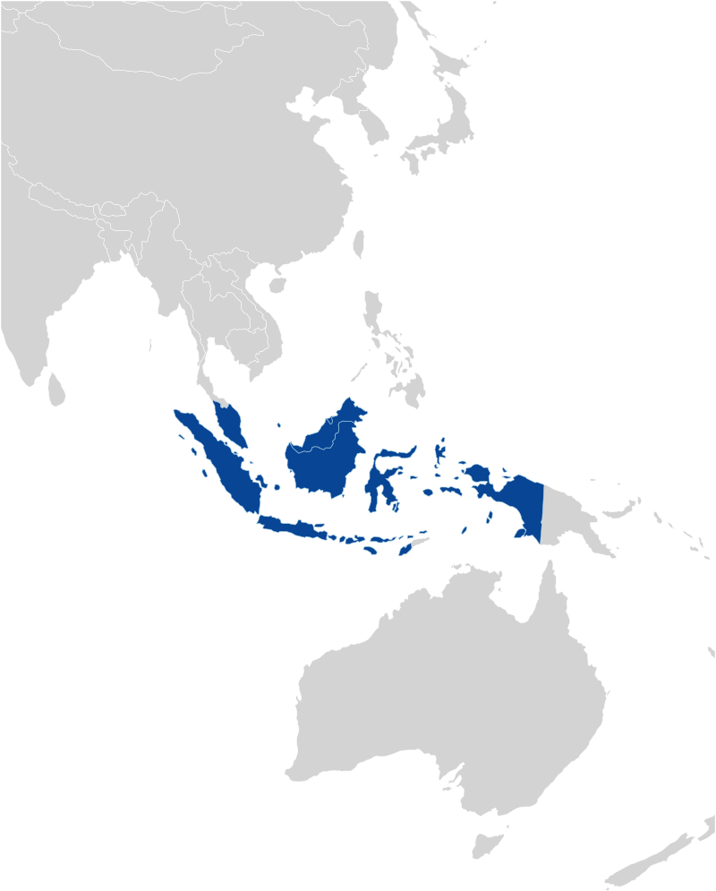
>
> Countries where Ceki cards are used.

## Malaysia & Singapore

The use of Cherki cards in Malaysia & Singapore was introduced by
[Peranakan](https://en.wikipedia.org/wiki/Peranakans) (Baba–Nyonya) communities.
Much of the terminology and card naming derives from Hokkien, and the cards used
are closer to their ancestral forms than those used in Indonesia.

> [!figure]
>
> 
>
> ```yaml
 > license: stock-image
 > orgName: Shutterstock.com
 > author: Fiqah Anugerah Dah Besa
 > identifier: '1293448237'
 > originalUrl: https://www.shutterstock.com/image-photo/penang-malaysia-january-22-2019-happy-1293448237
> ```
>
>  An exhibition game using Cherki cards being played in Penang, Malaysia.

In the past the game was played by all levels of society; records of the palace expenditure of the [Sultan Abdul Hamid Halim of Kedah](https://en.wikipedia.org/wiki/Abdul_Hamid_Halim_of_Kedah) (1864–1943) from 1896–99 indicate that he enjoyed gambling with Ceki.[@MemoryOfTheWorldRegister p. 58]

More recent accounts from Malaysia & Singapore indicate that the game was almost exclusively played by women, and in modern times it has nearly died out. @TheBabas reported that by the 1980s it was only possible to get cards in Melaka. However, there are ongoing efforts to preserve and repopularize the game.

Amongst [Kristang](https://en.wikipedia.org/wiki/Kristang_people) (or <span lang="mcm">Christão</span>) communities in Malacca, the cards were known as <span lang="mcm">chaqui</span> or <span lang="mcm">chiqui</span>.[@ChaquiAndPartui p. 34]

## Indonesia

In Indonesia, Ceki games are still popular, especially in Sumatra, Java, and Bali, all of which have historically had a large Chinese influence. In Javanese the cards are also known as <span lang="jv-Latn">kertu cilik</span> (‘small cards’).[@JavaneseEnglish p. 365]

During the colonial era, cards were manufactured in Europe by Dutch companies and exported to Indonesia. (See the [manufacturers](#manufacturers-brands) section below.) Ceki cards were also prohibited from being imported (from European manufacturers) into some areas, such as Sulawesi, “for reasons of public safety”.[@Title39_48 p. 1013]

> [!figure]
>
> 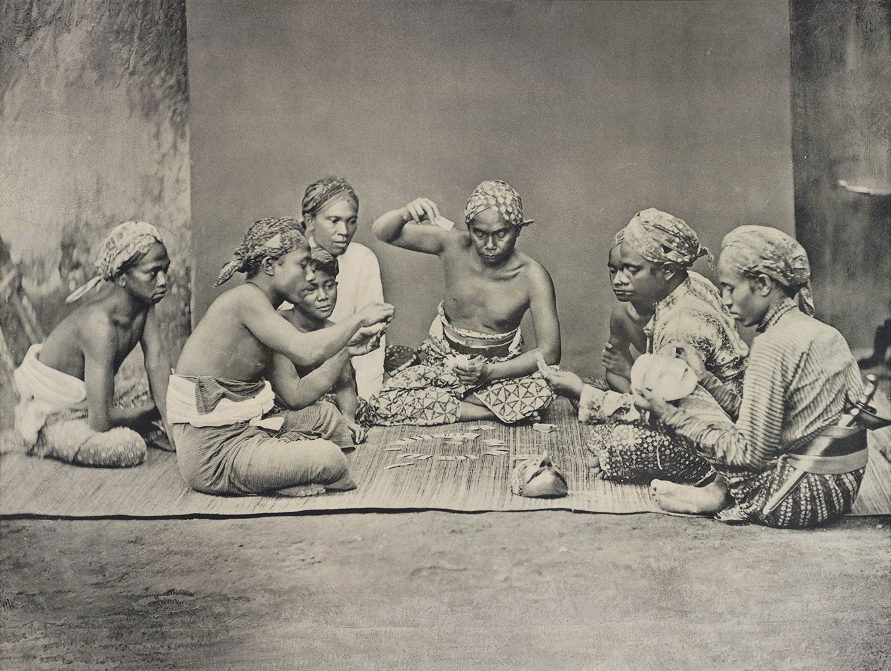
>
> ```yaml
> license: cc0
> size: wide
> ```
>
> Javanese card players, by Jean Demmeni (1866–1939). There are three players playing a fishing game, perhaps [Pèi](games/pei/pei.md); there are probably too many cards in the centre for it to be [<span lang="jv-Latn" class="noun">Thothit</span>](games/thothit/thothit.md).

In Bali, the game is widely played and has “a large if not fanatical following”,[@TransitionalDemocracy 170] despite gambling being illegal. Cards are readily available at many roadside convenience stores.

> [!figure]
>
> 
>
> ```yaml
> size: wide
> license: cc-by-nc-nd
> licenseVersion: '2.0'
> originalUrl: https://www.flickr.com/photos/adamcohn/30414256602/
> authorGiven: Adam
> authorFamily: Cohn
> copyrightYear: 2016
> ```
>
> Balinese men playing a gambling game.

The game is particularly popular amongst the Minangkabau people of West Sumatra, as the Dutch card-making company <span class="noun" lang="nl">Handelsvereniging Harmsen Verweij & Dunlop N.V.</span> had a factory[^hotel] in the city of Padang.

[^hotel]: This building was later to become the [Hotel Ambacang](https://en.wikipedia.org/wiki/Hotel_Ambacang), which was destroyed in the [2009 Sumatran earthquakes](https://en.wikipedia.org/wiki/2009_Sumatra_earthquakes). The company also had offices in Java & Sulawesi (previously known as Celebes).

In the Minang language, they game and cards are called Koa (sometimes spelt Kuwa or Kowah, <span lang="ms-Arab">كوا</span> in old Malay orthography).[@MalayEnglishWilkinson p. 542] The Minangkabau go so far as to say “<span lang="id">kalau ga bisa main KOA berarti bukan orang Minang</span>”: “if you can’t play Koa, it’s means you’re not a Minang”.[@PermainanKoaPart1] In Buginese and Makassarese, both spoken in South Sulawesi, the game is also called <span lang="bug-Latn">kowa</span> (<span lang="bug">ᨀᨚᨓ</span> in Lontara script),[@MakassaarschWoordenboek p. 63][@BoegineeschWoordenboek p. 46] after a term which is used in the game.

These terms might come from a Chinese language term for the number nine, which is how many cards the players need to complete their hand in the most common form of the game in these areas.

> [!todo]
> Dubious: I might even hazard something like <span lang="zh">九葉</span> ‘nine leaves’, Hakka <span lang="hak-Latn">kiú ya̍p</span>, Teochew <span lang="nan-Latn-pengim">gao² iab⁸</span>.

> [!figure]
>
> 
>
> ```yaml
> license: "cc0"
> originalUrl: "http://proxy.handle.net/10648/aead8142-d0b4-102d-bcf8-003048976d84"
> orgName: "Nationaal Archief"
> copyrightYear: 1955
> ```
>
> The game has also been carried to Suriname by [Javanese emigrants.](https://en.wikipedia.org/wiki/Javanese_Surinamese) This image shows it being played at the time of the visit of [Queen Juliana](https://en.wikipedia.org/wiki/Juliana_of_the_Netherlands) and [Prince Bernhard](https://en.wikipedia.org/wiki/Prince_Bernhard_of_Lippe-Biesterfeld) in 1955. The game being played here seems to be one that has “rooster” (<span lang="jv-Latn">jago</span>) bets.

## The Deck

The cards run <Cards>1–9</Cards> in three suits, and there are three ‘honour cards’, giving 30 different cards. Each deck, or <span lang="ms">kepala</span> (literally ‘head’, Javanese <span lang="jv">ꦏꦥꦭ</span> <span lang="jv-Latn">kapala</span>), contains two copies of each card, giving 60 total. In Banyuwangi, Java it is called a <span lang="jv">ꦫꦚ꧀ꦕꦏ꧀</span> <span lang="jv-Latn">rancak</span> ‘piece of wood’ or ‘set of instruments’.[@JavaanseKaartspelen p. 74] In Thai a deck is called a <span lang="th">สํารับ</span> <span lang="th-Latn">sam&shy;rap</span> (literally ‘condiment tray’). Many Ceki games require multiple <span lang="ms">kepala</span> to play, often two sets (giving 120 cards).

The three suits have various names.[@ChikiCards p. 119] ‘Coins’, ‘strings’, and
‘myriads’ are the terms I use for consistency across different types of
money-suited cards.

<dl>
<dt>
Names for Coins
</dt>
<dd>
* <span lang="ms">hitam</span> (‘black’), [<span lang="ms">batik</span>](https://en.wikipedia.org/wiki/Batik), <span lang="ms">piah</span> (from Hokkien <span lang="nan">餅</span> ‘round thing’), or <span lang="ms">tong</span> (from Hokkien <span lang="nan">筒</span> ‘barrel’);
* in Thai, <span lang="th">ผัก</span> <span lang="th-Latn">phak</span> ‘vegetable’.
</dd>
<dt>
Names for Strings
</dt>
<dd>
* <span lang="ms">manek</span> (‘bead’), <span lang="ms">sok</span> (from Hokkien <span lang="nan">索</span> ‘rope’), or <span lang="ms">tiau</span> (from Hokkien <span lang="nan">條</span> ‘long/thin object’);
* in Java, <span lang="jv-Latn">lintrik</span> (<span lang="jv">ꦤ꧀ꦠꦿꦶꦏ</span> ‘rows’?);[@JavanischeKartenspiele]
* in Thai, <span lang="th">นก</span> <span lang="th-Latn">nok</span> ‘birds’.[@PaiPhong1967 28]
</dd>
<dt>
Names for Myriads (Numbers)
</dt>
<dd>
* <span lang="ms">ban</span> (from Hokkien <span lang="nan-Latn">bān</span> <span lang="nan">萬/万</span> ‘myriad’), or <span lang="ms">cina</span> (‘Chinese’);
* in Java, <span lang="jv-Latn">wong</span> (<span lang="jv">ꦮꦺꦴꦁ</span> ‘people’);[@JavanischeKartenspiele]
* in Thai, <span lang="th">คน</span> <span lang="th-Latn">khon</span> ‘people’.
</dd>
</dl>

<table class="fixed">
<caption>
Cards from a modern Balinese Ceki deck.
</caption>
<thead>
<tr class="centered">
<th>
</th>
<th>
</th>
<th>
1
</th>
<th>
2
</th>
<th>
3
</th>
<th>
4
</th>
<th>
5
</th>
<th>
6
</th>
<th>
7
</th>
<th>
8
</th>
<th>
9
</th>
</tr>
</thead>
<tbody>
<tr>
<th scope="row" class="sideways centered">
Coins
</th>
<td>
> [!figure]
>
> 
>
> ```yaml
> noborder: true
> cram: true
> equalheight: true
> hidden: true
> ```
</td>
<td>
> [!figure]
>
> 
>
> ```yaml
> noborder: true
> cram: true
> equalheight: true
> hidden: true
> ```
</td>
<td>
> [!figure]
>
> 
>
> ```yaml
> noborder: true
> cram: true
> equalheight: true
> hidden: true
> ```
</td>
<td>
> [!figure]
>
> 
>
> ```yaml
> noborder: true
> cram: true
> equalheight: true
> hidden: true
> ```
</td>
<td>
> [!figure]
>
> 
>
> ```yaml
> noborder: true
> cram: true
> equalheight: true
> hidden: true
> ```
</td>
<td>
> [!figure]
>
> 
>
> ```yaml
> noborder: true
> cram: true
> equalheight: true
> hidden: true
> ```
</td>
<td>
> [!figure]
>
> 
>
> ```yaml
> noborder: true
> cram: true
> equalheight: true
> hidden: true
> ```
</td>
<td>
> [!figure]
>
> 
>
> ```yaml
> noborder: true
> cram: true
> equalheight: true
> hidden: true
> ```
</td>
<td>
> [!figure]
>
> 
>
> ```yaml
> noborder: true
> cram: true
> equalheight: true
> hidden: true
> ```
</td>
<td>
> [!figure]
>
> 
>
> ```yaml
> noborder: true
> cram: true
> equalheight: true
> hidden: true
> ```
</td>
</tr>
<tr>
<th scope="row" class="sideways centered">
Strings
</th>
<td>
> [!figure]
>
> 
>
> ```yaml
> noborder: true
> cram: true
> equalheight: true
> hidden: true
> ```
</td>
<td>
> [!figure]
>
> 
>
> ```yaml
> noborder: true
> cram: true
> equalheight: true
> hidden: true
> ```
</td>
<td>
> [!figure]
>
> 
>
> ```yaml
> noborder: true
> cram: true
> equalheight: true
> hidden: true
> ```
</td>
<td>
> [!figure]
>
> 
>
> ```yaml
> noborder: true
> cram: true
> equalheight: true
> hidden: true
> ```
</td>
<td>
> [!figure]
>
> 
>
> ```yaml
> noborder: true
> cram: true
> equalheight: true
> hidden: true
> ```
</td>
<td>
> [!figure]
>
> 
>
> ```yaml
> noborder: true
> cram: true
> equalheight: true
> hidden: true
> ```
</td>
<td>
> [!figure]
>
> 
>
> ```yaml
> noborder: true
> cram: true
> equalheight: true
> hidden: true
> ```
</td>
<td>
> [!figure]
>
> 
>
> ```yaml
> noborder: true
> cram: true
> equalheight: true
> hidden: true
> ```
</td>
<td>
> [!figure]
>
> 
>
> ```yaml
> noborder: true
> cram: true
> equalheight: true
> hidden: true
> ```
</td>
<td>
> [!figure]
>
> 
>
> ```yaml
> noborder: true
> cram: true
> equalheight: true
> hidden: true
> ```
</td>
</tr>
<tr>
<th scope="row" class="sideways centered">
Myriads
</th>
<td>
> [!figure]
>
> 
>
> ```yaml
> noborder: true
> cram: true
> equalheight: true
> hidden: true
> ```
</td>
<td>
> [!figure]
>
> 
>
> ```yaml
> noborder: true
> cram: true
> equalheight: true
> hidden: true
> ```
</td>
<td>
> [!figure]
>
> 
>
> ```yaml
> noborder: true
> cram: true
> equalheight: true
> hidden: true
> ```
</td>
<td>
> [!figure]
>
> 
>
> ```yaml
> noborder: true
> cram: true
> equalheight: true
> hidden: true
> ```
</td>
<td>
> [!figure]
>
> 
>
> ```yaml
> noborder: true
> cram: true
> equalheight: true
> hidden: true
> ```
</td>
<td>
> [!figure]
>
> 
>
> ```yaml
> noborder: true
> cram: true
> equalheight: true
> hidden: true
> ```
</td>
<td>
> [!figure]
>
> 
>
> ```yaml
> noborder: true
> cram: true
> equalheight: true
> hidden: true
> ```
</td>
<td>
> [!figure]
>
> 
>
> ```yaml
> noborder: true
> cram: true
> equalheight: true
> hidden: true
> ```
</td>
<td>
> [!figure]
>
> 
>
> ```yaml
> noborder: true
> cram: true
> equalheight: true
> hidden: true
> ```
</td>
<td>
> [!figure]
>
> 
>
> ```yaml
> noborder: true
> cram: true
> equalheight: true
> hidden: true
> ```
</td>
</tr>
</tbody>
</table>

## Card Names

For each card in the table below I show (in left-to-right order):

1. a card from a 19th-century deck collected in @ChineseOfTheStraitsSettlements,
2. a card from a different 19th-century deck from @YoungCeki [p. 300] (as reproduced in @JavaanseKaartspelen),
3. a card from a deck produced by Harmsen Verweij & Dunlop (after 1933), a Dutch company,[^fn0]
4. a 1940s deck collected in @JavaanseKaartspelen,
5. and then a modern card from a deck purchased in Bali in 2019 (clearly derived from #3).

[^fn0]: The cards as depicted in @BlikJavaansche_2 (pl. XVI) are identical to these.

Modern Malaysian & Singaporean decks (of which I have no samples[^yet]) are closer in style to the #1 deck.

[^yet]: Yet! Can you help with this? Contact me!

Each card in the deck has its own name as listed in the table below.  The translations in the table are mostly from the [SEAlang](http://sealang.net) dictionaries; any mistakes are my own.[^fn1] In Malaysia/Singapore the names are based on the Hokkien names of the cards — a combination of suit and rank — but as we move in a south-easterly direction along the Malay Archipelago (the table below is listed roughly in this order), the names diverge further and further from this original source, and most cards have nicknames that are based upon their appearance rather than their numeric value.

[^fn1]: According to some sources, the word “<span lang="jv-Latn">cina</span>” referring to a Chinese person is now considered a potentially derogatory term. For example, the Indonesian government no longer uses it in official communications, since the term was dropped from official usage by presidential decree in 2014.[@CinaOrTionghua]

The names in the **Makassar** column have been assigned based upon comparisons with the other names given; the source — being a dictionary — does not show which card maps to which name. I have not been able to figure out a satisfactory assignment for the following names:
<span lang="mak">ᨁᨚᨌᨗ</span> <span lang="mak-Latn">goncing</span>[@MakassaarschWoordenboek p. 76] ‘scissors’;
<span lang="mak">ᨁᨑᨗᨁᨗ</span> <span lang="mak-Latn">garigi</span>[@MakassaarschWoordenboek p. 79] [?];
<span lang="mak">ᨄᨄ</span> <span lang="mak-Latn">pampang</span>[@MakassaarschWoordenboek p. 98] ‘across’;
<span lang="mak">ᨄᨚᨄᨚᨀ</span> <span lang="mak-Latn">popokang</span>[@MakassaarschWoordenboek p. 99] ‘sorceress’;[^fn2]
<span lang="mak">ᨄᨙᨔᨚ</span> <span lang="mak-Latn">peso</span>[@MakassaarschWoordenboek p. 140] ‘lame’;
<span lang="mak">ᨅᨘᨀᨘ</span> <span lang="mak-Latn">buku</span>[@MakassaarschWoordenboek p. 148] ‘bone’;
<span lang="mak">ᨅᨚᨈᨘᨓᨒ</span> <span lang="mak-Latn">bontuwala</span>[@MakassaarschWoordenboek p. 173] Bontoala, a place near Makassar, also the name of a type of large kris;
<span lang="mak">ᨅᨓᨗ</span> <span lang="mak-Latn">bawi</span>[@MakassaarschWoordenboek p. 221] ‘pig’;
<span lang="mak">ᨆᨉᨘᨑ</span> <span lang="mak-Latn">mandura</span>[@MakassaarschWoordenboek p. 249] [?];
<span lang="mak">ᨌᨄᨗ</span> <span lang="mak-Latn">capi</span>[@MakassaarschWoordenboek p. 385] ‘deformed’, also ‘cow’;
<span lang="mak">ᨍᨘᨀᨘᨕᨙᨍ</span> <span lang="mak-Latn">juku-éja</span>[@MakassaarschWoordenboek p. 402] ‘red fish’;
<span lang="mak">ᨍᨚᨅᨚ</span> <span lang="mak-Latn">jobong</span>[@MakassaarschWoordenboek p. 408] [?];
<span lang="mak">ᨑᨚᨅᨙ</span> <span lang="mak-Latn">rombéng</span>[@MakassaarschWoordenboek p. 444] ‘long hair’;
<span lang="mak">ᨔᨄᨗ</span> <span lang="mak-Latn">sapi</span>[@MakassaarschWoordenboek p. 554] ‘cow’;
<span lang="mak">ᨔᨗᨄᨗ</span> <span lang="mak-Latn">sipi</span>[@MakassaarschWoordenboek p. 557] ‘pinch’.

[^fn2]: Not just any sorceress, but one that sends out her head and entrails at night, leaving her body behind! In Minangkabau this is called a ‘<span lang="min" class="noun">Palasik Panangga</span>’, or a ‘<span lang="ms" class="noun">Penanggalan</span>’ in Malay. For more information, see @Penanggalan.

⚠️ The table is *very wide* and might scroll horizontally.

> [!todo]
> The columns in the table are as follows:
> <dl>
> <dt>
> Malysia/Singapore
> </dt>
> <dd>
>
> These names are a combination of the rank (derived from Hokkien number names) and
> either the suit name or some nickname based on the middle portion of the
> card,[@ChikiCards p. 121] which is slightly bigger there than in the Indonesian
> version.
>
> </dd>
>
> <dt>
> Minang
> </dt>
> <dd>These are names used by Minangkabau people in Indonesia. Instead of numeric
> ranks, they are based on the appearance of the indices in the corners of the
> cards.</dd>
>
> <dt>
> Java
> </dt>
> <dd>
>
> The third row of names are those used in Java, as recorded in the early 20th
> century,[@JavanischeKartenspiele] and as such might be very outdated.
>
> </dd>
>
> <dt>
> Bali/Lombok
> </dt>
> <dd>
>
> The fourth row of names records names reportedly used in Bali[@RancangBangun pp.
> 45–7] or Lombok,[@LombokCeki] where almost every card has a specific name. This
> section of the table is much more imprecise than the previous lines.
>
> </dd>
> </dl>

<div class="full-width scroller">
<table class="rule-first-col small">
<thead>
<tr>
<th style="min-width: 200px">
</th>
<th>
Thailand
</th>
<th colspan="4">
Malaysia/Singapore
</th>
<th>
Sumatra
</th>
<th colspan="7">
Java
</th>
<th colspan="7">
Bali
</th>
<th colspan="2">
Lombok
</th>
<th>
Borneo
</th>
<th colspan="2">
Sulawesi
</th>
<th>
Maluku
</th>
<th>
Timor
</th>
</tr>
<tr>
<th>
Cards
</th>
<th>
(1967)[@PaiPhong1967]
</th>
<th>
General
</th>
<th>
Older (Malay)\
(1894)[@CliffordMalay3 334]
</th>
<th>
Malacca (Kristang)\
(1972)[@ChaquiAndPartui]
</th>
<th>
Malacca (Kristang)\
(2012)[@HowToPlayChiki]
</th>
<th>
Padang\
(2013)[@MinangCeki]
</th>
> [!todo] ---JAVA---
<th>
[unstated]\
(1876)[@deClercqPehiSpel]
</th>
<th>
Pekalongan\
(1941)[@JavaanseKaartspelen]
</th>
<th>
Magelang\
(1941)[@JavaanseKaartspelen]
</th>
<th>
Yogyakarta\
(1941)[@JavaanseKaartspelen]
</th>
<th>
Surakarta\
(1941)[@JavaanseKaartspelen]
</th>
<th>
[Surabaya?]\
(1914)[@JavanischeKartenspiele]
</th>
<th>
Banyuwangi\
(1941)[@JavaanseKaartspelen]
</th>
> [!todo] ---BALI---
<th>
[Badung?]\
(2012)[@RancangBangun]
</th>
<th>
Badung\
(1941)[@JavaanseKaartspelen]
</th>
<th>
Gianyar\
(1941)[@JavaanseKaartspelen]
</th>
<th>
Klungkung\
(1941)[@JavaanseKaartspelen]
</th>
<th>
Karangasem\
(1941)[@JavaanseKaartspelen]
</th>
<th>
Buleleng\
(1941)[@JavaanseKaartspelen]
</th>
<th>
Singaraja\
(1941)[@JavaanseKaartspelen]
</th>
<th>
Lombok\
(2016)[@LombokCeki]
</th>
<th>
Lombok\
(1941)[@JavaanseKaartspelen]
</th>
<th>
Banjarmasin\
(1941)[@JavaanseKaartspelen]
</th>
> [!todo] ---SULAWESI---
<th>
Makassar\
(1859)[@MakassaarschWoordenboek]
</th>
<th>
Manado\
(1876)[@HetMaleischderMolukken]
</th>
<th>
Ambon\
(1876)[@HetMaleischderMolukken]
</th>
<th>
Timor\
(1876)[@HetMaleischderMolukken]
</th>
</tr>
</thead>
<tbody>
<tr class="table-secondary">
<th scope="row" class="text-center sticky-left border-end">
Honours & Rank 1
</th>
<td>
<span lang="th">เอี่ยว</span> <span lang="th-Latn">iao</span>, from Hokkien/Teochew <span lang="nan">幺</span> <span lang="nan-Latn-pehoeji">io</span>/<span lang="nan-Latn-pengim">iao¹</span>, ‘ace’
</td>
> [!todo] ---MALAY---
<td>
<span lang="ms">yu</span> or <span lang="ms">yeo</span>, from Hokkien/Teochew
</td>
<td>
<span lang="ms">iu</span> (modern <span lang="ms">ayu</span>)\
<span lang="ms-Arab">ايو</span>\
from Hokkien/Teochew
</td>
<td>
<span lang="mcm">cartas fortes</span>\
‘strong cards’, for the first three
</td>
<td>
<span lang="mcm">yoh</span>\
(Hokkien <span lang="nan-Latn">io</span>)
</td>
<td>
<span lang="min">hiu/iyu</span> ‘shark’, looks like a fin
</td>
> [!todo] ---JAVA---
<td>
</td>
<td>
</td>
<td>
</td>
<td>
</td>
<td>
</td>
<td>
</td>
<td>
</td>
> [!todo] ---BALI---
<td>
</td>
<td>
</td>
<td>
</td>
<td>
</td>
<td>
</td>
<td>
</td>
<td>
</td>
> [!todo] ---LOMBOK---
<td>
</td>
<td>
</td>
> [!todo] ---BORNEO---
<td>
<span lang="bjn">hio</span>
</td>
> [!todo] ---SULAWESI---
<td>
<span lang="mak">ᨈᨕᨘ</span>\
<span lang="mak-Latn">tau</span>\
human
</td>
<td>
</td>
> [!todo] ---Maluku---
<td>
</td>
> [!todo] ---Timor---
<td>
</td>
</tr>

<tr>
<th scope="row" class="sticky-left border-end table-light">
> [!figure]
>
> 
> 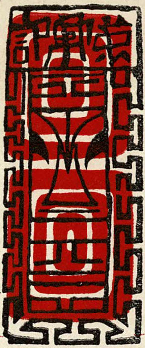
> 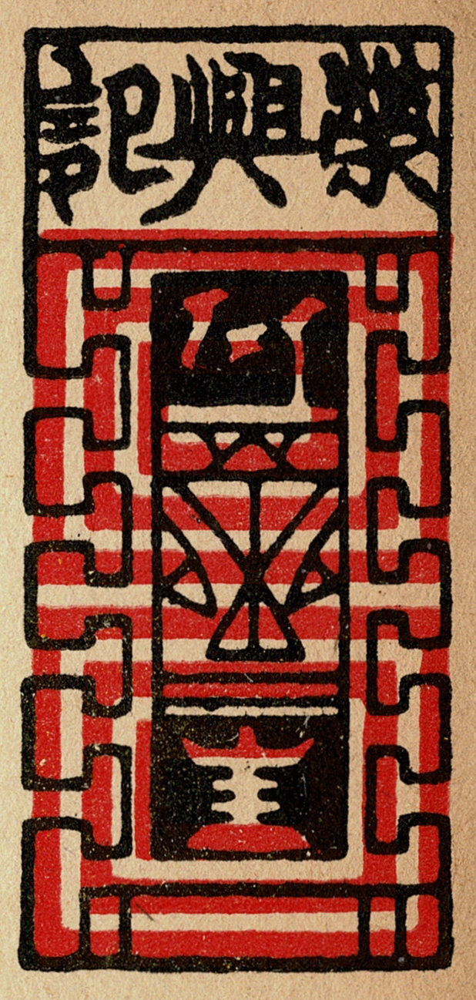
> 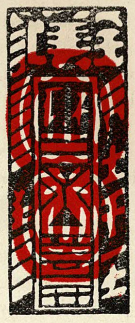
> 
>
> ```yaml
> noborder: true
> hidden: true
> cram: true
> equalheight: true
> size: "small"
> ```
>
> Old Thousand
</th>
> [!todo] ---Thai---
<td>
<span lang="th">เอี่ยวพญา</span>\
<span lang="th-Latn">iao phaya</span>\
king ace

<span lang="th">เอี่ยวแดงพญา</span>\
<span lang="th-Latn">iao daeng phaya</span>\
red king ace

<span lang="th">เอี่ยวโต้ง</span>\
<span lang="th-Latn">iao tong</span>\
large ace
</td>
> [!todo] ---M/S---
<td>
<span lang="ms">yu lau chian</span>, from Hokkien <span lang="nan">老千</span> ‘old thousand’\
or <span lang="ms">yu pinding</span>
</td>
<td>
<span lang="ms">iu mêrah bĕsar</span>\
<span lang="ms-Arab">ايو ميره بسر</span>\
large red/king ace
</td>
<td>
<span lang="mcm">yo sekarat, yo mitadi</span>\
candlenut, one half
</td>
<td>
<span lang="mcm">obu</span>\
egg
</td>
<td>
<span lang="min">danau rezeki, hiu/babak</span>\
[chapter?] shark
</td>
> [!todo] ---Java---
<td>
<span lang="jv">ꦫꦗ</span>\
<span lang="jv-Latn">raja</span>\
king
</td>
<td>
<span lang="jv-Latn">iyo ratu</span>\
king ace
</td>
<td>
<span lang="jv-Latn">iyo ratu</span>\
king ace
</td>
<td>
<span lang="jv-Latn">iyo ratu</span>\
king ace
</td>
<td>
<span lang="jv-Latn">iyo ratu</span>\
king ace
</td>
<td>
<span lang="jv-Latn">besar</span>\
large
</td>
<td>
<span lang="jv-Latn">besar</span>\
large
</td>
> [!todo] ---Bali---
<td>
<span lang="ban"> ᬭᬚ</span>\
<span lang="ban-Latn">raja</span>\
king
</td>
<td>
<span lang="ban"> ᬭᬚ</span>\
<span lang="ban-Latn">raja</span>\
king
</td>
<td>
<span lang="ban"> ᬭᬚ</span>\
<span lang="ban-Latn">(oong) raja</span>
</td>
<td>
<span lang="ban"> ᬭᬚ</span>\
<span lang="ban-Latn">(oong) raja</span>
</td>
<td>
<span lang="ban">ᬓᭀᬩᬃ</span>\
<span lang="ban-Latn">kobar</span>\
burning
</td>
<td>
<span lang="ban">ᬓᭀᬩᬃ</span>\
<span lang="ban-Latn">kobar (oong besar KBW)</span>
</td>
<td>
<span lang="ban">ᬓᭀᬩᬃ</span>\
<span lang="ban-Latn">kobar</span>\
burning
</td>
> [!todo] ---Lombok---
<td>
<span lang="sas">ᬓᭀᬩᬃ</span>\
<span lang="sas-Latn">kobar</span>\
burning
</td>
<td>
<span lang="sas">ᬓᭀᬩᬃ</span>\
<span lang="sas-Latn">kobar</span>\
burning
</td>
> [!todo] ---Borneo---
<td>
<span lang="bjn">abang/raja basar</span>\
red/big king
</td>
> [!todo] ---Sulawesi---
<td>
<span lang="mak">ᨒᨚᨌᨗᨐ</span>\
<span lang="mak-Latn">lociyang</span>[@MakassaarschWoordenboek p. 508]\
from Hokkien
</td>
<td>
<span lang="id">laucan, lokjan</span>\
from Hokkien
</td>
> [!todo] ---Maluku---
<td>
<span lang="id">meirah lokjan</span>\
red lokjan
</td>
> [!todo] ---Timor---
<td>
<span lang="id">meirah besar</span>\
big red
</td>
</tr>

<tr>
<th scope="row" class="sticky-left border-end table-light">
> [!figure]
>
> 
> 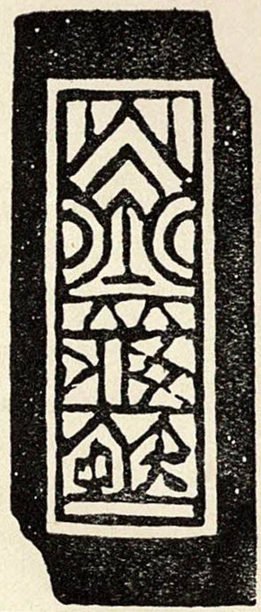
> 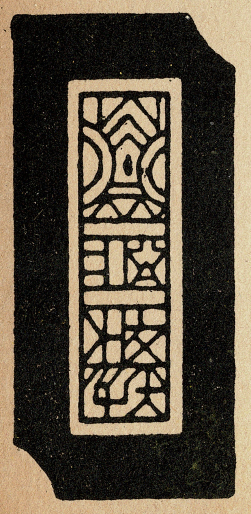
> 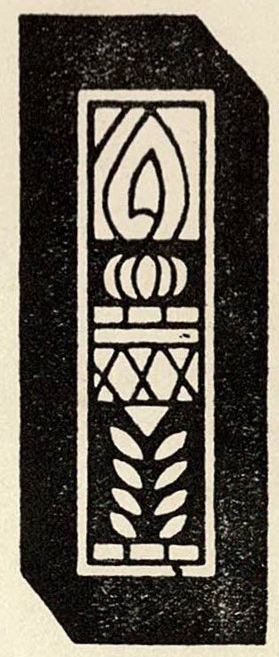
> 
>
> ```yaml
> noborder: true
> hidden: true
> cram: true
> equalheight: true
> size: "small"
> ```
>
> White Flower
</th>
> [!todo] ---Thai---
<td>
<span lang="th">เอี่ยวชี</span>\
<span lang="th-Latn">iao chi</span>\
nun ace
</td>
> [!todo] ---M/S---
<td>
<span lang="ms">yu kuching</span>\
cat ace
</td>
<td>
<span lang="ms">iu kûching</span>\
<span lang="ms-Arab">ايو كوچيڠ</span>\
cat ace
</td>
<td>
<span lang="mcm">yo feme</span>\
one woman
</td>
<td>
<span lang="mcm">femi/fula</span>\
woman/vagina
</td>
<td>
<span lang="min">hiu kuciang</span>\
cat shark
</td>
> [!todo] ---Java---
<td>
<span lang="jv">ꦏꦸꦕꦶꦁ</span>\
<span lang="jv-Latn">kucing</span>\
cat
</td>
<td>
<span lang="jv-Latn">kucing</span>\
cat
</td>
<td>
<span lang="jv-Latn">kucing</span>\
cat
</td>
<td>
<span lang="jv-Latn">kucing</span>\
cat
</td>
<td>
<span lang="jv-Latn">(iyo) kucing</span>\
cat ace

<span lang="jv-Latn">curut</span>\
rat
</td>
<td>
<span lang="jv-Latn">kucing</span>\
cat
</td>
<td>
<span lang="jv-Latn">kucing</span>\
cat
</td>
> [!todo] ---Bali---
<td>
<span lang="ban">ᬘᬓ᭄ᬭ</span>\
<span lang="ban-Latn">cakra</span>\
chakra
</td>
<td>
<span lang="ban">ᬘᬓ᭄ᬭ</span>\
<span lang="ban-Latn">cakra</span>\
chakra
</td>
<td>
<span lang="ban">ᬘᬓ᭄ᬭ</span>\
<span lang="ban-Latn">cakra</span>\
chakra
</td>
<td>
<span lang="ban">ᬘᬓ᭄ᬭ</span>\
<span lang="ban-Latn">cakra</span>\
chakra
</td>
<td>
<span lang="ban">ᬘᭂᬧᬾ</span>\
<span lang="ban-Latn">cepé</span>
</td>
<td>
<span lang="ban">ᬘᬓ᭄ᬭ</span>\
<span lang="ban-Latn">cakra</span>\
chakra
</td>
<td>
<span lang="ban">ᬘᬓ᭄ᬭ</span>\
<span lang="ban-Latn">cakra</span>\
chakra
</td>
> [!todo] ---Lombok---
<td>
<span lang="sas">ᬘ᭄ᬧᬾ</span>\
<span lang="sas-Latn">cpé</span>\
?
</td>
<td>
<span lang="sas">ᬋᬋᬧᬾ</span>\
<span lang="sas-Latn">rerepé</span>
</td>
> [!todo] ---Borneo---
<td>
<span lang="bjn">kucing</span>
</td>
> [!todo] ---Sulawesi---
<td>
<span lang="mak"></span>
<span lang="mak-Latn"></span>
</td>
<td>
<span lang="id">kukis</span>
</td>
> [!todo] ---Maluku---
<td>
<span lang="id">parampuwan</span>\
woman
</td>
> [!todo] ---Timor---
<td>
<span lang="id">kucing</span>
</td>
</tr>

<tr>
<th scope="row" class="sticky-left border-end table-light">
> [!figure]
>
> 
> 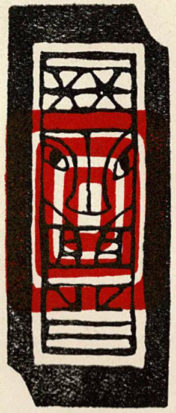
> 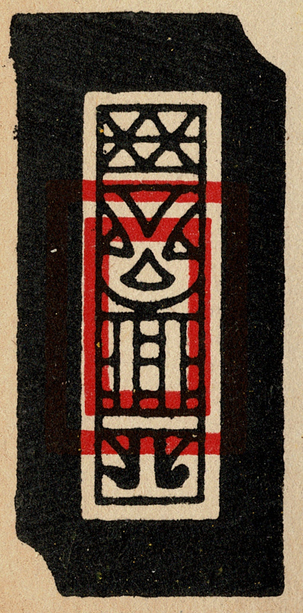
> 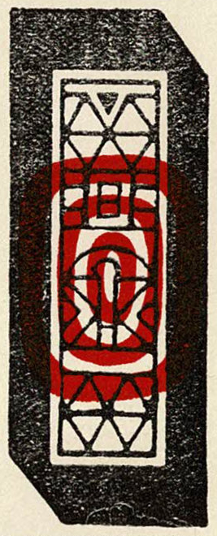
> 
>
> ```yaml
> noborder: true
> hidden: true
> cram: true
> equalheight: true
> size: "small"
> ```
>
> Red Flower
</th>
> [!todo] ---Thai---
<td>
<span lang="th">เอี่ยวแดงนาง</span>\
<span lang="th-Latn">iao daeng nang</span>\
red lady ace

<span lang="th">เอี่ยวนาง</span>\
<span lang="th-Latn">iao nang</span>\
lady ace
</td>
> [!todo] ---M/S---
<td>
<span lang="ms">yu nyonya</span>\
(娘仔?) ace
</td>
<td>
<span lang="ms">iu mêrah s’krat</span>\
<span lang="ms-Arab">ايو ميره سكرة</span>\
partly red ace
</td>
<td>
<span lang="mcm">yo fogu</span>\
one fire
</td>
<td>
<span lang="mcm">sekeras</span>\
candlenut
</td>
<td>
<span lang="min">hiu merah</span>\
red shark

or <span lang="min">penci</span>\
[<a href="https://en.wikipedia.org/wiki/Songkok">a hat</a>?]
</td>
> [!todo] ---Java---
<td>
<span lang="jv">ꦏꦼꦚ꧀ꦕꦶ</span>\
<span lang="jv-Latn">kêñci</span>\
[unknown]
</td>
<td>
<span lang="jv-Latn">kenci</span>
</td>
<td>
<span lang="jv-Latn">kenci</span>
</td>
<td>
<span lang="jv-Latn">kenci</span>
</td>
<td>
<span lang="jv-Latn">kinci, pinci, iyo kenci</span>
</td>
<td>
<span lang="jv-Latn">cinci</span>\
[unknown]
</td>
<td>
<span lang="jv-Latn">pinci</span>
</td>
> [!todo] ---Bali---
<td>
<span lang="ban">ᬓᭂᬜ᭄ᬘᬶ</span>\
<span lang="ban-Latn">kenci</span>
</td>
<td>
<span lang="ban">ᬓᬸᬜ᭄ᬘᬶ</span>\
<span lang="ban-Latn">kunci</span>\
keys?
</td>
<td>
<span lang="ban">ᬓᭀᬜ᭄ᬘᬶ</span>\
<span lang="ban-Latn">konci</span>
</td>
<td>
<span lang="ban">ᬓᭀᬜ᭄ᬘᬶ</span>\
<span lang="ban-Latn">konci</span>
</td>
<td>
<span lang="ban">ᬓᭀᬜ᭄ᬘᬶ</span>\
<span lang="ban-Latn">konci</span>
</td>
<td>
<span lang="ban">ᬓᬶᬜ᭄ᬘᬶ</span>\
<span lang="ban-Latn">kinci (kenci KBW)</span>
</td>
<td>
<span lang="sas">ᬓᬾᬜ᭄ᬘᬶ</span>\
<span lang="sas-Latn">kènci</span>
</td>
> [!todo] ---Lombok---
<td>
<span lang="sas">ᬓᬶᬜ᭄ᬘᬶ</span>\
<span lang="sas-Latn">kinci</span>
</td>
<td>
<span lang="sas">ᬓᬾᬜ᭄ᬘᬶ</span>\
<span lang="sas-Latn">kènci</span>
</td>
> [!todo] ---Borneo---
<td>
<span lang="bjn">pinci</span>
</td>
> [!todo] ---Sulawesi---
<td>
<span lang="mak"></span>
<span lang="mak-Latn"></span>
</td>
<td>
<span lang="id">kapala</span>
</td>
> [!todo] ---Maluku---
<td>
<span lang="id">meirah kapala</span>
</td>
> [!todo] ---Timor---
<td>
<span lang="id">meirah prik</span>
</td>
</tr>

<tr>
<th scope="row" class="sticky-left border-end table-light">
> [!figure]
>
> 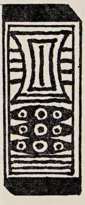
> 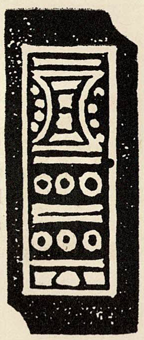
> 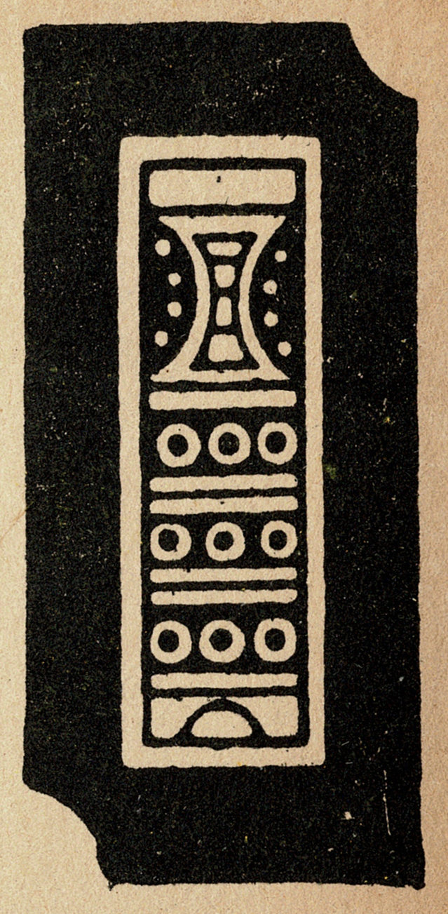
> 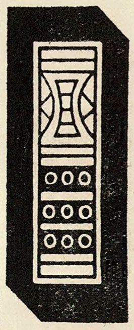
> 
>
> ```yaml
> noborder: true
> hidden: true
> cram: true
> equalheight: true
> size: "small"
> ```
>
> 1 Coins
</th>
> [!todo] ---Thai---
<td>
<span lang="th">เอี่ยวเกือก</span>\
<span lang="th-Latn">iao kueak</span>\
shoe ace

<span lang="th">เอี่ยวรอง</span>\
<span lang="th-Latn">iao rong</span>\
secondary ace
</td>
> [!todo] ---M/S---
<td>
<span lang="ms">yu kasut</span>\
slipper ace (looks like a Nyonya slipper)
</td>
<td>
<span lang="ms">iu kâsut</span>\
<span lang="ms-Arab">ايو كاسة</span>\
slipper ace
</td>
<td>
<span lang="mcm">sapatu</span>\
shoe
</td>
<td>
<span lang="mcm">sapatu</span>\
shoe
</td>
<td>
<span lang="min">hiu kasuik</span>\
[unknown] shark
</td>
> [!todo] ---Java---
<td>
<span lang="jv">ꦏꦱꦸꦠ꧀</span>\
<span lang="jv-Latn">kasut</span>\
slipper
</td>
<td>
<span lang="jv-Latn">kasut</span>\
slipper
</td>
<td>
<span lang="jv-Latn">kasut</span>\
slipper
</td>
<td>
<span lang="jv-Latn">kasut</span>\
slipper
</td>
<td>
<span lang="jv-Latn">(iyo) kasut</span>\
slipper
</td>
<td>
<span lang="jv-Latn">kesut</span>\
[var: kasut?]
</td>
<td>
<span lang="jv-Latn">kisut</span>\
wrinkled
</td>
> [!todo] ---Bali---
<td>
<span lang="ban">ᬮᬶᬓᬲ᭄</span>\
<span lang="ban-Latn">likas</span>\
reel
</td>
<td>
<span lang="ban">ᬮᬶᬓᬲ᭄</span>\
<span lang="ban-Latn">likas</span>\
reel
</td>
<td>
<span lang="ban">ᬮᬶᬓᬲ᭄</span>\
<span lang="ban-Latn">likas</span>\
reel
</td>
<td>
<span lang="ban">ᬮᬶᬓᬲ᭄</span>\
<span lang="ban-Latn">likas</span>\
reel
</td>
<td>
<span lang="ban">ᬮᬶᬓᬲ᭄</span>\
<span lang="ban-Latn">likas</span>\
reel
</td>
<td>
<span lang="ban">ᬮᬶᬓᬲ᭄</span>\
<span lang="ban-Latn">likas</span>\
reel
</td>
<td>
<span lang="ban">ᬮᬶᬓᬲ᭄</span>\
<span lang="ban-Latn">likas</span>\
reel
</td>
> [!todo] ---Lombok---
<td>
<span lang="sas">ᬮᬶᬓᬲ᭄</span>\
<span lang="sas-Latn">likas</span>\
reel
</td>
<td>
<span lang="sas">ᬮᬶᬓᬲ᭄</span>\
<span lang="sas-Latn">likas</span>\
reel
</td>
> [!todo] ---Borneo---
<td>
<span lang="bjn">kasut/butuh [women]; bedor [men]</span>
</td>
> [!todo] ---Sulawesi---
<td>
<span lang="mak">ᨈᨗᨀᨑ</span>\
<span lang="mak-Latn">tikara</span>[@MakassaarschWoordenboek p. 276]
</td>
<td>
<span lang="id">tikar</span>\
plaited mat
</td>
> [!todo] ---Maluku---
<td>
<span lang="id">tikar</span>\
plaited mat
</td>
> [!todo] ---Timor---
<td>
<span lang="id">kaso</span>\
[<cite>Saccharum spontaneum</cite>? <a href="https://www.britishmuseum.org/collection/object/A_As1960-10-79">mats are woven from this</a>]
</td>
</tr>

<tr>
<th scope="row" class="sticky-left border-end table-light">
> [!figure]
>
> 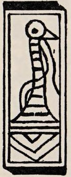
> 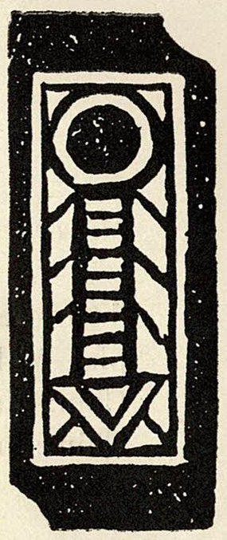
> 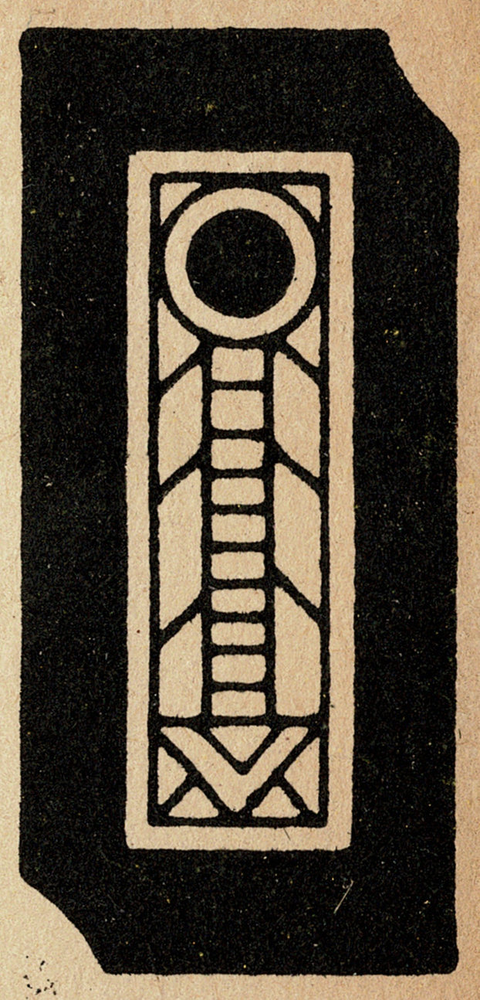
> 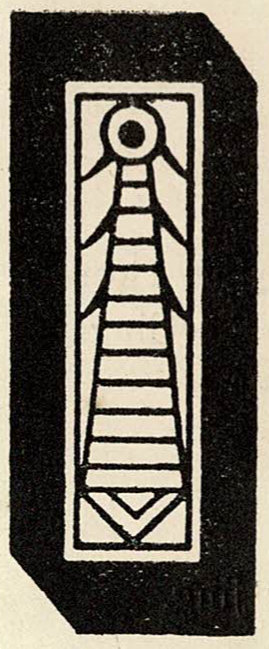
> 
>
> ```yaml
> noborder: true
> hidden: true
> cram: true
> equalheight: true
> size: "small"
> ```
>
> 1 Strings
</th>
> [!todo] ---Thai---
<td>
<span lang="th">เอี่ยวยาว</span>\
<span lang="th-Latn">iao yao</span>\
long ace

<span lang="th">เอี่ยวเข็ม</span>\
<span lang="th-Latn">iao khem</span>\
needle ace
</td>
> [!todo] ---M/S---
<td>
<span lang="ms">yu panjang</span> or <span lang="ms">yu burung</span>\
long or bird ace\
(In Indonesian, bird is also slang for penis.)[@IndonesianIdioms p. 62]
</td>
<td>
<span lang="ms">iu pli</span>\
<span lang="ms-Arab">ايو ڤلي</span>\
? ace
</td>
<td>
<span lang="mcm">pau</span>\
club
</td>
<td>
<span lang="mcm">pau</span>\
club
</td>
<td>
<span lang="min">hiu panjang</span>\
long shark
</td>
> [!todo] ---Java---
<td>
<span lang="jv">ꦧꦼꦢꦺꦴꦂ</span>\
<span lang="jv-Latn">bêdor</span>
</td>
<td>
<span lang="jv-Latn">(iyo) bedor</span>
</td>
<td>
<span lang="jv-Latn">(iyo) bedor</span>
</td>
<td>
<span lang="jv-Latn">(iyo) bedor</span>
</td>
<td>
<span lang="jv-Latn">(iyo) bedor</span>
</td>
<td>
<span lang="jv-Latn">sotur</span>\
[probably round-tipped lance]
</td>
<td>
<span lang="jv-Latn">bedhul</span>\
pulled out, uprooted

<span lang="jv-Latn">sodor</span>\
round-tipped lance
</td>
> [!todo] ---Bali---
<td>
<span lang="ban">ᬮᭀᬓᭀᬃ</span>\
<span lang="ban-Latn">lojor</span>\
long
</td>
<td>
<span lang="ban">ᬮᭀᬓᭀᬃ</span>\
<span lang="ban-Latn">lojor</span>\
long
</td>
<td>
<span lang="ban">ᬮᭀᬓᭀᬃ</span>\
<span lang="ban-Latn">lojor</span>\
long
</td>
<td>
<span lang="ban">ᬮᭀᬓᭀᬃ</span>\
<span lang="ban-Latn">lojor</span>\
long
</td>
<td>
<span lang="ban">ᬮᭀᬓᭀᬃ</span>\
<span lang="ban-Latn">lojor</span>\
long
</td>
<td>
<span lang="ban">ᬲ᭄ᬮᭀᬤᭀᬃ</span>\
<span lang="ban-Latn">slodor</span>\
[probably round-tipped lance]
</td>
<td>
<span lang="ban">ᬲᭂᬮᭀᬤᭀᬃ</span>\
<span lang="ban-Latn">selodor</span>\
[probably round-tipped lance]
</td>
> [!todo] ---Lombok---
<td>
<span lang="sas">ᬲᭂᬮᭀᬤᭀᬃ</span>\
<span lang="sas-Latn">selodor</span>\
[probably round-tipped lance]
</td>
<td>
<span lang="sas">ᬮᭀᬚᭀᬃ</span>\
<span lang="sas-Latn">(lojor?)</span>
</td>
> [!todo] ---Borneo---
<td>
<span lang="bjn">panjang</span>\
long
</td>
> [!todo] ---Sulawesi---
<td>
<span lang="mak">ᨒᨅᨘᨔᨘ</span>\
<span lang="mak-Latn">lambusu</span>[@MakassaarschWoordenboek p. 496]\
straight
</td>
<td>
<span lang="id">panjang</span>\
long
</td>
> [!todo] ---Maluku---
<td>
<span lang="id">panjang</span>\
long
</td>
> [!todo] ---Timor---
<td>
<span lang="id">panjang</span>\
long
</td>
</tr>

<tr>
<th scope="row" class="sticky-left border-end table-light">
> [!figure]
>
> 
> 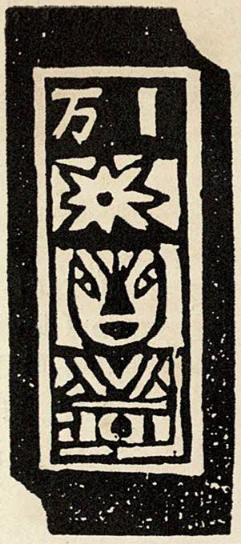
> 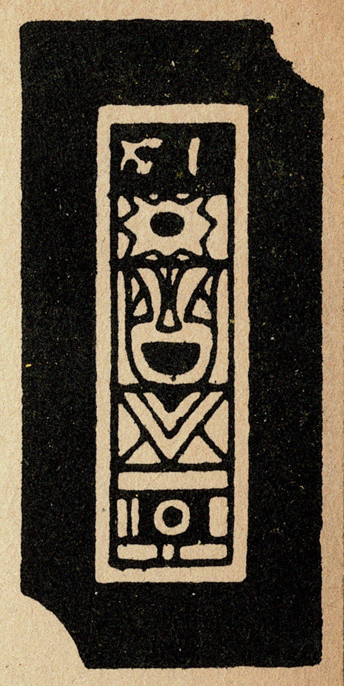
> 
> 
>
> ```yaml
> noborder: true
> hidden: true
> cram: true
> equalheight: true
> size: "small"
> ```
>
> 1 Myriads
</th>
> [!todo] ---Thai---
<td>
<span lang="th">เอี่ยวหนู</span>\
<span lang="th-Latn">iao nu</span>\
mouse ace\
(the symbol looks like a mouse’s tail)
</td>
> [!todo] ---M/S---
<td>
<span lang="ms">yu hue sio</span>\
from Hokkien ‘monk’ <span lang="nan">和尚</span>
</td>
<td>
<span lang="ms">iu lîchin</span>\
<span lang="ms-Arab">ايو ليچين</span>\
smooth/bare ace (probably referring to the bald head)
</td>
<td>
<span lang="mcm">China/ladrán</span>\
China/thief
</td>
<td>
<span lang="mcm">China</span>\
China
</td>
<td>
<span lang="min">hiu bungo</span>\
flower shark
</td>
> [!todo] ---Java---
<td>
<span lang="jv">ꦥꦼꦠꦶꦏ꧀</span>\
<span lang="jv-Latn">pêtik</span>
</td>
<td>
<span lang="jv-Latn">beset</span>\
peeled [bald?]
</td>
<td>
<span lang="jv-Latn">gundhul</span>\
bald

<span lang="jv-Latn">pletik</span>\
spark
</td>
<td>
<span lang="jv-Latn">(iyo) gundhul</span>\
bald

<span lang="jv-Latn">petik</span>\
[spark?]
</td>
<td>
<span lang="jv-Latn">(iyo) gundhul</span>\
bald

<span lang="jv-Latn">petik</span>\
[spark?]
</td>
<td>
<span lang="jv-Latn">p’té</span>\
[unknown]
</td>
<td>
<span lang="jv-Latn">putri</span>\
woman or princess
</td>
> [!todo] ---Bali---
<td>
<span lang="ban">ᬘᬶᬦ</span>\
<span lang="ban-Latn">cina</span>\
China
</td>
<td>
<span lang="ban">ᬘᬶᬦ</span>\
<span lang="ban-Latn">cina</span>
</td>
<td>
<span lang="ban">ᬘᬶᬦ</span>\
<span lang="ban-Latn">cina</span>
</td>
<td>
<span lang="ban">ᬘᬶᬦ</span>\
<span lang="ban-Latn">cina</span>
</td>
<td>
<span lang="ban">ᬘᬶᬦ</span>\
<span lang="ban-Latn">cina</span>
</td>
<td>
<span lang="ban">ᬘᬶᬦ</span>\
<span lang="ban-Latn">cina</span>
</td>
<td>
<span lang="ban">ᬘᬶᬦ</span>\
<span lang="ban-Latn">cina</span>
</td>
> [!todo] ---Lombok---
<td>
<span lang="sas">ᬘᬶᬦ</span>\
<span lang="sas-Latn">cina</span>
</td>
<td>
<span lang="sas">ᬘᬶᬦ</span>\
<span lang="sas-Latn">cina</span>
</td>
> [!todo] ---Borneo---
<td>
<span lang="bjn">nyonyah</span>
</td>
> [!todo] ---Sulawesi---
<td>
<span lang="mak">ᨌᨗᨊ</span>\
<span lang="mak-Latn">cina</span>[@MakassaarschWoordenboek p. 391]\
China
</td>
<td>
<span lang="id">cina</span>
</td>
> [!todo] ---Maluku---
<td>
<span lang="id">cina</span>
</td>
> [!todo] ---Timor---
<td>
<span lang="id">cina</span>
</td>
</tr>

<tr class="table-secondary">
<th scope="row" class="text-center sticky-left border-end">
Rank 2
</th>
> [!todo] ---Thai---
<td>
<span lang="th">สอง</span>\
<span lang="th-Latn">song</span>\
two
</td>
> [!todo] ---M/S---
<td>
<span lang="ms">ji</span>\
(Hokkien jī)
</td>
<td>
<span lang="ms">lĕkok</span>\
<span lang="ms-Arab">لكوق</span>\
notched
</td>
<td>
—
</td>
<td>
<span lang="mcm">gee</span>\
(Hokkien jī)
</td>
<td>
<span lang="min">bengkok</span> ‘crooked’
</td>
> [!todo] ---Java---
<td>
</td>
<td>
</td>
<td>
</td>
<td>
</td>
<td>
</td>
<td>
</td>
<td>
</td>
> [!todo] ---Bali---
<td>
</td>
<td>
</td>
<td>
</td>
<td>
</td>
<td>
</td>
<td>
</td>
<td>
</td>
> [!todo] ---Lombok---
<td>
</td>
<td>
</td>
> [!todo] ---Borneo---
<td>
</td>
> [!todo] ---Sulawesi---
<td>
<span lang="mak"></span>
<span lang="mak-Latn"></span>
</td>
<td>
</td>
> [!todo] ---Maluku---
<td>
</td>
> [!todo] ---Timor---
<td>
</td>
</tr>

<tr>
<th scope="row" class="sticky-left border-end table-light">
> [!figure]
>
> 
> 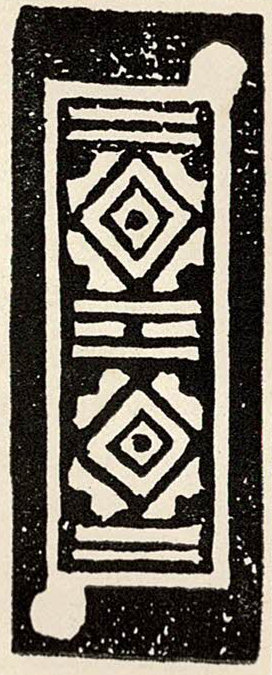
> 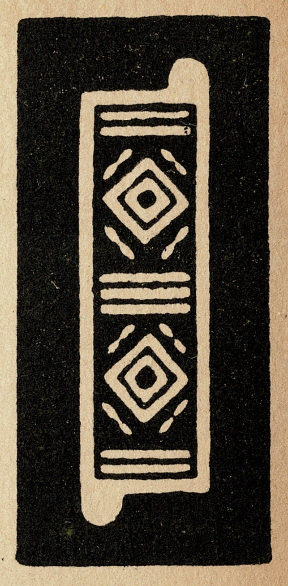
> 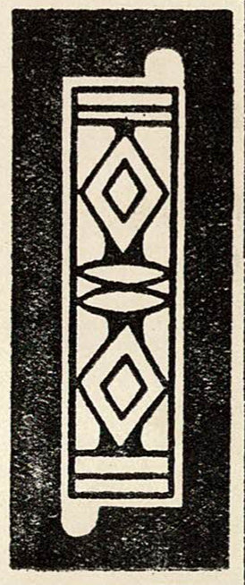
> 
>
> ```yaml
> noborder: true
> hidden: true
> cram: true
> equalheight: true
> size: "small"
> ```
>
> 2 Coins
</th>
> [!todo] ---Thai---
<td>
<span lang="th">สองตา</span>\
<span lang="th-Latn">song ta</span>\
eyes two

<span lang="th">สองตาโต</span>\
<span lang="th-Latn">song ta to</span>\
shocked two
</td>
> [!todo] ---M/S---
<td>
<span lang="ms">ji hitam</span> or <span lang="ms">ji bulat</span>\
black or round two
</td>
<td>
<span lang="ms">lĕkok lâmah</span>\
<span lang="ms-Arab">لكوق لامه</span>\
? notched
</td>
<td>
<span lang="mcm">bola</span>\
ball
</td>
<td>
<span lang="mcm">bola</span>\
ball
</td>
<td>
<span lang="min">bengkok itam/wajik</span>\
black/diamond crooked
</td>
> [!todo] ---Java---
<td>
<span lang="jv">ꦥ꧀ꦭꦺꦴꦩ꧀ꦥꦺꦴꦁ</span>\
<span lang="jv-Latn">plompong</span>\
gaping mouth
</td>
<td>
<span lang="jv-Latn">pelong</span>\
wide open
</td>
<td>
<span lang="jv-Latn">plompong</span>\
gaping mouth
</td>
<td>
<span lang="jv-Latn">loro plompong</span>\
gaping two

<span lang="jv-Latn">plontho</span>\
prostitute
</td>
<td>
<span lang="jv-Latn">loro plompong</span>\
gaping two

<span lang="jv-Latn">plontho</span>\
prostitute
</td>
<td>
<span lang="jv-Latn">dhimpil tolu</span>\
chipped [fifth week of Javanese calendar?]
</td>
<td>
<span lang="jv-Latn">komplong</span>\
to gape
</td>
> [!todo] ---Bali---
<td>
<span lang="ban">ᬩᬸᬕ᭄ᬤᬸᬯ</span>\
<span lang="ban-Latn">bug dua</span>\
[two dried betel nuts?]
</td>
<td>
<span lang="ban">ᬚᭂᬩᬸᬕ᭄ᬤᬸᬯ</span>\
<span lang="ban-Latn">jebug dua</span>
</td>
<td>
<span lang="ban">ᬚᭂᬩᬸᬕ᭄ᬤᬸᬯ</span>\
<span lang="ban-Latn">jebug dua</span>

<span lang="ban">ᬧᭀᬗ᭄ᬕᬂ</span>\
<span lang="ban-Latn">ponggang</span>\
hole
</td>
<td>
<span lang="ban">ᬚᬩᭀᬕ᭄ᬤᬸᬯ</span>\
<span lang="ban-Latn">jabog dua</span>
</td>
<td>
<span lang="ban">ᬧᭀᬗ᭄ᬕᬂ</span>\
<span lang="ban-Latn">ponggang</span>\
hole
</td>
<td>
<span lang="ban">ᬕᭀᬩᭀᬕ᭄ᬤᬸᬯ</span>\
<span lang="ban-Latn">gobog dua (omplong KBW)</span>
</td>
<td>
<span lang="ban">ᬕᭀᬩᭀᬕ᭄ᬤᬸᬯ</span>\
<span lang="ban-Latn">gobog dua</span>
</td>
> [!todo] ---Lombok---
<td>
<span lang="sas">ᬚᭂᬩᬸᬕ᭄ᬤᬸᬯ</span>\
<span lang="sas-Latn">jebug dua</span>
</td>
<td>
<span lang="sas">ᬕᭀᬩᭀᬕ᭄ᬤᬸᬯ</span>\
<span lang="sas-Latn">gobog dua</span>
</td>
> [!todo] ---Borneo---
<td>
<span lang="bjn">tambur dua</span>\
two drums

<span lang="bjn">palumpung</span>\
[?]
</td>
> [!todo] ---Sulawesi---
<td>
<span lang="mak">ᨄᨗᨌᨗᨉᨘᨓ</span>\
<span lang="mak-Latn">picing duwa</span>[@MakassaarschWoordenboek p. 113]\
two coins
</td>
<td>
<span lang="id">duwa mata</span>
</td>
> [!todo] ---Maluku---
<td>
<span lang="id">duwa mata</span>
</td>
> [!todo] ---Timor---
<td>
<span lang="id">batik</span>
</td>
</tr>

<tr>
<th scope="row" class="sticky-left border-end table-light">
> [!figure]
>
> 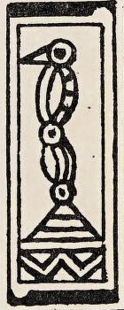
> 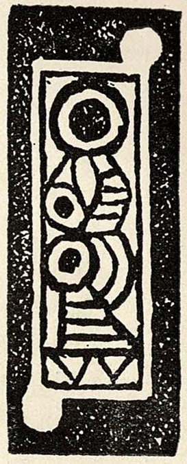
> 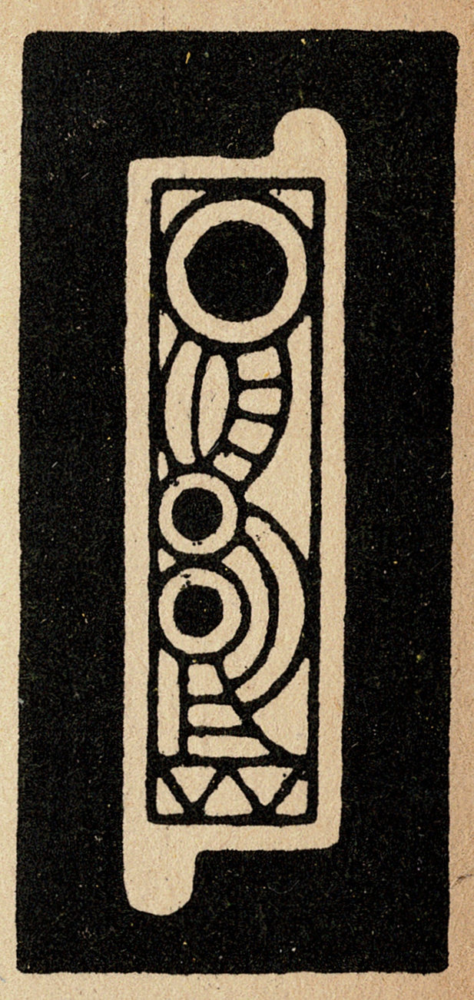
> 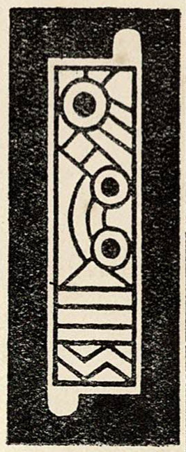
> 
>
> ```yaml
> noborder: true
> hidden: true
> cram: true
> equalheight: true
> size: "small"
> ```
>
> 2 Strings
</th>
> [!todo] ---Thai---
<td>
<span lang="th">สององคต</span>\
<span lang="th-Latn">song (ongkot?)</span>\
two <a href="https://en.wikipedia.org/wiki/Angada">Angada</a> (a legendary monkey with an immovable leg)
</td>
> [!todo] ---M/S---
<td>
<span lang="ms">ji burung</span>\
bird two
</td>
<td>
<span lang="ms">lĕkok lêrek</span>\
<span lang="ms-Arab">لكوق ليرق</span>\
notched borer?
</td>
<td>
<span lang="mcm">beechu</span>\
worm
</td>
<td>
<span lang="mcm">bicu, geli-geli</span>\
caterpillar, worm
</td>
<td>
<span lang="min">bengkok gadang</span>\
big crooked
</td>
> [!todo] ---Java---
<td>
<span lang="jv">ꦢꦺꦁꦏꦺꦏ꧀</span>\
<span lang="jv-Latn">déngkék</span>
</td>
<td>
<span lang="jv-Latn">dengkek</span>
</td>
<td>
<span lang="jv-Latn">dengkek</span>
</td>
<td>
<span lang="jv-Latn">(loro) dengkek</span>
</td>
<td>
<span lang="jv-Latn">(loro) dengkek</span>
</td>
<td>
<span lang="jv-Latn">cekok</span>\
neck-hollow
</td>
<td>
<span lang="jv-Latn">dengkek</span>
</td>
> [!todo] ---Bali---
<td>
<span lang="ban">ᬤᭂᬗ᭄ᬓᭂᬓ᭄</span>\
<span lang="ban-Latn">dengkek</span>\
having a bent back
</td>
<td>
<span lang="ban">ᬲᭂᬗ᭄ᬓᭂᬓ᭄</span>\
<span lang="ban-Latn">sengkek</span>
</td>
<td>
<span lang="ban">ᬲᭂᬗ᭄ᬓᭂᬓ᭄</span>\
<span lang="ban-Latn">sengkek</span>
</td>
<td>
<span lang="ban">ᬤᭂᬗ᭄ᬓᭂᬓ᭄</span>\
<span lang="ban-Latn">dengkek</span>
</td>
<td>
<span lang="ban">ᬤᭂᬗ᭄ᬓᭂᬓ᭄</span>\
<span lang="ban-Latn">dengkek</span>
</td>
<td>
<span lang="ban">ᬤᭂᬗ᭄ᬓᭂᬓ᭄</span>\
<span lang="ban-Latn">dengkek (dengkel, dengkol)</span>
</td>
<td>
<span lang="ban">ᬤᭂᬗ᭄ᬓᭂᬓ᭄</span>\
<span lang="ban-Latn">dengkek</span>
</td>
> [!todo] ---Lombok---
<td>
<span lang="sas">ᬤᭂᬗ᭄ᬓᭂᬓ᭄</span>\
<span lang="sas-Latn">dengkek</span>
</td>
<td>
<span lang="sas">ᬤᭂᬗ᭄ᬓᭂᬓ᭄</span>\
<span lang="sas-Latn">dengkek</span>
</td>
> [!todo] ---Borneo---
<td>
<span lang="bjn">téngkong</span>
</td>
> [!todo] ---Sulawesi---
<td>
<span lang="mak"></span>
<span lang="mak-Latn"></span>
</td>
<td>
<span lang="id">bèngkok</span>
</td>
> [!todo] ---Maluku---
<td>
<span lang="id">bongkok</span>
</td>
> [!todo] ---Timor---
<td>
<span lang="id">bongko</span>
</td>
</tr>

<tr>
<th scope="row" class="sticky-left border-end table-light">
> [!figure]
>
> 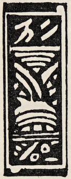
> 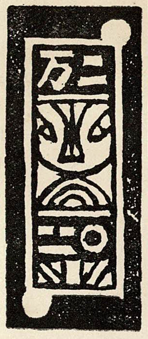
> 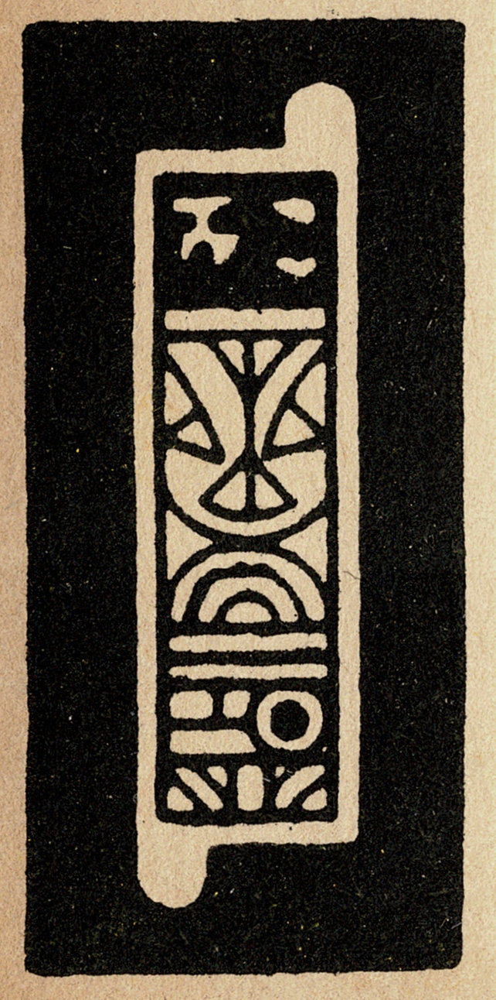
> 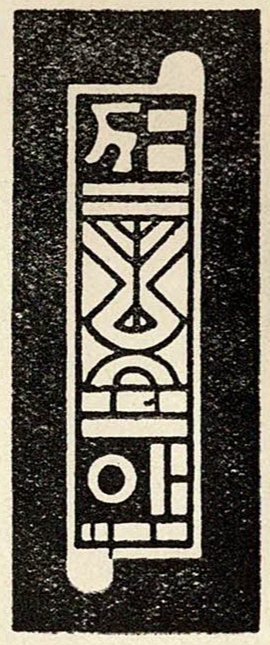
> 
>
> ```yaml
> noborder: true
> hidden: true
> cram: true
> equalheight: true
> size: "small"
> ```
>
> 2 Myriads
</th>
> [!todo] ---Thai---
<td>
<span lang="th">สองคน</span>\
<span lang="th-Latn">song khon</span>\
two people
</td>
> [!todo] ---M/S---
<td>
<span lang="ms">ji ban</span>
</td>
<td>
<span lang="ms">lĕkok cîna</span>\
<span lang="ms-Arab">لكوق چين</span>\
notched Chinese
</td>
<td>
<span lang="mcm">noiba</span>\
bride
</td>
<td>
<span lang="mcm">noiba</span>\
bride
</td>
<td>
<span lang="min">bengkok aluih</span>\
genteel crooked
</td>
> [!todo] ---Java---
<td>
<span lang="jv">ꦝꦶꦩ꧀ꦥꦶꦭ꧀ꦕꦶꦤ</span>\
<span lang="jv-Latn">dhimpil cina</span>\
chipped Chinese
</td>
<td>
<span lang="jv-Latn">munthil</span>\
small tight knot, Javanese hairstyle
</td>
<td>
<span lang="jv-Latn">dhimpil</span>\
chipped
</td>
<td>
<span lang="jv-Latn">loro cina</span>\
China two

<span lang="jv-Latn">loro dhimpil</span>\
chipped two
</td>
<td>
<span lang="jv-Latn">loro cina</span>\
China two

<span lang="jv-Latn">loro dhimpil</span>\
chipped two
</td>
<td>
<span lang="jv-Latn">dhimpil wong</span>\
chipped person
</td>
<td>
<span lang="jv-Latn">wong bendhol</span>\
person with a bump
</td>
> [!todo] ---Bali---
<td>
<span lang="ban">ᬧᭂᬮᬶᬓ᭄</span>\
<span lang="ban-Latn">pelik</span>\
[?]
</td>
<td>
<span lang="ban">ᬧ᭄ᬮᬶᬓ᭄</span>\
<span lang="ban-Latn">plik</span>
</td>
<td>
<span lang="ban">ᬧ᭄ᬮᬶᬓ᭄</span>\
<span lang="ban-Latn">plik</span>
</td>
<td>
<span lang="ban">ᬘᭂᬮᬶᬓ᭄</span>\
<span lang="ban-Latn">celik</span>
</td>
<td>
<span lang="ban">ᬧ᭄ᬮᬶᬓ᭄</span>\
<span lang="ban-Latn">plik</span>
</td>
<td>
<span lang="ban">ᬓᭀᬮᭀ</span>\
<span lang="ban-Latn">kolo (gobog, ketonglang KBW)</span>
</td>
<td>
<span lang="ban">ᬓᭀᬮᭀ</span>\
<span lang="ban-Latn">kolo</span>
</td>
> [!todo] ---Lombok---
<td>
<span lang="sas">ᬓᭀᬮᭀ</span>\
<span lang="sas-Latn">kolo</span>
</td>
<td>
<span lang="sas">ᬓᭀᬮᭀ</span>\
<span lang="sas-Latn">kolo</span>
</td>
> [!todo] ---Borneo---
<td>
<span lang="bjn">miring</span>\
angled
</td>
> [!todo] ---Sulawesi---
<td>
<span lang="mak">ᨀᨚᨉᨙ</span>\
<span lang="mak-Latn">kondé</span>[@MakassaarschWoordenboek p. 27]\
Chinese bun hairstyle
</td>
<td>
<span lang="id">miring</span>\
angled
</td>
> [!todo] ---Maluku---
<td>
<span lang="id">miring</span>\
angled
</td>
> [!todo] ---Timor---
<td>
<span lang="id">miring</span>\
angled
</td>
</tr>

<tr class="table-secondary">
<th scope="row" class="text-center sticky-left border-end">
Rank 3
</th>
> [!todo] ---Thai---
<td>
<span lang="th">สาม</span>\
<span lang="th-Latn">sam</span>\
three
</td>
> [!todo] ---M/S---
<td>
<span lang="ms">sa</span>\
(Hokkien saⁿ)
</td>
<td>
<span lang="ms">sêrong</span>\
<span lang="ms-Arab">سيروڠ</span>\
askew
</td>
<td>
—
</td>
<td>
<span lang="mcm">sar</span>\
(Hokkien saⁿ)
</td>
<td>
<span lang="min">jarum</span> ‘needle’
</td>
> [!todo] ---Java---
<td>
</td>
<td>
</td>
<td>
</td>
<td>
</td>
<td>
</td>
<td>
</td>
<td>
</td>
> [!todo] ---Bali---
<td>
</td>
<td>
</td>
<td>
</td>
<td>
</td>
<td>
</td>
<td>
</td>
<td>
</td>
> [!todo] ---Lombok---
<td>
</td>
<td>
</td>
> [!todo] ---Borneo---
<td>
</td>
> [!todo] ---Sulawesi---
<td>
</td>
<td>
</td>
> [!todo] ---Maluku---
<td>
</td>
> [!todo] ---Timor---
<td>
</td>
</tr>

<tr>
<th scope="row" class="sticky-left border-end table-light">
> [!figure]
>
> 
> 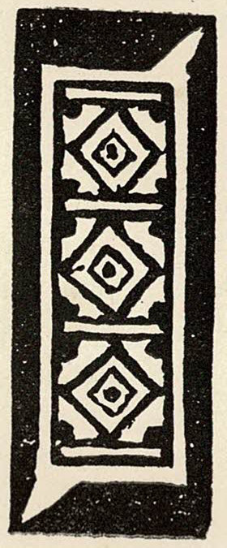
> 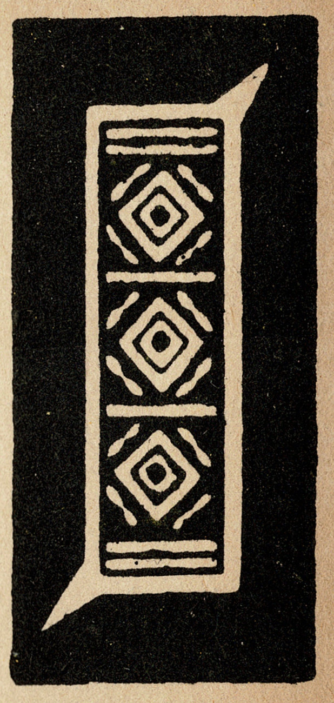
> 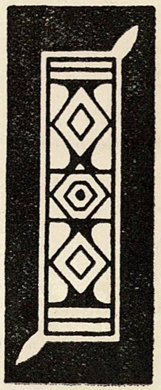
> 
>
> ```yaml
> noborder: true
> hidden: true
> cram: true
> equalheight: true
> size: "small"
> ```
>
> 3 Coins
</th>
> [!todo] ---Thai---
<td>
<span lang="th">สามตา</span>\
<span lang="th-Latn">sam ta</span>\
three eyes

<span lang="th">สามตาโต</span>\
<span lang="th-Latn">sam ta to</span>\
three big eyes
</td>
> [!todo] ---M/S---
<td>
<span lang="ms">sa batik</span>\
batik three
</td>
<td>
<span lang="ms">sêrong wâjik</span>\
<span lang="ms-Arab">سيروڠ واجيق</span>\
askew diamond
</td>
<td>
<span lang="mcm">crossan</span>\
heart, or brooch of Cabaia-wood
</td>
<td>
<span lang="mcm">batik</span>\
batik
</td>
<td>
<span lang="min">jarum wajik/itam</span>\
diamond/black needle
</td>
> [!todo] ---Java---
<td>
<span lang="jv">ꦮꦗꦶꦏ꧀</span>\
<span lang="jv-Latn">wajik</span>\
diamond
</td>
<td>
<span lang="jv-Latn">wajik</span>\
diamond
</td>
<td>
<span lang="jv-Latn">plenthi</span>

<span lang="jv-Latn">pithi</span>
</td>
<td>
<span lang="jv-Latn">(telu) plenthi</span>

<span lang="jv-Latn">tambur cilik</span>\
small drum

<span lang="jv-Latn">telu pithi</span>
</td>
<td>
<span lang="jv-Latn">(telu) plenthi</span>

<span lang="jv-Latn">tambur cilik</span>\
small drum

<span lang="jv-Latn">telu pithi</span>
</td>
<td>
<span lang="jv-Latn">cerut</span>\
[constricted?]

<span lang="jv-Latn">jarum</span>\
needle
</td>
<td>
<span lang="jv-Latn">gebles/gobog cilik/curut</span>
</td>
> [!todo] ---Bali---
<td>
<span lang="ban">ᬩᬸᬕ᭄ᬢᭂᬮᬸ</span>\
<span lang="ban-Latn">bug telu</span>\
[three dried betel nuts?]
</td>
<td>
<span lang="ban">ᬩᬸᬕ᭄ᬢᭂᬮᬸ</span>\
<span lang="ban-Latn">bug telu</span>
</td>
<td>
<span lang="ban">ᬚ᭄ᬩᬸᬕ᭄ᬢᭂᬮᬸ</span>\
<span lang="ban-Latn">jbug telu</span>
</td>
<td>
<span lang="ban">ᬚᭂᬩᭀᬕ᭄ᬢᭂᬮᬸ</span>\
<span lang="ban-Latn">jabog telu</span>
</td>
<td>
<span lang="ban">ᬩᬸᬕ᭄ᬢᭂᬮᬸ</span>\
<span lang="ban-Latn">bug telu</span>
</td>
<td>
<span lang="ban">ᬕᭀᬩᭀᬕ᭄ᬢᭂᬮᬸ</span>\
<span lang="ban-Latn">gobog telu</span>
</td>
<td>
<span lang="ban">ᬕᭀᬩᭀᬕ᭄ᬢᭂᬮᬸ</span>\
<span lang="ban-Latn">gobog telu</span>
</td>
> [!todo] ---Lombok---
<td>
<span lang="sas">ᬚᭂᬩᬸᬕ᭄ᬢᭂᬮᬸ</span>\
<span lang="sas-Latn">jebug telu</span>
</td>
<td>
<span lang="sas">(ᬕᭀᬩᭀᬕ᭄ᬢᭂᬮᬸ)</span>\
<span lang="sas-Latn">(gobog telu?)</span>
</td>
> [!todo] ---Borneo---
<td>
<span lang="bjn">tambur tiga</span>\
three drums
</td>
> [!todo] ---Sulawesi---
<td>
<span lang="mak"></span>
<span lang="mak-Latn"></span>
</td>
<td>
<span lang="id">tiga mata</span>
</td>
> [!todo] ---Maluku---
<td>
<span lang="id">tiga mata</span>
</td>
> [!todo] ---Timor---
<td>
<span lang="id">kukis</span>
</td>
</tr>

<tr>
<th scope="row" class="sticky-left border-end table-light">
> [!figure]
>
> 
> 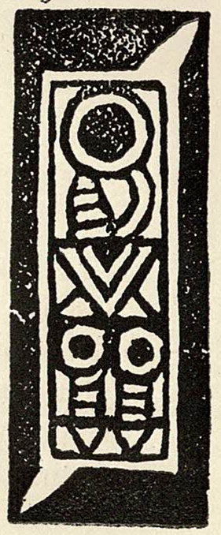
> 
> 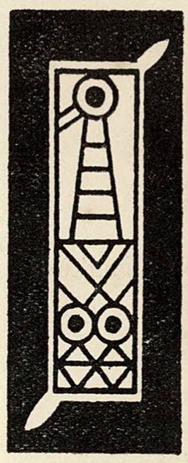
> 
>
> ```yaml
> noborder: true
> hidden: true
> cram: true
> equalheight: true
> size: "small"
> ```
>
> 3 Strings
</th>
> [!todo] ---Thai---
<td>
<span lang="th">สามนก</span>\
<span lang="th-Latn">sam nok</span>\
three birds

<span lang="th">สามนกเตี้ย</span>\
<span lang="th-Latn">sam nok tia</span>\
three short birds
</td>
> [!todo] ---M/S---
<td>
<span lang="ms">sa udang</span>\
shrimp three
</td>
<td>
<span lang="ms">sêrong gûnong</span>\
<span lang="ms-Arab">سيروڠ ݢونڠ</span>\
askew mountain
</td>
<td>
<span lang="mcm">kambrang</span>\
shrimp
</td>
<td>
<span lang="mcm">kambrang, kotek, cucuk</span>\
shrimp, penis, thorn
</td>
<td>
<span lang="min">jarum gadang</span>\
big needle
</td>
> [!todo] ---Java---
<td>
<span lang="jv">ꦒꦹꦤꦸꦁ</span>\
<span lang="jv-Latn">gunung</span>\
mountain
</td>
<td>
<span lang="jv-Latn">gunung</span>\
mountain
</td>
<td>
<span lang="jv-Latn">gunung</span>\
mountain
</td>
<td>
<span lang="jv-Latn">(telu) gunung</span>\
mountain (three)
</td>
<td>
<span lang="jv-Latn">(telu) gunung</span>\
mountain (three)
</td>
<td>
<span lang="jv-Latn">gunung</span>\
mountain
</td>
<td>
<span lang="jv-Latn">gunung</span>\
mountain
</td>
> [!todo] ---Bali---
<td>
<span lang="ban">ᬕᬸᬦᬸᬂ</span>\
<span lang="ban-Latn">gunung</span>\
mountain
</td>
<td>
<span lang="ban">ᬕᬸᬦᬸᬂ</span>\
<span lang="ban-Latn">gunung</span>\
mountain
</td>
<td>
<span lang="ban">ᬕᬸᬦᬸᬂ</span>\
<span lang="ban-Latn">gunung</span>\
mountain
</td>
<td>
<span lang="ban">ᬕᬸᬦᬸᬂ</span>\
<span lang="ban-Latn">gunung</span>\
mountain
</td>
<td>
<span lang="ban">ᬕᬸᬦᬸᬂ</span>\
<span lang="ban-Latn">gunung</span>\
mountain
</td>
<td>
<span lang="ban">ᬕᬸᬦᬸᬂ</span>\
<span lang="ban-Latn">gunung</span>\
mountain
</td>
<td>
<span lang="ban">ᬕᬸᬦᬸᬂ</span>\
<span lang="ban-Latn">gunung</span>\
mountain
</td>
> [!todo] ---Lombok---
<td>
<span lang="sas">ᬕᬸᬦᬸᬂ</span>\
<span lang="sas-Latn">gunung</span>\
mountain
</td>
<td>
<span lang="sas">ᬕᬸᬦᬸᬂ</span>\
<span lang="sas-Latn">gunung</span>\
mountain
</td>
> [!todo] ---Borneo---
<td>
<span lang="bjn">(jarum) gunung</span>\
(needle) mountain
</td>
> [!todo] ---Sulawesi---
<td>
<span lang="mak"></span>
<span lang="mak-Latn"></span>
</td>
<td>
<span lang="id">udang</span>\
shrimp
</td>
> [!todo] ---Maluku---
<td>
<span lang="id">udang</span>\
shrimp
</td>
> [!todo] ---Timor---
<td>
<span lang="id">udang</span>\
shrimp
</td>
</tr>

<tr>
<th scope="row" class="sticky-left border-end table-light">
> [!figure]
>
> 
> 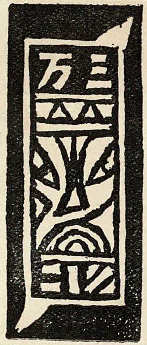
> 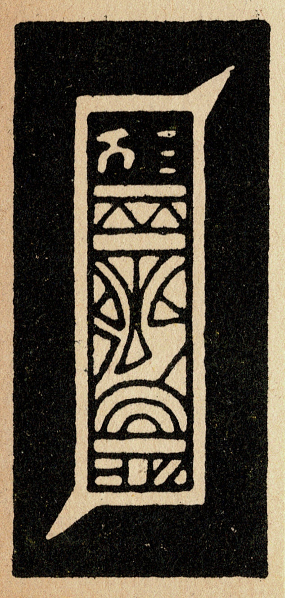
> 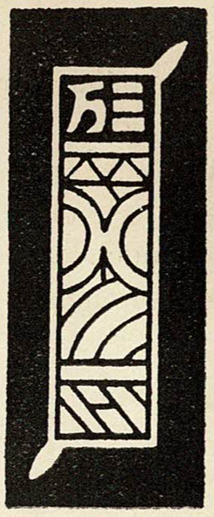
> 
>
> ```yaml
> noborder: true
> hidden: true
> cram: true
> equalheight: true
> size: "small"
> ```
>
> 3 Myriads
</th>
> [!todo] ---Thai---
<td>
<span lang="th">สามคน</span>\
<span lang="th-Latn">sam khon</span>\
three people
</td>
> [!todo] ---M/S---
<td>
<span lang="ms">sa ban</span>
</td>
<td>
<span lang="ms">sêrong jârum</span>\
<span lang="ms-Arab">سيروڠ جارم</span>\
askew needle
</td>
<td>
<span lang="mcm">chuchō</span>\
prick (Malay <span lang="ms">cucok</span>)

<span lang="mcm">agula</span>\
needle
</td>
<td>
<span lang="mcm">agula</span>\
needle
</td>
<td>
<span lang="min">jarum aluih</span>\
genteel needle
</td>
> [!todo] ---Java---
<td>
<span lang="jv">ꦗꦫꦸꦩ꧀</span>\
<span lang="jv-Latn">jarum</span>\
needle
</td>
<td>
<span lang="jv-Latn">telu cina, cingik</span>
</td>
<td>
<span lang="jv-Latn">telu cina, jarum</span>
</td>
<td>
<span lang="jv-Latn">singit, jarum</span>
</td>
<td>
<span lang="jv-Latn">telu cina, jarum, gudhul</span>
</td>
<td>
<span lang="jv-Latn">jarum wong</span>\
needle person
</td>
<td>
<span lang="jv-Latn">wong cungit, wong curut</span>
</td>
> [!todo] ---Bali---
<td>
<span lang="ban"> ᬘᬮᬶᬂ</span>\
<span lang="ban-Latn">caling</span>
</td>
<td>
<span lang="ban"> ᬘᬮᬶᬂ</span>\
<span lang="ban-Latn">caling</span>
</td>
<td>
<span lang="ban">ᬘᬸᬲ᭄</span>\
<span lang="ban-Latn">cus</span>
</td>
<td>
<span lang="ban">ᬘᬸᬲ᭄</span>\
<span lang="ban-Latn">cus</span>
</td>
<td>
<span lang="ban">ᬘᬸᬲ᭄</span>\
<span lang="ban-Latn">cues</span>
</td>
<td>
<span lang="ban">ᬚᬭᬸᬫ᭄</span>\
<span lang="ban-Latn">jarum</span>\
needle
</td>
<td>
<span lang="ban">ᬚᬭᬸᬫ᭄</span>\
<span lang="ban-Latn">jarum</span>\
needle
</td>
> [!todo] ---Lombok---
<td>
<span lang="sas">ᬚᬭᬸᬫ᭄</span>\
<span lang="sas-Latn">jarum</span>\
needle
</td>
<td>
<span lang="sas">ᬚᬭᬸᬫ᭄</span>\
<span lang="sas-Latn">jarum</span>\
needle
</td>
> [!todo] ---Borneo---
<td>
<span lang="bjn">jarum (alus)</span>\
needle
</td>
> [!todo] ---Sulawesi---
<td>
<span lang="mak">ᨍᨑᨘ</span>\
<span lang="mak-Latn">jarung</span>[@MakassaarschWoordenboek p. 416]\
nail
</td>
<td>
<span lang="id">jarum</span>\
needle
</td>
> [!todo] ---Maluku---
<td>
<span lang="id">jarum</span>\
needle
</td>
> [!todo] ---Timor---
<td>

<span lang="id">jarum</span>\
needle

> [!todo] NB: there is an error in Javaanse here

</td>
</tr>

<tr class="table-secondary">
<th scope="row" class="text-center sticky-left border-end">
Rank 4
</th>
<td>
> [!todo] ---Thai---
<span lang="th">สี่</span>\
<span lang="th-Latn">si</span>\
four
</td>
<td>
> [!todo] ---M/S---
<span lang="ms">si</span>\
(Hokkien sì)
</td>
<td>
<span lang="ms">kĕpâla bûlat</span>\
<span lang="ms-Arab">كڤلا بولة</span>\
round head
</td>
<td>
—
</td>
<td>
<span lang="mcm">see</span>\
(Hokkien sì)
</td>
<td>
<span lang="min">suduang</span> ‘spoon’(?)
</td>
> [!todo] ---Java---
<td>
</td>
<td>
</td>
<td>
</td>
<td>
</td>
<td>
</td>
<td>
</td>
<td>
</td>
> [!todo] ---Bali---
<td>
</td>
<td>
</td>
<td>
</td>
<td>
</td>
<td>
</td>
<td>
</td>
<td>
</td>
> [!todo] ---Lombok---
<td>
</td>
<td>
</td>
> [!todo] ---Borneo---
<td>
</td>
> [!todo] ---Sulawesi---
<td>
</td>
<td>
</td>
> [!todo] ---Maluku---
<td>
</td>
> [!todo] ---Timor---
<td>
</td>
</tr>

<tr>
<th scope="row" class="sticky-left border-end table-light">
> [!figure]
>
> 
> 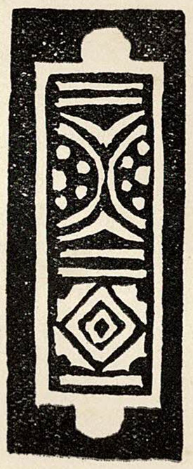
> 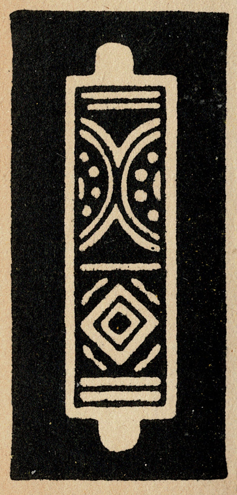
> 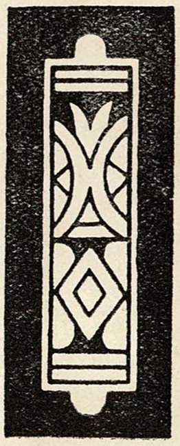
> 
>
> ```yaml
> noborder: true
> hidden: true
> cram: true
> equalheight: true
> size: "small"
> ```
>
> 4 Coins
</th>
> [!todo] ---Thai---
<td>
<span lang="th">สี่มะเขือ</span>\
<span lang="th-Latn">si makhuea</span>\
four eggplants
</td>
> [!todo] ---M/S---
<td>
<span lang="ms">si hitam</span>\
black four
</td>
<td>
<span lang="ms">kĕpâla bûlat gĕrôbok</span>\
<span lang="ms-Arab">كڤلا بولة ݢروبق</span>\
round head crockery chest
</td>
<td>
<span lang="mcm">manuco/rã</span>\
frog
</td>
<td>
<span lang="mcm">kodok</span>\
frog
</td>
<td>
<span lang="min">suduang itam/wajik</span>\
black/diamond spoon
</td>
> [!todo] ---Java---
<td>
<span lang="jv">ꦠꦩ꧀ꦧꦸꦂ</span>\
<span lang="jv-Latn">tambur</span>\
drum
</td>
<td>
<span lang="jv-Latn">tambur</span>\
drum
</td>
<td>
<span lang="jv-Latn">tambur</span>\
drum
</td>
<td>
<span lang="jv-Latn">tambur gedhé</span>\
big drum
</td>
<td>
<span lang="jv-Latn">papat tambur</span>\
four drum

<span lang="jv-Latn">tambur gedhé</span>\
big drum
</td>
<td>
<span lang="jv-Latn">gobok</span>\
coin
</td>
<td>
<span lang="jv-Latn">gebles/gobod gedhé</span>
</td>
> [!todo] ---Bali---
<td>
<span lang="ban">ᬩᭂᬮᬄ</span>\
<span lang="ban-Latn">belah</span>\
split
</td>
<td>
<span lang="ban">ᬩᬸᬕ᭄ᬕᭂᬤᬾ</span>\
<span lang="ban-Latn">bug gedé</span>\
big betel nut?
</td>
<td>
<span lang="ban">ᬩᭂᬮᬄ</span>\
<span lang="ban-Latn">(jebug) belah</span>\
split [betel nut?]
</td>
<td>
<span lang="ban">ᬚᬩᭀᬕ᭄ᬧᬶᬬᬕ᭄</span>\
<span lang="ban-Latn">jabog piag</span>
</td>
<td>
<span lang="ban">ᬩᭂᬲᬃ</span>\
<span lang="ban-Latn">besar</span>
</td>
<td>
<span lang="ban">ᬩᭂᬮᬄ</span>\
<span lang="ban-Latn">belah (gobog besar)</span>
</td>
<td>
<span lang="ban">ᬩᭂᬮᬄ</span>\
<span lang="ban-Latn">belah</span>
</td>
> [!todo] ---Lombok---
<td>
<span lang="sas">ᬩᭂᬲᬃ</span>\
<span lang="sas-Latn">besar</span>
</td>
<td>
<span lang="sas">ᬕᭀᬩᭀᬕ᭄ᬩᭂᬲᬃ</span>\
<span lang="sas-Latn">gobog besar</span>
</td>
> [!todo] ---Borneo---
<td>
<span lang="bjn">tambur (satu)</span>
</td>
> [!todo] ---Sulawesi---
<td>
<span lang="mak"></span>
<span lang="mak-Latn"></span>
</td>
<td>
<span lang="id">as</span>
</td>
> [!todo] ---Maluku---
<td>
<span lang="id">tambur</span>
</td>
> [!todo] ---Timor---
<td>
<span lang="id">ekor</span>
</td>
</tr>

<tr>
<th scope="row" class="sticky-left border-end table-light">
> [!figure]
>
> 
> 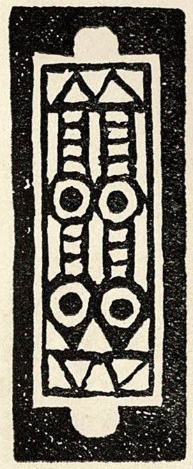
> 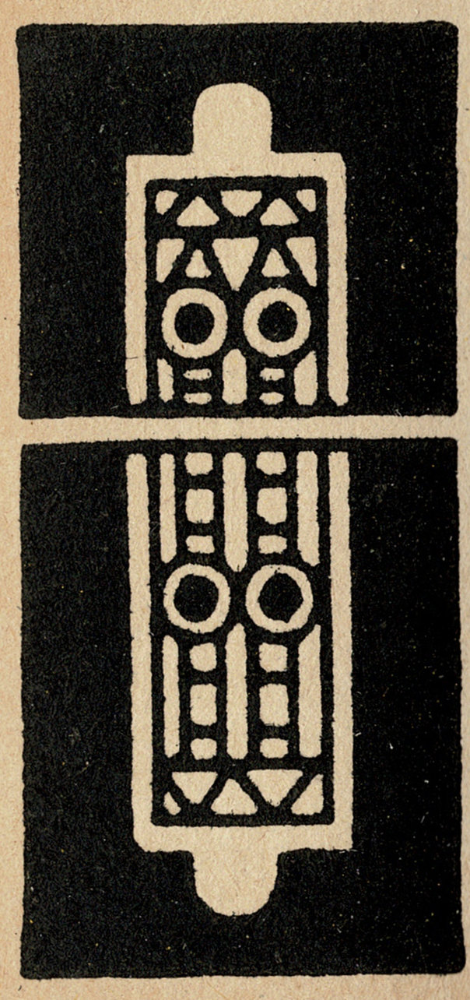
> 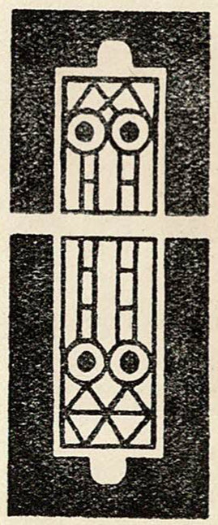
> 
>
> ```yaml
> noborder: true
> hidden: true
> cram: true
> equalheight: true
> size: "small"
> ```
>
> 4 Strings
</th>
> [!todo] ---Thai---
<td>
<span lang="th">สี่นม</span>\
<span lang="th-Latn">si nom</span>\
four breasts

<span lang="th">สี่นมยาน</span>\
<span lang="th-Latn">si nom yan</span>\
four hanging breasts
</td>
> [!todo] ---M/S---
<td>
<span lang="ms">si putih</span>\
white four
</td>
<td>
<span lang="ms">kĕpâla bûlat sûngkap</span>\
<span lang="ms-Arab">كڤلا بولة سوڠكڤ</span>\
round head loose hair
</td>
<td>
<span lang="mcm">basio</span>\
plate
</td>
<td>
<span lang="mcm">basiu</span>\
plate
</td>
<td>
<span lang="min">pinggang</span>\
waist
</td>
> [!todo] ---Java---
<td>
<span lang="jv">ꦕꦮꦁ</span>\
<span lang="jv-Latn">cawang</span>\
forked
</td>
<td>
<span lang="jv-Latn">gapet</span>
</td>
<td>
<span lang="jv-Latn">cawang</span>\
forked

<span lang="jv-Latn">pat pedhot</span>\
interrupted four
</td>
<td>
<span lang="jv-Latn">(pat) cawang</span>\
forked (four)
</td>
<td>
<span lang="jv-Latn">(pat) cawang</span>\
forked (four)
</td>
<td>
<span lang="jv-Latn">cawang</span>\
forked
</td>
<td>
<span lang="jv-Latn">cawang</span>\
forked
</td>
> [!todo] ---Bali---
<td>
<span lang="ban">ᬲᬗ᭄ᬓᬧ᭄</span>\
<span lang="ban-Latn">sangkap</span>\
[unknown]
</td>
<td>
<span lang="ban">ᬲᬗ᭄ᬓᬧ᭄</span>\
<span lang="ban-Latn">sangkap</span>
</td>
<td>
<span lang="ban">ᬲᬗ᭄ᬓᬧ᭄</span>\
<span lang="ban-Latn">sangkap (bebed)</span>
</td>
<td>
<span lang="ban">ᬲᬗ᭄ᬓᬧ᭄</span>\
<span lang="ban-Latn">sangkap</span>
</td>
<td>
<span lang="ban">ᬲᬗ᭄ᬓᬧ᭄</span>\
<span lang="ban-Latn">sangkap</span>
</td>
<td>
<span lang="ban">ᬘᬯᬂ</span>\
<span lang="ban-Latn">cawang</span>
</td>
<td>
<span lang="ban">ᬘᬯᬂ</span>\
<span lang="ban-Latn">cawang</span>
</td>
> [!todo] ---Lombok---
<td>
<span lang="sas">ᬘᬯᬂ</span>\
<span lang="sas-Latn">cawang</span>
</td>
<td>
<span lang="sas">ᬘᬯᬂ</span>\
<span lang="sas-Latn">cawang</span>
</td>
> [!todo] ---Borneo---
<td>
<span lang="bjn">pinggang</span>\
waist
</td>
> [!todo] ---Sulawesi---
<td>
<span lang="mak"></span>
<span lang="mak-Latn"></span>
</td>
<td>
<span lang="id">putus</span>\
cut
</td>
> [!todo] ---Maluku---
<td>
<span lang="id">putus pinggang</span>
</td>
> [!todo] ---Timor---
<td>
<span lang="id">pinggang</span>\
waist
</td>
</tr>

<tr>
<th scope="row" class="sticky-left border-end table-light">
> [!figure]
>
> 
> 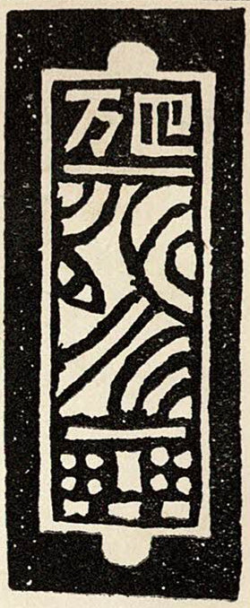
> 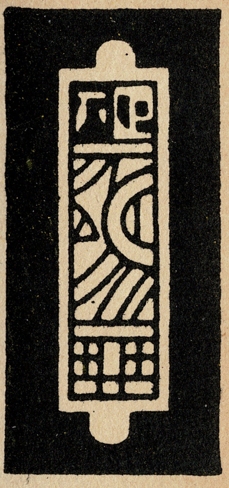
> 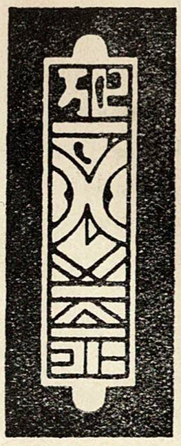
> 
>
> ```yaml
> noborder: true
> hidden: true
> cram: true
> equalheight: true
> size: "small"
> ```
>
> 4 Myriads
</th>
> [!todo] ---Thai---
<td>
<span lang="th">สี่คน</span>\
<span lang="th-Latn">si khon</span>\
four people
</td>
> [!todo] ---M/S---
<td>
<span lang="ms">si ban</span>
</td>
<td>
<span lang="ms">kĕpâla bûlat sundul</span>\
<span lang="ms-Arab">كڤلا بولة سوندل</span>\
round head ?
</td>
<td>
<span lang="mcm">ryiami/curto</span>\
short
</td>
<td>
<span lang="mcm">nyami</span>\
yam
</td>
<td>
<span lang="min">suduang putiah</span>\
white spoon
</td>
> [!todo] ---Java---
<td>
<span lang="jv">ꦕꦶꦤ</span>\
<span lang="jv-Latn">cina</span>\
China/Chinese
</td>
<td>
<span lang="jv-Latn">bodong</span>\
protruding (navel)
</td>
<td>
<span lang="jv-Latn">pat cina</span>\
Chinese four
</td>
<td>
<span lang="jv-Latn">bodong</span>\
protruding (navel)
</td>
<td>
<span lang="jv-Latn">papat cina</span>\
Chinese four

<span lang="jv-Latn">kondhé, nyonyah</span>
</td>
<td>
<span lang="jv-Latn">sundhul</span>\
to reach or touch up high
</td>
<td>
<span lang="jv-Latn">wong sundhul</span>\
person reach or touch up high
</td>
> [!todo] ---Bali---
<td>
<span lang="ban">ᬫᭂᬦ᭄ᬤᬸᬢ᭄</span>\
<span lang="ban-Latn">mendut</span>\
steamed rice flour balls
</td>
<td>
<span lang="ban">ᬕᭂᬦ᭄ᬤᭀᬢ᭄</span>\
<span lang="ban-Latn">gendot</span>
</td>
<td>
<span lang="ban">ᬓ᭄ᬩᭀᬂ</span>\
<span lang="ban-Latn">kbong</span>
</td>
<td>
<span lang="ban">ᬓᭀᬩᭀᬂ</span>\
<span lang="ban-Latn">kobong</span>
</td>
<td>
<span lang="ban">ᬓᭀᬩᭀᬂ</span>\
<span lang="ban-Latn">kobong</span>
</td>
<td>
<span lang="ban">ᬓᭀᬩᭀᬂ</span>\
<span lang="ban-Latn">kobong (kebong)</span>
</td>
<td>
<span lang="ban">ᬓᭀᬩᭀᬂ</span>\
<span lang="ban-Latn">kobong</span>
</td>
> [!todo] ---Lombok---
<td>
<span lang="sas">ᬘᭂᬍᬓ᭄</span>\
<span lang="sas-Latn">celek</span>
</td>
<td>
<span lang="sas">ᬘᭂᬍᬓ᭄</span>\
<span lang="sas-Latn">celek</span>
</td>
> [!todo] ---Borneo---
<td>
<span lang="bjn">pajung</span>
</td>
> [!todo] ---Sulawesi---
<td>
<span lang="mak"></span>
<span lang="mak-Latn"></span>
</td>
<td>
<span lang="id">kondei</span>
</td>
> [!todo] ---Maluku---
<td>
<span lang="id">kondei</span>
</td>
> [!todo] ---Timor---
<td>
<span lang="id">kondei</span>
</td>
</tr>

<tr class="table-secondary">
<th scope="row" class="text-center sticky-left border-end">
Rank 5
</th>
> [!todo] ---Thai---
<td>
<span lang="th">ห้า</span>\
<span lang="th-Latn">ha</span>\
five
</td>
> [!todo] ---M/S---
<td>
<span lang="ms">go</span>\
(Hokkien gō͘)
</td>
<td>
<span lang="ms">mâta dûa</span>\
<span lang="ms-Arab">ماة دوا</span>\
two eyes
</td>
<td>
—
</td>
<td>
<span lang="mcm">goh</span>\
(Hokkien gō͘)
</td>
<td>
<span lang="min">babi</span> ‘pig’ (looks like nostrils)
</td>
> [!todo] ---Java---
<td>
</td>
<td>
</td>
<td>
</td>
<td>
</td>
<td>
</td>
<td>
</td>
<td>
</td>
> [!todo] ---Bali---
<td>
</td>
<td>
</td>
<td>
</td>
<td>
</td>
<td>
</td>
<td>
</td>
<td>
</td>
> [!todo] ---Lombok---
<td>
</td>
<td>
</td>
> [!todo] ---Borneo---
<td>
</td>
> [!todo] ---Sulawesi---
<td>
</td>
<td>
</td>
> [!todo] ---Maluku---
<td>
</td>
> [!todo] ---Timor---
<td>
</td>
</tr>

<tr>
<th scope="row" class="sticky-left border-end table-light">
> [!figure]
>
> 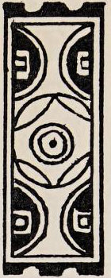
> 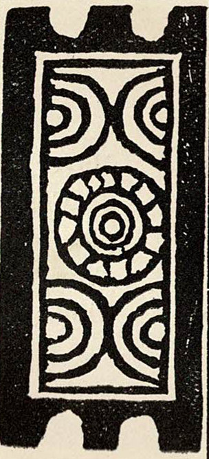
> 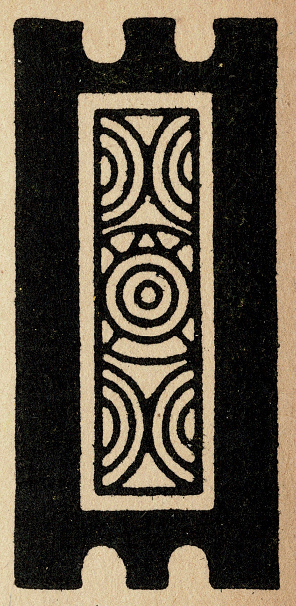
> 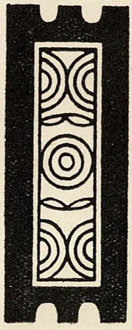
> 
>
> ```yaml
> noborder: true
> hidden: true
> cram: true
> equalheight: true
> size: "small"
> ```
>
> 5 Coins
</th>
> [!todo] ---Thai---
<td>
<span lang="th">ห้าแตงโม</span>\
<span lang="th-Latn">ha taengmo</span>\
five watermelons
</td>
> [!todo] ---M/S---
<td>
<span lang="ms">go pending</span>\
pending five
</td>
<td>
<span lang="ms">mâta dûa kĕlôning</span>\
<span lang="ms-Arab">ماة دوا كلونيڠ</span>\
? two eyes
</td>
<td>
<span lang="mcm">panding</span>\
sarong-fastener
</td>
<td>
<span lang="mcm">pending</span>\
sarong-fastener
</td>
<td>
<span lang="min">babi pusek</span>\
navel pig
</td>
> [!todo] ---Java---
<td>
<span lang="jv">ꦧꦧꦶꦏꦟ꧀ꦛꦺꦴꦁ</span> (modern <span lang="jv">ꦏꦤ꧀ꦛꦺꦴꦁ</span>)\
<span lang="jv-Latn">babi kaṇthong (kanthong)</span>\
pig bag
</td>
<td>
<span lang="jv-Latn">kanthong</span>\
bag
</td>
<td>
<span lang="jv-Latn">kanthong</span>\
bag
</td>
<td>
<span lang="jv-Latn">(lima) kanthong</span>\
bag (five)

<span lang="jv-Latn">lumpang</span>\
mortar
</td>
<td>
<span lang="jv-Latn">(lima) kanthong</span>\
bag (five)

<span lang="jv-Latn">lumpang</span>\
mortar
</td>
<td>
<span lang="jv-Latn">cupa</span>\
[unknown]
</td>
<td>
<span lang="jv-Latn">pau</span>

<span lang="jv-Latn">wudel</span>\
navel

<span lang="jv-Latn">bodong</span>\
protruding (navel)
</td>
> [!todo] ---Bali---
<td>
<span lang="ban">ᬧ᭄ᬭᬳᬸ</span>\
<span lang="ban-Latn">prau</span>\
boat
</td>
<td>
<span lang="ban">ᬧᬳᬸ</span>\
<span lang="ban-Latn">pau</span>
</td>
<td>
<span lang="ban">ᬧᬳᬸ</span>\
<span lang="ban-Latn">pau</span>
</td>
<td>
<span lang="ban">(ᬧᬳᬸ)</span>\
<span lang="ban-Latn">pau[?]</span>
</td>
<td>
<span lang="ban">(ᬧᬳᬸ)</span>\
<span lang="ban-Latn">pau[?]</span>
</td>
<td>
<span lang="ban">ᬧᬳᬸ</span>\
<span lang="ban-Latn">pau</span>
</td>
<td>
<span lang="ban">ᬧᬳᬸ</span>\
<span lang="ban-Latn">pau</span>
</td>
> [!todo] ---Lombok---
<td>
<span lang="sas-Latn">perahu</span>
</td>
<td>
<span lang="sas">ᬧᬳᬸ</span>\
<span lang="sas-Latn">pau</span>
</td>
> [!todo] ---Borneo---
<td>
<span lang="bjn">klonéng</span>
</td>
> [!todo] ---Sulawesi---
<td>
<span lang="mak">ᨄᨚᨌᨗ</span>\
<span lang="mak-Latn">poci</span>[@MakassaarschWoordenboek p. 114]\
navel
</td>
<td>
<span lang="id">prahu</span>
</td>
> [!todo] ---Maluku---
<td>
<span lang="id">pusat</span>\
navel
</td>
> [!todo] ---Timor---
<td>
<span lang="id">pusat</span>\
navel
</td>
</tr>

<tr>
<th scope="row" class="sticky-left border-end table-light">
> [!figure]
>
> 
> 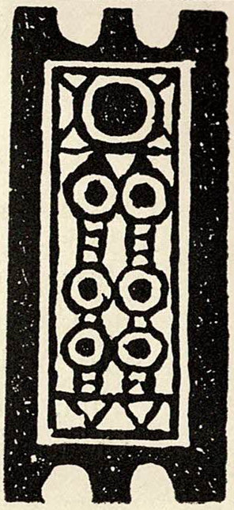
> 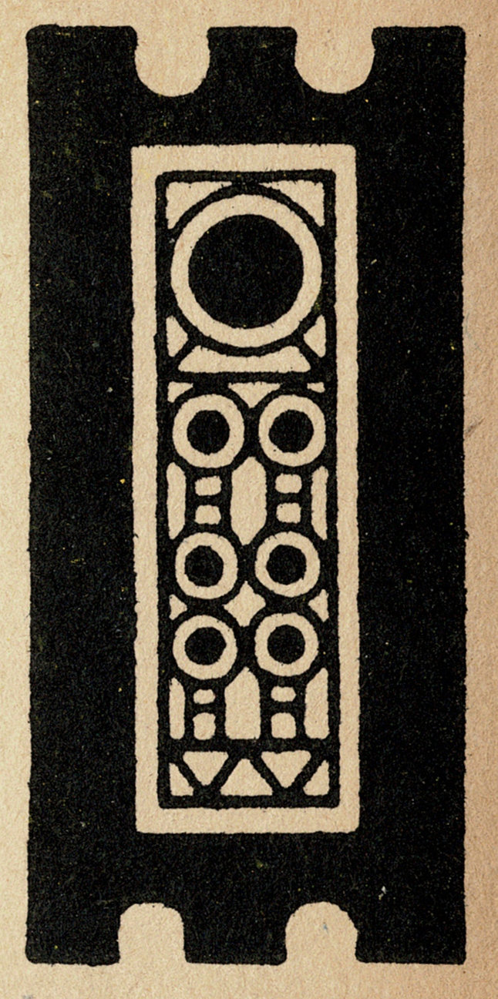
> 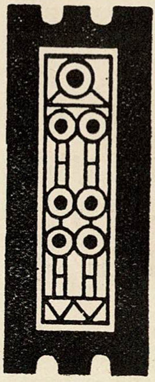
> 
>
> ```yaml
> noborder: true
> hidden: true
> cram: true
> equalheight: true
> size: "small"
> ```
>
> 5 Strings
</th>
> [!todo] ---Thai---
<td>
<span lang="th">ห้านก</span>\
<span lang="th-Latn">ha nok</span>\
five birds
</td>
> [!todo] ---M/S---
<td>
<span lang="ms">go burung</span>\
bird five
</td>
<td>
<span lang="ms">mâta dûa lêrek</span>\
<span lang="ms-Arab">ماة دوا ليرق</span>\
? two eyes
</td>
<td>
<span lang="mcm">baker</span>\
cow
</td>
<td>
<span lang="mcm">baka</span>\
cow
</td>
<td>
<span lang="min">babi gadang</span>\
big pig
</td>
> [!todo] ---Java---
<td>
<span lang="jv">ꦧꦧꦶꦭꦶꦤ꧀ꦠꦿꦶꦏ꧀</span>\
<span lang="jv-Latn">babi lintrik</span>
</td>
<td>
<span lang="jv-Latn">lima kleja</span>
</td>
<td>
<span lang="jv-Latn">lima lintrik, kecuk</span>
</td>
<td>
<span lang="jv-Latn">tholo</span>
</td>
<td>
<span lang="jv-Latn">lima linktrik, pecuk</span>
</td>
<td>
<span lang="jv-Latn">babi lintrik</span>\
pig [unknown]
</td>
<td>
<span lang="jv-Latn">cucuk babi</span>\
thorn ping
</td>
> [!todo] ---Bali---
<td>
<span lang="ban">ᬫᬢᭂᬕᭂᬤᬾ</span>\
<span lang="ban-Latn">mate gedé</span>\
big eye
</td>
<td>
<span lang="ban">ᬲᬸᬫ᭄ᬧᬸᬮ᭄</span>\
<span lang="ban-Latn">sumpul</span>
</td>
<td>
<span lang="ban">ᬧᬮᬸ</span>\
<span lang="ban-Latn">palu</span>
</td>
<td>
<span lang="ban-Latn">?</span>
</td>
<td>
<span lang="ban">ᬕᭀᬕᭀᬲ᭄</span>\
<span lang="ban-Latn">gogos</span>
</td>
<td>
<span lang="ban">ᬕᭀᬕᭀᬲ᭄</span>\
<span lang="ban-Latn">gogos</span>
</td>
<td>
<span lang="ban">ᬕᭀᬕᭀᬲ᭄</span>\
<span lang="ban-Latn">gogos</span>
</td>
> [!todo] ---Lombok---
<td>
<span lang="sas-Latn">gogoas</span>
</td>
<td>
<span lang="sas">ᬕᭀᬕᭀᬲ᭄</span>\
<span lang="sas-Latn">gogos</span>
</td>
> [!todo] ---Borneo---
<td>
<span lang="bjn">pantat</span>
</td>
> [!todo] ---Sulawesi---
<td>
<span lang="mak">ᨁᨚᨁᨚᨔᨚ</span>\
<span lang="mak-Latn">gogoso</span>[@MakassaarschWoordenboek p. 69]\
<a href="https://www.dreamstime.com/buras-traditional-food-west-south-sulawesi-indonesia-gogos-made-thick-glutinous-rice-then-wrapped-banana-leaves-image276176098">a dish of sticky rice cooked in bamboo leaves</a>
</td>
<td>
<span lang="id">têroes</span>
</td>
> [!todo] ---Maluku---
<td>
<span lang="id">têroes</span>
</td>
> [!todo] ---Timor---
<td>
<span lang="id">kio putih</span>
</td>
</tr>

<tr>
<th scope="row" class="sticky-left border-end table-light">
> [!figure]
>
> 
> 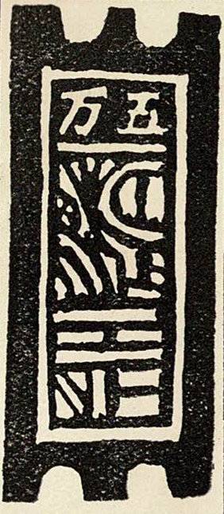
> 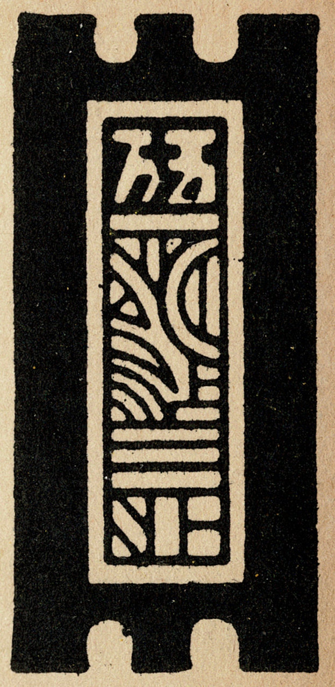
> 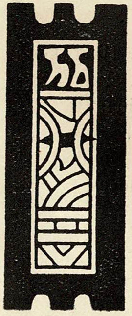
> 
>
> ```yaml
> noborder: true
> hidden: true
> cram: true
> equalheight: true
> size: "small"
> ```
>
> 5 Myriads
</th>
> [!todo] ---Thai---
<td>
<span lang="th">ห้าคน</span>\
<span lang="th-Latn">ha khon</span>\
five people
</td>
> [!todo] ---M/S---
<td>
<span lang="ms">go ban</span>
</td>
<td>
<span lang="ms">mâta dûa cîna</span>\
<span lang="ms-Arab">ماة دوا چين</span>\
Chinese two eyes
</td>
<td>
<span lang="mcm">governu/goberno</span>\
governor

<span lang="mcm">europeano</span>\
european
</td>
<td>
<span lang="mcm">ropianu</span>\
european
</td>
<td>
<span lang="min">babi aluih</span> \
genteel pig
</td>
> [!todo] ---Java---
<td>
<span lang="jv">ꦧꦧꦶꦕꦶꦤ</span>\
<span lang="jv-Latn">babi cina</span>\
pig China
</td>
<td>
<span lang="jv-Latn">gombal</span>\
rag
</td>
<td>
<span lang="jv-Latn">lima cina</span>\
China five
</td>
<td>
<span lang="jv-Latn">babi</span>\
pig
</td>
<td>
<span lang="jv-Latn">lima cina, babi</span>\
China five, pig
</td>
<td>
<span lang="jv-Latn">babi wong</span>\
pig person
</td>
<td>
<span lang="jv-Latn">wong babi</span>\
person pig
</td>
> [!todo] ---Bali---
<td>
<span lang="ban">ᬩᭀᬗ᭄ᬓᬃ</span>\
<span lang="ban-Latn">bongkar</span>\
[unload: forklift?]
</td>
<td>
<span lang="ban">ᬩᭀᬗ᭄ᬓᬃ</span>\
<span lang="ban-Latn">bongkar</span>
</td>
<td>
<span lang="ban">ᬩᭀᬗ᭄ᬓᬃ</span>\
<span lang="ban-Latn">bongkar</span>
</td>
<td>
<span lang="ban">ᬧᬂᬧᬂ</span>\
<span lang="ban-Latn">pangpang</span>
</td>
<td>
<span lang="ban">ᬘᬗ᭄ᬕᬄ</span>\
<span lang="ban-Latn">canggah</span>
</td>
<td>
<span lang="ban">ᬧᭀᬮᬓ᭄</span>\
<span lang="ban-Latn">polak</span>
</td>
<td>
<span lang="ban">ᬧᭀᬮᬓ᭄</span>\
<span lang="ban-Latn">polak</span>
</td>
> [!todo] ---Lombok---
<td>
<span lang="sas">ᬧᭀᬮᬓ᭄</span>\
<span lang="sas-Latn">polak</span>
</td>
<td>
<span lang="sas">ᬧᭀᬮᬓ᭄</span>\
<span lang="sas-Latn">polak</span>
</td>
> [!todo] ---Borneo---
<td>
<span lang="bjn">babi</span>
</td>
> [!todo] ---Sulawesi---
<td>
<span lang="mak"></span>
<span lang="mak-Latn"></span>
</td>
<td>
<span lang="id">babi (pai tuwa)</span>
</td>
> [!todo] ---Maluku---
<td>
<span lang="id">babi (pai tuwa)</span>
</td>
> [!todo] ---Timor---
<td>
<span lang="id">babi (pai tuwa)</span>
</td>
</tr>

<tr class="table-secondary">
<th scope="row" class="text-center sticky-left border-end">
Rank 6
</th>
> [!todo] ---Thai---
<td>
<span lang="th">หก</span>\
<span lang="th-Latn">hok</span>\
six
</td>
> [!todo] ---M/S---
<td>
<span lang="ms">lak</span>\
(Hokkien la̍k)
</td>
<td>
<span lang="ms">lak</span>\
<span lang="ms-Arab">لق</span>\
(from Hokkien)
</td>
<td>
—
</td>
<td>
<span lang="mcm">lak</span>\
(Hokkien la̍k)
</td>
<td>
<span lang="min">kapik</span> ‘grill’
</td>
> [!todo] ---Java---
<td>
</td>
<td>
</td>
<td>
</td>
<td>
</td>
<td>
</td>
<td>
</td>
<td>
</td>
> [!todo] ---Bali---
<td>
</td>
<td>
</td>
<td>
</td>
<td>
</td>
<td>
</td>
<td>
</td>
<td>
</td>
> [!todo] ---Lombok---
<td>
</td>
<td>
</td>
> [!todo] ---Borneo---
<td>
</td>
> [!todo] ---Sulawesi---
<td>
</td>
<td>
</td>
> [!todo] ---Maluku---
<td>
</td>
> [!todo] ---Timor---
<td>
</td>
</tr>

<tr>
<th scope="row" class="sticky-left border-end table-light">
> [!figure]
>
> 
> 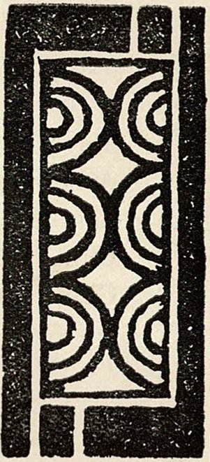
> 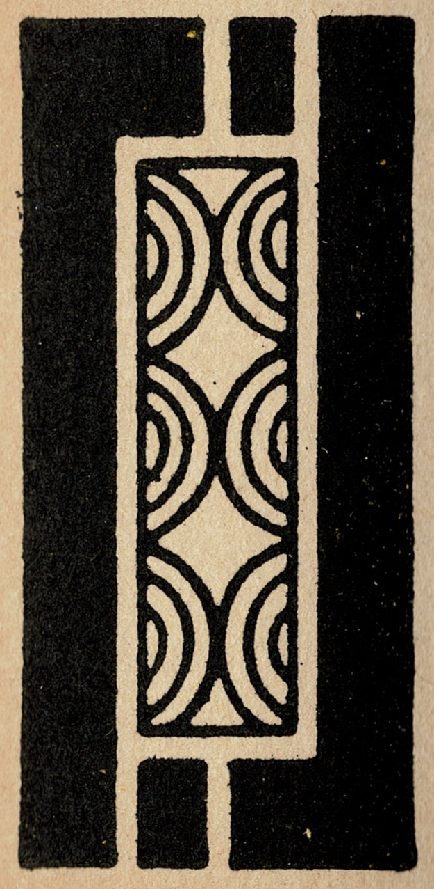
> 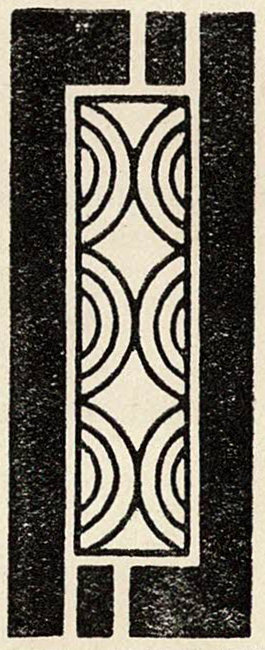
> 
>
> ```yaml
> noborder: true
> hidden: true
> cram: true
> equalheight: true
> size: "small"
> ```
>
> 6 Coins
</th>
> [!todo] ---Thai---
<td>
<span lang="th">หกตา</span>\
<span lang="th-Latn">hok ta</span>\
six eyes
</td>
> [!todo] ---M/S---
<td>
<span lang="ms">lak hitam</span>\
black six
</td>
<td>
<span lang="ms">lak kroh</span>\
<span lang="ms-Arab">لق كروه</span>\
? six
</td>
<td>
<span lang="mcm">gordo</span>\
fat
</td>
<td>
<span lang="mcm">godra</span>\
fat
</td>
<td>
<span lang="min">kapik anam</span>\
grilled six
</td>
> [!todo] ---Java---
<td>
<span lang="jv">ꦏꦼꦫꦺꦴꦏ꧀ꦒ꦳ꦥꦶꦠ꧀</span>\
<span lang="jv-Latn">kêrok ghapit</span>\
curry-comb tongs
</td>
<td>
<span lang="jv-Latn">kerok</span>\
curry-comb
</td>
<td>
<span lang="jv-Latn">kerok</span>\
curry-comb
</td>
<td>
<span lang="jv-Latn">(nem) kerok</span>
</td>
<td>
<span lang="jv-Latn">(nem) kerok</span>
</td>
<td>
<span lang="jv-Latn">mendhung</span>\
dark rain cloud
</td>
<td>
<span lang="jv-Latn">kerok</span>\
curry-comb
</td>
> [!todo] ---Bali---
<td>
<span lang="ban">ᬦ᭄ᬬᭂᬫ᭄</span>\
<span lang="ban-Latn">nyem</span>\
[pun on six?]
</td>
<td>
<span lang="ban">ᬧᬶᬲ᭄ᬦᭂᬫ᭄</span>\
<span lang="ban-Latn">pis nem</span>\
six coins
</td>
<td>
<span lang="ban">ᬧᬶᬲ᭄ᬦᭂᬫ᭄</span>\
<span lang="ban-Latn">pis nem</span>\
six coins
</td>
<td>
<span lang="ban">ᬧᬶᬲ᭄ᬦᭂᬫ᭄</span>\
<span lang="ban-Latn">pis nem</span>\
six coins
</td>
<td>
<span lang="ban">ᬧᬶᬲ᭄ᬦᭂᬫ᭄</span>\
<span lang="ban-Latn">pis nem</span>\
six coins
</td>
<td>
<span lang="ban">ᬢᬶᬫᬦᭂᬫ᭄</span>\
<span lang="ban-Latn">tima nem (pipis nem)</span>\
six coins
</td>
<td>
<span lang="ban">ᬢᬶᬫᬦᭂᬫ᭄</span>\
<span lang="ban-Latn">tima nem (pipis nem)</span>\
six coins
</td>
> [!todo] ---Lombok---
<td>
<span lang="sas">ᬧᬶᬲ᭄ᬦᭂᬫ᭄</span>\
<span lang="sas-Latn">pis nem</span>\
six coins
</td>
<td>
<span lang="sas">ᬢᬶᬫᬦᭂᬫ᭄</span>\
<span lang="sas-Latn">tima nem (pipis nem)</span>\
six coins
</td>
> [!todo] ---Borneo---
<td>
<span lang="bjn">kerok</span>
</td>
> [!todo] ---Sulawesi---
<td>
<span lang="mak">ᨕᨊ</span>\
<span lang="mak-Latn">anang</span>[@MakassaarschWoordenboek p. 653]\
six
</td>
<td>
<span lang="id">anam mata</span>
</td>
> [!todo] ---Maluku---
<td>
<span lang="id">anam kaladi</span>
</td>
> [!todo] ---Timor---
<td>
<span lang="id">tarasi</span>
</td>
</tr>

<tr>
<th scope="row" class="sticky-left border-end table-light">
> [!figure]
>
> 
> 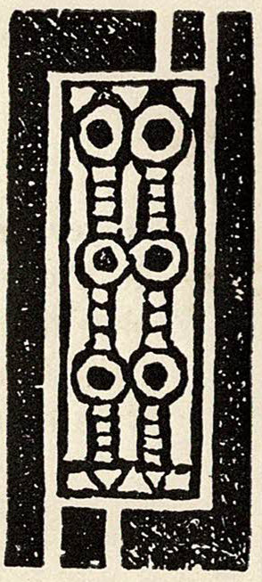
> 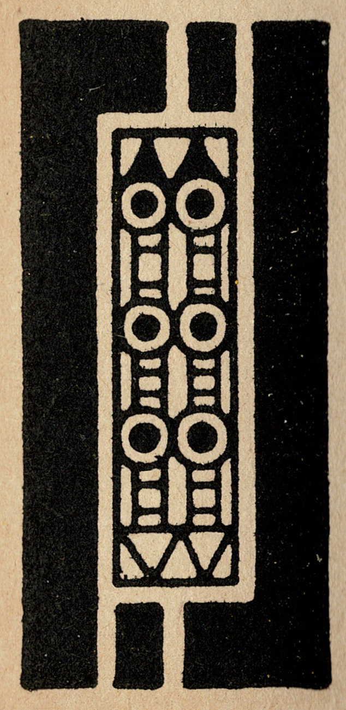
> 
> 
>
> ```yaml
> noborder: true
> hidden: true
> cram: true
> equalheight: true
> size: "small"
> ```
>
> 6 Strings
</th>
> [!todo] ---Thai---
<td>
<span lang="th">หกละเอียด</span>\
<span lang="th-Latn">hok laiat</span>\
delicate six

<span lang="th">หกเซาะ</span>\
<span lang="th-Latn">hok so</span>\
chiselled six
</td>
> [!todo] ---M/S---
<td>
<span lang="ms">lak putih</span>\
white six
</td>
<td>
<span lang="ms">lak tâli</span>\
<span lang="ms-Arab">لق تالي</span>\
rope six
</td>
<td>
<span lang="mcm">gala</span>\
bamboo
</td>
<td>
<span lang="mcm">gala</span>\
bamboo
</td>
<td>
<span lang="min">kapik manih</span>\
grilled sweet
</td>
> [!todo] ---Java---
<td>
<span lang="jv">ꦏ꧀ꦭꦺꦗꦒ꦳ꦥꦶꦠ꧀</span>\
<span lang="jv-Latn">kléja ghapit</span>
</td>
<td>
<span lang="jv-Latn">kléja</span>
</td>
<td>
<span lang="jv-Latn">kléja</span>
</td>
<td>
<span lang="jv-Latn">(nem) kléja, bagus</span>
</td>
<td>
<span lang="jv-Latn">(nem) kléja, bagus</span>
</td>
<td>
<span lang="jv-Latn">candra</span>\
[moon/month?]
</td>
<td>
<span lang="jv-Latn">tanem</span>\
[high register: to plant?]
</td>
> [!todo] ---Bali---
<td>
<span lang="ban-Latn">mer</span>\
[unknown]
</td>
<td>
<span lang="ban-Latn">mer</span>
</td>
<td>
<span lang="ban">ᬓᬼᬦ᭄ᬢᬾᬂ</span>\
<span lang="ban-Latn">klenténg</span>\
Chinese temple (onomatopœic: bells)[@IndonesianIdioms p. 160]
</td>
<td>
<span lang="ban">ᬧᭂᬗ᭄ᬓ</span>\
<span lang="ban-Latn">pengka</span>
</td>
<td>
<span lang="ban-Latn">mer</span>
</td>
<td>
<span lang="ban-Latn">mer</span>
</td>
<td>
<span lang="ban-Latn">mer</span>
</td>
> [!todo] ---Lombok---
<td>
<span lang="sas-Latn">mer</span>
</td>
<td>
<span lang="sas-Latn">mer</span>
</td>
> [!todo] ---Borneo---
<td>
<span lang="bjn">bambu</span>\
bamboo
</td>
> [!todo] ---Sulawesi---
<td>
<span lang="mak"></span>
<span lang="mak-Latn"></span>
</td>
<td>
<span lang="id">bêlah buluh</span>\
wide stripes

<span lang="id">tarabei</span>
</td>
> [!todo] ---Maluku---
<td>
<span lang="id">bambu</span>\
bamboo
</td>
> [!todo] ---Timor---
<td>
<span lang="id">bambu</span>\
bamboo
</td>
</tr>

<tr>
<th scope="row" class="sticky-left border-end table-light">
> [!figure]
>
> 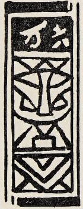
> 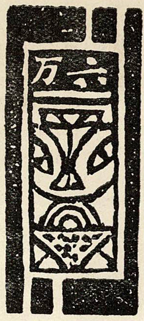
> 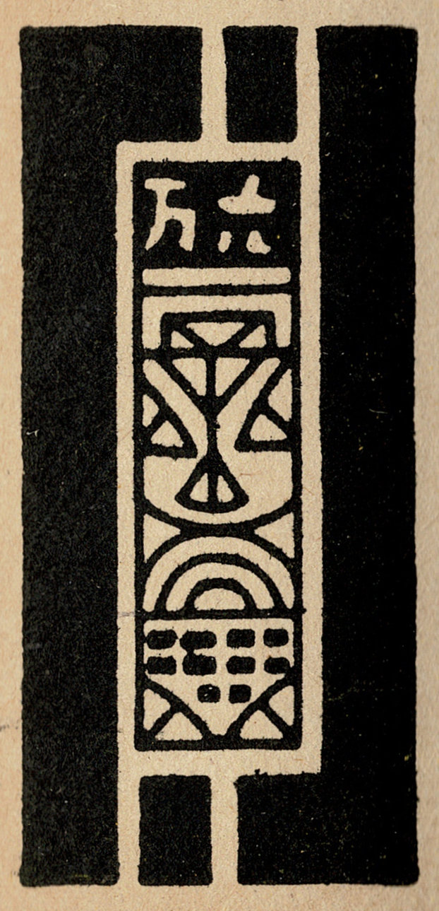
> 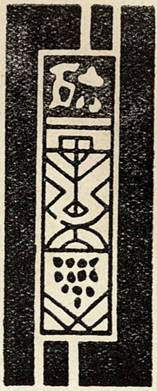
> 
>
> ```yaml
> noborder: true
> hidden: true
> cram: true
> equalheight: true
> size: "small"
> ```
>
> 6 Myriads
</th>
> [!todo] ---Thai---
<td>
<span lang="th">หกคน</span>\
<span lang="th-Latn">hok khon</span>\
six people
</td>
> [!todo] ---M/S---
<td>
<span lang="ms">lak ban</span>
</td>
<td>
<span lang="ms">lak chantek</span>\
<span lang="ms-Arab">لق چنتيق</span>\
beautiful six
</td>
<td>
<span lang="mcm">osu</span>\
bone
</td>
<td>
<span lang="mcm">osu</span>\
bone
</td>
<td>
<span lang="min">kapik aluih</span>\
grilled genteel
</td>
> [!todo] ---Java---
<td>
<span lang="jv">ꦕꦶꦤꦒ꦳ꦥꦶꦠ꧀</span>\
<span lang="jv-Latn">cina ghapit</span>\
Chinese tongs
</td>
<td>
<span lang="jv-Latn">nem cina</span>\
China six
</td>
<td>
<span lang="jv-Latn">nem cina</span>\
China six
</td>
<td>
<span lang="jv-Latn">siyong bombyok</span>
</td>
<td>
<span lang="jv-Latn">nem cina</span>\
China six
</td>
<td>
<span lang="jv-Latn">gabit</span>\
[probably tongs]
</td>
<td>
<span lang="jv-Latn">wong gapit</span>\
tongs person
</td>
> [!todo] ---Bali---
<td>
<span lang="ban">ᬓᬼᬦ᭄ᬢᬾᬂ</span>\
<span lang="ban-Latn">klenténg</span>\
Chinese temple
</td>
<td>
<span lang="ban">ᬍᬢᬾᬂ</span>\
<span lang="ban-Latn">leteng</span>
</td>
<td>
<span lang="ban">ᬩᬸᬭᬢ᭄</span>\
<span lang="ban-Latn">burat</span>\
makeup
</td>
<td>
<span lang="ban">ᬩᬸᬭᬢ᭄</span>\
<span lang="ban-Latn">burat</span>\
makeup
</td>
<td>
<span lang="ban">ᬩᬸᬳᬢ᭄</span>\
<span lang="ban-Latn">buat</span>\
[makeup?]
</td>
<td>
<span lang="ban">ᬫᭂᬕᬢ᭄</span>\
<span lang="ban-Latn">megat (gapit)</span>
</td>
<td>
<span lang="ban">ᬫᭂᬕᬢ᭄</span>\
<span lang="ban-Latn">megat</span>
</td>
> [!todo] ---Lombok---
<td>
<span lang="sas">ᬫᭂᬕᬢ᭄</span>\
<span lang="sas-Latn">megat</span>
</td>
<td>
<span lang="sas">ᬫᭂᬕᬢ᭄</span>\
<span lang="sas-Latn">megat</span>
</td>
> [!todo] ---Borneo---
<td>
<span lang="bjn">rumah</span>\
building [temple?]
</td>
> [!todo] ---Sulawesi---
<td>
<span lang="mak">ᨅᨒ</span>\
<span lang="mak-Latn">bala</span>[@MakassaarschWoordenboek p. 200]\
house [see bottom of card]
</td>
<td>
<span lang="id">lakban</span>
</td>
> [!todo] ---Maluku---
<td>
<span lang="id">lakban</span>
</td>
> [!todo] ---Timor---
<td>
<span lang="id">lakban</span>
</td>
</tr>

<tr class="table-secondary">
<th scope="row" class="text-center sticky-left border-end">
Rank 7
</th>
> [!todo] ---Thai---
<td>
<span lang="th">เจ็ด</span>\
<span lang="th-Latn">chet</span>\
seven
</td>
> [!todo] ---M/S---
<td>
<span lang="ms">jit</span>\
(Hokkien chhit)
</td>
<td>
<span lang="ms">chit</span>\
<span lang="ms-Arab">چية</span>\
(from Hokkien)
</td>
<td>
—
</td>
<td>
<span lang="ms">chit</span>\
(Hokkien chhit)
</td>
<td>
<span lang="min">sisiak</span> ‘scales’
</td>
> [!todo] ---Java---
<td>
</td>
<td>
</td>
<td>
</td>
<td>
</td>
<td>
</td>
<td>
</td>
<td>
</td>
> [!todo] ---Bali---
<td>
</td>
<td>
</td>
<td>
</td>
<td>
</td>
<td>
</td>
<td>
</td>
<td>
</td>
> [!todo] ---Lombok---
<td>
</td>
<td>
</td>
> [!todo] ---Borneo---
<td>
</td>
> [!todo] ---Sulawesi---
<td>
</td>
<td>
</td>
> [!todo] ---Maluku---
<td>
</td>
> [!todo] ---Timor---
<td>
</td>
</tr>

<tr>
<th scope="row" class="sticky-left border-end table-light">
> [!figure]
>
> 
> 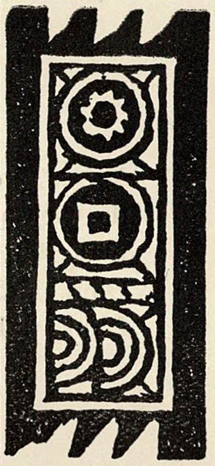
> 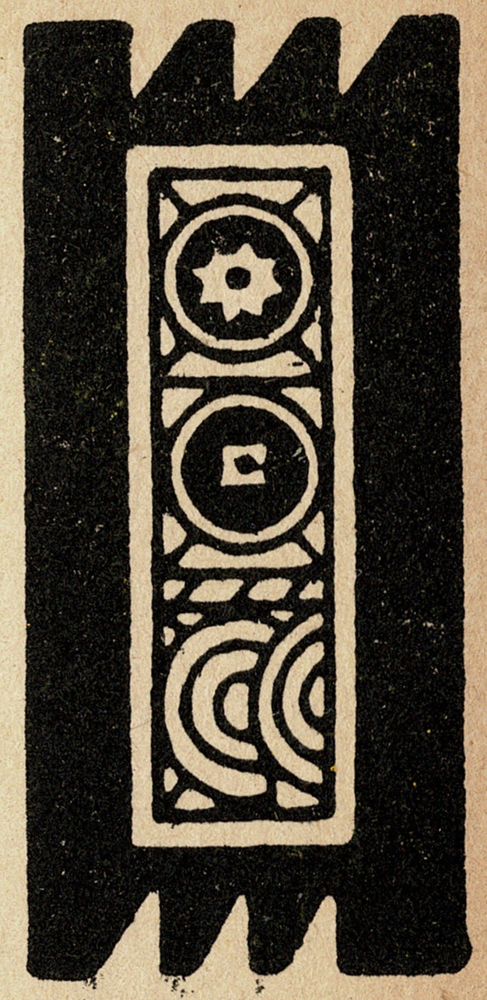
> 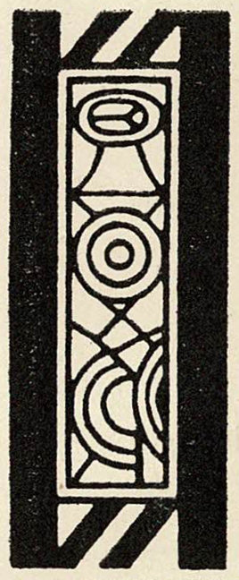
> 
>
> ```yaml
> noborder: true
> hidden: true
> cram: true
> equalheight: true
> size: "small"
> ```
>
> 7 Coins
</th>
> [!todo] ---Thai---
<td>
<span lang="th">เจ็ดพัด</span>\
<span lang="th-Latn">chet phat</span>\
seven fans
</td>
> [!todo] ---M/S---
<td>
<span lang="ms">jit hitam</span> or <span lang="ms">jit daun</span>\
black or leaf seven
</td>
<td>
<span lang="ms">chit sûngkai</span>\
<span lang="ms-Arab">چية سوڠكي</span>\
<a href="https://en.wikipedia.org/wiki/Peronema"><cite lang="la">Peronema canescens</cite></a> (a leafy plant) seven
</td>
<td>
<span lang="mcm">lóia</span>\
flag
</td>
<td>
<span lang="mcm">layar</span>\
sail
</td>
<td>
<span lang="min">sisiak bendera</span>\
flag scales
</td>
> [!todo] ---Java---
<td>
<span lang="jv">ꦫꦺꦪꦧ꧀ꦭꦪꦂ</span>\
<span lang="jv-Latn">réyab layar</span>\
sweep hair, sail
</td>
<td>
<span lang="jv-Latn">geper</span>
</td>
<td>
<span lang="jv-Latn">sember, pitu kera</span>
</td>
<td>
<span lang="jv-Latn">sember</span>
</td>
<td>
<span lang="jv-Latn">(pitu) kera, keder</span>
</td>
<td>
<span lang="jv-Latn">layar</span>\
sail
</td>
<td>
<span lang="jv-Latn">layar</span>\
sail
</td>
> [!todo] ---Bali---
<td>
<span lang="ban">ᬧᬓᬸ</span>\
<span lang="ban-Latn">paku</span>\
[fern or nail?]
</td>
<td>
<span lang="ban">ᬧᬶᬲ᭄ᬢᬸ</span>\
<span lang="ban-Latn">pis tu</span>
</td>
<td>
<span lang="ban">ᬧᬶᬲ᭄ᬢᬸ</span>\
<span lang="ban-Latn">pis tu</span>
</td>
<td>
<span lang="ban">ᬧᬶᬲ᭄ᬧᬶᬢᬸ</span>\
<span lang="ban-Latn">pipis pitu</span>\
seven coins
</td>
<td>
<span lang="ban">ᬩᭂᬦ᭄ᬤᬾᬭ</span>\
<span lang="ban-Latn">bendéra</span>\
flag
</td>
<td>
<span lang="ban">ᬩᭂᬦ᭄ᬤᬾᬭ</span>\
<span lang="ban-Latn">bendéra (layar)</span>\
flag (sail)
</td>
<td>
<span lang="ban">ᬩᭂᬦ᭄ᬤᬾᬭ</span>\
<span lang="ban-Latn">bendéra (layar)</span>\
flag (sail)
</td>
> [!todo] ---Lombok---
<td>
<span lang="sas">ᬩᭂᬦ᭄ᬤᬾᬭ</span>\
<span lang="sas-Latn">bendera</span>\
flag
</td>
<td>
<span lang="sas">ᬩᭂᬦ᭄ᬤᬾᬭ</span>\
<span lang="sas-Latn">bendéra (bendéra layar)</span>\
flag
</td>
> [!todo] ---Borneo---
<td>
<span lang="bjn">layar</span>
</td>
> [!todo] ---Sulawesi---
<td>
<span lang="mak">ᨅᨉᨙᨑ</span>\
<span lang="mak-Latn">bandéra</span>[@MakassaarschWoordenboek p. 175]\
flag
</td>
<td>
<span lang="id">bandéra</span>
</td>
> [!todo] ---Maluku---
<td>
<span lang="id">bulu ayam</span>
</td>
> [!todo] ---Timor---
<td>
<span lang="id">bandéra</span>
</td>
</tr>

<tr>
<th scope="row" class="sticky-left border-end table-light">
> [!figure]
>
> 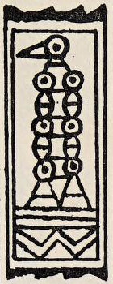
> 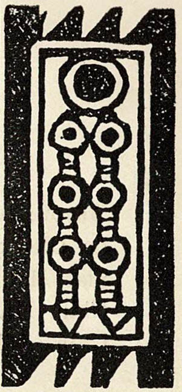
> 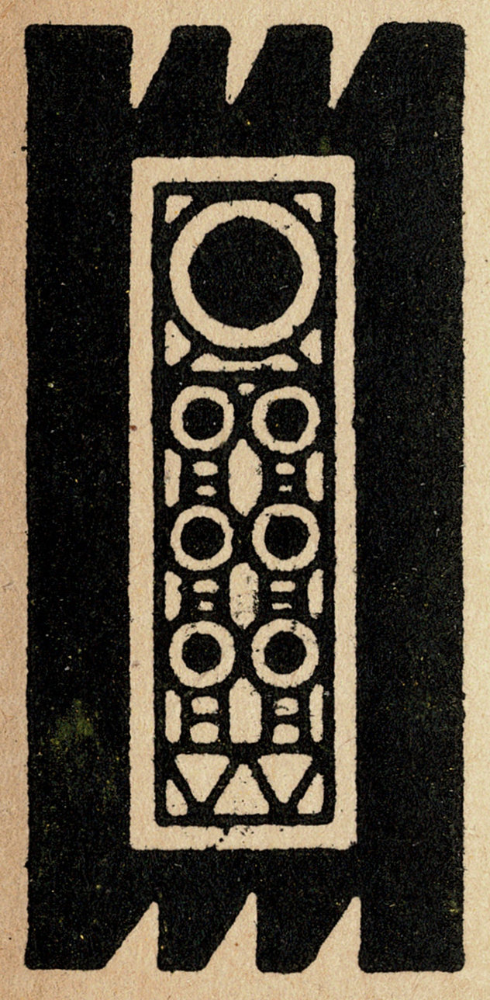
> 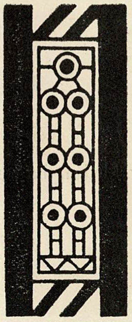
> 
>
> ```yaml
> noborder: true
> hidden: true
> cram: true
> equalheight: true
> size: "small"
> ```
>
> 7 Strings
</th>
> [!todo] ---Thai---
<td>
<span lang="th">เจ็ดนก</span>\
<span lang="th-Latn">chet nok</span>\
seven birds
</td>
> [!todo] ---M/S---
<td>
<span lang="ms">jit burung</span>\
bird seven
</td>
<td>
<span lang="ms">chit halus</span>\
<span lang="ms-Arab">چية هالس</span>\
fine seven
</td>
<td>
<span lang="mcm">galinha</span>\
chicken
</td>
<td>
<span lang="mcm">galinha</span>\
chicken
</td>
<td>
<span lang="min">sisiak gadang</span>\
big scales
</td>
> [!todo] ---Java---
<td>
<span lang="jv">ꦫꦺꦪꦧ꧀ꦭꦶꦤ꧀ꦠꦿꦶꦏ꧀</span>\
<span lang="jv-Latn">réyab lintrik</span>
</td>
<td>
<span lang="jv-Latn">lintrik</span>
</td>
<td>
<span lang="jv-Latn">pitu kecuk</span>
</td>
<td>
<span lang="jv-Latn">pitu lintrik, pecuk pitu</span>
</td>
<td>
<span lang="jv-Latn">pitu lintrik, pecuk pitu</span>
</td>
<td>
<span lang="jv-Latn">réyab lintrik</span>\
[unknown]
</td>
<td>
<span lang="jv-Latn">cucuk kereg</span>
</td>
> [!todo] ---Bali---
<td>
<span lang="ban">ᬭᬶᬂᬬᬶᬂ</span>\
<span lang="ban-Latn">ringying</span>\
[unknown]
</td>
<td>
<span lang="ban-Latn">merenying</span>
</td>
<td>
<span lang="ban">ᬭᬶᬜᬶᬂ</span>\
<span lang="ban-Latn">rinying</span>
</td>
<td>
<span lang="ban">ᬭᬶᬜᬶᬂ</span>\
<span lang="ban-Latn">rinying</span>
</td>
<td>
<span lang="ban">ᬘᬸᬭᬶᬂ</span>\
<span lang="ban-Latn">curing</span>\
an instrument or bird-like decoration
</td>
<td>
<span lang="ban">ᬘᬸᬭᬶᬂ</span>\
<span lang="ban-Latn">curing</span>\
an instrument or bird-like decoration
</td>
<td>
<span lang="ban">ᬘᬸᬭᬶᬂ</span>\
<span lang="ban-Latn">curing</span>\
an instrument or bird-like decoration
</td>
> [!todo] ---Lombok---
<td>
<span lang="sas">ᬘᬸᬭᬶᬂ</span>\
<span lang="sas-Latn">curing</span>\
an instrument or bird-like decoration
</td>
<td>
<span lang="sas">ᬘᬸᬭᬶᬂ</span>\
<span lang="sas-Latn">curing</span>\
an instrument or bird-like decoration
</td>
> [!todo] ---Borneo---
<td>
<span lang="bjn">bulu</span>
</td>
> [!todo] ---Sulawesi---
<td>
<span lang="mak"></span>
<span lang="mak-Latn"></span>
</td>
<td>
<span lang="id">galéma</span>
</td>
> [!todo] ---Maluku---
<td>
<span lang="id">gohu</span>
</td>
> [!todo] ---Timor---
<td>
<span lang="id">josef</span>
</td>
</tr>

<tr>
<th scope="row" class="sticky-left border-end table-light">
> [!figure]
>
> 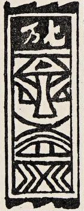
> 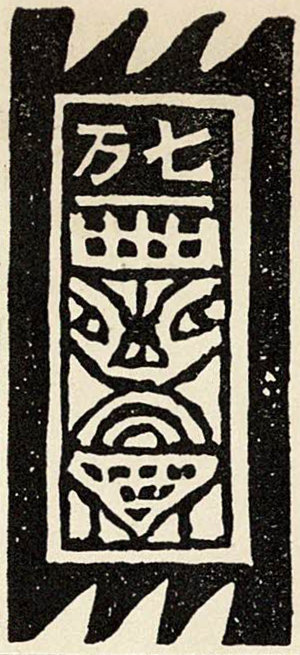
> 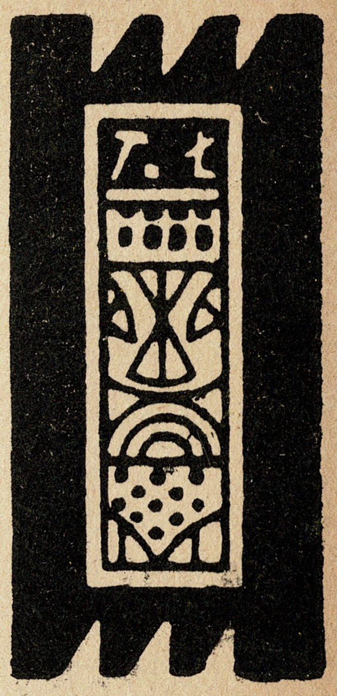
> 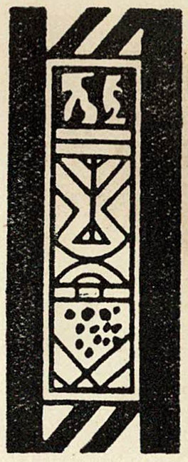
> 
>
> ```yaml
> noborder: true
> hidden: true
> cram: true
> equalheight: true
> size: "small"
> ```
>
> 7 Myriads
</th>
> [!todo] ---Thai---
<td>
<span lang="th">เจ็ดคน</span>\
<span lang="th-Latn">chet khon</span>\
seven people
</td>
> [!todo] ---M/S---
<td>
<span lang="ms">jit ban</span>
</td>
<td>
<span lang="ms">chit kâsar</span>\
<span lang="ms-Arab">چية كاسر</span>\
coarse seven
</td>
<td>
<span lang="mcm">malayu</span>\
malay
</td>
<td>
<span lang="mcm">malayu</span>\
malay
</td>
<td>
<span lang="min">sisiak aluih</span>\
genteel scales
</td>
> [!todo] ---Java---
<td>
<span lang="jv">ꦫꦺꦪꦧ꧀ꦕꦶꦤ</span>\
<span lang="jv-Latn">réyab cina</span>
</td>
<td>
<span lang="jv-Latn">pitu cina</span>\
China seven
</td>
<td>
<span lang="jv-Latn">pitu cina</span>\
China seven
</td>
<td>
<span lang="jv-Latn">pitu cina</span>\
China seven
</td>
<td>
<span lang="jv-Latn">pitu cina</span>\
China seven
</td>
<td>
<span lang="jv-Latn">reab wong</span>\
[unknown]
</td>
<td>
<span lang="jv-Latn">wong kereg</span>
</td>
> [!todo] ---Bali---
<td>
<span lang="ban">ᬭᬶᬗ᭄ᬕᬶᬢ᭄</span>\
<span lang="ban-Latn">ringgit</span>\
serrated
</td>
<td>
<span lang="ban">ᬭᬶᬗ᭄ᬕᬶᬢ᭄</span>\
<span lang="ban-Latn">ringgit</span>\
serrated
</td>
<td>
<span lang="ban">ᬭᬶᬗ᭄ᬕᬶᬢ᭄</span>\
<span lang="ban-Latn">ringgit</span>\
serrated
</td>
<td>
<span lang="ban">ᬭᬶᬗ᭄ᬕᬶᬢ᭄</span>\
<span lang="ban-Latn">ringgit</span>\
serrated
</td>
<td>
<span lang="ban">ᬭᬶᬗ᭄ᬕᬶᬢ᭄</span>\
<span lang="ban-Latn">ringgit</span>\
serrated
</td>
<td>
<span lang="ban">ᬭᬶᬗ᭄ᬕᬶᬢ᭄</span>\
<span lang="ban-Latn">ringgit (bagus)</span>\
(fine) serrated
</td>
<td>
<span lang="ban">ᬭᬶᬗ᭄ᬕᬶᬢ᭄</span>\
<span lang="ban-Latn">ringgit</span>\
serrated
</td>
> [!todo] ---Lombok---
<td>
<span lang="sas">ᬭᬶᬗ᭄ᬕᬶᬢ᭄</span>\
<span lang="sas-Latn">ringgit</span>
</td>
<td>
<span lang="sas">ᬭᬶᬗ᭄ᬕᬶᬢ᭄</span>\
<span lang="sas-Latn">ringgit</span>
</td>
> [!todo] ---Borneo---
<td>
<span lang="bjn">sisir</span>\
comb
</td>
> [!todo] ---Sulawesi---
<td>
<span lang="mak"></span>
<span lang="mak-Latn"></span>
</td>
<td>
<span lang="id">ringgit</span>
</td>
> [!todo] ---Maluku---
<td>
<span lang="id">sisir</span>\
comb
</td>
> [!todo] ---Timor---
<td>
<span lang="id">sisir</span>\
comb
</td>
</tr>

<tr class="table-secondary">
<th scope="row" class="text-center sticky-left border-end">
Rank 8
</th>
> [!todo] ---Thai---
<td>
<span lang="th">แปด</span>\
<span lang="th-Latn">paet</span>\
eight
</td>
> [!todo] ---M/S---
<td>
<span lang="ms">puek</span>\
(Hokkien poeh)
</td>
<td>
<span lang="ms">mâta sâtu</span>\
<span lang="ms-Arab">ماة ساتو</span>\
one eye
</td>
<td>
—
</td>
<td>
<span lang="mcm">sepet</span>\
‘half-closed (eyes)’
</td>
<td>
<span lang="min">pacah</span> ‘broken’
</td>
> [!todo] ---Java---
<td>
</td>
<td>
</td>
<td>
</td>
<td>
</td>
<td>
</td>
<td>
</td>
<td>
</td>
> [!todo] ---Bali---
<td>
</td>
<td>
</td>
<td>
</td>
<td>
</td>
<td>
</td>
<td>
</td>
<td>
</td>
> [!todo] ---Lombok---
<td>
</td>
<td>
</td>
> [!todo] ---Borneo---
<td>
</td>
> [!todo] ---Sulawesi---
<td>
</td>
<td>
</td>
> [!todo] ---Maluku---
<td>
</td>
> [!todo] ---Timor---
<td>
</td>
</tr>

<tr>
<th scope="row" class="sticky-left border-end table-light">
> [!figure]
>
> 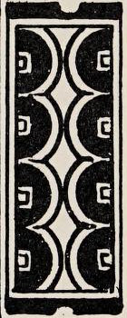
> 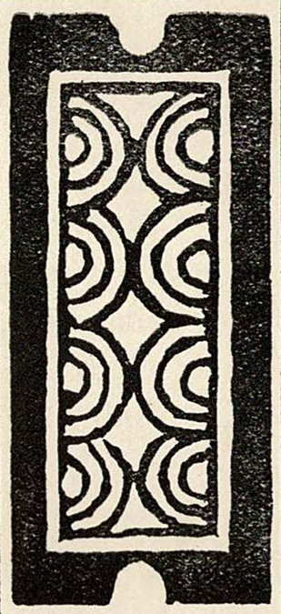
> 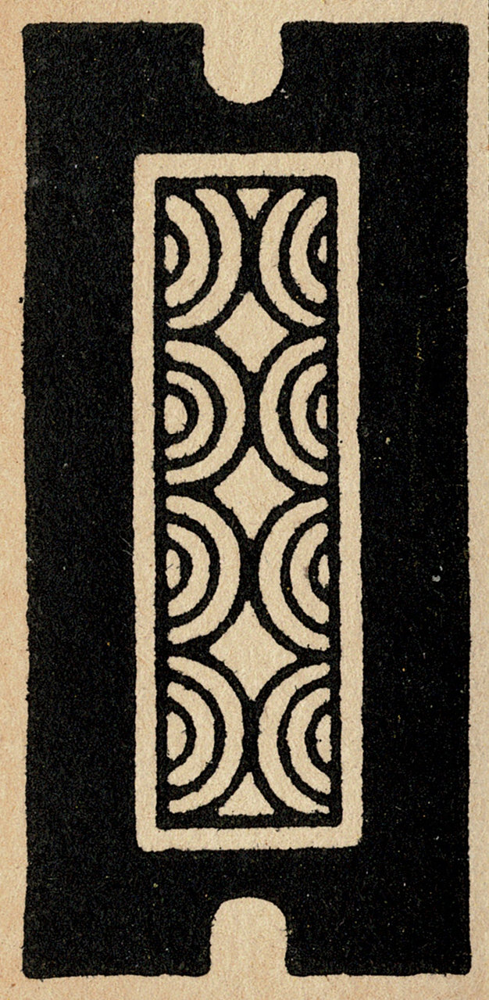
> 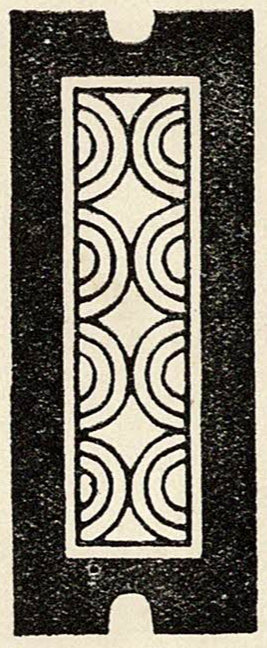
> 
>
> ```yaml
> noborder: true
> hidden: true
> cram: true
> equalheight: true
> size: "small"
> ```
>
> 8 Coins
</th>
> [!todo] ---Thai---
<td>
<span lang="th">แปดตา</span>\
<span lang="th-Latn">paet ta</span>\
eight eyes
</td>
> [!todo] ---M/S---
<td>
<span lang="ms">puek kerang</span>\
cockle eight
</td>
<td>
<span lang="ms">mâta sâtu plong</span>\
<span lang="ms-Arab">ماة ساتو ڤلوڠ</span>\
? one eye
</td>
<td>
<span lang="mcm">brau</span>\
ship
</td>
<td>
<span lang="mcm">prau</span>\
ship
</td>
<td>
<span lang="min">pacah lapan</span>\
broken eight
</td>
> [!todo] ---Java---
<td>
<span lang="jv">ꦊꦏꦺꦴꦏ꧀ꦥꦶꦕꦶꦱ꧀</span>\
<span lang="jv-Latn">lêkok picis</span>
</td>
<td>
<span lang="jv-Latn">wolu kerok</span>
</td>
<td>
<span lang="jv-Latn">picis, wolu kerok</span>
</td>
<td>
<span lang="jv-Latn">(wolu) picis, (wolu) wang</span>
</td>
<td>
<span lang="jv-Latn">(wolu) picis, (wolu) wang</span>
</td>
<td>
<span lang="jv-Latn">lekok pecis</span>\
dented [<a href="https://en.wikipedia.org/wiki/Songkok">peci</a> or coin?]
</td>
<td>
<span lang="jv-Latn">picis, buthak, buthak tai</span>
</td>
> [!todo] ---Bali---
<td>
<span lang="ban">ᬲᭂᬓᬸᬢᬸᬲ᭄</span>\
<span lang="ban-Latn">sekutus</span>\
[adj:eight?]
</td>
<td>
<span lang="ban">ᬧᬶᬲ᭄ᬢᬸᬲ᭄</span>\
<span lang="ban-Latn">pis tus</span>\
eight coins
</td>
<td>
<span lang="ban">ᬧᬶᬲ᭄ᬢᬸᬲ᭄</span>\
<span lang="ban-Latn">pis tus</span>\
eight coins
</td>
<td>
<span lang="ban">ᬧᬶᬲ᭄ᬓᬸᬢᬸᬲ᭄</span>\
<span lang="ban-Latn">pipis kutus</span>\
eight coins
</td>
<td>
<span lang="ban">ᬧᬶᬲ᭄ᬢᬸᬲ᭄</span>\
<span lang="ban-Latn">pis tus</span>\
eight coins
</td>
<td>
<span lang="ban">ᬢᬶᬫᬓᬸᬢᬸᬲ᭄</span>\
<span lang="ban-Latn">tima kutus</span>
</td>
<td>
<span lang="ban">ᬢᬶᬫᬓᬸᬢᬸᬲ᭄</span>\
<span lang="ban-Latn">tima kutus</span>
</td>
> [!todo] ---Lombok---
<td>
<span lang="sas">ᬧᬶᬲ᭄ᬳᬸᬮᬸ</span>\
<span lang="sas-Latn">pis ulu</span>\
eight coins
</td>
<td>
<span lang="sas-Latn">(tima kutus?)</span>
</td>
> [!todo] ---Borneo---
<td>
<span lang="bjn">dalapan</span>\
eight
</td>
> [!todo] ---Sulawesi---
<td>
<span lang="mak">ᨔᨁᨈᨘᨍᨘ</span>\
<span lang="mak-Latn">sagantuju</span>[@MakassaarschWoordenboek p. 551]\
eight
</td>
<td>
<span lang="id">delapan mata</span>
</td>
> [!todo] ---Maluku---
<td>
<span lang="id">delapan kaladi</span>
</td>
> [!todo] ---Timor---
<td>
<span lang="id">delapan</span>
</td>
</tr>

<tr>
<th scope="row" class="sticky-left border-end table-light">
> [!figure]
>
> 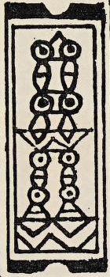
> 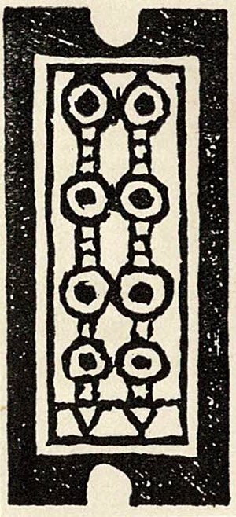
> 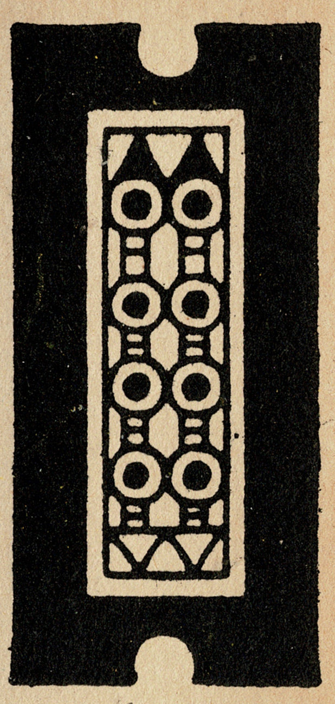
> 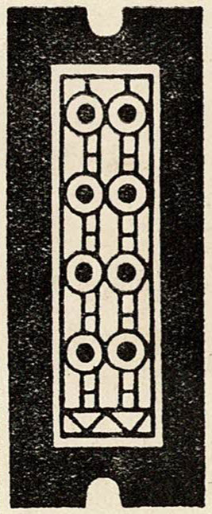
> 
>
> ```yaml
> noborder: true
> hidden: true
> cram: true
> equalheight: true
> size: "small"
> ```
>
> 8 Strings
</th>
> [!todo] ---Thai---
<td>
<span lang="th">แปดละเอียด</span>\
<span lang="th-Latn">paet laiat</span>\
delicate eight

<span lang="th">แปดเซาะ</span>\
<span lang="th-Latn">paet so</span>\
chiselled eight
</td>
> [!todo] ---M/S---
<td>
<span lang="ms">puek menak</span>\
noble eight\
(Menak is a title for an aristocrat.)
</td>
<td>
<span lang="ms">mâta sâtu bengkok</span>\
<span lang="ms-Arab">ماة ساتو بڠكوق</span>\
crooked one eye
</td>
<td>
<span lang="mcm">baji/dosi</span>\
sweet
</td>
<td>
<span lang="mcm">manis/dosi</span>\
sweet
</td>
<td>
<span lang="min">pacah manih</span>\
broken sweet
</td>
> [!todo] ---Java---
<td>
<span lang="jv">ꦊꦏꦺꦴꦏ꧀ꦭꦶꦤ꧀ꦠꦿꦶꦏ꧀</span>\
<span lang="jv-Latn">lêkok lintrik</span>
</td>
<td>
<span lang="jv-Latn">wolu manis</span>
</td>
<td>
<span lang="jv-Latn">wolu lintrik, manis</span>
</td>
<td>
<span lang="jv-Latn">manis</span>
</td>
<td>
<span lang="jv-Latn">wolu lintrik/pecuk/manis</span>
</td>
<td>
<span lang="jv-Latn">lekok lintrik</span>\
dented [unknown]
</td>
<td>
<span lang="jv-Latn">cucuk buthak/manis</span>
</td>
> [!todo] ---Bali---
<td>
<span lang="ban">ᬳᬸᬮᬸ</span>\
<span lang="ban-Latn">ulu</span>\
eight/upstream
</td>
<td>
<span lang="ban">ᬫᬤᬾ</span>\
<span lang="ban-Latn">madé</span>\
a ‘four-fold cord’[@SEAlangBalinese]
</td>
<td>
<span lang="ban">ᬳᬸᬮᬸ</span>\
<span lang="ban-Latn">ulu</span>
</td>
<td>
<span lang="ban">ᬳᬸᬮᬸ</span>\
<span lang="ban-Latn">ulu</span>
</td>
<td>
<span lang="ban">ᬫᬦᬶᬲ᭄</span>\
<span lang="ban-Latn">manis</span>\
sweet
</td>
<td>
<span lang="ban">ᬫᬦᬶᬲ᭄</span>\
<span lang="ban-Latn">manis</span>
</td>
<td>
<span lang="ban">ᬫᬦᬶᬲ᭄</span>\
<span lang="ban-Latn">manis</span>
</td>
> [!todo] ---Lombok---
<td>
<span lang="sas">ᬫᬦᬶᬲ᭄</span>\
<span lang="sas-Latn">manis</span>
</td>
<td>
<span lang="sas">ᬫᬦᬶᬲ᭄</span>\
<span lang="sas-Latn">manis</span>
</td>
> [!todo] ---Borneo---
<td>
<span lang="bjn">manis</span>
</td>
> [!todo] ---Sulawesi---
<td>
<span lang="mak"></span>
<span lang="mak-Latn"></span>
</td>
<td>
<span lang="id">manis</span>
</td>
> [!todo] ---Maluku---
<td>
<span lang="id">manis</span>
</td>
> [!todo] ---Timor---
<td>
<span lang="id">cinta</span>
</td>
</tr>

<tr>
<th scope="row" class="sticky-left border-end table-light">
> [!figure]
>
> 
> 
> 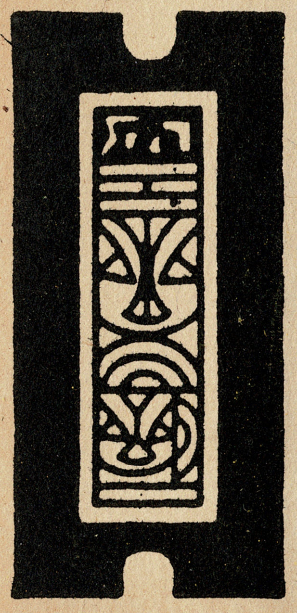
> 
> 
>
> ```yaml
> noborder: true
> hidden: true
> cram: true
> equalheight: true
> size: "small"
> ```
>
> 8 Myriads
</th>
> [!todo] ---Thai---
<td>
<span lang="th">แปดคน</span>\
<span lang="th-Latn">paet khon</span>\
eight people
</td>
> [!todo] ---M/S---
<td>
<span lang="ms">puek ban</span>
</td>
<td>
<span lang="ms">mâta sâtu kĕrbau</span>\
<span lang="ms-Arab">ماة ساتو كربو</span>\
buffalo one eye
</td>
<td>
<span lang="mcm">belu</span>\
old
</td>
<td>
<span lang="mcm">belu</span>\
old
</td>
<td>
<span lang="min">pacah aluih</span>\
broken genteel
</td>
> [!todo] ---Java---
<td>
<span lang="jv">ꦊꦏꦺꦴꦏ꧀ꦕꦶꦤ</span>\
<span lang="jv-Latn">lêkok cina</span>
</td>
<td>
<span lang="jv-Latn">budheg</span>\
[deaf/stupid?]
</td>
<td>
<span lang="jv-Latn">wolu cina</span>\
China eight
</td>
<td>
<span lang="jv-Latn">budheg</span>\
[deaf/stupid?]
</td>
<td>
<span lang="jv-Latn">wolu cina</span>\
China eight
</td>
<td>
<span lang="jv-Latn">lekok wong</span>\
dented person
</td>
<td>
<span lang="jv-Latn">wong buthak</span>
</td>
> [!todo] ---Bali---
<td>
<span lang="ban">ᬫᬦᬓ᭄</span>\
<span lang="ban-Latn">manak</span>\
to have a child
</td>
<td>
<span lang="ban">ᬫᬦᬓ᭄</span>\
<span lang="ban-Latn">manak</span>\
to have a child
</td>
<td>
<span lang="ban">ᬫᬦᬓ᭄</span>\
<span lang="ban-Latn">manak</span>\
to have a child
</td>
<td>
<span lang="ban">ᬘᭂᬍᬓ᭄</span>\
<span lang="ban-Latn">celek</span>
</td>
<td>
<span lang="ban">ᬍᬧᭀᬓ᭄</span>\
<span lang="ban-Latn">lepok</span>
</td>
<td>
<span lang="ban">ᬓᬼᬧᭀᬓ᭄</span>\
<span lang="ban-Latn">klepok</span>
</td>
<td>
<span lang="ban">ᬓᬼᬧᭀᬓ᭄</span>\
<span lang="ban-Latn">kelepok</span>
</td>
> [!todo] ---Lombok---
<td>
<span lang="sas">ᬓᬼᬧᭀᬓ᭄</span>\
<span lang="sas-Latn">kelepok</span>
</td>
<td>
<span lang="sas">ᬓᬼᬧᭀᬓ᭄</span>\
<span lang="sas-Latn">kelepok</span>
</td>
> [!todo] ---Borneo---
<td>
<span lang="bjn">pecah</span>\
broken?
</td>
> [!todo] ---Sulawesi---
<td>
<span lang="mak"></span>
<span lang="mak-Latn"></span>
</td>
<td>
<span lang="id">dukun</span>\
<a href="https://en.wikipedia.org/wiki/Dukun">a shaman</a>
</td>
> [!todo] ---Maluku---
<td>
<span lang="id">picah kapala</span>
</td>
> [!todo] ---Timor---
<td>
<span lang="id">picah</span>
</td>
</tr>

<tr class="table-secondary">
<th scope="row" class="text-center sticky-left border-end">
Rank 9
</th>
> [!todo] ---Thai---
<td>
<span lang="th">เก้า</span>\
<span lang="th-Latn">kao</span>\
nine
</td>
> [!todo] ---M/S---
<td>
<span lang="ms">kau</span>\
(Hokkien káu)
</td>
<td>
<span lang="ms">ânjing</span>\
<span lang="ms-Arab">انجيڠ</span>\
dog?
</td>
<td>
—
</td>
<td>
<span lang="ms">kau</span>\
(Hokkien káu)
</td>
<td>
<span lang="min">tali</span> ‘rope’
</td>
> [!todo] ---Java---
<td>
</td>
<td>
</td>
<td>
</td>
<td>
</td>
<td>
</td>
<td>
</td>
<td>
</td>
> [!todo] ---Bali---
<td>
</td>
<td>
</td>
<td>
</td>
<td>
</td>
<td>
</td>
<td>
</td>
<td>
</td>
> [!todo] ---Lombok---
<td>
</td>
<td>
</td>
> [!todo] ---Borneo---
<td>
</td>
> [!todo] ---Sulawesi---
<td>
</td>
<td>
</td>
> [!todo] ---Maluku---
<td>
</td>
> [!todo] ---Timor---
<td>
</td>
</tr>

<tr>
<th scope="row" class="sticky-left border-end table-light">
> [!figure]
>
> 
> 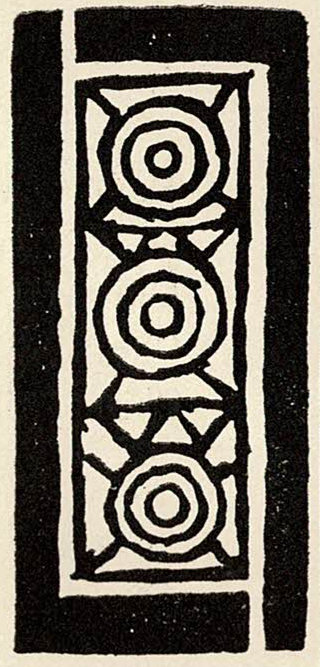
> 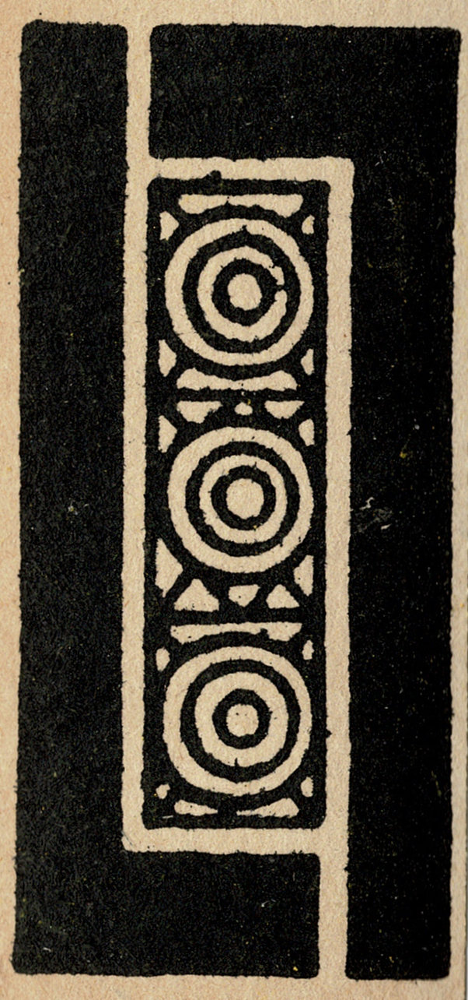
> 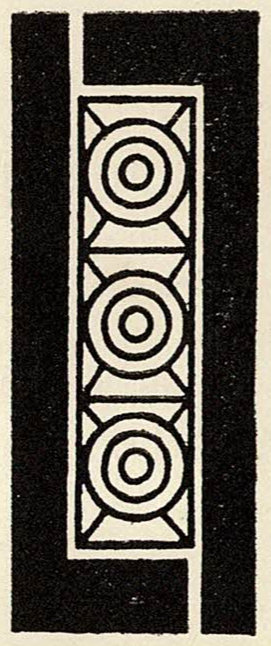
> 
>
> ```yaml
> noborder: true
> hidden: true
> cram: true
> equalheight: true
> size: "small"
> ```
>
> 9 Coins
</th>
> [!todo] ---Thai---
<td>
<span lang="th">เก้าจัน</span>\
<span lang="th-Latn">kao chan</span>\
nine <a href="https://en.wikipedia.org/wiki/Diospyros_decandra"><cite>Diospyros decandra</cite></a>, similar to a persimmon
</td>
> [!todo] ---M/S---
<td>
<span lang="ms">kau hitam</span>\
black nine
</td>
<td>
<span lang="ms">ânjing pîtis</span>\
<span lang="ms-Arab">انجيڠ بيتس</span>\
dog? cash
</td>
<td>
<span lang="mcm">Mōru</span>\
Moor/Indian
</td>
<td>
<span lang="mcm">Mōru</span>\
Moor/Indian
</td>
<td>
<span lang="min">tali bulek</span>\
round rope
</td>
> [!todo] ---Java---
<td>
<span lang="jv">ꦒꦁꦥꦶꦕꦶꦱ꧀</span>\
<span lang="jv-Latn">gang picis</span>\
gap money
</td>
<td>
<span lang="jv-Latn">glindhing</span>\
wheels
</td>
<td>
<span lang="jv-Latn">glindhing</span>\
wheels
</td>
<td>
<span lang="jv-Latn">(sanga) glindhing, plolo</span>

<span lang="jv-Latn">picis gedhé</span>\
large coins
</td>
<td>
<span lang="jv-Latn">(sanga) glindhing, plolo</span>

<span lang="jv-Latn">picis gedhé</span>\
large coins
</td>
<td>
<span lang="jv-Latn">pecis</span>\
[<a href="https://en.wikipedia.org/wiki/Songkok">peci</a> or coin?]
</td>
<td>
<span lang="jv-Latn">picis</span>\
money

<span lang="jv-Latn">glindhing</span>\
wheels
</td>
> [!todo] ---Bali---
<td>
<span lang="ban">ᬲᬗ</span>\
<span lang="ban-Latn">sanga</span>\
nine
</td>
<td>
<span lang="ban">ᬲᬗ</span>\
<span lang="ban-Latn">sanga</span>\
nine
</td>
<td>
<span lang="ban">ᬲᬗ</span>\
<span lang="ban-Latn">sanga</span>\
nine
</td>
<td>
<span lang="ban">ᬧᬶᬲ᭄ᬲᬗ</span>\
<span lang="ban-Latn">pis sanga</span>\
nine coins
</td>
<td>
<span lang="ban">ᬲᬗ</span>\
<span lang="ban-Latn">sanga</span>\
nine
</td>
<td>
<span lang="ban">ᬢ᭄ᬭᭀᬫ᭄ᬧᭀᬂ</span>\
<span lang="ban-Latn">trompong</span>\
Balinese gamelan
</td>
<td>
<span lang="ban">ᬢᭂᬭᭀᬫ᭄ᬧᭀᬂ</span>\
<span lang="ban-Latn">terompong</span>\
[probably Balinese gamelan]
</td>
> [!todo] ---Lombok---
<td>
<span lang="sas">ᬕᬵᬤ</span>\
<span lang="sas-Latn">gada</span>\
a <a href="https://en.wikipedia.org/wiki/Gada_(mace)">mace</a>
</td>
<td>
<span lang="sas">ᬕᬵᬤ</span>\
<span lang="sas-Latn">gada</span>
</td>
> [!todo] ---Borneo---
<td>
<span lang="bjn">bulat</span>

<span lang="bjn">galéndéng</span>
</td>
> [!todo] ---Sulawesi---
<td>
<span lang="mak">ᨑᨘᨄᨗᨐ</span>\
<span lang="mak-Latn">rupiya</span>[@MakassaarschWoordenboek p. 440]\
rupees
</td>
<td>
<span lang="id">roda</span>
</td>
> [!todo] ---Maluku---
<td>
<span lang="id">rupiah</span>\
rupees
</td>
> [!todo] ---Timor---
<td>
<span lang="id">rupiah</span>\
rupees
</td>
</tr>

<tr>
<th scope="row" class="sticky-left border-end table-light">
> [!figure]
>
> 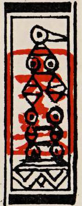
> 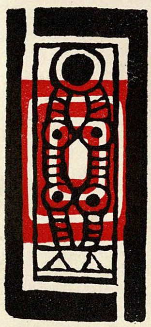
> 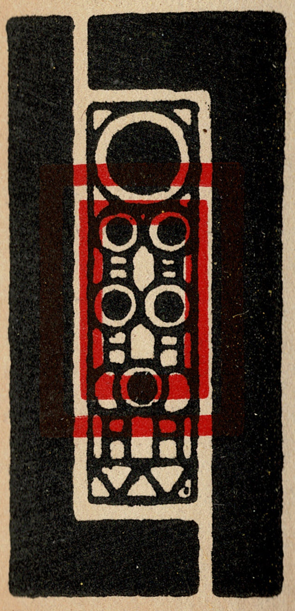
> 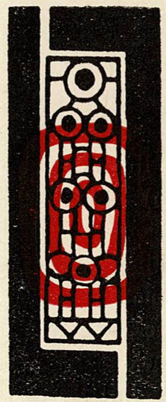
> 
>
> ```yaml
> noborder: true
> hidden: true
> cram: true
> equalheight: true
> size: "small"
> ```
>
> 9 Strings
</th>
> [!todo] ---Thai---
<td>
<span lang="th">เก้าแดง</span>\
<span lang="th-Latn">kao daeng</span>\
red nine
</td>
> [!todo] ---M/S---
<td>
<span lang="ms">kau merah</span>\
red nine
</td>
<td>
<span lang="ms">ânjing hâti</span>\
<span lang="ms-Arab">انجيڠ هاتي</span>\
dog? heart/liver
</td>
<td>
<span lang="mcm">botol/bottle/whisky</span>\
bottle
</td>
<td>
<span lang="mcm">botel</span>\
bottle
</td>
<td>
<span lang="min">tali merah</span>\
red rope
</td>
> [!todo] ---Java---
<td>
<span lang="jv">ꦒꦁꦭꦶꦤ꧀ꦠꦿꦶꦏ꧀</span>\
<span lang="jv-Latn">gang lintrik</span>
</td>
<td>
<span lang="jv-Latn">sanga bang</span>\
red nine
</td>
<td>
<span lang="jv-Latn">sanga bang</span>\
red nine
</td>
<td>
<span lang="jv-Latn">obor</span>\
torch
</td>
<td>
<span lang="jv-Latn">sanga ban/lintrik</span>\
rows or red nine

<span lang="jv-Latn">obor</span>\
torch
</td>
<td>
<span lang="jv-Latn">gang abang</span>\
red gap
</td>
<td>
<span lang="jv-Latn">cucuk abang/besar</span>\
red/large prick
</td>
> [!todo] ---Bali---
<td>
<span lang="ban">ᬩᭂᬲᬃ</span>\
<span lang="ban-Latn">besar</span>\
large
</td>
<td>
<span lang="ban">ᬩᭂᬲᬃ</span>\
<span lang="ban-Latn">gesar</span>
</td>
<td>
<span lang="ban">ᬩᭂᬲᬃ</span>\
<span lang="ban-Latn">besar</span>
</td>
<td>
<span lang="ban">ᬮᬶᬦ᭄ᬢ᭄ᬭᬶᬓ᭄ᬩᭂᬲᬃ</span>\
<span lang="ban-Latn">lintrik besar</span>
</td>
<td>
<span lang="ban">ᬢᬾᬚ</span>\
<span lang="ban-Latn">téja</span>\
shining/red
</td>
<td>
<span lang="ban">ᬢᬾᬚ</span>\
<span lang="ban-Latn">téja</span>\
shining/red
</td>
<td>
<span lang="ban">ᬢᬾᬚ</span>\
<span lang="ban-Latn">téja</span>\
shining/red
</td>
> [!todo] ---Lombok---
<td>
<span lang="sas">ᬢᬾᬚ</span>\
<span lang="sas-Latn">téja</span>\
shining/red
</td>
<td>
<span lang="sas">ᬢᬾᬚ</span>\
<span lang="sas-Latn">téja</span>\
shining/red
</td>
> [!todo] ---Borneo---
<td>
<span lang="bjn">léntri, lantri</span>
</td>
> [!todo] ---Sulawesi---
<td>
<span lang="mak">ᨀᨓᨚᨅ</span>\
<span lang="mak-Latn">kawo-bang</span>[@MakassaarschWoordenboek p. 63]\
red nine?
</td>
<td>
<span lang="id">kacang</span>\
[bean/clitoris?]
</td>
> [!todo] ---Maluku---
<td>
<span lang="id">meirah kacang</span>
</td>
> [!todo] ---Timor---
<td>
<span lang="id">kio meirah</span>
</td>
</tr>

<tr>
<th scope="row" class="sticky-left border-end table-light">
> [!figure]
>
> 
> 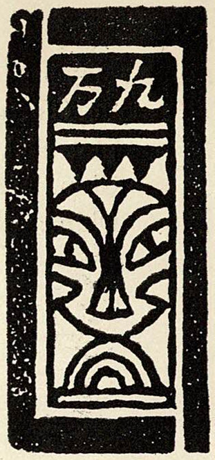
> 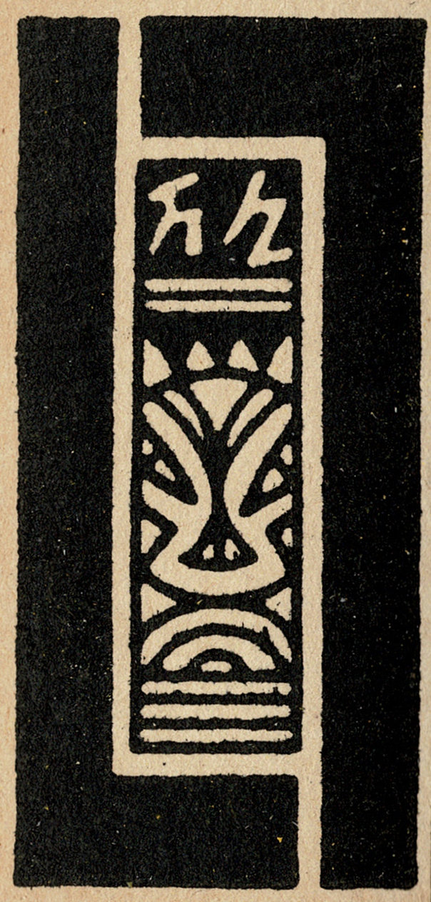
> 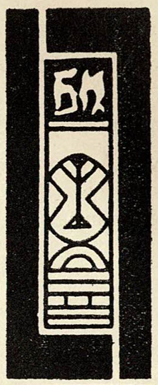
> 
>
> ```yaml
> noborder: true
> hidden: true
> cram: true
> equalheight: true
> size: "small"
> ```
>
> 9 Myriads
</th>
> [!todo] ---Thai---
<td>
<span lang="th">เก้าคน</span>\
<span lang="th-Latn">kao khon</span>\
nine people
</td>
> [!todo] ---M/S---
<td>
<span lang="ms">kau ban</span>
</td>
<td>
<span lang="ms">ânjing kau</span>\
<span lang="ms-Arab">انجيڠ كاو</span>\
dog? nine
</td>
<td>
<span lang="mcm">Mary, Mérri, Maria, Kau Mary</span>\
Mary
</td>
<td>
<span lang="mcm">Mary</span>\
Mary
</td>
<td>
<span lang="min">tali aluih</span>\
genteel rope
</td>
> [!todo] ---Java---
<td>
<span lang="jv">ꦒꦁꦕꦶꦤ</span>\
<span lang="jv-Latn">gang cina</span>
</td>
<td>
<span lang="jv-Latn">keyang</span>
</td>
<td>
<span lang="jv-Latn">keyang</span>
</td>
<td>
<span lang="jv-Latn">keyang</span>
</td>
<td>
<span lang="jv-Latn">sanga cina, kayang, kéyang</span>
</td>
<td>
<span lang="jv-Latn">gang</span>\
gap
</td>
<td>
<span lang="jv-Latn">wong cucuk</span>\
thorn man
</td>
> [!todo] ---Bali---
<td>
<span lang="ban">ᬓᬳᭀ</span>\
<span lang="ban-Latn">kao</span>\
from Hokkien ‘nine’ (<span lang="nan-Latn">káu</span>)?
</td>
<td>
<span lang="ban">ᬓᬳᬸ</span>\
<span lang="ban-Latn">kau</span>
</td>
<td>
<span lang="ban">ᬓᬳᬸ</span>\
<span lang="ban-Latn">kau</span>
</td>
<td>
<span lang="ban">ᬓᬳᬸ</span>\
<span lang="ban-Latn">kau</span>
</td>
<td>
<span lang="ban">ᬚᭂᬭᬶᬂ</span>\
<span lang="ban-Latn">jering</span>\
[upright?]
</td>
<td>
<span lang="ban">ᬚᭂᬭᬶᬂ</span>\
<span lang="ban-Latn">jering</span>
</td>
<td>
<span lang="ban">ᬚᭂᬭᬶᬂ</span>\
<span lang="ban-Latn">jering</span>
</td>
> [!todo] ---Lombok---
<td>
<span lang="sas">ᬚᭂᬭᬶᬂ</span>\
<span lang="sas-Latn">jering</span>
</td>
<td>
<span lang="sas">ᬚᭂᬭᬶᬂ</span>\
<span lang="sas-Latn">jering</span>
</td>
> [!todo] ---Borneo---
<td>
<span lang="bjn">turus</span>
</td>
> [!todo] ---Sulawesi---
<td>
<span lang="mak"></span>
<span lang="mak-Latn"></span>
</td>
<td>
<span lang="id">gargaji (baduri)</span>
</td>
> [!todo] ---Maluku---
<td>
<span lang="id">gargaji (baduri)</span>
</td>
> [!todo] ---Timor---
<td>
<span lang="id">suwanggi</span>
</td>
</tr>

</tbody>
</table>
</div>

> [!aside]
>
> The book @GatewayToOldSchoolGames uses the spellings: burung = burong, batik = bateh, yu = yeo, hue sio = huay sio, putih = puteh, ji = jee, sa = sarh, si = see, go = gor, lak = lark.

## Games

There are many games played with Ceki cards.[@NyonyaMosaic p. 124] For most of
them, I do not know of any other sets of rules recorded online.

**Fishing** games (where players capture cards from a central pool):

* [Cholek Tiga](games/cholek-tiga/cholek-tiga.md) (‘draw three’), a Malaysian game for two or three players[@BabaMalayDictionary 214][@ChikiCards 125]
* [Pèi](games/pei/pei.md), a Javanese game for three players where the goal is to collect specific scoring combinations[@JavaanseKaartspelen 58–70]
* [<span lang="jv-Latn" class="noun">Thothit</span>](games/thothit/thothit.md), a Javanese game for three players where the goal is to capture identical pairs[@JavaanseKaartspelen 71–2]
* [<span lang="jv-Latn" class="noun">Enthit</span>](games/thothit/thothit.md#enthit), a similar Javanese game for three players where the goal is to capture identical quadruplets[@JavaanseKaartspelen 74]
* [<span lang="jv-Latn" class="noun">Thothit Kuna</span>](games/thothit/thothit.md#thothit-kuna), an older and slower version of the game[@JavaanseKaartspelen 74]
* [<span lang="jv-Latn" class="noun">Thothit Yogyakarta</span>](games/kings/kings.md#thothit-yogya), a luck-based Javanese game for three players[@JavaanseKaartspelen 73]
* [Thit-Thit-Dulit](games/kings/kings.md#thit-thit-dulit), a luck-based Javanese game for two players[@JavaanseKaartspelen 73]

**Simple** gambling games:

* [Sampen](games/sampen/sampen.md) is a gambling game from Java that requires no skill
* [<span lang="jv-Latn" class="noun">Thothit Banyuwangi</span>](games/sampen/sampen.md#thothit-banyuwangi) is a similar game[@JavaanseKaartspelen p. 76]

**Trick-taking** games:

* [Kartu Lima](games/kartu-lima/kartu-lima.md) is a Javan game with unusual card rankings

**Draw & discard** games (like Mahjong):

* [Balik Satu](games/balik-satu/balik-satu.md) (‘turn one’), a Malaysian game with no fixed number of players[@BabaMalayDictionary p. 214][@ChikiCards p. 122]
* [Balik Lima Belas](games/balik-satu/balik-satu.md#balik-lima-belas)[@ChikiCards p. 127]/Balek Lima Belair[@BabaMalayDictionary p. 124]/Bukak Lima Blas Leh[@TheBabas p. 167] (‘turn fifteen’), an alternate method of scoring Balik Satu
* [Chot](games/balik-satu/balik-satu.md#chot)/Chote/Choke/Kiong, a similar four-player game[@BabaMalayDictionary p. 214][@ChikiCards p. 127][@TheBabas p. 167]
* [<span class="noun" lang="jv-Latn">Gonggong</span>](games/balik-satu/balik-satu.md#gonggong), a Javan game for four or six players[@JavaanseKaartspelen p. 94–7]
* [<span class="noun" lang="jv-Latn">Tantanan</span>](games/balik-satu/balik-satu.md#tantanan), a fast-playing Javan game for four players[@JavaanseKaartspelen p. 98]
* [Pong](games/pai-tong/pai-tong.md) a Malaysian version of a Thai game, played by four people, also played with Mahjong tiles

Other games from Malaysia/Singapore, for which I have no rules, are:

* Pak Tui, which is described as a solitaire game in @BabaMalayDictionary [p. 215]. This is probably also the Patui[^fn3] which is mentioned by Mayer[@BlikJavaansche_2 p. 499] and Matthes. The name might be from the Chinese <span lang="nan">八對</span> ‘eight pairs’ (Hokkien <span lang="nan-Latn">pat tùi</span>),[^fn4] in which case the game could be something similar to [<span class="noun" lang="jv-Latn">Tantanan</span>](games/balik-satu/balik-satu.md#tantanan).
* Choke/Chote (Ramay), a game for more than four players[@BabaMalayDictionary p. 214]
* Tongkeng, a game for two people[@BabaMalayDictionary p. 215]
* Cho It and Chochot[@SomeNotesMalayCardGames p. 88] — could Chochot be the same as Chot or Thothit?

[^fn3]: Patoei or <span lang="ms-Arab">ڤتوي</span>[@Pijnappel p. 58] in older orthographies, probably also equivalent to <span lang="rej-Latn">ptu’i</span> <span lang="rej">ꤶ꥓ꤳꥈꥆꥇ</span> in [Rejang](https://en.wikipedia.org/wiki/Rejang_language).[@MaterialsRejang 92]

[^fn4]: This possibility raised in @Morgenlandisch_2 [p. 572].

In some descriptions, Ceki is itself a game (a variant of [Balik Satu](games/balik-satu/balik-satu.md)) and the cards called by other names such as <span lang="jv-Latn">ijo</span>. @BlikJavaansche_2 [p. 499] gives the games <span lang="jv-Latn">koa</span>, <span lang="jv-Latn">koa-baq</span>, <span lang="jv-Latn">koa-gonggong</span> ([<span class="noun" lang="jv-Latn">Gonggong</span>](games/balik-satu/balik-satu.md#gonggong)), <span lang="jv-Latn">pehi</span> ([Pèi](games/pei/pei.md)?), <span lang="jv-Latn">patui</span>, <span lang="jv-Latn">panghao</span>, and <span lang="jv-Latn">cĕki</span>, but without explanations.

## Manufacturers & Brands

> [!figure]
>
> 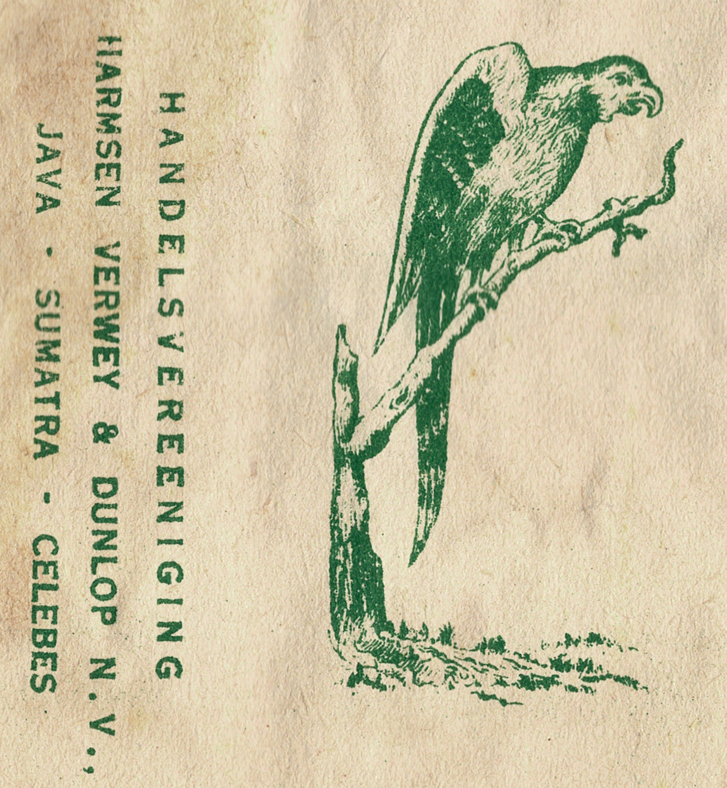
>
> ```yaml
> position: aside
> ```
>
> The logo for <span class="noun" lang="nl">Handelsvereeniging Harmsen Verweij & Dunlop N.V.</span>.

(Extinct) European manufacturers included:

> [!figure]
>
> 
>
> ```yaml
> position: aside
> noborder: true
> originalUrl: "https://opac.perpusnas.go.id/uploaded_files/dokumen_isi3/Terbitan%20Berkala/Sin_Po_1922_03_20_001.pdf"
> license: cc0
> ```
>
> Newspaper advertisement in [<span class="noun" lang="id">Sin Po</span>](https://en.wikipedia.org/wiki/Sin_Po_(newspaper)), 20th March 1922, for <span lang="fr" class="noun">Mesmaekers Frères</span>’ <span class="noun" lang="id">Dua Macan</span> (‘two tigers’) brand ceki cards (<span lang="id">kartoe tjeki</span>), being sold by Handel Mij. (also publishers of the newspaper).

* <span class="noun" lang="fr">Camoin</span>, a French company that was based in Marseille
* <span class="noun" lang="nl">Handelsvereeniging Harmsen Verweij & Dunlop N.V.</span>, a
  Dutch company that had offices in Java, Sumatra, and Celebes (Sulawesi)[@TraditionCardGameCeki]
* [<span class="noun" lang="fr">Mesmaekers Frères</span>](https://www.wopc.co.uk/belgium/mesmaeker/mesmaeker-moentack), a Belgian company based in Turnhout whose cards were imported to Java by Brandon Mesritz & Co.[@ChiChiPai] Their brands included:
  * <span class="noun" lang="id">Dua Macan</span> (‘two tigers’), trademark registered 15th October 1887.[@Turnhout p. 32] This brand was also used for other types of cards, like domino cards.
* Cartamundi, a Belgian company based in Turnhout, and now the largest manufacturer of playing cards in the world. Their brands included:
  * Three Goats Brand (also labelled <span lang="zh">行通南</span>?), trademark registered 26 July 1972.[@Turnhout p. 47] Decks containing Ceki cards seem to have been in a red packet and labelled ‘A’; green and ‘B’ were four-colour cards.

> [!todo]
> stefan_lauwers_domino_cards.jpg
> jef_smets_cartamundi_three_goats.jpg
> <p>榮興記</p>

Old Indonesian brands included:

* <span class="noun" lang="id">Bajing</span> (‘squirrel’)[@JavaanseKaartspelen p. 12]
* <span class="noun" lang="id">Pajung</span>[@JavaanseKaartspelen p. 12]
* <span class="noun" lang="id">999</span>[@JavaanseKaartspelen p. 12]
* <span class="noun" lang="id">Leo</span> (‘lion’)[@JavaanseKaartspelen p. 12]
* <span class="noun" lang="id">Warak</span> (‘rhino’)[@JavaanseKaartspelen p. 12]
* <span class="noun" lang="id">Kodok</span> (‘frog’)[@JavaanseKaartspelen p. 12]
* <span class="noun" lang="id">Kunci</span> (‘lock/key’)[@JavaanseKaartspelen p. 12]

Modern Indonesian brands include:

* $ Dollar
* <span class="noun" lang="ms">Ceki Jitu/Cap Udang</span>, ‘shrimp brand’; trademark [registered](https://pdki-indonesia.dgip.go.id/detail/D002009029908?type=trademark&keyword=ceki) 8th September, 2009
* <span class="noun" lang="ms">Ceki Hiu</span>, ‘shark ceki’ (Old Thousand has a colour image of a shark)
* <span class="noun" lang="ms">Ceki Kalong Mas</span> (bat symbol, Old Thousand inscribed <span lang="zh">𫑟林</span>?)
* <span class="noun" lang="ms">Ceki Leak</span>, a [mythological creature](https://en.wikipedia.org/wiki/Leyak); trademark [registered](https://pdki-indonesia.dgip.go.id/detail/D002013040002?type=trademark&keyword=ceki) 27th August, 2013
* <span class="noun" lang="ms">Ceki Sinar Rejeki</span>, ‘lucky ray’?
* Flipper Brand
* Gold Fish
* <span class="noun" lang="ms">Gunting Baja</span>, from Bali
* <span class="noun" lang="ms">Gunting Rumput</span>
* <span class="noun" lang="ms">Gar’da Kencana</span>
* <span class="noun" lang="ms">Jangkar Kapal</span>, ‘ship anchor’
* <span class="noun" lang="ms">Kabuki</span>
* <span class="noun" lang="ms">Kalajengking</span>, ‘scorpion’
* <span class="noun" lang="ms">Kapal Ferry</span> (Old Thousand has a colour image of a ship)
* Liberty/777 (with an image of the Statue of Liberty)
* <span class="noun" lang="ms">Lintrik Cap Semar</span>
* <span class="noun" lang="ms">Pura Dewa</span>, from Bali
* <span class="noun" lang="jv-Latn">Tjap Klabang</span> (<span lang="jv-Latn">cap klabang</span>), ‘centipede brand’; trademark [registered](https://pdki-indonesia.dgip.go.id/detail/D002015047782?type=trademark&keyword=ceki) 28th October, 2015

The only current Malaysian manufacturer I know of is Yong Guan Heng & Co., who
sell Cherki cards under the Single Lion brand (<span lang="zh">單獅嘜</span>).

## Credits

Special thanks to:

- [Aditya](https://twitter.com/NNBJawaofficial) for double-checking my Javanese transcriptions.
- [Aditya Bayu Perdana](https://www.behance.net/byabay) for supplying the names in the Balinese script.
