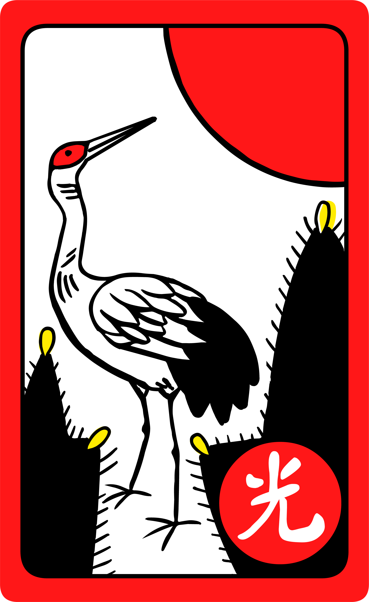
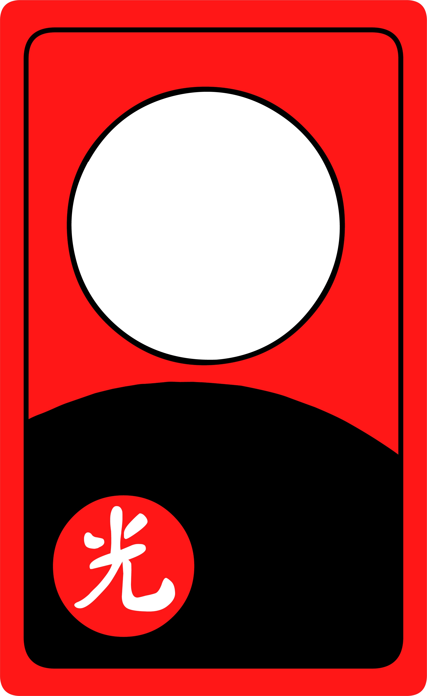
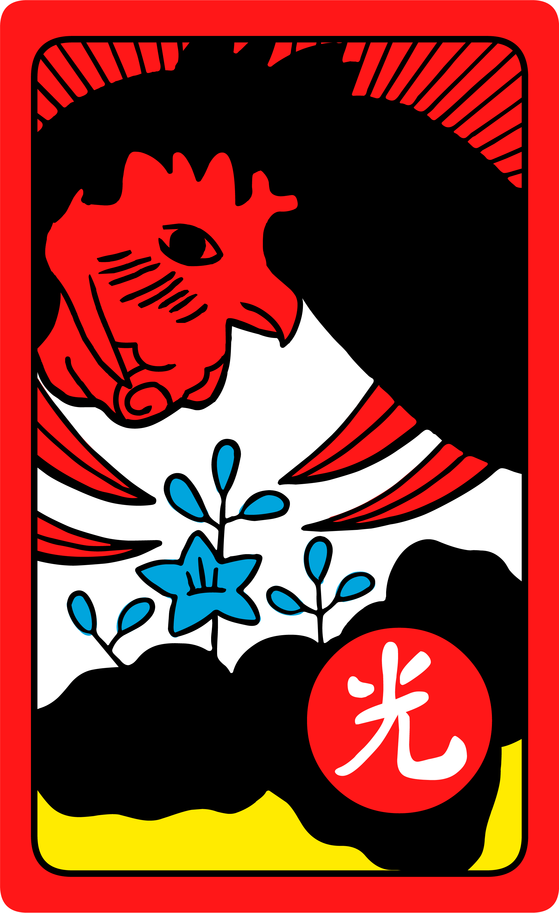
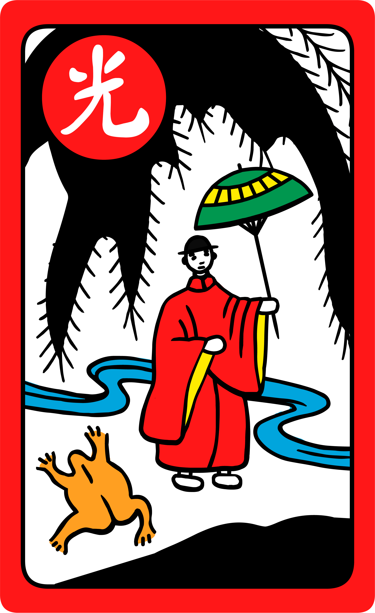

# Introduction to <span lang="ja-Latn" class="noun">Hanafuda</span>

<Pronounce pronouncer="biscuit"  lang="ja-Latn" file="pronunciation_ja_花札.mp3" noun="true">Hanafuda</Pronounce> (<span lang="ja">花札</span>, ‘flower cards’) are a type of playing card originating in Japan. They are also used in Korea, where they are known as <Pronounce pronouncer="ssoonkimi"  lang="ko-Latn" file="pronunciation_ko_화투.mp3">hwatu</Pronounce> (<span lang="ko">화투</span>, ‘flower fight’, originally <span lang="ko-Hani">花鬪</span>), and in Hawaiʻi, where there is a large Japanese population. They are mostly used to play matching or set-collecting games, but they can also be used for complex gambling games.

> [!todo]
> > [!figure]
> >
> > 
> >
> > ```yaml
> > size: "wide"
> > author: "Japanexpertna.se"
> > copyrightYear: 2015
> > license: 'cc-by-sa'
> > licenseVersion: '2.0'
> > originalUrl: "https://www.flickr.com/photos/68532869@N08/16201732242"
> > ```
> >
> > Cards from a modern <span lang="ja-Latn">hanafuda</span> deck printed by Nintendo

## Composition of the deck

Unlike Western playing cards which have 4 suits of 13 cards each, <span class="noun"
lang="ja-Latn">Hanafuda</span> decks comprise 12 ‘suits’ of 4 cards each, giving
48 cards total. Each suit corresponds to a month, and is represented on the
cards by a plant related to that month.

The months and their associated plants are:

<ol class="columnar">
<li>January: pine (<span lang="ja">松</span> <Pronounce pronouncer="_ai_"  lang="ja-Latn" file="pronunciation_ja_松.mp3">matsu</Pronounce>)</li>
<li>February: plum (<span lang="ja">梅</span> <Pronounce pronouncer="akitomo"  lang="ja-Latn" file="pronunciation_ja_梅.mp3">ume</Pronounce>)</li>
<li>March: cherry (<span lang="ja">桜</span> <Pronounce pronouncer="strawberrybrown"  lang="ja-Latn" file="pronunciation_ja_桜.mp3">sakura</Pronounce>)</li>
<li>April: wisteria (<span lang="ja">藤</span> <Pronounce pronouncer="kaoring"  lang="ja-Latn" file="pronunciation_ja_藤.mp3">fuji</Pronounce>)</li>
<li>May: iris (<span lang="ja">菖蒲</span> <Pronounce pronouncer="akitomo"  lang="ja-Latn" file="pronunciation_ja_菖蒲.mp3">ayame</Pronounce>)</li>
<li>June: peony (<span lang="ja">牡丹</span> <Pronounce pronouncer="ryomasakamoto"  lang="ja-Latn" file="pronunciation_ja_牡丹.mp3">botan</Pronounce>)</li>
<li>July: bush clover (<span lang="ja">萩</span> <Pronounce pronouncer="strawberrybrown"  lang="ja-Latn" file="pronunciation_ja_萩.mp3">hagi</Pronounce>)</li>
<li>August: silvergrass (<span lang="ja">芒/薄</span> <Pronounce pronouncer="kaoring"  lang="ja-Latn" file="pronunciation_ja_スズキ.mp3">susuki</Pronounce>)</li>
<li>September: chrysanthemum (<span lang="ja">菊</span> <Pronounce pronouncer="akitomo"  lang="ja-Latn" file="pronunciation_ja_菊.mp3">kiku</Pronounce>)</li>
<li>October: maple (<span lang="ja">紅葉</span> <Pronounce pronouncer="El55"  lang="ja-Latn" file="pronunciation_ja_紅葉.mp3">kōyō</Pronounce>)</li>
<li>November: willow (<span lang="ja">柳</span> <Pronounce pronouncer="akitomo"  lang="ja-Latn" file="pronunciation_ja_柳.mp3">yanagi</Pronounce>)</li>
<li>December: paulownia (<span lang="ja">桐</span> <Pronounce pronouncer="kaoring"  lang="ja-Latn" file="pronunciation_ja_桐.mp3">kiri</Pronounce>)</li>
</ol>

In Korean and some Hawaiian decks, the months of November &amp; December are switched. This rarely makes a difference except in some gambling games when the numeric order of the cards is used.

### Types of card

The deck is divided into four categories of card. In descending order of value, these are: the “bright” (<span lang="ja-Latn">hikari</span>) cards, the <span lang="ja-Latn">tane</span> cards, the <span lang="ja-Latn">tanzaku</span> cards, and the <span lang="ja-Latn">kasu</span> cards.

#### Bright cards

There are 5 ‘bright’ (<span lang="ja">光</span> <Pronounce pronouncer="strawberrybrown"  lang="ja-Latn" file="pronunciation_ja_光.mp3">hikari</Pronounce>) cards. In most games, these are worth 20 points. The five bright cards are:

* the crane with pine (January), <span lang="ja">松に鶴</span> <span lang="ja-Latn">matsu ni tsuru</span>
* the cherry blossom curtain (March), <span lang="ja">桜に幕</span> <span lang="ja-Latn">sakura ni maku</span>
* the full moon (August), <span lang="ja">芒に月</span> <span lang="ja-Latn">susuki ni tsuki</span>
* the rain man (November), <span lang="ja">柳に小野道風</span> <span lang="ja-Latn">yanagi ni Ono no Tōfū</span>
* the phoenix (December), <span lang="ja">桐に鳳凰</span> <span lang="ja-Latn">kiri ni hōō</span>

> [!figure]
>
> 
>
> ```yaml
> size: small
> position: aside 
> ```
>
> The five bright cards, from a standard <span class="noun" lang="ja-Latn">Nintendo</span> deck.


> [!figure]
>
> 
> 
> 
> 
> 
>
> ```yaml
> size: "small"
> justify: "centered"
> authorFamily: "Mantia"
> authorGiven: "Louie"
> copyrightYear: 2021
> license: "cc-by-sa"
> licenseVersion: "4.0"
> perRow: 5
> ```
>
> The bright cards of a Japanese deck.


In some decks, especially Korean ones, these are marked with the 光 character for ease of identification.[^fn0]

[^fn0]: <span class="noun" lang="ja-Latn">Maeda Masafumi</span> (<span lang="ja">前田雅文</span>, <abbr title="died">d.</abbr> 1998) of the manufacturer <span class="noun" lang="ja-Latn">Ōishi Tengudō</span> has claimed that these markings were actually a trademark-like feature that they used, which was picked up by the Korean manufacturers as a standardized marking.[@ModernKoreanCards]

> [!figure]
>
> 
>
> ```yaml
> size: "small"
> position: "aside" 
> ```
>
> The five bright cards, from a Korean Pierrot (<span lang="ko">피에로</span>) deck.


> [!figure]
>
> 
> 
> 
> 
> 
>
> ```yaml
> noborder: true
> size: "small"
> justify: "centered"
> authorFamily: "Richert"
> authorGiven: "Marcus"
> copyrightYear: 2021
> license: "cc-by-sa"
> licenseVersion: "4.0"
> originalUrl: "http://www.marcusrichert.com/images/hwatu/"
> perRow: 5
> ```
>
> The bright cards of a Korean deck.


#### <span lang="ja-Latn">Tane</span> cards

There are 9 <Pronounce pronouncer="yasuo"  lang="ja-Latn" file="pronunciation_ja_種.mp3">tane</Pronounce> (<span lang="ja">種</span>) cards, which are usually worth 10 points each. These cards mostly feature animals, but also a sake cup, and the ‘eight-planked bridge’.

> [!figure]
>
> 
> 
> 
> 
> 
> 
> 
> 
> 
>
> ```yaml
> size: "small"
> justify: "centered"
> authorFamily: "Mantia"
> authorGiven: "Louie"
> copyrightYear: 2021
> license: "cc-by-sa"
> licenseVersion: "4.0"
> perRow: 5
> ```
>
> The 9 <span lang="ja-Latn">tane</span> cards.

#### <span lang="ja-Latn">Tanzaku</span> cards

There are 10  (<span lang="ja">短冊</span>) cards, usually
worth 5 points each. These are the cards with the coloured ‘scrolls’ on them.
Small pieces of paper were used to write poems on at poetry competitions (see
the image below). For some games these are further subdivided into three
sub-groups: <span lang="ja-Latn">tanzaku</span> with writing, plain red <span
lang="ja-Latn">tanzaku</span>, and plain blue/purple <span
lang="ja-Latn">tanzaku</span>.

> [!figure]
>
> 
> 
> 
> 
> 
> 
> 
> 
> 
> 
>
> ```yaml
> size: "small"
> justify: "centered"
> authorFamily: "Mantia"
> authorGiven: "Louie"
> copyrightYear: 2021
> license: "cc-by-sa"
> licenseVersion: "4.0"
> perRow: 5
> ```
>
> The 10 <span lang="ja-Latn">tanzaku</span> cards.

> [!figure]
>
> 
>
> ```yaml
> size: "wide"
> originalUrl: "https://www.artic.edu/artworks/127644/autumn-maples-with-poem-slips"
> license: 'cc0'
> orgName: 'The Art Institute of Chicago'
> ```
>
> <cite>Maple with Poem Slips</cite> (c. 1675)<br /><cite lang="ja">櫻楓短冊圖</cite><br /> A six-panel screen (one of a pair) by <span class="noun" lang="ja-Latn">Tosa Mitsuoki</span> (<span lang="ja">土佐 光起</span>, 1617–1691).

#### <span lang="ja-Latn">Kasu</span> cards

The remaining 24 cards that aren’t in one of the previous categories are called
 (<span lang="ja">滓</span>, ‘dregs’ or
‘junk’). They are usually worth a single point each. The first ten months have
two <span lang="ja-Latn">kasu</span> cards, but November has only one, and
December has three.

These cards can be identified by their lack of distinguishing features. The odd
one out is the “lightning card” of the November month, which is printed with a
bold red &amp; black pattern. One of the December <span
lang="ja-Latn">kasu</span> cards also has a yellow background and this card is
treated specially in some games.

> [!figure]
>
> 
> 
> 
> 
> 
> 
> 
> 
> 
> 
> 
> 
> 
> 
> 
> 
> 
> 
> 
> 
> 
> 
> 
> 
>
> ```yaml
> size: "small"
> justify: "centered"
> perRow: 8
> authorFamily: "Mantia"
> authorGiven: "Louie"
> copyrightYear: 2021
> license: "cc-by-sa"
> licenseVersion: "4.0"
> ```
>
> The 24 <span lang="ja-Latn">kasu</span> cards.

#### Extra cards

Korean decks often contain extra (up to six) joker cards. How these are used (if
at all) depends upon the game being played. Many traditional Japanese decks also
contain a white (<span lang="ja">白</span> <span lang="ja-Latn">shiro</span>)
blank card which can be used to replace a card if it is damaged or lost. Some
Japanese decks also contain joker-like cards featuring <span
lang="ja-Latn">oni</span> (<span lang="ja">鬼</span>, a Japanese ogre); see the
next page for more examples of these.

> [!multi]
> > [!figure]
> >
> > 
> >
> > Assorted jokers from a Korean Flower deck.
> 
> > [!figure]
> >
> > 
> >
> > Assorted jokers from a Korean Rainbow deck.

> [!figure]
>
> 
>
> ```yaml
> size: small
> ```
>
> Two joker cards from the Yongjaeng Hwatoo ‘Style’ deck.


## Basic matching rules

Many <span class="noun" lang="ja-Latn">Hanafuda</span> games are of the ‘fishing’ variety,
where each player tries to capture cards from a shared pool of cards in the
centre of the table. The goal is to capture high-value cards or to form specific
scoring patterns called <span lang="ja-Latn">yaku</span> (<span lang="ja">役
</span>).

> [!figure]
>
> 
>
> ```yaml
> copyrightYear: 2021
> authorGiven: "Marcus"
> authorFamily: "Richert"
> originalUrl: 'http://www.marcusrichert.com/images/koikoi1/'
> license: 'cc-by'
> licenseVersion: '2.0'
> ```
>
> A sample setup for the game of <span class="noun" lang="ja-Latn">Koi-Koi</span>, with a pool of eight cards.

In most <span class="noun" lang="ja-Latn">Hanafuda</span> fishing games a turn proceeds as
follows:

First, the player chooses a card from their hand. If it matches (is of the same
month as) one of the face-up cards in the pool, they place it face-up on top of
that card. If it doesn’t match any of the cards in the pool, they lay it face-up
in the pool next to the other cards.

Next, the player turns over the top card of the face-down deck. If it matches
any of the single cards in the pool, they place the card on top of that one.

Finally, the player takes (‘captures’) any cards that were matched together out
of the pool, and places them face-up in front of themselves. This ends their
turn.

> [!todo]
> Terminology
> <dl> <dt><span lang="ja">場</span> <span lang="ja-Latn">ba</span>, ‘field’</dt> <dd>The area where cards are played.</dd> <dt><span lang="ja">親</span> <span lang="ja-Latn">oya</span>, ‘parent’</dt> <dd>The dealer.</dd> <dt><span lang="ja">ナカ</span> <span lang="ja-Latn">naka</span>, ‘middle’</dt> <dd>The second player in a three-player game.</dd> <dt><span lang="ja">ビキ</span> <span lang="ja-Latn">biki</span></dt> <dd>The third player in a three-player game.</dd> </dl>
