# Japanese Hanafuda Brands
## Identification 

The branding system of traditional <span class="noun" lang="ja-Latn">Hanafuda</span>
manufacturers can be confusing. Generally the top of the container (whether a
box or wrapper) will have a brand, which indicates the quality of the cards, and
the <em>type</em> of cards is written on the front end of the container. For
example, a box of <span class="noun" lang="ja-Latn">Nintendō</span> cards with Napoleon on
the front indicates their highest-quality card, but it could contain either
<span class="noun" lang="ja-Latn">Hanafuda</span> or <span class="noun" lang="ja-Latn">Kabufuda</span>
cards.

> [!figure]
>
> 
>
> ```yaml
> size: "small"
> ```
>
> The end of a <span class="noun" lang="ja-Latn">Nintendō</span> wrapper indicating that it contains standard (<span lang="ja">八々花</span> <span lang="ja-Latn">hachihachibana</span>) Hanafuda cards, with black (<span lang="ja">黒</span>) backs.

Traditionally, decks were boxed in sets of two, usually one with black backs and
the other with red backs. The outer box containing the two decks would have a
wider image on the front, and then each deck inside the box would be wrapped
individually. An example wrapper is shown folded flat below. The front end of
the box (at bottom right) is as discussed above. The sides of the box show the
manufacturer’s other brands, and sometimes awards that they have won, and the
back end of the box (at top left) usually has text about the manufacturer or a
list of brands.

> [!figure]
> 
> 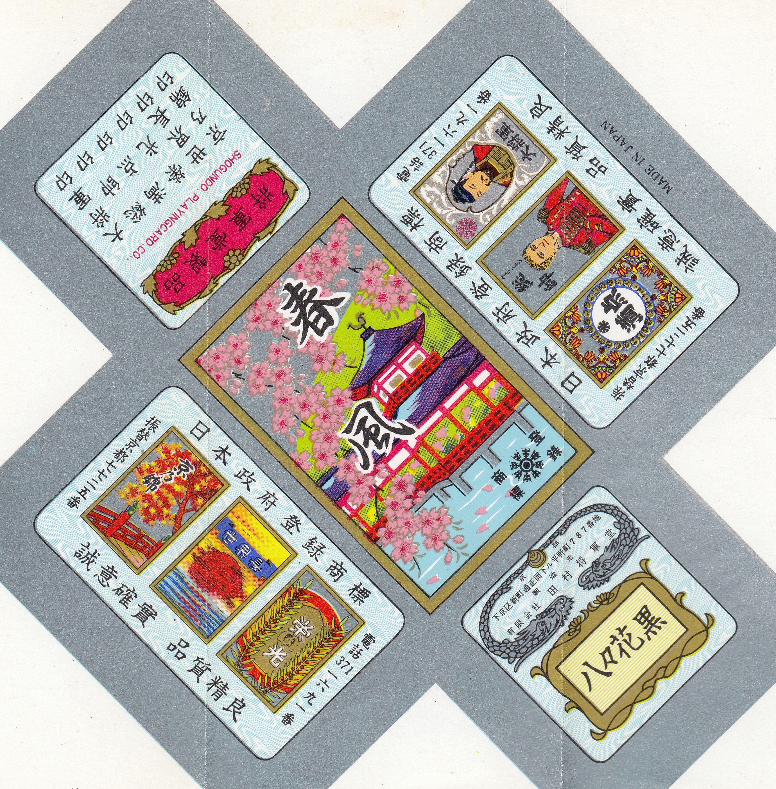
>
> Anatomy of a [<span class="noun" lang="ja-Latn">Tamura Shōgundō</span>](#tamura-shogundo) <span class="noun" lang="ja-Latn">Hanafuda</span> wrapper.


### Manufacturer’s Marks

Within the deck, the manufacturer’s name or mark is nowadays always on one of
the Paulownia junk cards, but on older decks it can be on a Peony or Wisteria
(for an example, see [below](#oishi-tengudo)), or another card entirely.

> [!figure]
>
> 
> 
>
> ```yaml
> size: "small"
> ```
>
> Manufacturer’s marks from <span class="noun" lang="ja-Latn">Nintendō</span>, Angel, and <span class="noun" lang="ja-Latn">Maruē</span>.


Often the mark is a simplified version of the name,[^direction] or a different <span lang="ja-Latn">kanji</span>, usually combined with a geometric shape. When pronouncing the mark the shape is usually also ‘read’, so that <span class="noun" lang="ja-Latn">Nintendō</span>’s mark—a stylized <span lang="ja">福</span> (<span lang="ja-Latn">fuku</span> ‘good fortune’) inside a circle—is read <span lang="ja-Latn">maru-fuku</span> ‘circle-fuku’, much like the brand “[Circle K](https://en.wikipedia.org/wiki/Circle_K)”. The same can also be done with the square  (<span lang="ja">角</span> <span lang="ja-Latn">kaku</span>), a corner at top-right (┐) can be described as a carpenter’s square  (<span lang="ja">矩 </span> <span lang="ja-Latn">kane</span>), and a corner pointing upwards (∧) is called a mountain (<span lang="ja">山</span> <span lang="ja-Latn">yama</span>).

[^direction]: Also be aware that Japanese can be written in either direction; @OstasiatischeSpielkarten [p. 136] describes a deck made by a mysterious manufacturer named ‘<span class="noun" lang="ja-Latn">Dōtennin</span>’!

### Index of Marks
<div class="multi">
<table>
<tbody>
<tr>
<td>

</td>
<td>
<a href="#nintendo"><span class="noun" lang="ja-Latn">Nintendō</span></a>
</td>
</tr>
<tr>
<td>
 or 
</td>
<td>
<a href="#oishi-tengudo"><span class="noun" lang="ja-Latn">Ōishi Tengudō</span></a>
</td>
</tr>
<tr>
<td>

</td>
<td>
<a href="#angel-enzeru">Angel</a>
</td>
</tr>
<tr>
<td>

</td>
<td>
<a href="#tamura-shogundo"><span class="noun" lang="ja-Latn">Tamura Shōgundō</span></a>
</td>
</tr>
<tr>
<td>

</td>
<td>
<a href="#matsui-tengudo"><span class="noun" lang="ja-Latn">Matsui Tengudō</span></a>
</td>
</tr>
<tr>
<td>
<span lang="ja" style="font-family: 'sans-serif'">エース</span>
</td>
<td>
<a href="#ace-esu">Ace</a>
</td>
</tr>
<tr>
<td>

</td>
<td>
<a href="#marue"><span class="noun" lang="ja-Latn">Maruē</span></a>
</td>
</tr>
<tr>
<td>

</td>
<td>
<a href="#tanaka-gyokusuido"><span class="noun" lang="ja-Latn">Tanaka Gyokusuidō</span></a>
</td>
</tr>
<tr>
<td>

</td>
<td>
<a href="#iwata-honten"><span class="noun" lang="ja-Latn">Iwata Honten</span></a>
</td>
</tr>
<tr>
<td>

</td>
<td>
<a href="#nihon-karuta-seizo-tamada-fukushodo"><span class="noun" lang="ja-Latn">Nihon Karuta</span>/<span class="noun" lang="ja-Latn">Tamada Fukushōdō</span></a>
</td>
</tr>
<tr>
<td>

</td>
<td>
<a href="#yamashiro-shoten"><span class="noun" lang="ja-Latn">Yamashiro Shōten</span></a>
</td>
</tr>
<tr>
<td>

</td>
<td>
<a href="#ryutendo"><span class="noun" lang="ja-Latn">Ryūtendō</span></a>
</td>
</tr>
<tr>
<td>

</td>
<td>
<a href="#inoue-juntendo"><span class="noun" lang="ja-Latn">Inoue Juntendō</span></a>
</td>
</tr>
<tr>
<td>

</td>
<td>
<a href="#nakao-seikado"><span class="noun" lang="ja-Latn">Nakao Seikadō</span></a>
</td>
</tr>
<tr>
<td>
?
</td>
<td>
<a href="#tsuchida-tenguya"><span class="noun" lang="ja-Latn">Tsuchida Tenguya</span></a>
</td>
</tr>
<tr>
<td>

</td>
<td>
<a href="#usui-nikkagetsudo-kyoto-karuta"><span class="noun" lang="ja-Latn">Usui Nikkagetsudō</span>/<span class="noun" lang="ja-Latn">Kyōto Karuta</span></a>
</td>
</tr>
<tr>
<td>

</td>
<td>
<a href="#heibon"><span class="noun" lang="ja-Latn">Heibon</span></a>
</td>
</tr>
<tr>
<td>
?
</td>
<td>
<a href="#kawakita"><span class="noun" lang="ja-Latn">Kawakita</span></a>
</td>
</tr>
<tr>
<td>

</td>
<td>
<a href="#kohara-honten"><span class="noun" lang="ja-Latn">Kohara Honten</span></a>
</td>
</tr>
</tbody>
</table>
<table>
<tbody>
<tr>
<td>

</td>
<td>
<a href="#nishimura"><span class="noun" lang="ja-Latn">Nishimura</span></a>
</td>
</tr>
<tr>
<td>

</td>
<td>
<a href="#nakao-kokeido"><span class="noun" lang="ja-Latn">Nakao Kōkeidō</span></a>
</td>
</tr>
<tr>
<td>

</td>
<td>
<a href="#baba-keieido"><span class="noun" lang="ja-Latn">Baba Keieidō</span></a> or <a href="#kyoto-karuta"><span class="noun" lang="ja-Latn">Kyōto Karuta</span></a>
</td>
</tr>
<tr>
<td>

</td>
<td>
<a href="#dai-nippon"><span class="noun" lang="ja-Latn">Dai Nippon</span></a>
</td>
</tr>
<tr>
<td>
?
</td>
<td>
<a href="#nippon-yugi-gangunichiyu"><span class="noun" lang="ja-Latn">Nippon Yūgi Gangu</span></a>
</td>
</tr>
<tr>
<td>
?
</td>
<td>
<a href="#universal"><span class="noun" lang="ja-Latn">Universal</span></a>
</td>
</tr>
<tr>
<td>

</td>
<td>
<a href="#kawai"><span class="noun" lang="ja-Latn">Kawai</span></a>
</td>
</tr>
<tr>
<td>

</td>
<td>
<a href="#akata-shojoya"><span class="noun" lang="ja-Latn">Akata Shōjōya</span></a>
</td>
</tr>
<tr>
<td>
?
</td>
<td>
<a href="#suisando"><span class="noun" lang="ja-Latn">Suisando</span></a>
</td>
</tr>
<tr>
<td>

</td>
<td>
<a href="#nihon-goraku"><span class="noun" lang="ja-Latn">Nihon Goraku</span></a>
</td>
</tr>
<tr>
<td>

</td>
<td>
<a href="#kyowado"><span class="noun" lang="ja-Latn">Kyōwadō</span></a> or <a href="#nishiguchi-shoten"><span class="noun" lang="ja-Latn">Nishi­&shy;guchi Shōten</span></a>
</td>
</tr>
<tr>
<td>

</td>
<td>
<a href="#kamigataya"><span class="noun" lang="ja-Latn">Kamigataya</span></a>
</td>
</tr>
<tr>
<td>

</td>
<td>
<a href="#marukin"><span class="noun" lang="ja-Latn">Marukin</span></a>
</td>
</tr>
<tr>
<td>

</td>
<td>
<a href="#otani-shoten"><span class="noun" lang="ja-Latn">Ōtani Shōten</span></a>
</td>
</tr>
<tr>
<td>

</td>
<td>
<a href="#tohoku-karuta"><span class="noun" lang="ja-Latn">Tōhoku Karuta</span></a>
</td>
</tr>
<tr>
<td>
(none)
</td>
<td>
<a href="#seieido"><span class="noun" lang="ja-Latn">Seieidō</span></a>
</td>
</tr>
<tr>
<td>
?
</td>
<td>
<a href="#tamei-fukujudo"><span class="noun" lang="ja-Latn">Tamei Fukujudō</span></a>
</td>
</tr>
<tr>
<td>
?
</td>
<td>
<a href="#sanjoya"><span class="noun" lang="ja-Latn">Sanjōya</span></a>
</td>
</tr>
<tr>
<td>

</td>
<td>
<a href="#maruyoshi"><span class="noun" lang="ja-Latn">Maruyoshi</span></a>
</td>
</tr>
<tr>
<td>
?
</td>
<td>
<a href="#ito-koji-shoten"><span class="noun" lang="ja-Latn">Itō Kōji Shōten</span></a>
</td>
</tr>
<tr>
<td>
—
</td>
<td>
<a href="#alaska-playing-cards">Alaska playing cards</a>
</td>
</tr>
</tbody>
</table>
</div>

### Dating Decks

Dating old decks can be difficult. As manufacturers have not published any
information about when certain brands or decks were produced, we can only go via
public information. Some suggested methods are:

> [!figure]
>
> 
>
> ```yaml
> position: "aside"
> size: "small"
> ```
>
> A <span class="noun" lang="ja-Latn">Nintendō</span> blank card indicating the date of manufacture (2012–01–24).


* With recent <span class="noun" lang="ja-Latn">Nintendō</span> decks, the blank card
  included has a 6-digit date of manufacture printed on it. This is the only
  case I know where the date is explicitly marked.
* Otherwise, the most accurate method of dating is to use tax stamps (see
  below), if the deck has any still present. This only works for decks produced
  up to 1989, when the tax on playing-cards was removed.
* For more recent decks, barcodes can give some clues: Japanese barcodes
  beginning with <span class="barcode">49⋯</span> have been used since 1978, but
  barcodes beginning with <span class="barcode">45⋯</span> were introduced in
  1992.
* Japanese written in a right-to-left ordering generally indicates that the deck
  would have been made before the end of <abbr title="World War Two">WWII</abbr>
  (from here on, I use the term ‘pre-war’). Thus, <span lang="ja">任天堂</span>
  is written <bdo dir="rtl" lang="ja">任天堂</bdo> on very old decks.
  <em>However</em>, some manufacturers such as <span class="noun" lang="ja-Latn">Ōishi
  Tengudō</span> or <span class="noun" lang="ja-Latn">Nihon Karuta</span> have persisted in
  using right-to-left ordering even into the present era.

### Tax Stamps

For most of the 20th century, <span class="noun" lang="ja-Latn">Hanafuda</span> cards were
taxed by the Japanese government. This tax has changed over time and thus can be
used to identify the time period during which a deck was sold.

The following table is summarized from [a series of
articles](https://japanplayingcardmuseum.com/category/0-0-cartatax-law-history/)
provided by <span class="noun" lang="ja-Latn">Ebashi</span> on his website:

<table class="numeric">
<caption>
Tax levied on <span class="noun" lang="ja-Latn">Hanafuda</span> sets over time.
</caption>
<thead>
  <tr>
  <th class="text-center">
  Date Introduced
  </th>
  <th class="text-center">
  Tax Amount
  </th>
  </tr>
</thead>
<tbody class="table-group-divider">
<tr>
  <td>
  July 1, 1902
  </td>
  <td>
  20 <span lang="ja-Latn">sen</span>
  </td>
</tr>
<tr>
  <td>
  April 1, 1926
  </td>
  <td>
  50 <span lang="ja-Latn">sen</span>
  </td>
</tr>
<tr>
  <td>
  April 1, 1940
  </td>
  <td>
  70 <span lang="ja-Latn">sen</span>
  </td>
</tr>
<tr>
  <td>
  November 22, 1941
  </td>
  <td>
  1½ <span lang="ja-Latn">yen</span>
  </td>
</tr>
<tr>
  <td>
  February 15, 1944
  </td>
  <td>
  3 <span lang="ja-Latn">yen</span>
  </td>
</tr>
<tr>
  <td>
  August 30, 1946
  </td>
  <td>
  10 <span lang="ja-Latn">yen</span>
  </td>
</tr>
<tr>
  <td>
  March 31, 1947
  </td>
  <td>
  30 <span lang="ja-Latn">yen</span>
  </td>
</tr>
<tr>
  <td>
  November 30, 1947
  </td>
  <td>
  100 <span lang="ja-Latn">yen</span>
  </td>
</tr>
<tr>
  <td>
  July 7, 1948
  </td>
  <td>
  130 <span lang="ja-Latn">yen</span>
  </td>
</tr>
<tr>
  <td>
  March 28, 1951
  </td>
  <td>
  50 <span lang="ja-Latn">yen</span>
  </td>
</tr>
<tr>
  <td>
  March 31, 1954
  </td>
  <td>
  60 <span lang="ja-Latn">yen</span>
  </td>
</tr>
<tr>
  <td>
  June 14, 1957
  </td>
  <td>
  60 <span lang="ja-Latn">yen</span>
  </td>
</tr>
<tr>
  <td>
  October 1, 1960
  </td>
  <td>
  60 <span lang="ja-Latn">yen</span>
  </td>
</tr>
<tr>
  <td>
  March 31, 1962
  </td>
  <td>
  40 <span lang="ja-Latn">yen</span>
  </td>
</tr>
<tr>
  <td>
  April 1, 1989
  </td>
  <td>
  abolished
  </td>
</tr>
</tbody>
</table>

> [!figure]
>
> 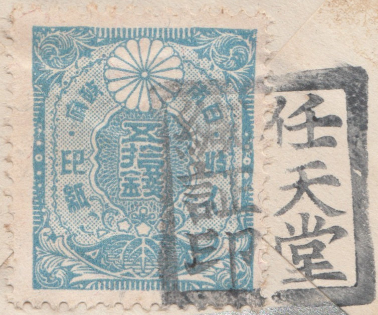
>
> ```yaml
> position: "aside"
> copyrightYear: 2023
> authorGiven: "Fabrice"
> authorFamily: "Heilig"
> license: 'with-permission'
> ```
>
> This 50 <span lang="ja-Latn">sen</span> stamp has a clear <span lang="ja-Latn" class="noun">Nintendō</span> (<span lang="ja">任天堂</span>) cancellation mark.


> [!figure]
>
> 
> 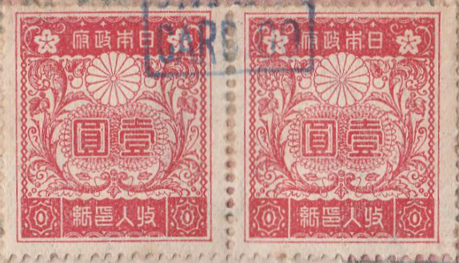
>
> ```yaml
> copyrightYear: 2019
> authorGiven: "Fabrice"
> authorFamily: "Heilig"
> license: 'with-permission'
> ```
>
> Late <span class="noun" lang="ja-Latn">Taishō</span>‐era tax stamps: blue 50 <span lang="ja-Latn">sen</span> on left, red 1 <span lang="ja-Latn">yen</span> on right.

> [!multi]
> > [!figure]
> >
> > 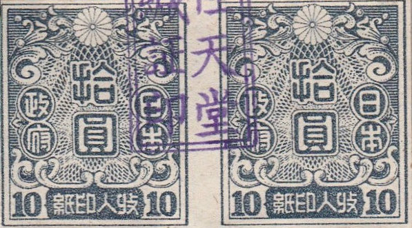
> >
> > ```yaml
> > copyrightYear: 2023 
> > authorGiven: "Fabrice"
> > authorFamily: "Heilig"
> > license: 'with-permission'
> > ```
> >
> > Two 10 <span lang="ja-Latn">yen</span> (<span lang="ja">拾圓</span>) stamps; the deck had 30 <span lang="ja-Latn">yen</span> total, indicating that the deck was sold in 1947. The cancellation mark is <span lang="ja-Latn" class="noun">Nintendō</span>’s.
> 
> > [!figure]
> >
> > 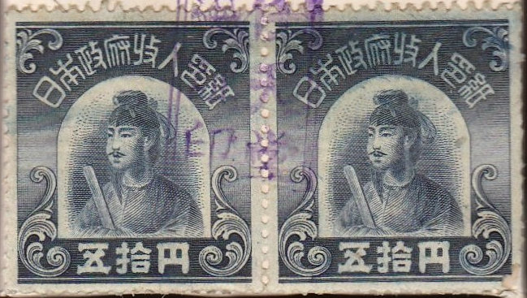
> >
> > ```yaml
> > copyrightYear: 2023
> > authorGiven: "Fabrice"
> > authorFamily: "Heilig"
> > license: 'with-permission'
> > ```
> >
> > Two 50 <span lang="ja-Latn">yen</span> (<span lang="ja">𠄡拾円</span>) stamps, indicating the deck was sold between 1947–48.
 
> [!figure]
>
> 
> 
>
> Tax stamps of the type used from 1960 until the tax was abolished in 1989. Pink was used for <span class="noun" lang="ja-Latn">Hanafuda</span> decks and purple was used for Western style (“trump”) decks.

## Current Manufacturers

All current Japanese manufacturers that I know of are based in <span class="noun"
lang="ja-Latn">Kyōto</span> prefecture. The <span class="noun" lang="ja-Latn">Kansai</span>
region (which contains both <span class="noun" lang="ja-Latn">Kyōto</span> and <span class="noun"
lang="ja-Latn">Ōsaka</span>) is the original source of <span class="noun"
lang="ja-Latn">Hanafuda</span> cards.

###  <span class="noun" lang="ja-Latn">Nintendō</span> (<span lang="ja">任天堂</span>)

> [!figure]
>
> 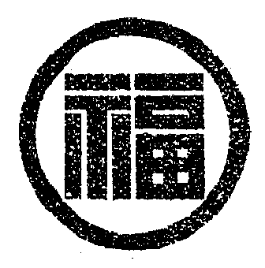
>
> ```yaml
> noborder: true
> size: "small"
> position: "aside"
> license: "cc0"
> ```
>
> <span class="noun" lang="ja-Latn">Nintendō</span>’s <span lang="ja-Latn">marufuku</span> mark, registered in 1900 by <span class="noun" lang="ja-Latn">Yamauchi Fusajirō</span>.[@Trademarks1905 p. 67]

<span class="noun" lang="ja-Latn">Nintendō</span> is the most prominent company that produces
<span class="noun" lang="ja-Latn">Hanafuda</span> cards today. The company was founded in
<span class="noun" lang="ja-Latn">Kyōto</span> in 1889 by <span class="noun" lang="ja-Latn">Yamauchi
Fusajirō</span> (<span lang="ja">山内房治郎</span>), and it was run by the <span class="noun"
lang="ja-Latn">Yamauchi</span> family for three generations until <span class="noun"
lang="ja-Latn">Yamauchi Hiroshi</span> (<span lang="ja">山内溥</span>) stepped
down in 2002.

> [!todo]: this seems dubious.
>
> In the early days of the company,  <span class="noun" lang="ja-Latn">Fusajirō</span> joined forces with the “tobacco king” <span class="noun" lang="ja-Latn">Murai Kichibei</span> (<span lang="ja">村井吉兵衛</span>) who had founded the <span class="noun" lang="ja-Latn">Murai</span> Brothers tobacco company in 1892. Like <span class="noun" lang="ja-Latn">Nintendō</span>, who were one of the first companies to produce Western-style cards in Japan, <span class="noun" lang="ja-Latn">Murai</span> Bros. was a company that was incorporating Western elements: they were operating in conjunction with American tobacco companies, and many of their cigarette brands bore English titles. Together the two companies invested to purchase printing equipment from an American company in New York that had been taken over by the <abbr title="United States Playing Card Company">USPCC</abbr>, and formed a venture called “Tōyō Printing”[^fn0] (<span lang="ja">東洋印刷</span>).[@EbashiCigaretteCards]
>
> :[^fn0] In some sources this is given in its translated form as the “Oriental Printing Company”.
>
>    position="left"
>     alt="An image of a cigarette card with a combination Hanafuda (Wisteria) and Western (4 of clubs) on the front, and on the reverse reading “A different card in each package of cigarettes”."
>     src={imgMuraiBrosCard}
>     source={
>       license: "cc0"
>     } %}
>     An example of a combination <span class="noun" lang="ja-Latn">Hanafuda</span> card included with a packet of Murai Bros. cigarettes. Note that the clubs are printed in the “wrong” colour.
>
> Using this printing equipment they were able to produce high-quality collectible cards to include with cigarettes, and by 1894, one of these offerings was a single <span class="noun" lang="ja-Latn">Hanafuda</span> card included with each packet of cigarettes sold. These tobacco cards often featured a design which combined Western playing cards with the <span class="noun" lang="ja-Latn">Hanafuda</span> pattern. In 1904, the Japanese government nationalized the manufacture of all tobacco products,[^fn1] and <span class="noun" lang="ja-Latn">Tōyō</span> Printing was sold along with the rest of the company.[@TarHeel p. 362]
> 
> :[^fn1] <span class="noun" lang="ja-Latn">Kichibei</span> was compensated massively for being pushed out of the industry and later founded a bank, among many other enterprises.[@JapanInTheTaishoEra p. 632]

A too-brief summary of their later success: after WWII, <span class="noun" lang="ja-Latn">Nintendō</span> managed to survive a period of crushing taxation on playing-card products, which wiped out many of the smaller manufacturers. In the second half of the 20th century they (famously!) diversified into children’s toys and, later on, video games.

<span class="noun" lang="ja-Latn">Nintendō</span>’s manufacturers mark is a circled <span
lang="ja" class="circled">福</span> (<span lang="ja-Latn">fuku</span>,
‘fortune’). This was originally the trade-name (<span lang="ja">屋号</span>
[<span lang="ja-Latn">yagō</span>](https://en.wikipedia.org/wiki/Yag%C5%8D)) of
the <span class="noun" lang="ja-Latn">Yamauchi</span> family.

> [!figure]
>
> 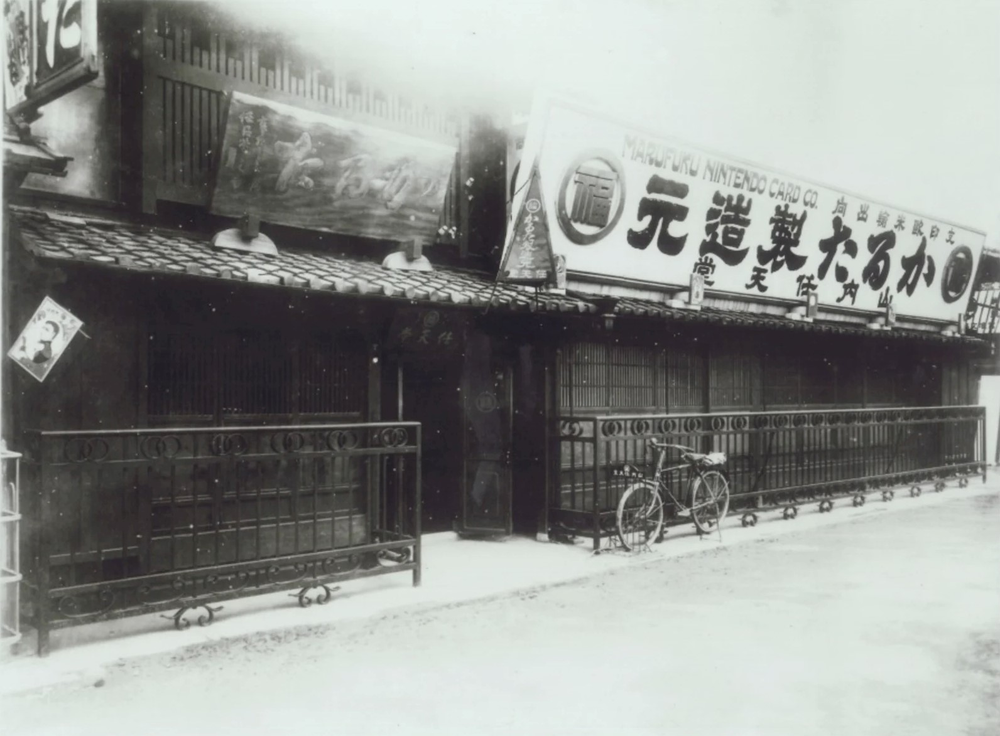
>
> ```yaml
> size: "wide"
> license: "cc0"
> ```
>
> The <span class="noun" lang="ja-Latn">Nintendō</span> storefront in <span class="noun" lang="ja-Latn">Kyōto</span> (original source dates this as 1889, but it seems more likely to be after 1900).

> [!figure]
>
> 
> 
> 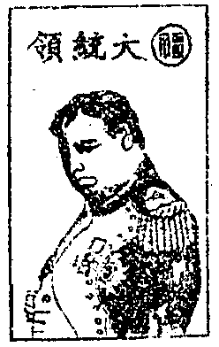
> 
>
> ```yaml
> noborder: true
> position: "aside"
> perRow: 2
> license: "cc0"
> ```
>
> Some early <span class="noun" lang="ja-Latn">Nintendō</span> trademarks, registered in 1900 by <span class="noun" lang="ja-Latn">Yamauchi Fusajirō</span>.[@Trademarks1905 p. 67] Note that at this time <span class="noun" lang="ja-Latn">Nintendō</span> had not yet started using the stylized form of the <span lang="ja-Latn">marufuku</span> symbol.

In the past <span class="noun" lang="ja-Latn">Nintendō</span> produced many varieties of
local cards or <span class="noun" lang="ja-Latn">Mekuri</span> cards, but today they only
produce <span class="noun" lang="ja-Latn">Hanafuda</span> and <span class="noun"
lang="ja-Latn">Kabufuda</span> cards. Their current brands are: <span
lang="ja-Latn">Daitōryō</span> <span lang="ja">大統領</span> (featuring a
picture of Napoleon); <span lang="ja-Latn">Marufuku Tengu</span> <span
lang="ja">丸福天狗</span>; and <span lang="ja-Latn">Miyako no Hana</span> <span
lang="ja">都の花</span> ‘flowers of the city’.

<div class="multi">
> [!figure]
>
> 
>
> <span class="noun" lang="ja-Latn">Nintendō</span>’s <span lang="ja-Latn">Daitōryō</span> packaging (1970s). Note the <span class="noun" lang="ja-Latn">Marufuku</span> mark at top right.

> [!figure]
>
> 
>
> <span class="noun" lang="ja-Latn">Nintendō</span>’s <span lang="ja-Latn">Tengu</span> packaging.

> [!figure]
>
> 
>
> <span class="noun" lang="ja-Latn">Nintendō</span>’s <span lang="ja-Latn">Daitengu</span> packaging.

> [!figure]
>
> 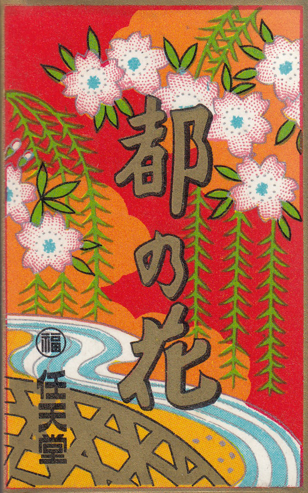
>
> <span class="noun" lang="ja-Latn">Nintendō</span>’s <span lang="ja-Latn">Miyako no Hana</span> packaging.

</div>

Other <span class="noun" lang="ja-Latn">Nintendō</span> <span class="noun" lang="ja-Latn">Hanafuda</span>
brands have included:[@ModernJapaneseWrappers p. 54]

> [!figure]
>
> 
>
> ```yaml
> position: "aside"
> originalUrl: "https://www.flickr.com/photos/kryptos5/2953289035"
> authorGiven: "See Tatt"
> authorFamily: "Yeo"
> license: "cc-by-nc-nd"
> licenseVersion: "2.0"
> ```
>
> <span class="noun" lang="ja-Latn">Otafuku</span> (also known as <span class="noun" lang="ja-Latn">Okame</span>) is a traditional character associated with good luck, and often appears in <span lang="ja-Latn">kagura</span> performances alongside [<span class="noun" lang="ja-Latn">Hyottoko</span>](https://en.wikipedia.org/wiki/Hyottoko).

* <span lang="ja">大統領</span> (<span lang="ja-Latn">daitōryō</span>, a
  translation of ‘first consul’, Napoleon’s title from 1799–1804), trademarked
  in 1901[@Trademarks1905 p. 67]
* <span lang="ja">お多福</span> (<span lang="ja-Latn">otafuku</span>,
  ‘moon-faced woman’), trademarked in 1900[@Trademarks1905 p. 67]
* <span lang="ja">正宗</span> (<span lang="ja-Latn">masamune</span>, [a famous
  swordsmith](https://en.wikipedia.org/wiki/Masamune)), trademarked in
  1900[@Trademarks1905 p. 67]
* <span lang="ja">天狗</span> (<span lang="ja-Latn">tengu</span>, ‘<span class="noun"
  lang="ja-Latn">Tengu</span>’), trademarked in 1912[@Trademarks1924_5 p. 276]
* <span lang="ja">大天狗</span> (<span lang="ja-Latn">daitengu</span>, the most
  powerful or chief type of <span class="noun" lang="ja-Latn">Tengu</span>), introduced in 1977
* <span lang="ja">大将</span> (<span lang="ja-Latn">taishō</span>, ‘general’),
  trademarked in 1900[@Trademarks1905 p. 67]
* <span lang="ja">白梅</span> (<span lang="ja-Latn">hakubai</span>, ‘white
  plum’), not in use as of 1980
* <span lang="ja">櫻乃山</span> (<span lang="ja-Latn">sakura no yama</span>,
  ‘mountain cherry blossoms’), not in use as of 1980
* <span lang="ja">朝日桜</span> (<span lang="ja-Latn">asahi sakura</span>,
  ‘sunrise cherry blossoms’)
* <span lang="ja">三羽鶴</span> (<span lang="ja-Latn">sanbazuru</span>, ‘three
  cranes’), not in use as of 1980
* <span lang="ja">千代桜</span> (<span lang="ja-Latn">chiyo zakura</span>,
  ‘thousand-year cherry blossoms’)
* <span lang="ja">春遊</span> (<span lang="ja-Latn">shun’yu</span>, ‘spring
  outing’, especially of the Emperor)
* <span lang="ja">四光印</span> (<span lang="ja-Latn">shikōjirushi</span>, ‘four
  brights brand’), trademarked in 1916[@Trademarks1924_9 p. 286]
* <span lang="ja">御所櫻</span> (<span lang="ja-Latn">gosho&shy;zakura</span>,
  ‘imperial palace cherry blossoms’)
* <span lang="ja">日乃出</span> (<span lang="ja-Latn">hinode</span>, ‘sunrise’)
* <span lang="ja">常磐</span> (<span lang="ja-Latn">tokiwa</span>, ‘eternal’, a
  reference to the [<span lang="ja-Latn">waka</span> that appears on the pine
  cards in some decks](articles/cards/japan/hanafuda/art/art.md#month-1))
* <span lang="ja">丹頂</span> (<span lang="ja-Latn">tanchō</span>, ‘red-crested
  crane’, that appears on the pine bright)

> [!figure]
>
> 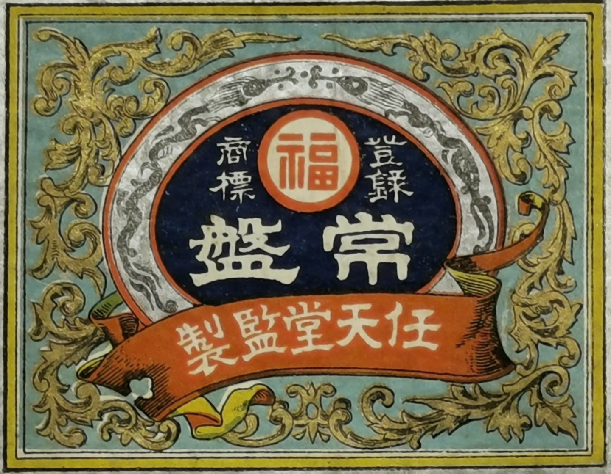
> 
>
> ```yaml
> orgName: "beforemario.com"
> orgUrl: "https://beforemario.com"
> copyrightYear: 2021
> license: "with-permission"
> ```
>
> The <span lang="ja-Latn">tokiwa</span> external box and wrapper.

> [!multi]
> > [!figure]
> >
> > 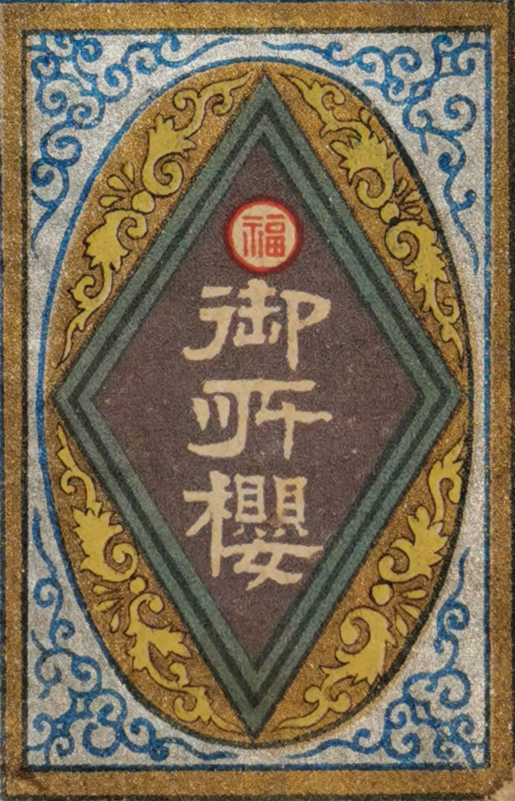
> >
> > ```yaml
> > orgName: "beforemario.com"
> > orgUrl: "https://beforemario.com"
> > copyrightYear: 2021
> > license: "with-permission"
> > ```
> >
> > The <span lang="ja-Latn">gosho&shy;zakura</span> wrapper.
> 
> > [!figure]
> >
> > 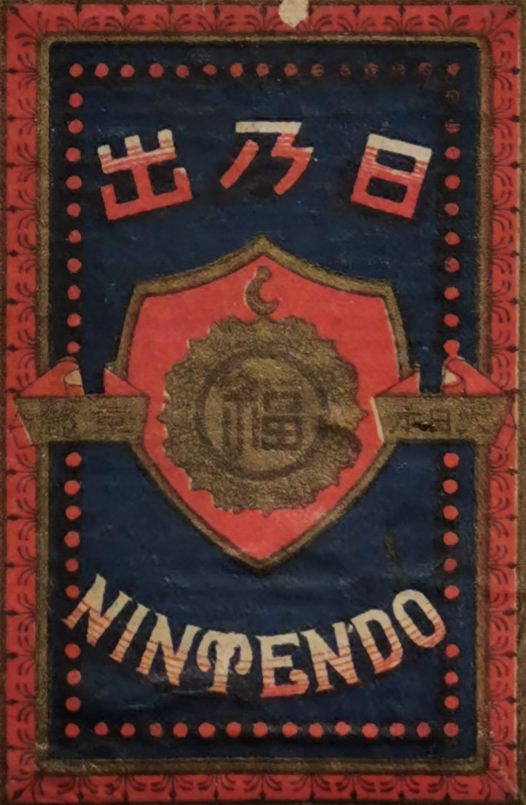
> >
> > ```yaml
> > orgName: "beforemario.com"
> > orgUrl: "https://beforemario.com"
> > copyrightYear: 2021
> > license: "with-permission"
> > ```
> >
> > The <span lang="ja-Latn">hinode</span> wrapper.
> 
> > [!figure]
> >
> > 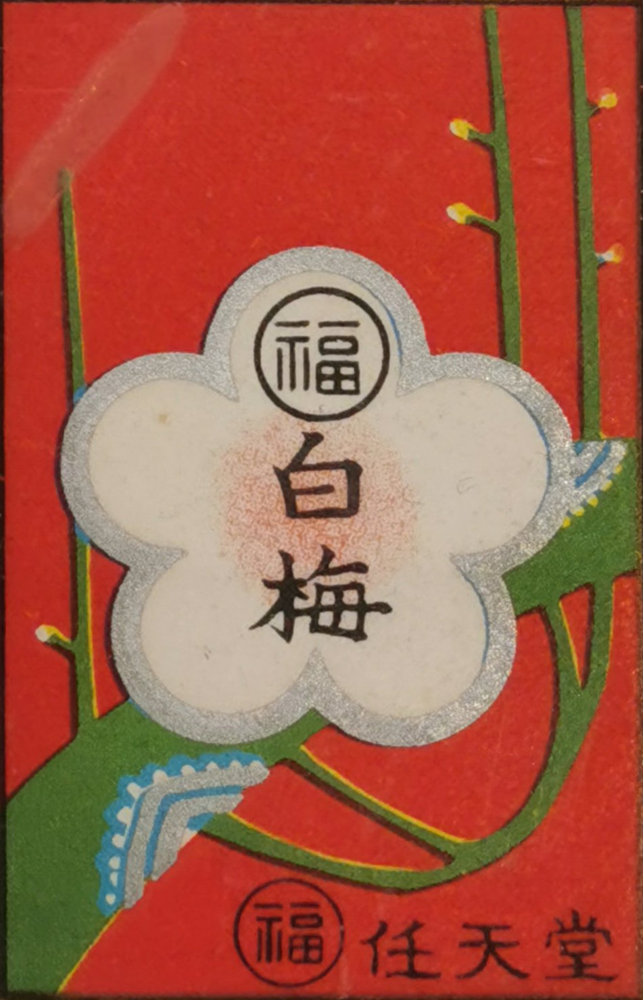
> >
> > ```yaml
> > orgName: "beforemario.com"
> > orgUrl: "https://beforemario.com"
> > copyrightYear: 2021
> > license: "with-permission"
> > ```
> >
> > The <span lang="ja-Latn">hakubai</span> wrapper.

One interesting deck they used to produce was **Hana-Trump**, which combined
<span class="noun" lang="ja-Latn">Hanafuda</span> cards with the cards of the international
standard playing card deck. Each rank of the standard pack corresponds to a
month of the <span class="noun" lang="ja-Latn">Hanafuda</span> deck:

> [!figure]
>
> 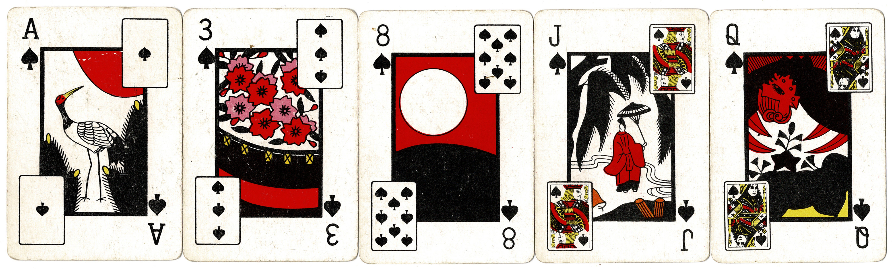
>
> The 5 Brights of <span class="noun" lang="ja-Latn">Nintendō</span>’s “Hana-Trump” deck.


Because there are four more cards in the standard deck compared to the <span class="noun" lang="ja-Latn">Hanafuda</span> one, <span class="noun" lang="ja-Latn">Nintendō</span> added an additional four cards (and two jokers) to the set. These extra cards are counterparts for specialized pieces of equipment present in boxed [Hachi-Hachi](games/hachi-hachi/hachi-hachi.md) (<span lang="ja">八八</span>) sets.

> [!figure]
>
> 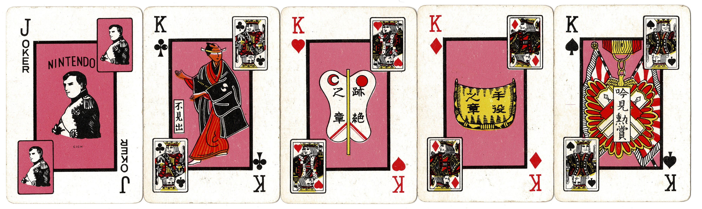
>
> The extra cards of <span class="noun" lang="ja-Latn">Nintendō</span>’s “Hana-Trump” deck.  From left-to-right, after the joker, these are: a blindfolded samurai, with text reading <span lang="ja"><q>不見出</q></span> (88 sets have a piece labelled <span lang="ja"><q>不見転</q></span>, ‘loose morals’); a <span lang="ja-Latn">gunbai</span> (<span lang="ja">軍配</span>), a military leader’s fan which is nowadays used by sumo referees, which is inscribed <span lang="ja"><q>跡絶之章</q></span> (88 sets have a piece labelled <span lang="ja"><q>両桐絶体之章</q></span>); a rice winnowing basket (<span lang="ja">箕</span> <span lang="ja-Latn">mi</span>) inscribed <span lang="ja"><q>手役之章</q></span> (hand-<span lang="ja-Latn">yaku</span> prize); and an award medal reading <span lang="ja"><q>吟見勲賞</q></span> (<span lang="ja-Latn">Ginmi Kunshō</span>, ‘<span lang="ja-Latn">Ginmi</span> Medal’), which is a prize for the ‘top player’ (<span lang="ja-Latn">Ginmi</span>, usually spelt <span lang="ja">吟味</span>, 88 sets have a piece labelled <span lang="ja">銀見勲章</span>).


Currently <span class="noun" lang="ja-Latn">Nintendō</span> also produce many novelty decks
themed with their videogame characters, such as Mario (pictured below), Pokémon,
Mario Pikachu (limited edition, 2016), Kirby (2020), among others.

> [!figure]
>
> 
>
> <span class="noun" lang="ja-Latn">Nintendō</span>’s Mario deck, featuring recurring characters from the Mario series.

<span class="noun" lang="ja-Latn">Nintendō</span> have also on occasion produced decks for
other companies, such as the <span class="noun" lang="ja-Latn">Shikishima Hanafuda</span>
(<span lang="ja">敷島花札</span>) produced for <span class="noun" lang="ja-Latn">Okuno
Karuta</span> (<span lang="ja">奥野かるた店</span>), a games shop in <span class="noun"
lang="ja-Latn">Tōkyō</span>.

> [!figure]
>
> 
>
> <span class="noun" lang="ja-Latn">Okuno Karuta’s Shikishima Hanafuda</span>. The cards were designed by the print artist <span class="noun" lang="ja-Latn">Itō Takumi</span> (<span lang="ja">伊藤卓美</span>, <abbr title="born">b.</abbr> 1946). They are larger than normal <span class="noun" lang="ja-Latn">Hanafuda</span> and the cards are printed on flat cardboard, not wrapped with backing paper.

###  <a href="https://www.tengudo.jp/" class="noun" lang="ja-Latn">Ōishi Tengudō</a> (<span lang="ja">大石天狗堂</span>)

Also based in <span class="noun" lang="ja-Latn">Kyōto</span>, <span class="noun" lang="ja-Latn">Ōishi
Tengudō</span> produces a wide variety of traditional Japanese card games. As
far as I know, they are the only major manufacturer still producing <span class="noun"
lang="ja-Latn">Mefuda</span> cards. They also produce reproductions of even
older cards, such as the <span class="noun" lang="ja-Latn">Unsun</span> deck.

> [!figure]
>
> 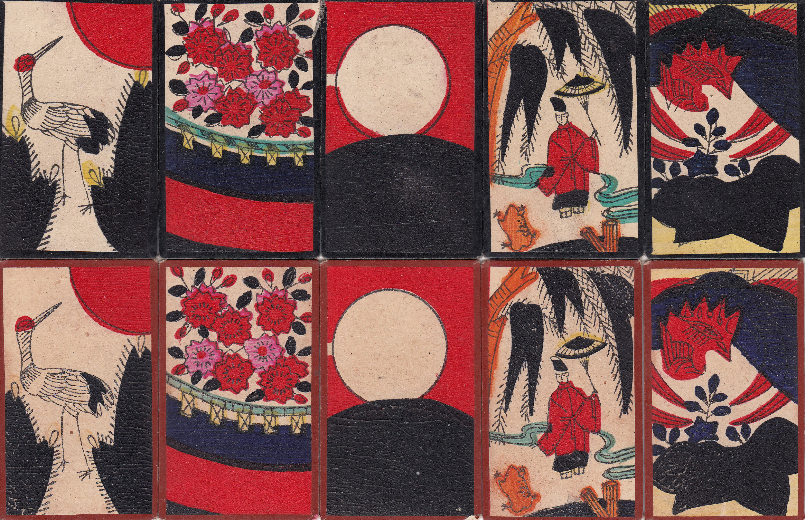
>
> ```yaml
> size: "wide"
> ```
>
> Cards from two different hand-printed <span class="noun" lang="ja-Latn">Ōishi Tengudō</span> decks, showing the high variability caused by the technique.

> [!figure]
>
> 
>
> ```yaml
> noborder: true
> size: "small"
> position: "aside"
> license: "cc0"
> ```
>
> <span class="noun" lang="ja-Latn">Ōishi Tengudō</span>’s earliest trademark, registered on the 5th of October 1893 by <span class="noun" lang="ja-Latn">Ōishi Sato</span> (<span lang="ja">大石サト</span>).[@Trademarks1905 p. 65] This trademark was clearly based on that of [<span class="noun" lang="ja-Latn">Sanjōya</span>](#sanjoya).

> [!figure]
>
> 
>
> ```yaml
> size: "small"
> position: "aside"
> ```
>
> <span class="noun" lang="ja-Latn">Ōishi Tengudō</span>’s manufacturer’s mark, on a Wisteria card from an old <span class="noun" lang="ja-Latn">Narikin</span> deck.


Their main manufacturer’s mark is <span lang="ja">み</span> with corner at top,
but on some decks (e.g. <span class="noun" lang="ja-Latn">Echigo-kobana</span>), they have
used <span lang="ja">大</span> in a square. In the past they have also used
circled <span class="circled" lang="ja">高</span>. Brands produced by <span class="noun"
lang="ja-Latn">Ōishi Tengudō</span> have included:[@ModernJapaneseWrappers pp.
57–8]

> [!figure]
>
> 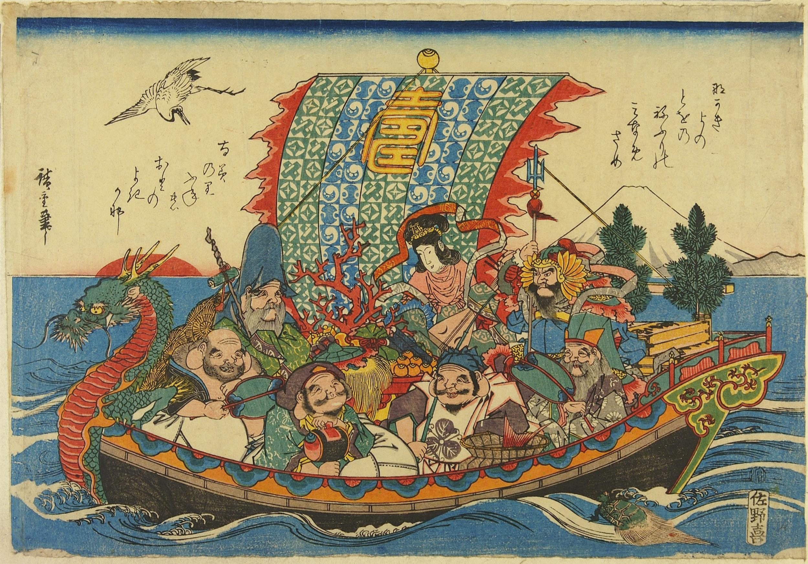
>
> ```yaml
> position: "aside"
> originalUrl: "https://commons.wikimedia.org/wiki/File:Takarabune_by_Hiroshige.png"
> license: "cc0"
> author: "MichaelMaggs" 
> ```
>
> The <span lang="ja-Latn">takarabune</span> is a [mythical ship](https://en.wikipedia.org/wiki/Takarabune) that carries the [seven lucky gods](https://en.wikipedia.org/wiki/Seven_Lucky_Gods), as shown in this print by [Hiroshige](https://en.wikipedia.org/wiki/Hiroshige) (<abbr>c.</abbr> 1840). 


* <span lang="ja">金天狗</span> (<span lang="ja-Latn">kintengu</span>, ‘golden <span class="noun" lang="ja-Latn">Tengu</span>’), also used for <span class="noun" lang="ja-Latn">Kabu</span> and <span class="noun" lang="ja-Latn">Tehonbiki</span> cards, trademarked in 1921[@Trademarks1924_18 p. 330]
* <span lang="ja">銀天狗</span> (<span lang="ja-Latn">gintengu</span>, ‘silver <span class="noun" lang="ja-Latn">Tengu</span>’), also used for <span class="noun" lang="ja-Latn">Kabufuda</span>, trademarked in 1921[@Trademarks1924_18 p. 331]
* <span lang="ja">若天狗</span> (<span lang="ja-Latn">wakatengu</span>, ‘young <span class="noun" lang="ja-Latn">Tengu</span>’)
* <span lang="ja">三天狗</span> (<span lang="ja-Latn">santengu</span>, ‘three <span class="noun" lang="ja-Latn">Tengu</span>’)
* <span lang="ja">成金</span> (<span lang="ja-Latn">narikin</span>, ‘newly rich’, derived from a <span class="noun" lang="ja-Latn">Shogi</span> term), also used for <span class="noun" lang="ja-Latn">Kabufuda</span>, trademarked in 1921[@Trademarks1924_18 p. 333]
* <span lang="ja">リンカーン</span> (<span lang="ja-Latn">rinkān</span>, ‘Lincoln’), no longer in use as of 1979
* <span lang="ja">福助</span> (<span lang="ja-Latn">fukusuke</span>, a [large-headed good luck doll](https://en.wikipedia.org/wiki/Fukusuke)), trademarked in 1917,[@Trademarks1924_11 p. 328] no longer in use as of 1979
* <span lang="ja">當矢</span> (<span lang="ja-Latn">atariya</span>, ‘winning arrow’)
* <span lang="ja">四季</span> (<span lang="ja-Latn">shiki</span>, ‘four seasons’)
* <span lang="ja">大江山</span> (<span lang="ja-Latn">ōeyama</span>, [a mountain near <span class="noun" lang="ja-Latn">Kyōto</span>](https://en.wikipedia.org/wiki/%C5%8Ceyama))
* <span lang="ja">寳船</span> (<span lang="ja-Latn">takarabune</span>, ‘treasure ship’)
* <span lang="ja">御所車</span> (<span lang="ja-Latn">goshoguruma</span>, ‘ox-drawn coach’)
* <span lang="ja">来福</span> (<span lang="ja-Latn">raifuku</span>, ‘fortune comes’, a reference to the full [<span lang="ja-Latn">yojijukugo</span>](https://en.wikipedia.org/wiki/Yojijukugo) “<span lang="ja">笑門来福</span>”, ‘fortune comes to the home of those who smile’), trademarked in 1921[@Trademarks1924_18 p. 333]
* <span lang="ja">花津久志/花𛁫くし</span> (<span lang="ja-Latn">hanazukushi</span>, ‘assorted flowers’)
* <span lang="ja">舞楽</span>, (<span lang="ja-Latn">bugaku</span>, [a courtly dance with music](https://en.wikipedia.org/wiki/Bugaku))
* <span lang="ja">𛀿𛀬ら</span>, (<span lang="ja-Latn">sakura</span>, but written with <span lang="ja-Latn">hentaigana</span> characters)
* <span lang="ja">一癶</span>, (<span lang="ja-Latn">ippatsu</span>, ‘one shot’, e.g. baseball home run or a mahjong term)
* <span lang="ja">梅印</span>, (<span lang="ja-Latn">umejirushi</span>, ‘plum brand’), trademarked in 1915[@Trademarks1924_8 p. 293]
* <span lang="ja">三福</span>, (<span lang="ja-Latn">sanfuku</span>, ‘three <span lang="ja-Latn">fuku</span> [masks]’), trademarked in 1915[@Trademarks1924_8 p. 295]
* <span lang="ja">國光</span>, (<span lang="ja-Latn">kokkou</span>, ‘national glory’), trademarked in 1915[@Trademarks1924_8 p. 297]
* <span lang="ja">橋立印</span>, (<span lang="ja-Latn">hashidate&shy;jirushi</span>, ‘[<span class="noun" lang="ja-Latn">Hashidate</span>](https://en.wikipedia.org/wiki/Amanohashidate) brand’), trademarked in 1921[@Trademarks1924_17 p. 272]
* <span lang="ja">松島印</span>, (<span lang="ja-Latn">matsushima&shy;jirushi</span>, ‘[<span class="noun" lang="ja-Latn">Matsu&shy;shima</span>](https://en.wikipedia.org/wiki/Matsushima) brand’), trademarked in 1921[@Trademarks1924_17 p. 272]
* (unnamed but with a picture of [<span class="noun" lang="ja-Latn">Miyajima</span>](https://en.wikipedia.org/wiki/Itsukushima), completing the [Three Views of Japan](https://en.wikipedia.org/wiki/Three_Views_of_Japan)), trademarked in 1921[@Trademarks1924_17 p. 272]
* <span lang="ja">由良之助</span>, (<span lang="ja-Latn">Yuranosuke</span>, the name of a fictionalized version of the real-life [<span class="noun" lang="ja-Latn">Ōishi Kuranosuke</span>](https://en.wikipedia.org/wiki/%C5%8Cishi_Yoshio)), trademarked in 1921[@Trademarks1924_17 p. 272]
* <span lang="ja">覇王</span> (<span lang="ja-Latn">haō</span>, ‘supreme ruler’), trademarked in 1921[@Trademarks1924_18 p. 332]
* <span lang="ja">曻龍</span> (<span lang="ja-Latn">shoryū</span>, ‘rising dragon’), trademarked in 1921[@Trademarks1924_18 p. 333]
* <span lang="ja">將軍</span> (<span lang="ja-Latn">shōgun</span>, ‘<span class="noun" lang="ja-Latn">Shogun</span>’), trademarked in 1921[@Trademarks1924_18 p. 334]

> [!multi]
> > [!figure]
> >
> > 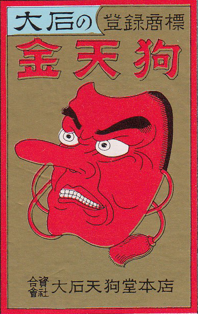
> >
> > <span class="noun" lang="ja-Latn">Ōishi Tengudō</span>’s <span lang="ja-Latn">kintengu</span> wrapper. This is now their standard brand.
> 
> > [!figure]
> >
> > 
> >
> > <span class="noun" lang="ja-Latn">Ōishi Tengudō</span>’s <span lang="ja-Latn">gintengu</span> wrapper.
> 
> > [!figure]
> >
> > 
> >
> > <span class="noun" lang="ja-Latn">Ōishi Tengudō</span>’s <span lang="ja-Latn">narikin</span> wrapper.

> [!multi-wide]
> > [!figure]
> > 
> > 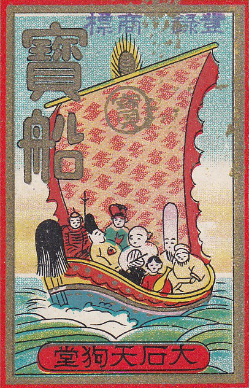
> >
> > <span class="noun" lang="ja-Latn">Ōishi Tengudō</span>’s <span lang="ja-Latn">takarabune</span> wrapper.
> 
> > [!figure]
> >
> > 
> >
> > <span class="noun" lang="ja-Latn">Ōishi Tengudō</span>’s <span lang="ja-Latn">sakura</span> wrapper.
> 
> > [!figure]
> >
> > 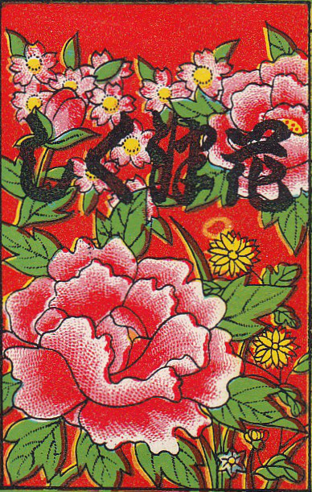
> > 
> > <span class="noun" lang="ja-Latn">Ōishi Tengudō</span>’s <span lang="ja-Latn">hanazukushi</span> wrapper.
> 
> > [!figure]
> >
> > 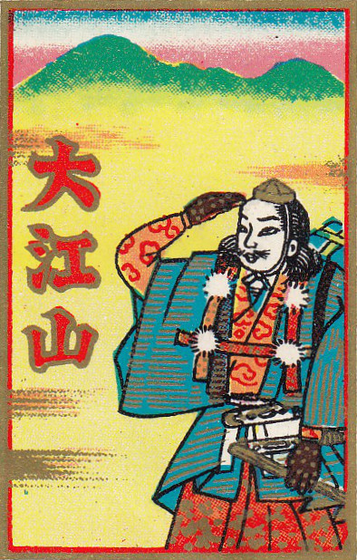
> >
> > <span class="noun" lang="ja-Latn">Ōishi Tengudō</span>’s <span lang="ja-Latn">ōeyama</span> wrapper. The man is wearing the clothing of the [<span class="noun" lang="ja-Latn">Shugendō</span>](https://en.wikipedia.org/wiki/Shugend%C5%8D) sect, which <span class="noun" lang="ja-Latn">Tengu</span> are also depicted as wearing.


> [!multi-wide]
> > [!figure]
> > 
> > 
> >
> > <span class="noun" lang="ja-Latn">Ōishi Tengudō</span>’s Lincoln wrapper.
> 
> > [!figure]
> >
> > 
> >
> > <span class="noun" lang="ja-Latn">Ōishi Tengudō</span>’s <span lang="ja-Latn">atariya</span> wrapper.
> 
> > [!figure]
> > 
> > 
> >
> > <span class="noun" lang="ja-Latn">Ōishi Tengudō</span>’s <span lang="ja-Latn">santengu</span> wrapper.
> 
> > [!figure]
> > 
> > 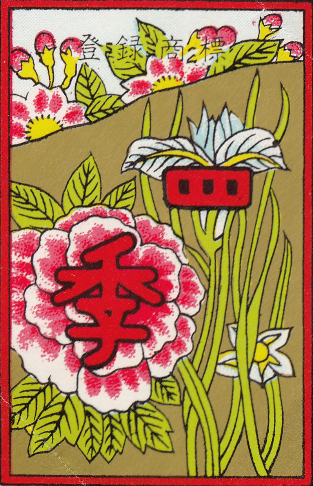
> >
> > <span class="noun" lang="ja-Latn">Ōishi Tengudō</span>’s <span lang="ja-Latn">shiki</span> wrapper.

In addition to the many standard & local patterns of <span class="noun"
lang="ja-Latn">Hanafuda</span> they produce, they also publish some novelty
decks, such as the <strong><span class="noun" lang="ja-Latn">Kyōto Hanafuda</span></strong>:

> [!figure]
>
> 
>
> The <span class="noun" lang="ja-Latn">Kyōto Hanafuda</span>’s 5 Brights, showing icons and landmarks of <span class="noun" lang="ja-Latn">Kyōto</span>. From left to right they represent: a fox with a jewel in its mouth, from the gate of the [<span class="noun" lang="ja-Latn">Fushimi Inari</span> shrine](https://en.wikipedia.org/wiki/Fushimi_Inari-taisha) (<span lang="ja">伏 見稲荷大社</span>); [<span class="noun" lang="ja-Latn">Toyotomi Hideyoshi</span>](https://en.wikipedia.org/wiki/Toyotomi_Hideyoshi) (<span lang="ja">豊臣秀吉</span>), [<span class="noun" lang="ja-Latn">Kita no Mandokoro</span>](https://en.wikipedia.org/wiki/K%C5%8Ddai-in) (<span lang="ja"> 北政所</span>), and [<span class="noun" lang="ja-Latn">Yodogimi</span>](https://en.wikipedia.org/wiki/Yodo-dono) (<span lang="ja">淀君</span>) at [Fushimi Castle](https://en.wikipedia.org/wiki/Fushimi_Castle) (<span lang="ja">伏見城 </span>); the character <span lang="ja">大</span> (<span lang="ja-Latn">dai</span>, ‘large’), which is lit on fire on mount <span class="noun" lang="ja-Latn">Daimonji</span> (<span lang="ja">大文字山</span>) during the festival of [<span class="noun" lang="ja-Latn">Gozan no Okuribi</span>](https://en.wikipedia.org/wiki/Gozan_no_Okuribi) (<span lang="ja">五山送り火</span>, ‘five mountain fire’); the warrior monk [<span class="noun" lang="ja-Latn">Benkei</span>](https://en.wikipedia.org/wiki/Benkei) (<span lang="ja">弁慶</span>) meeting [<span class="noun" lang="ja-Latn">Minamoto no Yoshitsune</span>](https://en.wikipedia.org/wiki/Minamoto_no_Yoshitsune) (<span lang="ja">源義経</span>), who is playing the flute, at <span class="noun" lang="ja-Latn">Gojō</span> bridge (<span lang="ja">五条橋</span>); and the [<span class="noun" lang="ja-Latn">Kyōto Sanga</span>](https://en.wikipedia.org/wiki/Kyoto_Sanga_FC) (<span lang="ja">京 都サンガ</span>) football club, whose logo contains the Chinese/Japanese phoenix that is normally featured on the Paulownia bright card.

In conjunction with <span class="noun" lang="ja-Latn">Ganzo&shy;futo&shy;neko&shy;dō</span> (<span lang="ja">元祖ふとねこ堂</span>), they produced <strong><span class="noun" lang="ja-Latn">Hana&shy;neko&shy;fuda</span></strong> (<span lang="ja">花猫札</span>), featuring Japanese cats:

> [!figure]
>
> 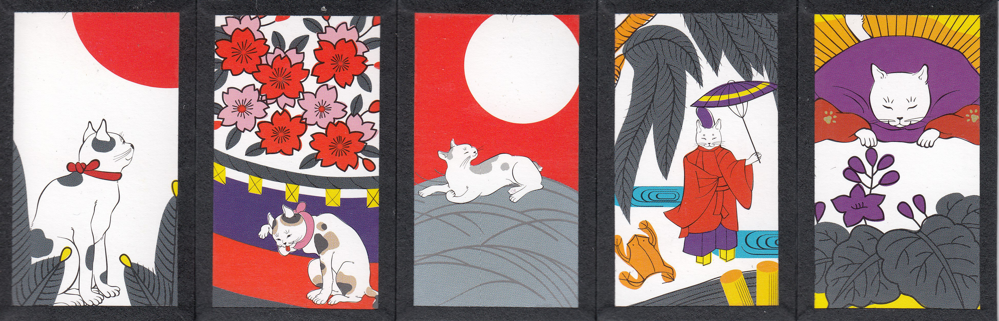

###  <a href="http://www.angelplayingcards.com/product/hana.php">Angel</a> (<span lang="ja">エンゼル</span> <span lang="ja-Latn">enzeru</span>)

> [!multi]
> > [!figure]
> > 
> > 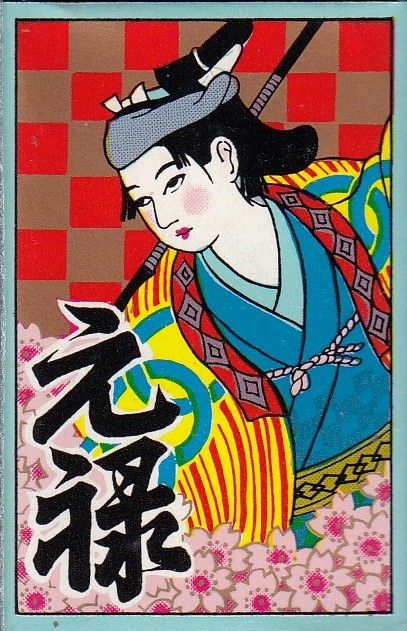
> >
> > Angel’s <span lang="ja-Latn">Genroku</span> packaging (1970s, the current packaging is different).
> 
> > [!figure]
> > 
> > 
> >
> > The <span lang="ja-Latn">Taihei</span> packaging.
> 
> > [!figure]
> > 
> > 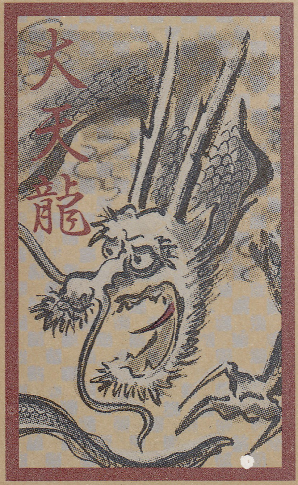
> >
> > The <span lang="ja-Latn">Daitenryū</span> packaging.

Angel was originally named <span class="noun" lang="ja-Latn">Okina Karuta Honpo</span> (<span lang="ja">翁かるた本舗</span>), and was first based in the city of [<span class="noun" lang="ja-Latn">Yōkaichi</span>](https://en.wikipedia.org/wiki/Y%C5%8Dkaichi,_Shiga) (now <span class="noun" lang="ja-Latn">Higashiōmi</span>), <span class="noun" lang="ja-Latn">Shiga</span> prefecture (<span lang="ja">滋賀県八日市市</span>). It is now based in <span class="noun" lang="ja-Latn">Kyōto</span>. They still use the character <span lang="ja">翁 </span> (<span lang="ja-Latn">okina</span>) as their maker’s mark, or otherwise the name Angel is written <span lang="ja">エンゼル</span>. On some cards this is [spelled](https://en.wikipedia.org/wiki/Ateji) <span lang="ja">縁是留</span>.

Angel currently produces <span class="noun" lang="ja-Latn">Hanafuda</span> and <span class="noun" lang="ja-Latn">Kabufuda</span> in two brands:

* <span lang="ja">千鳥</span> (<span lang="ja-Latn">chidori</span> ‘numerous birds’)
* <span lang="ja">元禄</span> (<span lang="ja-Latn">Genroku</span>, an era which spanned 1688–1704)

Other brands produced in the past included:[@ModernJapaneseWrappers p. 45]

* <span lang="ja">玉将</span> (<span lang="ja-Latn">gyokushō</span>, ‘king of the lesser player’, a <span class="noun" lang="ja-Latn">Shōgi</span> term)
* <span lang="ja">翁</span> (<span lang="ja-Latn">okina</span>, ‘old man’, the name of [a special ritual <span class="noun" lang="ja-Latn">Noh</span> play](https://www.the-noh.com/en/plays/data/program_067.html))
* <span lang="ja">泰平</span> (<span lang="ja-Latn">taihei</span>, ‘tranquility’)
* <span lang="ja">纏</span> (<span lang="ja-Latn">matoi</span>, ‘[fireman’s standard](https://en.wikipedia.org/wiki/Matoi)’), also used for <span class="noun" lang="ja-Latn">Kabufuda</span>
* <span lang="ja">旅</span> (<span lang="ja-Latn">tabi</span>, ‘trip’)
* <span lang="ja">大天龍</span> (<span lang="ja-Latn">daitenryū</span> ‘great <span class="noun" lang="ja-Latn">Tenryū</span>’)

Angel also produces cardboard novelty <span class="noun" lang="ja-Latn">hanafuda</span> for
brands like Disney and Hello Kitty, and both <span class="noun" lang="ja-Latn">Hyakunin
Isshu</span> and <span class="noun" lang="ja-Latn">Iroha Karuta</span>.

At one point they produced a Hana-Trump deck with similar construction to that
of <span class="noun" lang="ja-Latn">Nintendō</span>’s (above).

> [!figure]
>
> 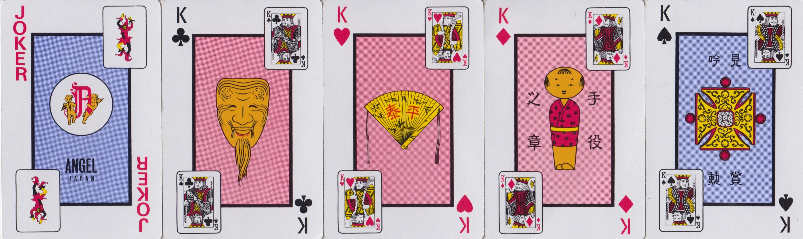
>
> The extra cards of Angel’s “Hana-Trump” deck.

###  <a id="tamura-shogundo" href="http://www.shogundo.co.jp/" class="noun" lang="ja-Latn">Tamura Shōgundō</a> (<span lang="ja">田村将軍堂</span>)

> [!figure]
>
> 
>
> ```yaml
> size: "small"
> noborder: true
> position: "aside"
> license: "cc0"
> ```
>
> The <span lang="ja-Latn">yaguruma</span> is a windmill-like device of arrows arranged in a wheel and allowed to rotate in the wind. They are associated with festivals, particularly the May 5th [<span class="noun" lang="ja-Latn">Tango no Sekku</span>](https://en.wikipedia.org/wiki/Tango_no_sekku) festival, where they are placed on top of tall poles from which [<span lang="ja-Latn">koi</span> streamers](https://en.wikipedia.org/wiki/Koinobori) are flown.


A small manufacturer, founded in 1921. Unlike other manufacturers, their mark is not a standard <span lang="ja-Latn">kanji</span>-shape combination, but instead a stylized depiction of a <span lang="ja-Latn">yaguruma</span> (<span lang="ja"> 矢車</span>, ‘arrow wheel’). They have also published <span class="noun" lang="ja-Latn">Harifuda</span> and <span class="noun" lang="ja-Latn">Shirofuda</span> (blank cards) under the mark <span lang="ja">㊀</span> (circled <span lang="ja">一</span>). They currently produce <span class="noun" lang="ja-Latn">Hyakunin Isshu</span>, <span class="noun" lang="ja-Latn">Manyo Karuta</span>, and <span class="noun" lang="ja-Latn">Hanafuda</span>.


Most of <span class="noun" lang="ja-Latn">Tamura Shōgundō</span>’s cards are produced with
hand-wrapped backing paper; they have [another web page that details their
manufacturing process](http://www5f.biglobe.ne.jp/~karutaya/brand.html).

<span class="noun" lang="ja-Latn">Tamura</span> manufactures two types of <span class="noun"
lang="ja-Latn">Hanafuda</span> cards; firstly the standard pattern, with brands
(these have been maintained since the 1970s):[@ModernJapaneseWrappers p. 39]

* <span lang="ja">紫宸殿</span> (<span lang="ja-Latn">Shishinden</span>, the ceremonial hall of <span class="noun" lang="ja-Latn">Kyōto</span> Imperial Palace)
* <span lang="ja">大将軍</span> (<span lang="ja-Latn">daishōgun</span>, ‘general’), also used for <span class="noun" lang="ja-Latn">Kabu</span>, <span class="noun" lang="ja-Latn">Tehonbiki</span>, <span class="noun" lang="ja-Latn">Shiro</span> (blank) cards
* <span lang="ja">満点</span> (<span lang="ja-Latn">manten</span>, ‘perfect score’), also <span class="noun" lang="ja-Latn">Kabufuda</span>
* <span lang="ja">栄光</span> (<span lang="ja-Latn">eikō</span>, ‘glory’), also <span class="noun" lang="ja-Latn">Kabufuda</span>
* <span lang="ja">京乃錦</span> (<span lang="ja-Latn">Kyō no nishiki</span>, ‘brocade of <span class="noun" lang="ja-Latn">Kyōto</span>’, indicating the autumn leaves)
* <span lang="ja">花くらべ</span> (<span lang="ja-Latn">hana&shy;kurabe</span>, ‘comparing flowers’)
* <span lang="ja">夜櫻</span> (<span lang="ja-Latn">yozakura</span>, ‘evening cherry blossoms’)
* <span lang="ja">春風</span> (<span lang="ja-Latn">harukaze</span>, ‘spring breeze’), also used for <span class="noun" lang="ja-Latn">Kabufuda</span>
* <span lang="ja">花あそび</span> (<span lang="ja-Latn">hanaasobi</span>, ‘flower playing’), no longer in use as of 2019
* <span lang="ja">世界長</span> (<span lang="ja-Latn">sekaichō</span>, ‘world leader’), no longer in use as of 1980
* <span lang="ja">宝玉</span> (<span lang="ja-Latn">hōgyoku</span>, ‘jewel’), no longer in use as of 1980
* <span lang="ja">将軍</span> (<span lang="ja-Latn">shōgun</span>, <span class="noun" lang="ja-Latn">Shogun</span>), used for <span class="noun" lang="ja-Latn">Tehonbiki</span> only
* <span lang="ja">総帥</span> (<span lang="ja-Latn">sōsui</span>, ‘commander-in-chief’, depicting the [Duke of Wellington](https://en.wikipedia.org/wiki/Arthur_Wellesley,_1st_Duke_of_Wellington) (<span lang="ja">ウエリントン</span>)), no longer in use as of 1980

> [!multi-wide]
> > [!figure]
> > 
> > 
> >
> > <span class="noun" lang="ja-Latn">Tamura Shōgundō</span>’s <span lang="ja-Latn">yozakura</span> wrapper. This is an outer-box wrapper designed to contain two decks.
> 
> > [!figure]
> > 
> > 
> >
> > <span class="noun" lang="ja-Latn">Tamura Shōgundō</span>’s <span lang="ja-Latn">harukaze</span> wrapper. This is an outer-boxed wrapper designed to contain two decks; [a wrapper for the individual deck can be seen above](#staticmediaflatwrapper-160054165411jpg).

> [!multi]
> > [!figure]
> > 
> > 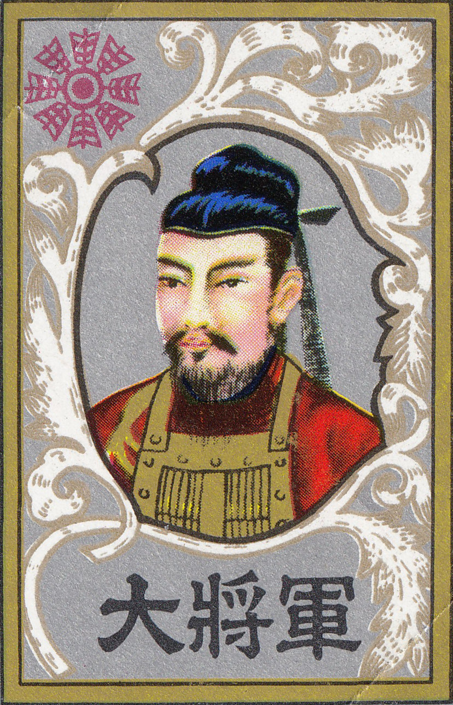
> >
> > <span class="noun" lang="ja-Latn">Tamura Shōgundō</span>’s <span lang="ja-Latn">daishōgun</span> wrapper.
> 
> > [!figure]
> > 
> > 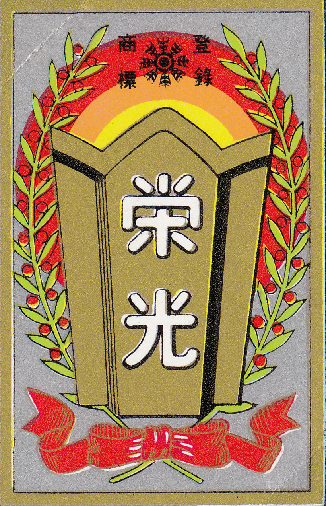
> >
> > <span class="noun" lang="ja-Latn">Tamura Shōgundō</span>’s <span lang="ja-Latn">eikō</span> wrapper.
> 
> > [!figure]
> > 
> > 
> >
> > <span class="noun" lang="ja-Latn">Tamura Shōgundō</span>’s <span lang="ja-Latn">hana&shy;kurabe</span> wrapper.

> [!multi]
> > [!figure]
> > 
> > 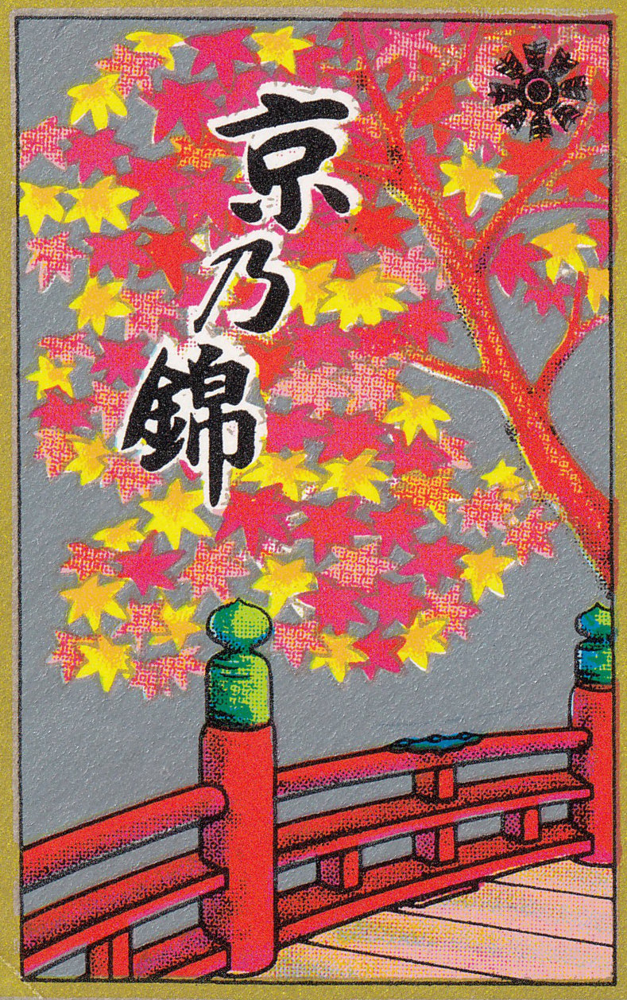
> >
> > <span class="noun" lang="ja-Latn">Tamura Shōgundō</span>’s <span lang="ja-Latn">kyō no nishiki</span> wrapper.
> 
> > [!figure]
> > 
> > 
> >
> > <span class="noun" lang="ja-Latn">Tamura Shōgundō</span>’s <span lang="ja-Latn">manten</span> wrapper.
> 
> > [!figure]
> > 
> > 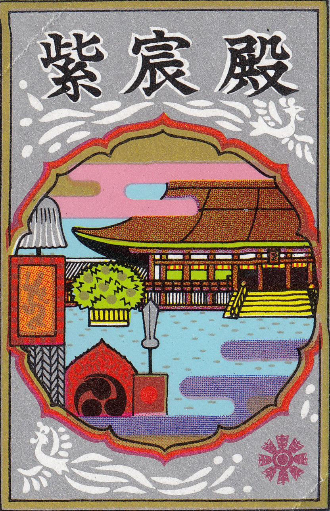
> >
> > <span class="noun" lang="ja-Latn">Tamura Shōgundō</span>’s <span lang="ja-Latn">Shishinden</span> wrapper.

> [!figure]
> 
> 
>
> ```yaml
> size: "small"
> position: "aside"
> ```
>
> <span class="noun" lang="ja-Latn">Tamura Shōgundō</span>’s <span lang="ja-Latn">Kyō maiko</span> brand.

They also print a revised pattern, <span class="noun" lang="ja-Latn">Nishiki</span> (<span lang="ja">錦</span>), which is larger and has a squarer format than standard cards, and is printed with more, bolder colours. This is sold under brands:

* <span lang="ja">京舞妓</span> <span lang="ja-Latn">Kyō maiko</span>, ‘<span class="noun" lang="ja-Latn">Kyōto maiko</span>’ (an apprentice <span lang="ja-Latn">geisha</span>)
* <span lang="ja">祇園茶屋</span> <span lang="ja-Latn">Gion chaya</span>, ‘<span class="noun" lang="ja-Latn">Gion</span> teahouse’ (a district of <span class="noun" lang="ja-Latn">Kyōto</span>)
* <span lang="ja">にしき花かるた</span> <span lang="ja-Latn">Nishiki hana karuta</span>, ‘<span class="noun" lang="ja-Latn">Nishiki</span> flower cards’

> [!figure]
>
> 
>
> The 5 Brights of the <span lang="ja-Latn">Nishiki</span> pattern.


## Extinct Manufacturers

These are producers that do not exist any more.

###  <span class="noun" lang="ja-Latn">Matsui Tengudō</span> (<span lang="ja">松井天狗堂</span>)

> [!figure]
>
> 
>
> ```yaml
> position: "aside"
> originalUrl: "https://commons.wikimedia.org/wiki/File:%E6%9D%BE%E4%BA%95%E5%A4%A9%E7%8B%97%E5%A0%82.jpg"
> copyrightYear: 2017
> author: "Kokoron78"
> license: "cc-by-sa"
> licenseVersion: "4.0"
> ```
>
> The <span class="noun" lang="ja-Latn">Matsui Tengudō</span> store as it appeared in 2017, 7 years after shutting down.

<span class="noun" lang="ja-Latn">Matsui Tengudō</span> was founded in <span class="noun" lang="ja-Latn">Kyōto</span>[^osaka] in 1897 by <span class="noun" lang="ja-Latn">Matsui Shigejiro</span> (<span lang="ja">松井重次郎</span>), and was run by the <span class="noun" lang="ja-Latn">Matsui</span> family for three generations until it closed in 2010 after <span class="noun" lang="ja-Latn">Matsui Shigeo</span> (<span lang="ja">松井重夫 </span>, 1931–2016) retired.[@IwanoMatsui]

[^osaka]: There was also an <span class="noun" lang="ja-Latn">Ōsaka</span>-based <span class="noun" lang="ja-Latn">Matsui Tengudō</span>, started by the younger brother of <span class="noun" lang="ja-Latn">Matsui Shigejiro</span>, which had actually opened before the <span class="noun" lang="ja-Latn">Kyōto</span> branch. It used the same manufacturer’s mark and existed in 1914[@JapaneseBusinessmen1914 p. 219] but closed after the second generation.

<span class="noun" lang="ja-Latn">Matsui Tengudō</span> was the last manufacturer to make cards entirely by hand;[@SalterJapanese] <span class="noun" lang="ja-Latn">Matsui Shigeo</span> had recovered this process in 1976 as a way to distinguish his cards from those being produced by other manufacturers, after a former teacher of his told him to “make something that doesn’t exist anywhere”.[@TewazaNoKioku]

Since closing, <span class="noun" lang="ja-Latn">Matsui Tengudō</span> decks now fetch high prices on Yahoo! Auctions, often selling for several hundred US dollars.

> [!figure]
>
> 
>
> The 5 Bright cards from a deck produced by <span class="noun" lang="ja-Latn">Matsui Shigeo</span> to demonstrate his printing technique (1978). This deck was produced as part of a demonstration for members of the International Playing Card Society.

<span class="noun" lang="ja-Latn">Matsui</span>’s mark was <span lang="ja">松</span> in a
square, and brands included:

* <span lang="ja">鳳凰</span> (<span lang="ja-Latn">hōō</span>, the Japanese phoenix)
* <span lang="ja">龍虎</span> (<span lang="ja-Latn">ryū ko</span>, ‘dragon and tiger’), also used for <span class="noun" lang="ja-Latn">Kabu</span>, <span class="noun" lang="ja-Latn">Tehonbiki</span>, and <span class="noun" lang="ja-Latn">Komaru</span> cards
* <span lang="ja">九一</span> (<span lang="ja-Latn">kuppin</span>, ‘nine and one’, the highest combination in <span class="noun" lang="ja-Latn">Kabufuda</span> games), used for <span class="noun" lang="ja-Latn">Kabu</span> cards only
* <span lang="ja">金龍&#xe0101;</span> (<span lang="ja-Latn">kinryū</span>, ‘gold dragon’), used for <span class="noun" lang="ja-Latn">Komaru</span> cards only
* <span lang="ja">菊華</span> (<span lang="ja-Latn">kikka</span>, ‘chrysanthemum’)
* <span lang="ja">牡丹</span> (<span lang="ja-Latn">botan</span>, ‘peony’)
* <span lang="ja">冨士櫻</span> (<span lang="ja-Latn">fujizakura</span>, ‘<span class="noun" lang="ja-Latn">Fuji</span> cherry blossoms’), also used for <span class="noun" lang="ja-Latn">Kabufuda</span>
* <span lang="ja">三光</span> (<span lang="ja-Latn">sankō</span>, ‘three brights’)

> [!multi]
> > [!figure]
> > 
> > 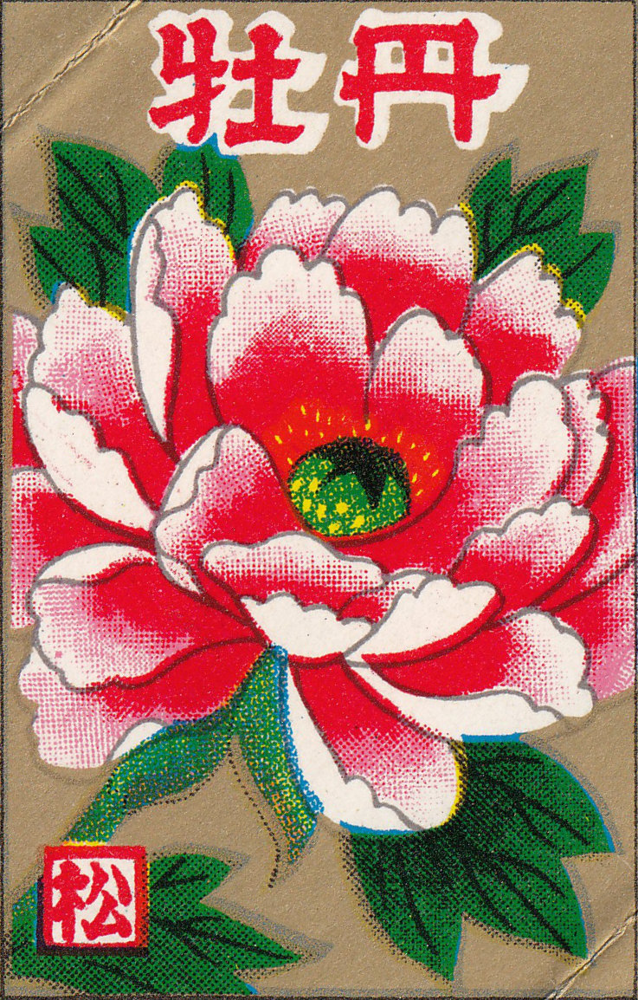
> >
> > The <span lang="ja-Latn">botan</span> wrapper.
> 
> > [!figure]
> >
> > 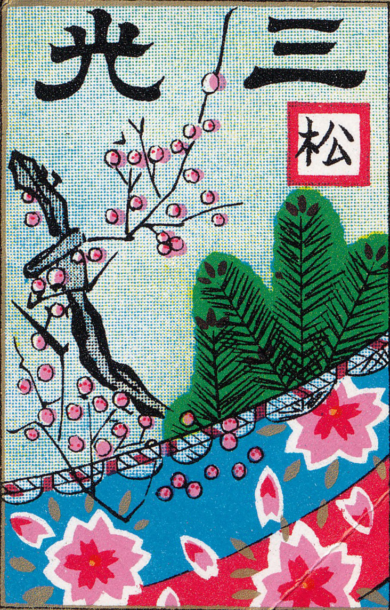
> >
> > The <span lang="ja-Latn">sankō</span> wrapper.
> 
> > [!figure]
> >
> > 
> >
> > The <span lang="ja-Latn">kuppin</span> wrapper.

> [!figure]
> 
> 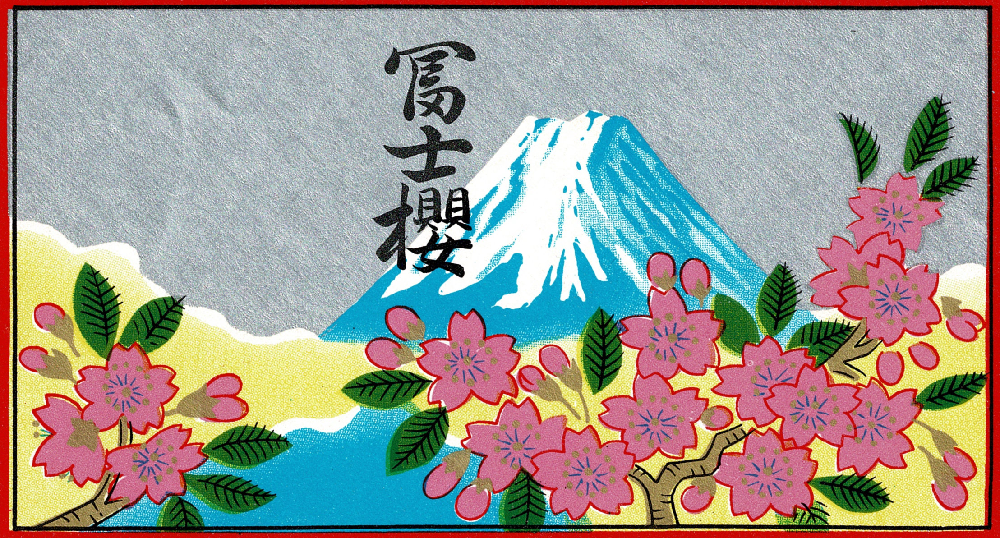
>
> The <span lang="ja-Latn">fujizakura</span> wrapper.


<span class="noun" lang="ja-Latn">Matsui</span> also produced custom extended <span class="noun"
lang="ja-Latn">Hanafuda</span> decks with 13 and 14 months, which can be used to
play games with more people. The 13-month deck features bamboo as the additional
suit, while the 14-month deck has both bamboo and lotus.

> [!figure]
> 
> 
>
> ```yaml
> size: "wide"
> authorFamily: "Mantia"
> authorGiven: "Louie"
> copyrightYear: 2021
> license: "with-permission"
> ```
>
> All the cards from <span class="noun" lang="ja-Latn">Matsui Tengudō</span>’s 13-month deck.


> [!figure]
>
> 
>
> ```yaml
> authorFamily: "Mantia"
> authorGiven: "Louie"
> copyrightYear: 2021
> license: "with-permission"
> ```
>
> The bamboo cards from the 13-month deck. From left-to-right they are: a sixth Bright card featuring the <span lang="ja-Latn">kanji</span> for “tiger” (<span lang="ja">寅</span>), a <span lang="ja-Latn">tane</span> card with a sparrow, a <span lang="ja-Latn">tanzaku</span> card, and a <span lang="ja-Latn">kasu</span> card.

### Ace (<span lang="ja">エース</span> <span lang="ja-Latn">ēsu</span>)

Ace was a manufacturer based in <span class="noun" lang="ja-Latn">Kyōto</span>. Their brands
included:[@ModernJapaneseWrappers p. 44]

* <span lang="ja">大公爵</span> (<span lang="ja-Latn">daikōshaku</span>, ‘grand duke’, also used for <span class="noun" lang="ja-Latn">Kabufuda</span>)
* <span lang="ja">大西郷</span> (<span lang="ja-Latn">daisaigō</span>, ‘great [Saigō](https://en.wikipedia.org/wiki/Saig%C5%8D_Takamori)’)
* <span lang="ja">エース</span> (<span lang="ja-Latn">ēsu</span>, also used for <span class="noun" lang="ja-Latn">Kabufuda</span>)
* <span lang="ja">大提督</span> (<span lang="ja-Latn">daiteitoku</span>, ‘grand admiral’, featuring a picture of [Horatio Nelson](https://en.wikipedia.org/wiki/Horatio_Nelson,_1st_Viscount_Nelson))
* <span lang="ja">大勝利</span> (<span lang="ja-Latn">daishōri</span>, ‘huge win’, featuring a picture of [Tōgō Heihachirō](https://en.wikipedia.org/wiki/T%C5%8Dg%C5%8D_Heihachir%C5%8D))
* <span lang="ja">紅葉</span> (<span lang="ja-Latn">momiji</span>, ‘autumn leaves’)
* <span lang="ja">源氏</span> (<span lang="ja-Latn">genji</span>, ‘[<span class="noun" lang="ja-Latn">Genji</span>](https://en.wikipedia.org/wiki/Hikaru_Genji)’)
* <span lang="ja">金鶏</span> (<span lang="ja-Latn">kinkei</span>, ‘golden pheasant’)
* <span lang="ja">日本光</span> (<span lang="ja-Latn">nihon hikari</span>, ‘light (of) Japan’, i.e. <span class="noun" lang="ja-Latn">Fuji</span>)
* <span lang="ja">祇園桜</span> (<span lang="ja-Latn">gionzakura</span>, ‘<span class="noun" lang="ja-Latn">Gion</span> cherries’)
* <span lang="ja">聖徳太子</span> (<span lang="ja-Latn">Shōtoku Taishi</span>, ‘[Prince <span class="noun" lang="ja-Latn">Shōtoku</span>](https://en.wikipedia.org/wiki/Prince_Sh%C5%8Dtoku)’)
* <span lang="ja">白梅</span> (<span lang="ja-Latn">hakubai</span>, ‘white plum’)

They also made two all-plastic <span class="noun" lang="ja-Latn">Hanafuda</span> decks: <span
lang="ja">金花</span> (<span lang="ja-Latn">kin-hana</span> ‘gold flowers’) and
<span lang="ja">銀花</span> (<span lang="ja-Latn">gin-hana</span> ‘silver
flowers’).

> [!multi]
> > [!figure]
> > 
> > 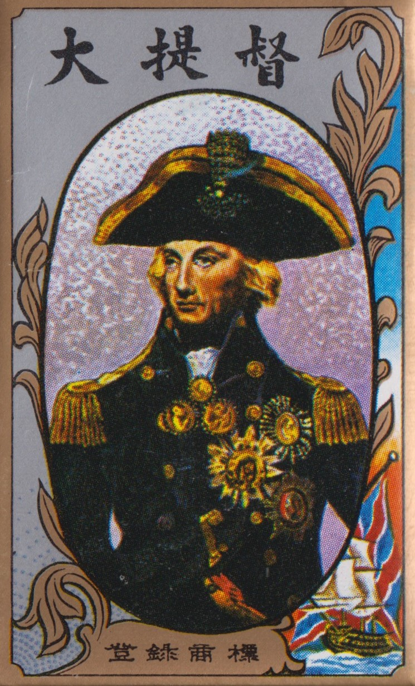
> >
> > Packaging of Ace’s <span class="noun" lang="ja-Latn">Dai Teitoku</span> brand, featuring Lord Nelson.
> 
> > [!figure]
> > 
> > 
> >
> > Packaging of Ace’s <span class="noun" lang="ja-Latn">Dai Kōshaku</span> brand; this is from a <span class="noun" lang="ja-Latn">Kurofuda deck</span>.
> 
> > [!figure]
> >
> > 
> >
> > Packaging of Ace’s <span class="noun" lang="ja-Latn">Dai Saigō</span> brand.

###  <span class="noun" lang="ja-Latn">Maruē</span> (<span lang="ja">マルエー</span>)

<span class="noun" lang="ja-Latn">Maruē</span> was from the city of [<span class="noun"
lang="ja-Latn">Mino</span>](https://en.wikipedia.org/wiki/Mino,_Gifu), in <span class="noun"
lang="ja-Latn">Gifu</span> prefecture (<span lang="ja">岐阜県美濃市</span>).
Their manufacturer’s mark was a circled <span lang="ja">英</span> (<span
lang="ja-Latn">ē</span>), i.e. <span lang="ja-Latn">maru-ē</span>. However,
<span lang="ja">英</span> has the meaning of ‘flower’ and can also be read with
the same pronunciation as <span lang="ja">花</span> <span
lang="ja-Latn">hana</span>, making this mark very punny.

> [!multi-wide]
> > [!figure]
> >
> > 
> >
> > Packaging for <span class="noun" lang="ja-Latn">Maruē</span>’s <span class="noun" lang="ja-Latn">Goten Sakura</span> brand (1970s).
> 
> > [!figure]
> >
> > 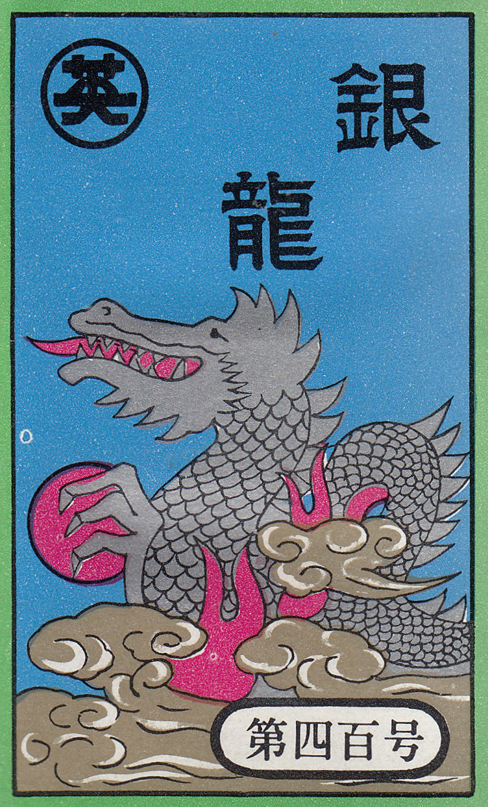
> >
> > Wrapper for the <span class="noun" lang="ja-Latn">Ginryū</span> brand.
> 
> > [!figure]
> > 
> > 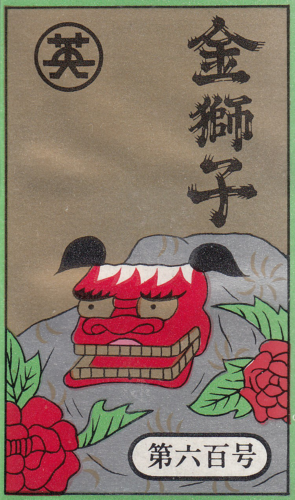
> >
> > Wrapper for the <span class="noun" lang="ja-Latn">Kinjishi</span> brand.
> 
> > [!figure]
> > 
> > 
> >
> > Wrapper for the <span class="noun" lang="ja-Latn">Kinryū</span> brand.

> [!multi]
> > [!figure]
> >
> > 
> >
> > Box for the <span class="noun" lang="ja-Latn">Ginryū</span> brand.
> 
> > [!figure]
> > 
> > 
> >
> > Box for the <span class="noun" lang="ja-Latn">Kinryū</span> brand.

> [!figure]
> 
> 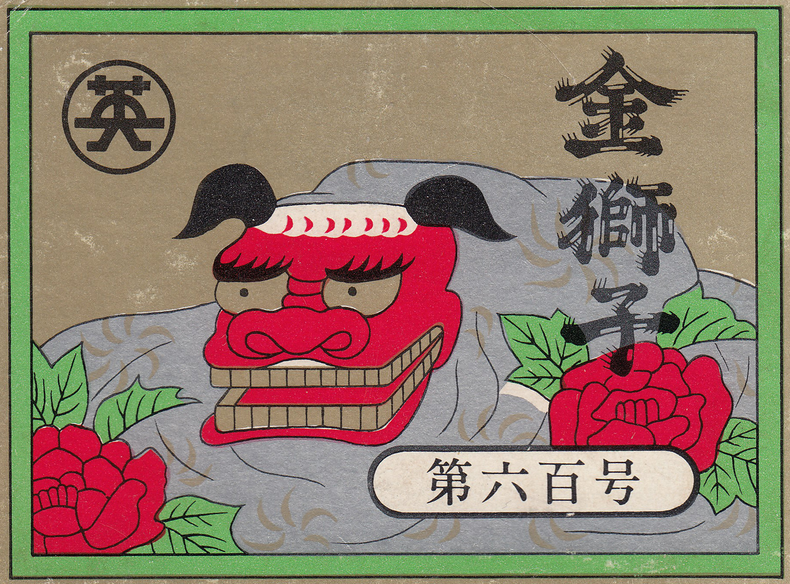
>
> ```yaml
> size: "small"
> ```
>
> Box for the <span class="noun" lang="ja-Latn">Kinjishi</span> brand.


Brands produced by <span class="noun" lang="ja-Latn">Maruē</span> included:[@ModernJapaneseWrappers p. 52]

* <span lang="ja">東洋一</span> (<span lang="ja-Latn">tōyōichi</span>, ‘best in the East’), also used for <span class="noun" lang="ja-Latn">Kabufuda</span>
* <span lang="ja">金獅子</span> (<span lang="ja-Latn">kinjishi</span>, ‘gold lion’), also used for <span class="noun" lang="ja-Latn">Kabufuda</span> and <span class="noun" lang="ja-Latn">Tehonbiki</span> cards
* <span lang="ja">金龍</span> (<span lang="ja-Latn">kinryū</span>, ‘gold dragon’)
* <span lang="ja">銀龍</span> (<span lang="ja-Latn">ginryū</span>, ‘silver dragon’), also used for <span class="noun" lang="ja-Latn">Kabufuda</span>
* <span lang="ja">御殿櫻</span> (<span lang="ja-Latn">gotenzakura</span>, ‘palace cherry blossoms’)
* <span lang="ja">夜櫻</span> (<span lang="ja-Latn">yoruzakura</span> ‘evening cherry blossoms’)
* <span lang="ja">梅の花</span> (<span lang="ja-Latn">ume no hana</span> ‘plum flowers’)
* <span lang="ja">秀吉</span> (<span lang="ja-Latn">hideyoshi</span> ‘Hideyoshi’)

###  <span class="noun" lang="ja-Latn" id="tanaka-gyokusuido">Tanaka Gyokusuidō</span> (<span lang="ja">田中玉水堂</span>)

> [!figure]
>
> 
>
> ```yaml
> noborder: true
> size: "small"
> position: "aside"
> license: "cc0"
> ```
>
> <span class="noun" lang="ja-Latn">Tanaka Gyokusuidō</span>’s trademark, registered on the 16th of October 1893 by <span class="noun" lang="ja-Latn">Tanaka Heibe</span> (<span lang="ja">田中平兵衛</span>).[@Trademarks1905 p. 65]

<span class="noun" lang="ja-Latn">Tanaka Gyokusuidō</span> was founded around 1893, and
existed in <span class="noun" lang="ja-Latn">Kyōto</span> through 1914 (when it was run by
<span class="noun" lang="ja-Latn">Tanaka Haru</span> <span lang="ja">田中ハル
</span>),[@JapaneseBusinessmen1914 p. 151] and 1948,[@Yamaguchi p. 102] but had
stopped producing in the early 1960s.[@ModernJapaneseWrappers p. 33] Their
brands (including <span class="noun" lang="ja-Latn">Fukusuke</span> and <span class="noun"
lang="ja-Latn">Ginsuehiro</span>) and manufacturer’s mark were taken over by
<span class="noun" lang="ja-Latn">Iwata Honten</span>.[@ModernJapaneseWrappers pp. 48–59]

> [!figure]
> 
> 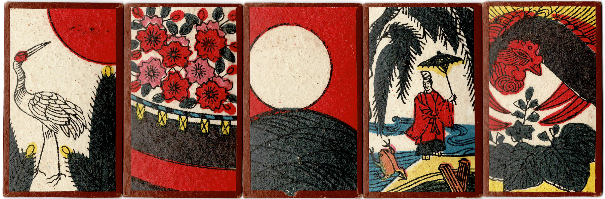
>
> ```yaml
> noborder: true
> ```
>
> Five Brights from a <span class="noun" lang="ja-Latn">Tanaka Gyokusuidō</span> deck.

> [!figure]
> 
> 
>
> ```yaml
> position: "aside"
> size: "small"
> ```
>
> <span class="noun" lang="ja-Latn">Tanaka Gyokusuidō</span>’s maker’s mark.

Their maker’s mark was <span lang="ja">田</span> with corner on top, and brands
included:

* <span lang="ja">福助</span> (<span lang="ja-Latn">fukusuke</span>, a [large-headed good luck doll](https://en.wikipedia.org/wiki/Fukusuke))
* <span lang="ja">銀末廣</span>/<span lang="ja">銀末広</span> (<span lang="ja-Latn">ginsuehiro</span> ‘silver fan’)
* <span lang="ja">末廣</span> (<span lang="ja-Latn">suehiro</span> ‘fan’)
* <span lang="ja">大帝王</span> (<span lang="ja-Latn">daiteiō</span> ‘great emperor’)
* <span lang="ja">春</span> (<span lang="ja-Latn">haru</span>, ‘spring’)
* <span lang="ja">横綱</span> (<span lang="ja-Latn">yokozuna</span>, the highest rank in <span lang="ja-Latn">sumo</span>)
* <span lang="ja">大関</span> (<span lang="ja-Latn">ōzeki</span>, the second-highest <span lang="ja-Latn">sumo</span> rank)
* <span lang="ja">高徳</span> (<span lang="ja-Latn">Takanori</span>, <span class="noun" lang="ja-Latn">Takanori Kojima</span>, a warrior famous for inscribing a poem of loyalty to the emperor onto a cherry tree)
* <span lang="ja">花扇</span> (<span lang="ja-Latn">hanaōgi</span>, ‘flower fan’)
* <span lang="ja">金剛</span> (<span lang="ja-Latn">kongō</span>, a mythical indestructible substance)
* <span lang="ja">よろしい</span> (<span lang="ja-Latn">yoroshii</span>, ‘all right’), trademarked in 1947
* <span lang="ja">達磨</span> (<span lang="ja-Latn">daruma</span>, Daruma)
* <span lang="ja">黄</span> (<span lang="ja-Latn">ki</span>, ‘yellow’)
* <span lang="ja">白</span> (<span lang="ja-Latn">shiro</span>, ‘white’)
* <span lang="ja">小判</span> (<span lang="ja-Latn">koban</span>, a large coin)

> [!multi]
> > [!figure]
> >
> > 
> >
> > ```yaml
> > license: "cc0"
> > ```
> >
> > <span class="noun" lang="ja-Latn">Tanaka Gyokusuidō</span>’s <span lang="ja-Latn">fukusuke</span> brand.
> 
> > [!figure]
> >
> > 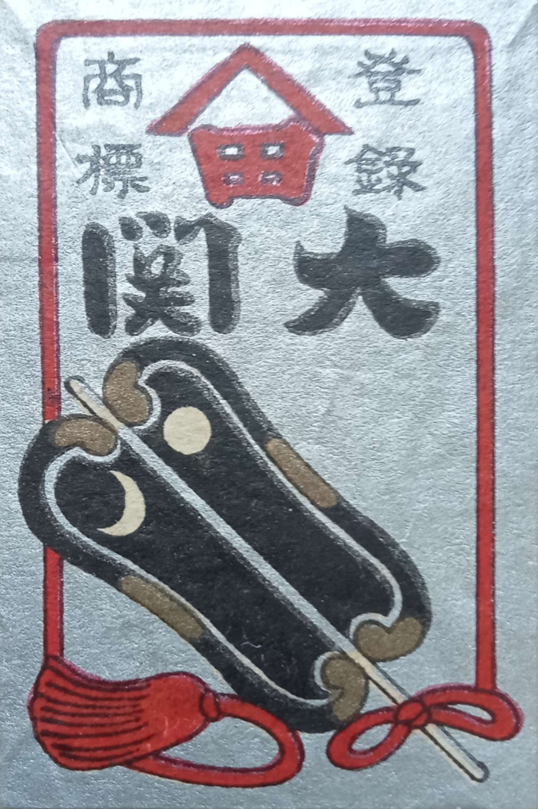
> >
> > ```yaml
> > license: "cc0"
> > ```
> >
> > <span class="noun" lang="ja-Latn">Tanaka Gyokusuidō</span>’s <span lang="ja-Latn">ōzeki</span> brand.
> 
> > [!figure]
> >
> > 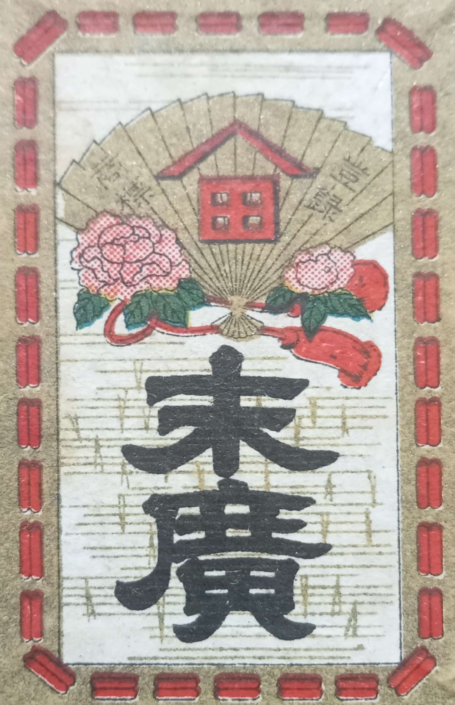
> >
> > ```yaml
> > license: "cc0"
> > ```
> >
> > <span class="noun" lang="ja-Latn">Tanaka Gyokusuidō</span>’s <span lang="ja-Latn">suehiro</span> brand.

### <span class="noun" lang="ja-Latn">Iwata Honten</span> (<span lang="ja">岩田本店</span>)

> [!figure]
>
> 
>
> ```yaml
> noborder: true
> size: "small"
> position: "aside"
> license: "cc0"
> ```
>
> <span class="noun" lang="ja-Latn">Iwata Honten</span>’s trademark, registered on the 27th of February 1918 by <span class="noun" lang="ja-Latn">Iwata Yoshinosuke</span> (<span lang="ja"> 岩田芳之助</span>).[@Trademarks1924_11 p. 330]

<span class="noun" lang="ja-Latn">Iwata</span> was founded around 1918. They did not make
their own cards but had them made by other manufacturers, including <span class="noun"
lang="ja-Latn">Tamura Shōgundō</span>, <span class="noun" lang="ja-Latn">Nintendō</span>, and
<span class="noun" lang="ja-Latn">Nihon Karuta</span>. Their mark was <span lang="ja">や
</span> in a fan shape.

Brands included:[@ModernJapaneseWrappers p. 48]

* <span lang="ja">福助</span> (<span lang="ja-Latn">fukusuke</span>, a [large-headed good luck doll](https://en.wikipedia.org/wiki/Fukusuke))
* <span lang="ja">銀末廣</span>/<span lang="ja">銀末広</span> (<span lang="ja-Latn">ginsuehiro</span> ‘silver fan’)
* <span lang="ja">小判</span> (<span lang="ja-Latn">koban</span>, a [type of coin](https://en.wikipedia.org/wiki/Koban_(coin))), manufactured by <span class="noun" lang="ja-Latn">Nintendō</span>
* <span lang="ja">雪月花</span> (<span lang="ja-Latn">setsugetsubana </span> ‘snow, moon, and flowers’), manufactured by <span class="noun" lang="ja-Latn">Nintendō</span>
* <span lang="ja">般若</span> (<span lang="ja-Latn">hannya</span>, a <span lang="ja-Latn">noh</span> mask representing a horned female demon), manufactured by <span class="noun" lang="ja-Latn">Nihon Karuta</span>
* <span lang="ja">金舞扇</span> (<span lang="ja-Latn">kinmaiōgi</span>, ‘gold dancer’s fan’), (probably) manufactured by <span class="noun" lang="ja-Latn">Nihon Karuta</span>
* <span lang="ja">銀舞扇</span> (<span lang="ja-Latn">ginmaiōgi</span>, ‘silver dancer’s fan’), (probably) manufactured by <span class="noun" lang="ja-Latn">Nihon Karuta</span>

> [!multi]
> > [!figure]
> > 
> > 
> >
> > The <span lang="ja-Latn">kinmaiōgi</span> wrapper.
> 
> > [!figure]
> > 
> > 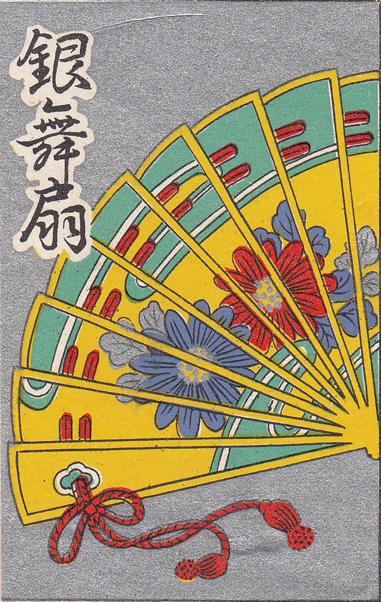
> >
> > The <span lang="ja-Latn">ginmaiōgi</span> wrapper.
> 
> > [!figure]
> > 
> > 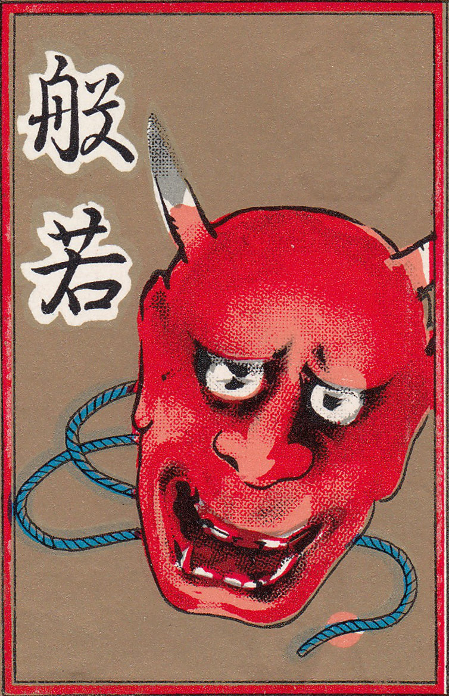
> >
> > The <span lang="ja-Latn">hannya</span> wrapper.

###  <span class="noun" lang="ja-Latn">Nihon Karuta Seizō</span>  (<span lang="ja">日本骨牌製造</span>)/<span class="noun" lang="ja-Latn">Tamada Fukushōdō</span> (<span lang="ja">玉田福勝堂</span>)

> [!figure]
>
> 
>
> ```yaml
> position: "aside"
> orgName: "British Museum"
> license: "cc-by-nc-sa"
> licenseVersion: "4.0"
> originalUrl: "https://www.britishmuseum.org/collection/object/A_1896-0501-876"
> ```
>
> A <span class="noun" lang="ja-Latn">Tamada Fukushōdō</span> box depicting a storefront, from the collection of Lady Charlotte Schreiber, bequeathed to the British Museum in 1895. (This deck is briefly described in @SchreiberCollection [p. 184], under ‘Japanese #2’.)

> [!figure]
> 
> 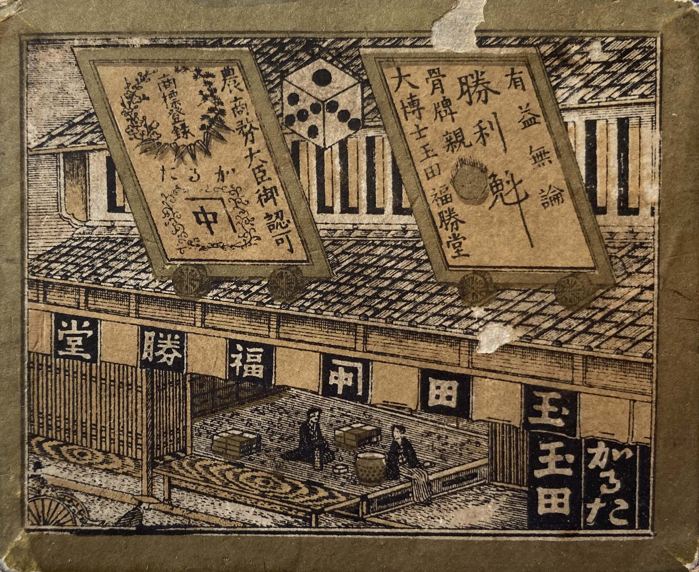
>
> ```yaml
> position: "aside"
> license: "cc0"
> ```
>
> Another version of the storefront box, from the <abbr title="Worshipful Company of Playing Card Makers">WCPCM</abbr> collection.


> [!figure]
>
> 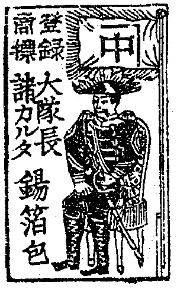
> 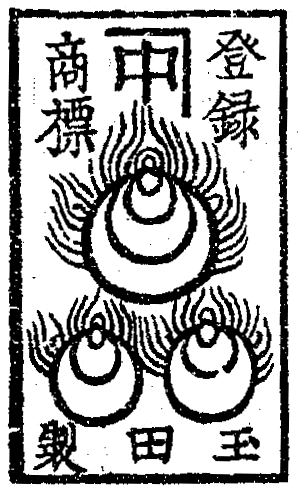
>
> ```yaml
> noborder: true
> position: "aside"
> license: "cc0"
> ```
>
> Some early <span class="noun" lang="ja-Latn">Tamada</span> trademarks, registered in 1899 by <span class="noun" lang="ja-Latn">Tamada Yasunosuke</span> (<span lang="ja">玉田安之助 </span>).[@Trademarks1905 p. 66]

> [!figure]
>
> 
> 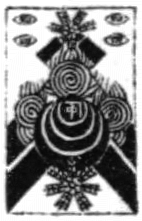
>
> ```yaml
> noborder: true
> position: "aside"
> license: "cc0"
> ```
>
> Earliest <span class="noun" lang="ja-Latn">Nihon Karuta</span> trademarks, registered in 1915.[@Trademarks1924_8 p. 295]

The mark of both of these companies was <span lang="ja">中</span> with corner at
top-right.

<span class="noun" lang="ja-Latn">Nihon Karuta</span> claimed to have been founded in
1806.[@TewazaNoKioku] It is hard to prove this, but an earlier company named
<span class="noun" lang="ja-Latn">Tamada Fukushōdō</span> that used the same manufacturer’s
mark had definitely existed in <span class="noun" lang="ja-Latn">Kyōto</span> since before
1895 (see image). It is unclear precisely what the relationship was between the
two companies, but <span class="noun" lang="ja-Latn">Nihon Karuta</span> advertised their
decks as being in the “<span class="noun" lang="ja-Latn">Tamada</span> style” (<span
lang="ja">玉田式</span>), and certainly the patterns they printed were very
similar. <span class="noun" lang="ja-Latn">Nihon Karuta</span> decks also often have the
<span class="noun" lang="ja-Latn">Tamada</span> name printed on their branding cards. A safe
guess would be that <span class="noun" lang="ja-Latn">Nihon Karuta</span> was a rebranding or
expansion of the original <span class="noun" lang="ja-Latn">Tamada Fukushōdō</span> name,
either to reflect the scope of a larger company or to project its ambitions.

<span class="noun" lang="ja-Latn">Nihon Karuta</span> itself seems to have been founded in
1915, as this is when its earliest trademark registrations
appear.[@Trademarks1924_8 p. 295] Other records show that it existed in
1916[@JapaneseBusinessmen1916 p. 135], 1948[@Yamaguchi p. 102] and through to at
least the early 1980s.[@ModernJapaneseWrappers p. 54]

Brands of both companies have included:[@ModernJapaneseWrappers pp. 54–5]

* <span lang="ja">花の王</span> (<span lang="ja-Latn">hana no ō</span>, ‘queen of flowers’, the [Cattleya](https://en.wikipedia.org/wiki/Cattleya))
* <span lang="ja">七福神</span> (<span lang="ja-Latn">shichi fukujin</span>, the [Seven Lucky Gods](https://en.wikipedia.org/wiki/Seven_Lucky_Gods))
* <span lang="ja">大隊長</span> (<span lang="ja-Latn">daitaichō</span>, ‘battalion commander’)
* <span lang="ja">ふじ</span> (<span lang="ja-Latn">fuji</span>, ‘<span class="noun" lang="ja-Latn">Fuji</span>’)
* <span lang="ja">四光</span> (<span lang="ja-Latn">shikō</span>, ‘four brights’)
* <span lang="ja">金の仲</span> (<span lang="ja-Latn">kane no naka</span>, ‘golden relationship’, a reference to the trademark pronounced <span lang="ja-Latn">kane-naka</span>), trademarked by NK in 1919 [@Trademarks1924_14 p. 242]
* <span lang="ja">百万弗</span> (<span lang="ja-Latn">hyakumandoru</span>, ‘a million dollars’)
* <span lang="ja">天狗</span> (<span lang="ja-Latn">tengu</span>, Tengu)
* <span lang="ja">万両</span> (<span lang="ja-Latn">manryū</span>, ‘10&thinsp;000 coins’), trademarked by NK in 1919 [@Trademarks1924_14 p. 242]
* <span lang="ja">千両</span> (<span lang="ja-Latn">senryū</span>, ‘1000 coins’)
* <span lang="ja">九重櫻</span>/<span lang="ja">九重さくら</span> (<span lang="ja-Latn">kokonoezakura</span>, ‘<span class="noun" lang="ja-Latn">Kokonoe</span> cherry blossoms’)
* <span lang="ja">梅印</span> (<span lang="ja-Latn">umejirushi</span> ‘plum brand’)
* <span lang="ja">金富士</span> (<span lang="ja-Latn">kinfuji</span> ‘gold <span class="noun" lang="ja-Latn">Fuji</span>’)
* <span lang="ja">御所車</span> (<span lang="ja-Latn">goshoguruma</span> ‘ox-drawn coach’)
* <span lang="ja">金鷲</span> (<span lang="ja-Latn">kinshū</span> ‘golden eagle’)
* <span lang="ja">雲龍</span> (<span lang="ja-Latn">unryū</span> ‘cloud dragon’), trademarked by NK in 1919 [@Trademarks1924_14 p. 241]
* <span lang="ja">金龍</span> (<span lang="ja-Latn">kinryū</span> ‘golden dragon’), trademarked by NK in 1919 [@Trademarks1924_14 p. 242]
* <span lang="ja">金世界</span> (<span lang="ja-Latn">kinsekai</span>, ‘gold world’), trademarked by NK in 1919 [@Trademarks1924_14 p. 242]
* <span lang="ja">大入</span> (<span lang="ja-Latn">ōiri</span>, ‘full house’, a theatre term), trademarked by NK in 1919 [@Trademarks1924_14 p. 242]
* <span lang="ja">東錦</span> (<span lang="ja-Latn">higashinishiki</span>, ‘eastern brocade’), trademarked by NK in 1919 [@Trademarks1924_14 p. 242]
* <span lang="ja">萬國一</span>/<span lang="ja">万国一</span> (<span lang="ja-Latn">bankokuichi</span>, ‘best in the world’), trademarked by NK in 1919 [@Trademarks1924_14 p. 242]
* <span lang="ja">のお正月</span> (<span lang="ja-Latn">[nihon karuta] no oshōgatsu</span>, ‘<span class="noun" lang="ja-Latn">Nihon Karuta</span>’s new year’)

> [!multi]
> > [!figure]
> > 
> > 
> >
> > <span class="noun" lang="ja-Latn">Tamada Fukushōdō</span>’s <span lang="ja-Latn">higashinishiki</span> box.
> 
> > [!figure]
> >
> > 
> >
> > <span class="noun" lang="ja-Latn">Nihon Karuta</span>’s <span lang="ja-Latn">higashinishiki</span> box.

> [!figure]
>
> 
>
> The <span lang="ja-Latn">kane no naka</span> box.


> [!multi]
> > [!figure]
> > 
> > 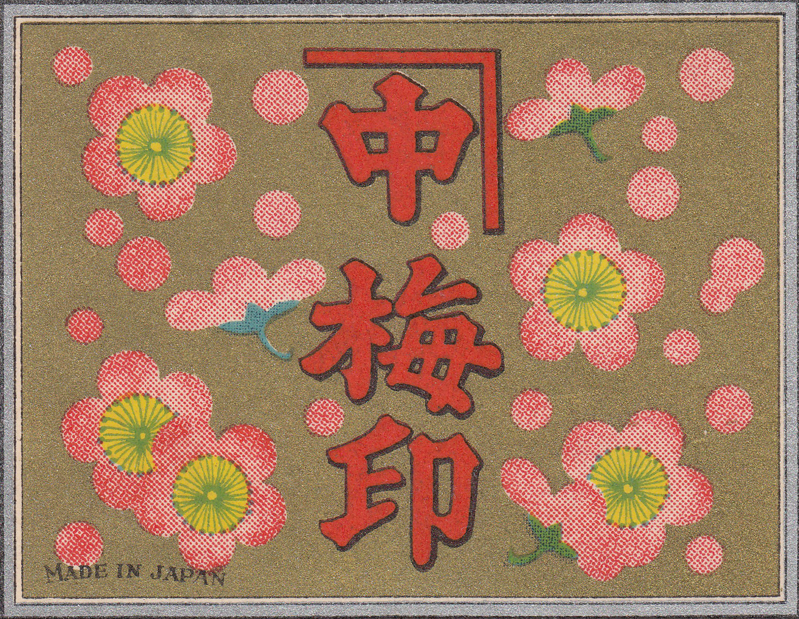
> >
> > The <span lang="ja-Latn">umejirushi</span> box.
> 
> > [!figure]
> > 
> > 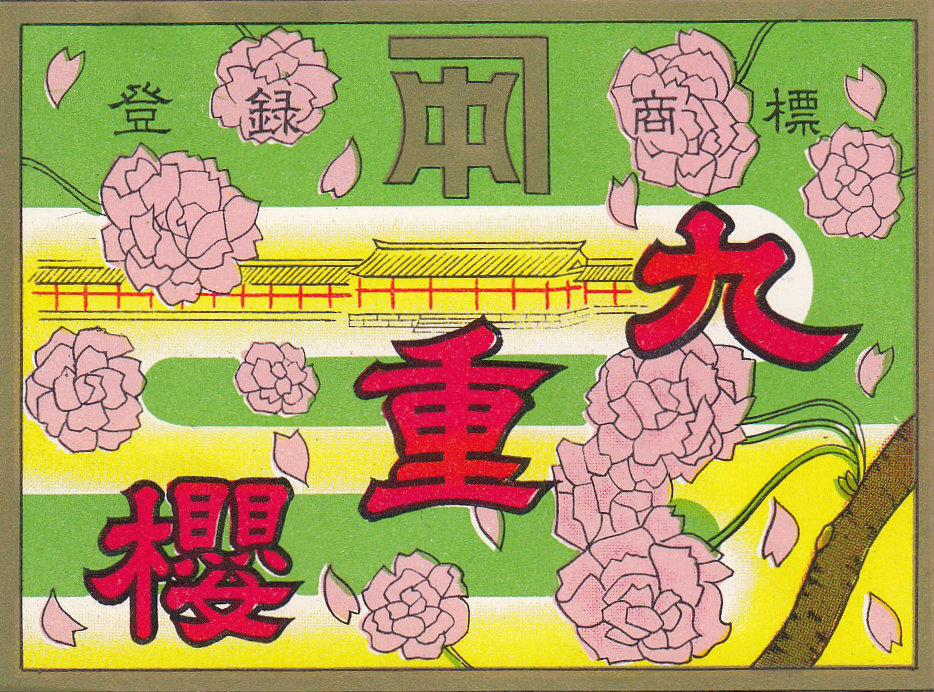
> >
> > <span class="noun" lang="ja-Latn">Nihon Karuta</span>’s <span lang="ja-Latn">kokonoezakura</span> box.
 
> [!multi-wide]
> > [!figure]
> > 
> > 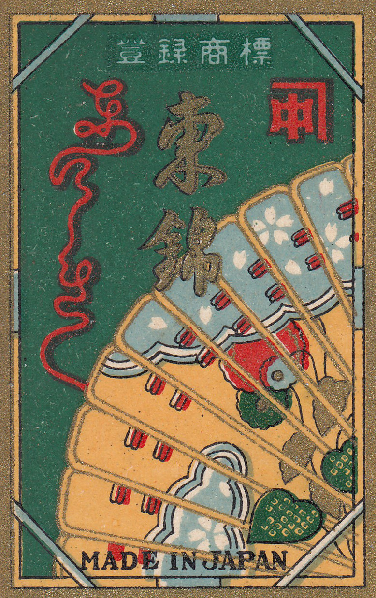
> >
> > The inner <span lang="ja-Latn">higashinishiki</span> wrapper, for a single deck.
> 
> > [!figure]
> >
> > 
> >
> > ```yaml
> > authorFamily: "琴比"
> > authorGiven: "良哲"
> > authorFamilyFirst: true
> > authorLang: "ja"
> > license: "with-permission"
> > copyrightYear: 2021  
> > ```
> >
> > The <span lang="ja-Latn">fuji</span> wrapper.
> 
> > [!figure]
> >
> > 
> >
> > The <span lang="ja-Latn">kinfuji</span> wrapper.
> 
> > [!figure]
> > 
> > 
> >
> > The <span lang="ja-Latn">hyakuman&shy;doru</span> wrapper.
> 
> > [!figure]
> >
> > 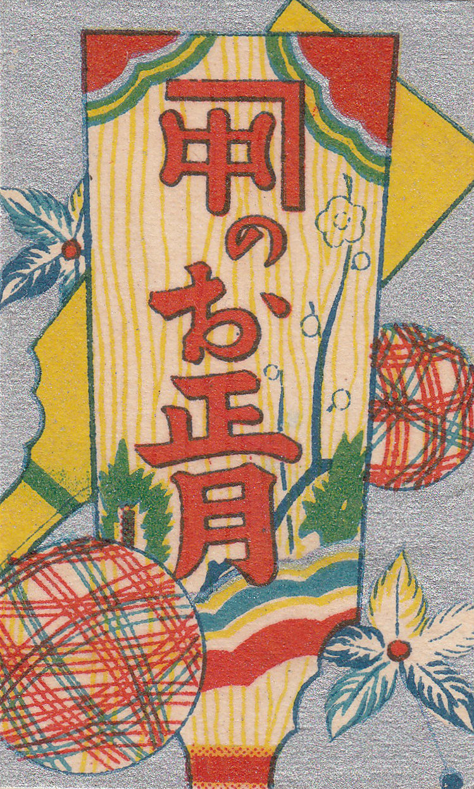
> >
> > The <span lang="ja-Latn">oshōgatsu</span> wrapper.

<span class="noun" lang="ja-Latn">Nihon Karuta</span>’s standard pattern was a variation on
the <span class="noun" lang="ja-Latn">Hachi&shy;hachi&shy;bana</span> which included more
detailing in the form of fine blue lines. The standout feature was the full moon
card, which featured a [rabbit pounding <span
lang="ja-Latn">mochi</span>](https://en.wikipedia.org/wiki/Moon_rabbit) in the
moon:

> [!figure]
>
> 
>
> The bright cards of <span class="noun" lang="ja-Latn">Nihon Karuta</span>’s special pattern.


Under the brand name of “Wind Mill”, <span class="noun" lang="ja-Latn">Nihon Karuta</span>
have also produced Western-style playing cards, including their own Hana-Trump
deck:

> [!figure]
> 
> 
>
> The bright cards of <span class="noun" lang="ja-Latn">Nihon Karuta</span>’s Hana-Trump deck. These are obviously based on the much older [Universal](#universal) <span class="noun" lang="ja-Latn">Trump-Hana</span> deck.


> [!figure]
> 
> 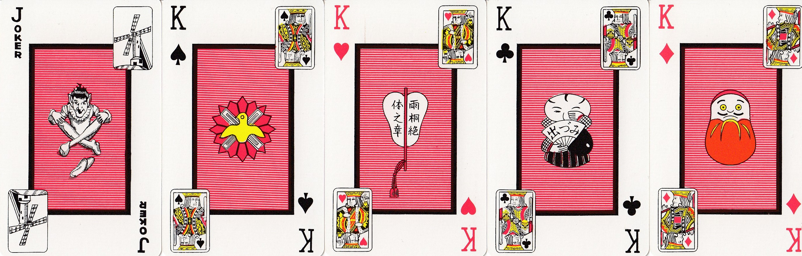
>
> The extra [Hachi-Hachi](games/hachi-hachi/hachi-hachi.md)-related cards of <span class="noun" lang="ja-Latn">Nihon Karuta</span>’s Hana-Trump deck. There is a windmill depicted in the corners of the Joker card.

###  <span class="noun" lang="ja-Latn">Yamashiro Shōten</span> (<span lang="ja">山城商店</span>)

> [!figure]
> 
> 
> 
> 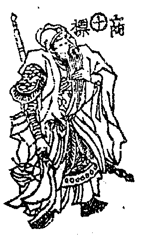
>
> ```yaml
> noborder: true
> position: "aside"
> license: "cc0"
> ```
>
> Some of <span class="noun" lang="ja-Latn">Yamashiro</span>’s trademarks, registered in 1901 & 1902 by <span class="noun" lang="ja-Latn">Yamashiro Yosaburō</span> (<span lang="ja">山城與三郎</span>).[@Trademarks1905 p. 66]


A <span class="noun" lang="ja-Latn">Kyōto</span> manufacturer that existed from at least 1901 through 1948,[@Yamaguchi p. 102] but stopped producing in 1962.[@ModernJapaneseWrappers p. 33] Their manfufacturer’s mark was <span lang="ja">㊉</span> (circled <span lang="ja">十</span>). The founder was <span lang="ja">山城與三郎</span> <span class="noun" lang="ja-Latn">Yamashiro Yosaburō</span>, which was sometimes abbreviated to <span lang="ja">山與</span> <span class="noun" lang="ja-Latn">Yamayo</span> on printed cards.

In addition to <span lang="ja-Latn" class="noun">Hanafuda</span> cards, they also produced <span lang="ja-Latn" class="noun">Kabufuda</span> and <span lang="ja-Latn" class="noun">Mekuri</span> cards.

Their brands included:

* <span lang="ja">金坊主</span> (<span lang="ja-Latn">kinbōzu</span>, ‘gold
  baldy’, ‘baldy’ being a nickname for a priest)
* <span lang="ja">関羽</span> (<span lang="ja-Latn">kan’u</span>, [<span class="noun"
  lang="cmn-Latn-pinyin">Guan Yu</span>](https://en.wikipedia.org/wiki/Guan_Yu)),
  trademarked in 1901[@Trademarks1905 p. 67]
* <span lang="ja">九紋竜</span> (<span lang="ja-Latn">kumonryū</span>,
  ‘nine-tattoo dragon’, a nickname for [<span class="noun" lang="cmn-Latn-pinyin">Shi
  Jin</span>](https://en.wikipedia.org/wiki/Shi_Jin)), trademarked in
  1902[@Trademarks1905 p. 67]
* <span lang="ja">大黒</span> (<span lang="ja-Latn">daikoku</span>,
  [Daikokuten](https://en.wikipedia.org/wiki/Daikokuten))
* <span lang="ja">山猟</span> (<span lang="ja-Latn">yamasatsu</span>, ‘mountain
  hunter’)

> [!multi]
> > [!figure]
> > 
> > 
> >
> > ```yaml
> > noborder: true
> > ```
> >
> > An uncut sheet of <span lang="ja-Latn" class="noun">Mushi</span> cards, by <span class="noun" lang="ja-Latn">Yamashiro</span>.
> 
> > [!figure]
> >
> > 
> >
> > ```yaml
> > license: "cc0"
> > ```
> >
> > The cover of their pricelist shows a realistic shopfront, of similar construction to <span class="noun" lang="ja-Latn">Nintendō</span>’s store that is shown in a photo above.

> [!figure]
>
> 
>
> ```yaml
> size: "extra-wide"
> license: "cc0"
> ```
>
> A box wrapper from around 1900 featuring an imaginary depiction of the <span class="noun" lang="ja-Latn">Yamashiro</span> store exterior; in reality it was nowhere near as large as this. The advertising boards at the left depict <span class="noun" lang="cmn-Latn-pinyin">Guan Yu</span> and <span class="noun" lang="cmn-Latn-pinyin">Shi Jin</span>, who represent two of the company’s brands (see trademark images at right).

###  <span class="noun" lang="ja-Latn">Ryūtendō</span> (<span lang="ja">龍天堂</span>)

Existed in <span class="noun" lang="ja-Latn">Kyōto</span> in 1948;[@Yamaguchi p. 102] mark
was a circled <span lang="ja">龍</span> (they also possibly had another trade
name of <span lang="ja">マルナ</span> with circled <span lang="ja"
class="circled">名</span> as mark). Brands included:

* <span lang="ja">龍田川</span> (<span lang="ja-Latn">tatsutagawa</span>, ‘<span class="noun" lang="ja-Latn">Tatsuta</span> river’)
* <span lang="ja">天龍</span> (<span lang="ja-Latn">tenryū</span>, ‘<span class="noun" lang="ja-Latn">Tenryū</span>’)
* <span lang="ja">龍王</span> (<span lang="ja-Latn">ryūō</span>, ‘dragon king’)
* <span lang="ja">鞍馬金天狗</span> (<span lang="ja-Latn">kurama kintengu</span>, ‘[<span class="noun" lang="ja-Latn">Kurama</span>](https://en.wikipedia.org/wiki/Mount_Kurama) golden tengu’; according to myth, <span class="noun" lang="ja-Latn">Kurama</span> is the home of the king of the <span lang="ja-Latn">tengu</span>)
* <span lang="ja">福宝</span> (<span lang="ja-Latn">fukuhō</span>, ‘good fortune, treasure’)

###  <span class="noun" lang="ja-Latn">Inoue Juntendō</span> (<span lang="ja">井上順天堂</span>)0

Existed in <span class="noun" lang="ja-Latn">Kyōto</span> in 1948;[@Yamaguchi p. 102] mark
was a circled <span lang="ja">順</span>.

###  <span class="noun" lang="ja-Latn">Nakao Seikadō</span> (<span lang="ja">中尾清花堂</span>)

> [!figure]
>
> 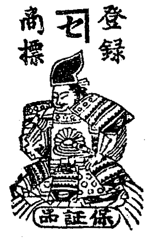
>
> ```yaml
> noborder: true
> size: "small"
> position: "aside"
> license: "cc0"
> ```
>
> <span class="noun" lang="ja-Latn">Nakao Seikadō</span>’s trademark, registered on the 12th of July 1894 by <span class="noun" lang="ja-Latn">Nakao Kiyosuke</span> (<span lang="ja">中尾清 助</span>).[@Trademarks1905 p. 66]

Founded around 1894, and still existed in <span class="noun" lang="ja-Latn">Kyōto</span> in
1948. Their [@Yamaguchi p. 102] mark was <span lang="ja">セ</span> with corner
at top-right.

Brands included:

* <span lang="ja">世界長</span> (<span lang="ja-Latn">sekaichō</span>, ‘world leader’), trademarked in 1921[@Trademarks1924_18 p. 331]
* <span lang="ja">日の出</span> (<span lang="ja-Latn">hinode</span>, ‘sunrise’)
* <span lang="ja">三日月</span> (<span lang="ja-Latn">mikazuki</span>, ‘crescent moon’)

> [!figure]
>
> 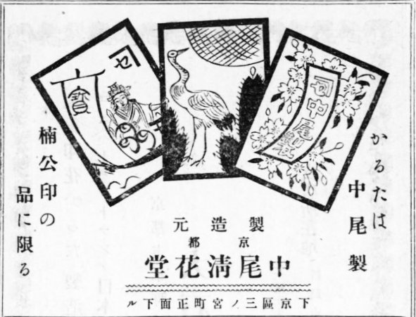
>
> ```yaml
> license: "cc0"
> ```
>
> A 1926 advertisement for <span class="noun" lang="ja-Latn">Nakao Seikadō</span>.


### <span class="noun" lang="ja-Latn">Tsuchida Tenguya</span> (<span lang="ja">土田天狗屋</span>)

> [!figure]
>
> 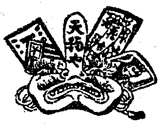
>
> ```yaml
> noborder: true
> position: "aside"
> license: "cc0"
> ```
>
> <span class="noun" lang="ja-Latn">Tsuchida Tenguya</span>’s trademark, registered on the 16th of April 1894 by <span class="noun" lang="ja-Latn">Tsuchida Tsurumatsu</span> (<span lang="ja">土田鶴松</span>).[@Trademarks1905 p. 66]

Founded around 1894, <span class="noun" lang="ja-Latn">Tsuchida Tenguya</span> was based in
<span class="noun" lang="ja-Latn">Ōsaka</span>, and also manufactured Western and <span
lang="ja-Latn">kabu</span> cards. Their mark was <span lang="ja">天</span> in a
square.

> [!figure]
>
> 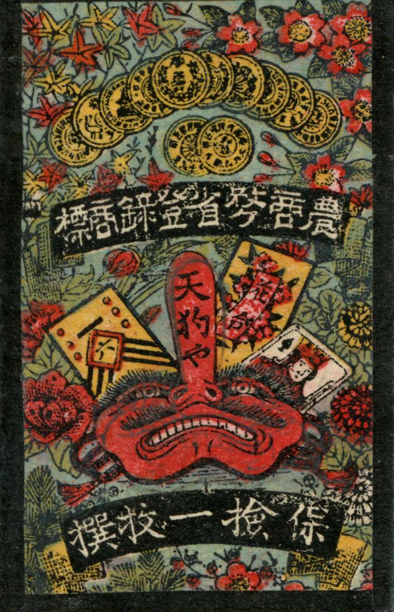
> 
> 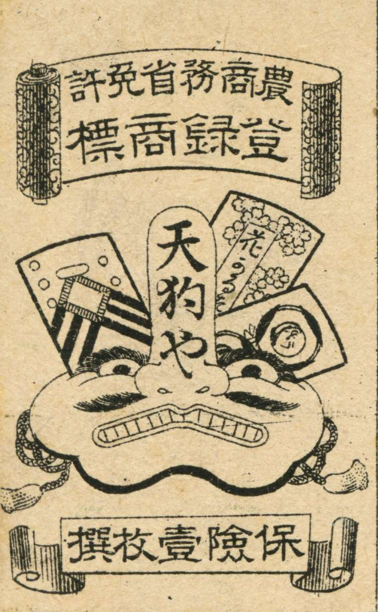
>
> ```yaml
> orgName: "Worshipful Company of the Makers of Playing Cards"
> orgAbbr: "WCMPC"
> originalUrl: "http://www.playingcardmakerscollection.co.uk/Cardhtml/W0317.html"
> license: "with-permission"
> ```
>
> Wrapper, maker’s mark (on Wisteria), and advertising card from a <span lang="ja-Latn">dai&shy;tengu</span> deck.


In the 1930s their brands included (in descending price order):

* <span lang="ja">花の譽</span> (<span lang="ja-Latn">hana no homare</span>, ‘flower’s honour’)
* <span lang="ja">福天狗</span> (<span lang="ja-Latn">fuku&shy;tengu</span>, ‘lucky <span lang="ja-Latn">tengu</span>’), also used for <span lang="ja-Latn">mushi-</span>, <span lang="ja-Latn">kabu-</span>, <span lang="ja-Latn">mekuri-</span>, and <span lang="ja-Latn">mamefuda</span>
* <span lang="ja">金天狗</span> (<span lang="ja-Latn">kin&shy;tengu</span>, ‘golden <span lang="ja-Latn">tengu</span>’), also used for <span lang="ja-Latn">mushi-</span>, <span lang="ja-Latn">kabu-</span>, <span lang="ja-Latn">mekuri-</span>, and <span lang="ja-Latn">mamefuda</span>
* <span lang="ja">銀天狗</span> (<span lang="ja-Latn">gin&shy;tengu</span>, ‘silver <span lang="ja-Latn">tengu</span>’)
* <span lang="ja">大天狗</span> (<span lang="ja-Latn">dai&shy;tengu</span>, ‘great <span lang="ja-Latn">tengu</span>’), also used for <span lang="ja-Latn">mushi-</span>, <span lang="ja-Latn">kabu-</span>, <span lang="ja-Latn">mekuri-</span>, and <span lang="ja-Latn">mamefuda</span>
* <span lang="ja">美人天狗</span> (<span lang="ja-Latn">bijin&shy;tengu</span>, ‘beauty <span lang="ja-Latn">tengu</span>’)
* <span lang="ja">中天狗</span> (<span lang="ja-Latn">naka&shy;tengu</span>, ‘middle <span lang="ja-Latn">tengu</span>’)
* <span lang="ja">花天狗</span> (<span lang="ja-Latn">hana&shy;tengu</span>, ‘flower <span lang="ja-Latn">tengu</span>’), only used for <span lang="ja-Latn">mushifuda</span>
* <span lang="ja">三天狗</span> (<span lang="ja-Latn">san&shy;tengu</span>, ‘three <span lang="ja-Latn">tengu</span>’)
* <span lang="ja">國の花</span> (<span lang="ja-Latn">kuni no hana</span>, ‘nation’s flower’)
* <span lang="ja">八重櫻</span> (<span lang="ja-Latn">yaezakura</span>, ‘eight-fold cherry blossom’, a double-flowered cherry blossom), also used for <span lang="ja-Latn">mushifuda</span>
* <span lang="ja">福助</span> (<span lang="ja-Latn">fukusuke</span>), only used for <span lang="ja-Latn">kabu-</span>, <span lang="ja-Latn">mekuri-</span>, and <span lang="ja-Latn">mamefuda</span>
* <span lang="ja">紅梅</span> (<span lang="ja-Latn">kōbai</span>, ‘red plum’)
* <span lang="ja">張貫</span> (<span lang="ja-Latn">harinuki</span>, a manufacturing technique), only used for <span lang="ja-Latn">kabu-</span>, <span lang="ja-Latn">mekuri-</span>, and <span lang="ja-Latn">mamefuda</span>
* <span lang="ja">一楽</span> (<span lang="ja-Latn">ichiraku</span>, ‘one of one’s hobbies’), only used for <span lang="ja-Latn">kabu-</span>, <span lang="ja-Latn">mekuri-</span>, and <span lang="ja-Latn">mamefuda</span>
* <span lang="ja">五光</span> (<span lang="ja-Latn">gokō</span>, ‘five brights’)
* <span lang="ja">青天狗</span> (<span lang="ja-Latn">ao&shy;tengu</span>, ‘blue <span lang="ja-Latn">tengu</span>’), only used for <span lang="ja-Latn">kabu-</span>, <span lang="ja-Latn">mekuri-</span>, and <span lang="ja-Latn">mamefuda</span>
* <span lang="ja">天狗</span> (<span lang="ja-Latn">tengu</span>, ‘<span lang="ja-Latn">tengu</span>’), only used for <span lang="ja-Latn">mamefuda</span>

> [!figure]
> 
> 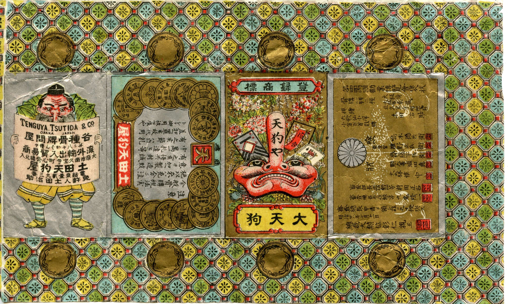
>
> ```yaml
> size: "wide"
> noborder: true
> orgName: "Worshipful Company of the Makers of Playing Cards"
> orgAbbr: "WCMPC"
> originalUrl: "http://www.playingcardmakerscollection.co.uk/Cardhtml/W0329.html"
> license: "with-permission"
> ```
>
> An outer wrapper for the <span lang="ja-Latn">dai&shy;tengu</span> brand.


###  <span class="noun" lang="ja-Latn">Usui Nikkagetsudō</span> (<span lang="ja">臼井日月堂</span>)/<span class="noun" lang="ja-Latn">Kyōto Karuta</span> (<span lang="ja">京都カルタ</span>)

> [!figure]
>
> 
>
> ```yaml
> noborder: true
> size: "small"
> position: "aside"
> license: "cc0"
> ```
>
> <span class="noun" lang="ja-Latn">Usui Nikkagetsudō</span>’s trademark, registered on the 9th of October 1894 by <span class="noun" lang="ja-Latn">Usui Iwajirō</span> (<span lang="ja">臼 井岩次郎</span>).[@Trademarks1905 p. 66]

Founded around 1894, their mark was <span lang="ja">ヱ</span> in an angle, this
company was at first called <span class="noun" lang="ja-Latn">Usui Nikkagetsudō</span> and
then later <span class="noun" lang="ja-Latn">Kyōto Karuta</span> — not to be confused with
the later <span class="noun" lang="ja-Latn">Kyōto Karuta</span> who were active in the 1960s
& 70s!

Their brands included:

* <span lang="ja">百萬圓</span> (<span lang="ja-Latn">hyakumanen</span>, ‘one million <span lang="ja-Latn">yen</span>’), trademarked in 1921[@Trademarks1924_18 p. 331]

###  <span class="noun" lang="ja-Latn">Baba Keieidō</span> (<span lang="ja">馬場京栄堂</span>)

Existed in Kyōto in 1948;[@Yamaguchi p. 102] mark was a circled <span lang="ja">京</span>.

###  <span class="noun" lang="ja-Latn">Heibon</span> (<span lang="ja">平凡</span>)

This <span class="noun" lang="ja-Latn">Tōkyō</span> manufacturer stopped producing shortly after 1972.[@ModernJapaneseWrappers p. 42] Their maker’s mark was the phrase <span lang="ja">天下一</span> (<span lang="ja-Latn">tenkaichi</span> ‘best in the world’) written inside a large [<span lang="ja-Latn">koban</span>](https://en.wikipedia.org/wiki/Koban_(coin)). Their brands included:

* <span lang="ja">四天王</span> (<span lang="ja-Latn">shi tennō</span> the [four heavenly kings](https://en.wikipedia.org/wiki/Four_Heavenly_Kings)), also used for <span class="noun" lang="ja-Latn">Kabufuda</span>
* <span lang="ja">牡丹獅子</span> (<span lang="ja-Latn">botanjishi</span> ‘peony and lion’), also used for <span class="noun" lang="ja-Latn">Kabufuda</span>
* <span lang="ja">金時桜</span> (<span lang="ja-Latn">kintokizakura</span> ‘[<span class="noun" lang="ja-Latn">Kintoki</span>](https://en.wikipedia.org/wiki/Kintar%C5%8D) and cherry blossom’)
* <span lang="ja">旭富士</span> (<span lang="ja-Latn">asahifuji</span> ‘<span class="noun" lang="ja-Latn">Fuji</span> sunrise’)
* <span lang="ja">桜判官</span> (<span lang="ja-Latn">sakurahangan</span> ‘cherry blossom judge’, a reference to [<span class="noun" lang="ja-Latn">Tōyama Kagemoto</span>](https://en.wikipedia.org/wiki/T%C5%8Dyama_Kagemoto))

> [!multi]
> > [!figure]
> >
> > 
> >
> > ```yaml
> > license: "with-permission"
> > copyrightYear: 2021
> > authorFamily: "Sartor"
> > authorGiven: "Ryan"
> > ```
> >
> > <span class="noun" lang="ja-Latn">Heibon</span>’s <span lang="ja-Latn">botanjishi</span> wrapper. Note the sticker indicating that the box contains <span class="noun" lang="ja-Latn">Kabufuda</span> cards.
> 
> > [!figure]
> >
> > 
> >
> > ```yaml
> > license: "with-permission"
> > copyrightYear: 2021
> > authorFamily: "Sartor"
> > authorGiven: "Ryan" 
> > ```
> >
> > <span class="noun" lang="ja-Latn">Heibon</span>’s <span lang="ja-Latn">sakurahangan</span> wrapper.
> 
> > [!figure]
> >
> > 
> >
> > ```yaml
> > license: "with-permission"
> > copyrightYear: 2021
> > authorFamily: "Sartor"
> > authorGiven: "Ryan"
> > ```
> >
> > <span class="noun" lang="ja-Latn">Heibon</span>’s <span lang="ja-Latn">asahifuji</span> wrapper. (Low-resolution image from the side of a <span lang="ja-Latn">botanjishi</span> wrapper.)

### <span class="noun" lang="ja-Latn">Kawakita</span> (<span lang="ja">川北</span>)

<span class="noun" lang="ja-Latn">Kawakita</span> had its own brands but cards were made by
<span class="noun" lang="ja-Latn">Yamashiro Shōten</span>. It closed after
1962.[@ModernJapaneseWrappers pp. 48–9] Brands included:

* <span lang="ja">牛若丸</span> (<span lang="ja-Latn">ushiwakamaru</span>, the childhood name of [<span class="noun" lang="ja-Latn">Minamoto no Yoshitsune</span>](https://en.wikipedia.org/wiki/Minamoto_no_Yoshitsune))
* <span lang="ja">金閣寺</span> (<span lang="ja-Latn">kinkaku-ji</span>, the Golden Pavilion in <span class="noun" lang="ja-Latn">Kyōto</span>)
* <span lang="ja">銀閣寺</span> (<span lang="ja-Latn">ginkaku-ji</span>, the Silver Pavilion in <span class="noun" lang="ja-Latn">Kyōto</span>)
* <span lang="ja">弁慶</span> (<span lang="ja-Latn">benkei</span>, [a famous warrior monk](https://en.wikipedia.org/wiki/Benkei))
* <span lang="ja">大文字</span> (<span lang="ja-Latn">daimonji</span>, [a mountain in <span class="noun" lang="ja-Latn">Kyōto</span>](https://en.wikipedia.org/wiki/Gozan_no_Okuribi))
* <span lang="ja">祇園</span> (<span lang="ja-Latn">gion</span>, the <span lang="ja-Latn">geisha</span> district of <span class="noun" lang="ja-Latn">Kyōto</span>)

###  <span class="noun" lang="ja-Latn">Kohara Honten</span> (<span lang="ja">小原本店</span>)

<span class="noun" lang="ja-Latn">Kohara</span> was a manufacturer based in <span class="noun"
lang="ja-Latn">Ōsaka</span> until 1980.[@ModernJapaneseWrappers p. 48] Their
manufacturer’s mark was a circled <span lang="ja" class="circled">さ</span>, and
brands included:

* <span lang="ja">鬼印</span> (<span lang="ja-Latn">onijirushi</span>, ‘ogre brand’, also for <span class="noun" lang="ja-Latn">Kabufuda</span> and <span class="noun" lang="ja-Latn">Harifuda</span>)
* <span lang="ja">王将</span> (<span lang="ja-Latn">ōshō</span>, the king of the stronger player in <span class="noun" lang="ja-Latn">Shōgi</span>, also used for <span class="noun" lang="ja-Latn">Kabufuda</span>)
* <span lang="ja">大登龍</span> (<span lang="ja-Latn">daitōryū</span>, ‘great rising dragon’), also used for <span class="noun" lang="ja-Latn">Kabufuda</span>
* <span lang="ja">金札印</span> (<span lang="ja-Latn">kinfudajirushi</span>, ‘golden card brand’)
* <span lang="ja">鍾馗</span> (<span lang="ja-Latn">shōki</span>, [<span class="noun" lang="ja-Latn">Shōki</span> the demon-queller](https://en.wikipedia.org/wiki/Zhong_Kui))
* <span lang="ja">馬印</span> (<span lang="ja-Latn">umajirushi</span>, ‘horse brand’)
* <span lang="ja">宝船</span> (<span lang="ja-Latn">takarabune</span>, ‘treasure ship’)
* <span lang="ja">寶引</span> (<span lang="ja-Latn">hōbiki</span>, ‘treasure pull’, a kind of lottery where one rope out of a bundle was tied to the prize, and whoever pulled it won; these were <span class="noun" lang="ja-Latn">Hikifuda</span> cards)
* <span lang="ja">蝶々</span> (<span lang="ja-Latn">chōchō</span>, ‘butterflies’)
* <span lang="ja">松竹梅</span> (<span lang="ja-Latn">shōchikubai</span>, ‘pine bamboo plum’, the “[three friends of winter](https://en.wikipedia.org/wiki/Three_Friends_of_Winter)”)
* <span lang="ja">折鶴</span> (<span lang="ja-Latn">oridzuru</span>, ‘origami crane’)
* <span lang="ja">八千代</span> (<span lang="ja-Latn">yachiyo</span>, ‘forever’, literally ‘eight thousand years’)
* <span lang="ja">鳴戸</span> (<span lang="ja-Latn">naruto</span>, ‘whirlpool’)
* <span lang="ja">船</span> (<span lang="ja-Latn">fune</span>, ‘ship’), used for <span class="noun" lang="ja-Latn">Kabufuda</span>
* <span lang="ja">成駒家</span> (<span lang="ja-Latn">narikomaya</span>, a <span lang="ja-Latn">kabuki</span> actor’s [<span lang="ja-Latn">yagō</span>](https://en.wikipedia.org/wiki/Yag%C5%8D), probably here referring to [<span class="noun" lang="ja-Latn">Nakamura Ganjirō</span> <span class="rnum">II</span>](https://en.wikipedia.org/wiki/Nakamura_Ganjir%C5%8D_II))
* <span lang="ja">三ッ葉葵</span> (<span lang="ja-Latn">mitsuba-aoi</span>, a <span lang="ja-Latn">mon</span> consisting of three birthwort leaves used by the [<span class="noun" lang="ja-Latn">Tokugawa</span>](https://en.wikipedia.org/wiki/Tokugawa_clan#Crest) clan)

> [!multi]
> > [!figure]
> > 
> > 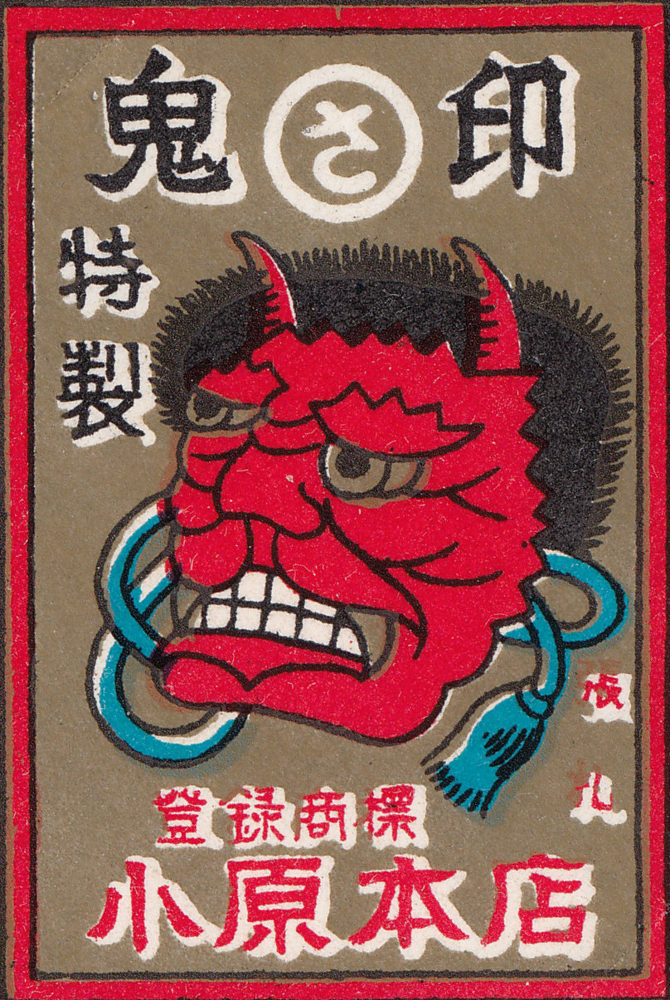
> >
> > The <span lang="ja-Latn">onijirushi</span> wrapper.
> 
> > [!figure]
> >
> > 
> >
> > The <span lang="ja-Latn">takarabune</span> wrapper.
> 
> > [!figure]
> > 
> > 
> >
> > The <span lang="ja-Latn">shōki</span> wrapper.

> [!multi]
> > [!figure]
> > 
> > 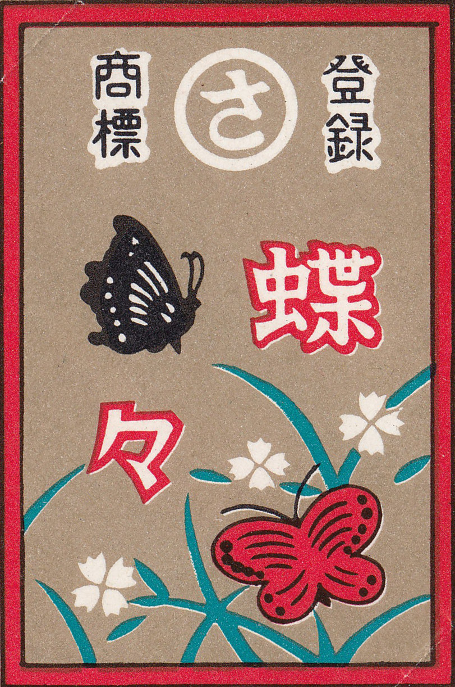
> >
> > The <span lang="ja-Latn">chōchō</span> wrapper.
> 
> > [!figure]
> >
> > 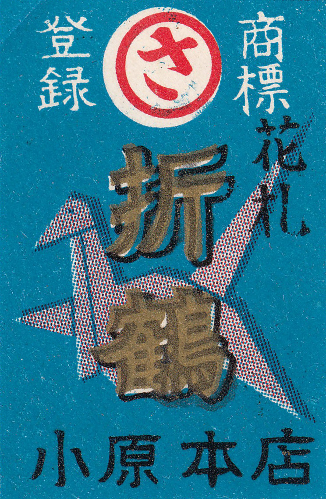
> >
> > The <span lang="ja-Latn">oridzuru</span> wrapper.
> 
> > [!figure]
> >
> > 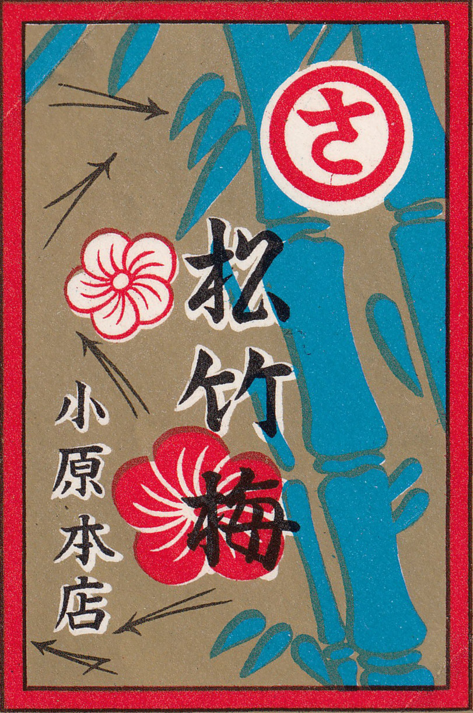
> >
> > The <span lang="ja-Latn">shōchikubai</span> wrapper.

> [!multi-wide]
> > [!figure]
> >
> > 
> >
> > The <span lang="ja-Latn">yachiyo</span> wrapper.
> 
> > [!figure]
> > 
> > 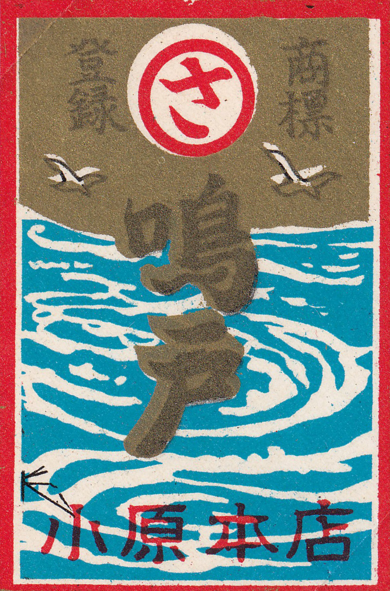
> >
> > The <span lang="ja-Latn">naruto</span> wrapper.
> 
> > [!figure]
> > 
> > 
> >
> > The <span lang="ja-Latn">fune</span> wrapper.
> 
> > [!figure]
> >
> > 
> >
> > The <span lang="ja-Latn">narikomaya</span> wrapper. The repeated symbol is <span lang="ja">イ菱</span> ‘<span lang="ja">イ</span> caltrop’, the <span lang="ja-Latn">mon</span> of the <span class="noun" lang="ja-Latn">Nakamura Ganjirō</span> line of actors.

###  <span class="noun" lang="ja-Latn">Nakao Kōkeidō</span> (<span lang="ja">中尾晃恵堂</span>)

A company in <span class="noun" lang="ja-Latn">Ōsaka</span> which had its cards manufactured
by <span class="noun" lang="ja-Latn">Nihon Karuta</span>. Its mark was circled <span
lang="ja" class="circled">恵</span>. The only brands I know of are:

* <span lang="ja">梅ヶ枝</span> (<span lang="ja-Latn">umegae</span>, ‘plum branch’)
* <span lang="ja">松風</span> (<span lang="ja-Latn">matsukazu</span>, ‘(the sound of) wind blowing through pine trees’)

> [!multi]
> > [!figure]
> > 
> > 
> >
> > The <span lang="ja-Latn">umegae</span> wrapper.
> 
> > [!figure]
> > 
> > 
> >
> > The <span lang="ja-Latn">matsukaze</span> wrapper.

###  <span class="noun" lang="ja-Latn">Nishimura</span> (<span lang="ja">西村</span>)

> [!figure]
>
> 
>
> ```yaml
> position: "aside"
> authorFamily: "Richert"
> authorGiven: "Marcus"
> copyrightYear: 2020
> license: "with-permission"
> ```
>
> An extra ‘advertising’ card featuring the <span lang="ja-Latn">kabuki</span> character [<span class="noun" lang="ja-Latn">Sukeroku</span>](https://en.wikipedia.org/wiki/Sukeroku), who appeared often in <span class="noun" lang="ja-Latn">Nishimura</span>’s branding. <span class="noun" lang="ja-Latn">Sukeroku</span> popularized the style of umbrella called a ‘snake-eye umbrella’ (<span lang="ja">蛇の目傘</span>) due to its pattern, so this type of umbrella is also referred to as a <span lang="ja-Latn">Sukeroku-gasa</span> (<span lang="ja">助六傘</span>).

> [!figure]
>
> 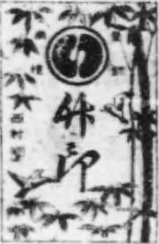
> 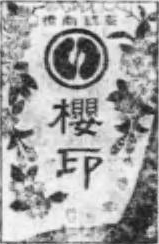
> 
>
> ```yaml
> noborder: true
> position: "aside"
> license: "cc0"
> ```
>
> Early <span class="noun" lang="ja-Latn">Nishimura</span> trademarks, registered in 1915 by <span class="noun" lang="ja-Latn">Nishimura Inosuke</span> (<span lang="ja">西村伊之助 </span>).[@Trademarks1924_8 p. 296]

At first an important manufacturer in <span class="noun" lang="ja-Latn">Tōkyō</span>, but
later cards were made by other makers including <span class="noun" lang="ja-Latn">Ōishi
Tengudō</span>.

The company existed in 1914, and was run by a <span class="noun" lang="ja-Latn">Nishimura
Inosuke</span> (<span lang="ja">西村伊之助</span>).[@JapaneseBusinessmen1914 p.
45]

Their mark was a circled <span lang="ja" class="circled">い</span>, and their
brands included:[@ModernJapaneseWrappers pp. 54–8]

* <span lang="ja">金助六</span> (<span lang="ja-Latn">kinsukeroku</span>, ‘golden [<span class="noun" lang="ja-Latn">Sukeroku</span>](https://en.wikipedia.org/wiki/Sukeroku)’)
* <span lang="ja">銀助六</span> (<span lang="ja-Latn">ginsukeroku</span>, ‘silver Sukeroku’)
* <span lang="ja">小天狗</span> (<span lang="ja-Latn">kotengu</span>, ‘little <span class="noun" lang="ja-Latn">Tengu</span>’)
* <span lang="ja">花の花</span> (<span lang="ja-Latn">hana no hana</span>, ‘flower of flowers’)
* <span lang="ja">白雪</span> (<span lang="ja-Latn">shirayuki</span>, ‘white snow’)
* <span lang="ja">百万石</span> (<span lang="ja-Latn">hyakumangoku</span>, ‘one million [<span lang="ja-Latn">koku</span>](https://en.wikipedia.org/wiki/Koku)’, a nickname for the rich [<span class="noun" lang="ja-Latn">Kaga</span> domain](https://en.wikipedia.org/wiki/Kaga_Domain), or its lord, in the <span class="noun" lang="ja-Latn">Edo</span> period), no longer produced as of 1980
* <span lang="ja">奴さん</span> (<span lang="ja-Latn">yakkosan</span>, ‘guy’, a samurai manservant, also a traditional origami shape imitating a man), no longer produced as of 1980
* <span lang="ja">奴印</span> (<span lang="ja-Latn">yakko&shy;jirushi</span>, ‘guy brand’), trademarked in 1921[@Trademarks1924_18 p. 331]
* <span lang="ja">竹印</span> (<span lang="ja-Latn">takejirushi</span>, ‘bamboo brand’), trademarked in 1915[@Trademarks1924_8 p. 296]
* <span lang="ja">櫻印</span> (<span lang="ja-Latn">sakurajirushi</span>, ‘cherry brand’), trademarked in 1915[@Trademarks1924_8 p. 296]
* <span lang="ja">月𛀙瀬</span>/<span lang="ja">月ヶ瀬</span> (<span lang="ja-Latn">tsukigase</span>, a place famous for its plum blossoms), trademarked in 1915[@Trademarks1924_8 p. 296]
* <span lang="ja">星印</span> (<span lang="ja-Latn">hoshi&shy;jirushi</span>, ‘star brand’), trademarked in 1916[@Trademarks1924_9 p. 289]
* <span lang="ja">花乃王</span> (<span lang="ja-Latn">hana no ō</span>, ‘king of flowers’, i.e. the peony), trademarked in 1918[@Trademarks1924_11 p. 331]
* <span lang="ja">龍田川</span> (<span lang="ja-Latn">tatsutagawa</span>, ‘<span class="noun" lang="ja-Latn">Tatsuta</span> river’), trademarked in 1918[@Trademarks1924_11 p. 331]
* <span lang="ja">大正錦</span> (<span lang="ja-Latn">Taishō nishiki</span>, ‘<span class="noun" lang="ja-Latn">Taishō</span> brocade’), trademarked in 1921[@Trademarks1924_18 p. 330]
* <span lang="ja">弁慶</span> (<span lang="ja-Latn">Benkei</span>, ‘<span class="noun" lang="ja-Latn">Benkei</span>’), trademarked in 1921[@Trademarks1924_18 p. 330]
* <span lang="ja">二福</span> (<span lang="ja-Latn">nifuku</span>, ‘two fortunes’, picturing <span class="noun" lang="ja-Latn">Ebisu</span> and <span class="noun" lang="ja-Latn">Daikokuten</span>), trademarked in 1921[@Trademarks1924_18 p. 331]
* <span lang="ja">圓満</span> (<span lang="ja-Latn">enman</span>, ‘harmony’), trademarked in 1921[@Trademarks1924_18 p. 332]
* <span lang="ja">東山</span> (<span lang="ja-Latn">higashiyama</span>, ‘[<span class="noun" lang="ja-Latn">Higashiyama</span>](https://en.wikipedia.org/wiki/Higashiyama-ku,_Kyoto)’)

> [!figure]
>
> 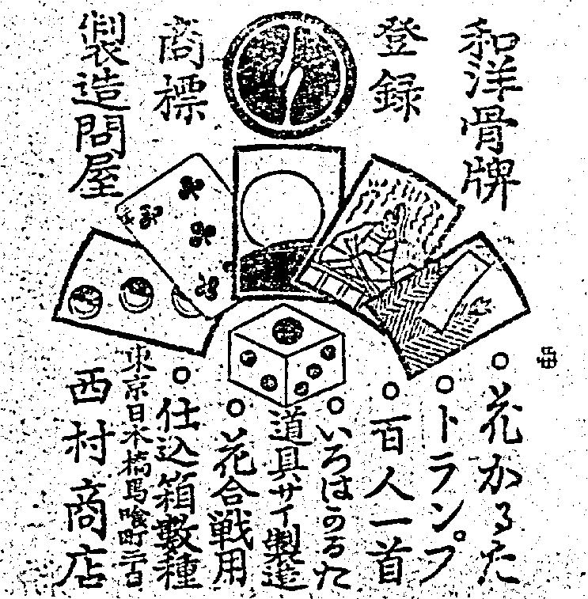
> 
>
> ```yaml
> license: "cc0"
> originalUrl: "http://www.tga-j.org/documents/i/627/detail.html"
> orgName: "日本粧業会 資料館"
> ```
>
> Two <span class="noun" lang="ja-Latn">Nishimura</span> advertisements, from the December 1907 issue of the “Tokyo Toilet Trade Journal”. The advert on the right shows that they also sold <span class="noun" lang="ja-Latn">Ōishi Tengudō</span> products.

###  <span class="noun" lang="ja-Latn">Kyōto Karuta</span> (<span lang="ja">京都かるた</span>)

A <span class="noun" lang="ja-Latn">Kyōto</span> manufacturer, founded by an ex-employee of
<span class="noun" lang="ja-Latn">Nihon Karuta</span>. They were active in the 1960s & ’70s,
but closed in the 1990s.[@UmebayashiIsao] Their brands
included:[@ModernJapaneseWrappers p. 49]

* <span lang="ja">金の司</span> (<span lang="ja-Latn">kin no tsukasa</span> ‘officer of gold’)
* <span lang="ja">大帝王</span> (<span lang="ja-Latn">daiteiō</span> ‘great emperor’, also used for <span class="noun" lang="ja-Latn">Kabufuda</span>)
* <span lang="ja">神鉾</span> (<span lang="ja-Latn">kamihoko</span> ‘sacred halberd’, also used for <span class="noun" lang="ja-Latn">Kabufuda</span>)
* <span lang="ja">つかさ天狗</span> (<span lang="ja-Latn">tsukasatengu</span>, ‘chief tengu’)
* <span lang="ja">花あらし</span> (<span lang="ja-Latn">hanaarashi</span>, ‘flower storm’, a heavy fall of blossoms)
* <span lang="ja">短冊</span> (<span lang="ja-Latn">tanzaku</span>, ‘poetry strip’)
* <span lang="ja">ぼたん</span> (<span lang="ja-Latn">botan</span>, ‘peony’)

###  <span class="noun" lang="ja-Latn">Dai Nippon</span> (<span lang="ja">大日本</span>)

A manufacturer from the city of [<span class="noun"
lang="ja-Latn">Yōkaichi</span>](https://en.wikipedia.org/wiki/Y%C5%8Dkaichi,_Shiga)
(now part of <span class="noun" lang="ja-Latn">Higashiōmi</span>), <span class="noun"
lang="ja-Latn">Shiga</span> prefecture (<span lang="ja">滋賀県八日市市</span>).
Their logo is a group of three gourds, which is considered to be a lucky symbol.

Brands included:[@ModernJapaneseWrappers p. 46]

* <span lang="ja">銀達磨</span> (<span lang="ja-Latn">gindaruma</span> ‘silver [<span class="noun" lang="ja-Latn">Daruma</span>](https://en.wikipedia.org/wiki/Bodhidharma)’)
* <span lang="ja">千姫</span> (<span lang="ja-Latn">senhime</span> ‘[Lady <span class="noun" lang="ja-Latn">Sen</span>](https://en.wikipedia.org/wiki/Senhime)’)
* <span lang="ja">銀瓠</span> (<span lang="ja-Latn">ginhyō</span> ‘silver gourd’)
* <span lang="ja">金瓠</span> (<span lang="ja-Latn">kinhyō</span> ‘gold gourd’)
* <span lang="ja">豊太閤</span>[^fn2] (<span lang="ja-Latn">hōtaikō</span>, a title of honour for [<span class="noun" lang="ja-Latn">Toyotomi Hideyoshi</span>](https://en.wikipedia.org/wiki/Toyotomi_Hideyoshi))
* <span lang="ja">千成</span> (<span lang="ja-Latn">sennari</span>, short for <span lang="ja">千成瓢箪</span> <span lang="ja-Latn">sennaribyōtan</span> ‘thousand gourds’, the standard used by <span class="noun" lang="ja-Latn">Hideyoshi</span>)

[^fn2]: On some versions of this, it is misspelt <span lang="ja">豊太閣</span>.

> [!multi-wide]
> > [!figure]
> > 
> > 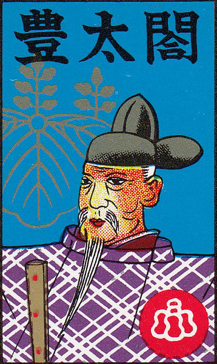
> >
> > The <span lang="ja-Latn">hōtaikō</span> wrapper.
> 
> > [!figure]
> >
> > 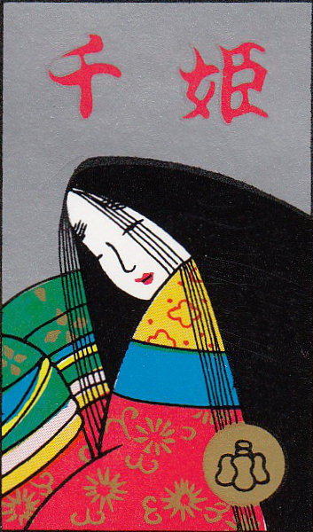
> >
> > The <span lang="ja-Latn">senhime</span> wrapper.
> 
> > [!figure]
> >
> > 
> >
> > The <span lang="ja-Latn">kinhyō</span> wrapper.
> 
> > [!figure]
> > 
> > 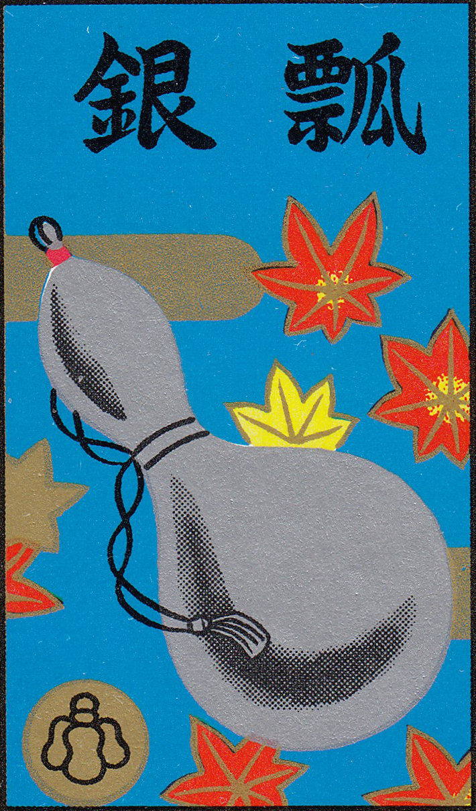
> >
> > The <span lang="ja-Latn">ginhyō</span> wrapper.

### <a href="http://www.nichiyu.net/en" class="noun" lang="ja-Latn">Nippon Yūgi Gangu/Nichiyū</a> (<span lang="ja">日本遊戯玩具</span>/<span lang="ja">ニチユー</span>)

> [!figure]
> 
> 
>
> ```yaml
> position: "aside"
> ```
>
> <span class="noun" lang="ja-Latn">Nippon Yūgi</span>’s <span lang="ja-Latn">kintengu</span> brand.


<span class="noun" lang="ja-Latn">Nippon Yūgi</span> (also known as <span class="noun"
lang="ja-Latn">Nichiyū</span>) was founded in <span class="noun" lang="ja-Latn">Tōkyō</span>
in 1946. They still exist but no longer appear to produce <span class="noun"
lang="ja-Latn">Hanafuda</span> cards, instead specializing in tarot. Their
previous brands included:[@ModernJapaneseWrappers p. 54]

* <span lang="ja">白鶴</span> (<span lang="ja-Latn">hakuzuru</span>, ‘white crane’)
* <span lang="ja">(日遊)金天狗</span> (<span lang="ja-Latn">(nichiyū) kintengu</span>, ‘<span class="noun" lang="ja-Latn">Nippon Yūgi</span> golden <span class="noun" lang="ja-Latn">Tengu</span>’)
* <span lang="ja">鳳</span> (<span lang="ja-Latn">ōtori</span>, ‘splendid bird’, a male Japanese phoenix)
* <span lang="ja">宴</span> (<span lang="ja-Latn">utage</span>, ‘banquet’)
* <span lang="ja">大入叶</span> (<span lang="ja-Latn">ōirikanō</span>, ‘grant a full house’, a theatre term)
* <span lang="ja">兜</span> (<span lang="ja-Latn">kabuto</span>, ‘samurai helmet’)
* <span lang="ja">花川戸</span> (<span lang="ja-Latn">hanakawado</span>, a place in <span class="noun" lang="ja-Latn">Tōkyō</span>)
* <span lang="ja">花あわせ</span> (<span lang="ja-Latn">hana-awase</span>, ‘flower matching’)

They also produced a poker-sized <span class="noun" lang="ja-Latn">Hanafuda</span> deck that
included point values on the cards, as well as the name of the month and the
flower associated with the month. Interestingly, the point values on some of the
cards indicate that they were intended to be played with Hawaiian rules.

> [!figure]
>
> 
>
> <span class="noun" lang="ja-Latn">Nippon Yūgi</span>’s poker-format deck, possibly created for sale in <span class="noun" lang="haw">Hawai'i</span>.

### Universal (<span lang="ja">ユニバーサル</span>)

> [!aside]
> 
> There was also [a Universal Playing Card Co. based in England](https://www.wopc.co.uk/alfcooke/index). As far as I can tell, the two companies were unrelated.

> [!figure]
>
> 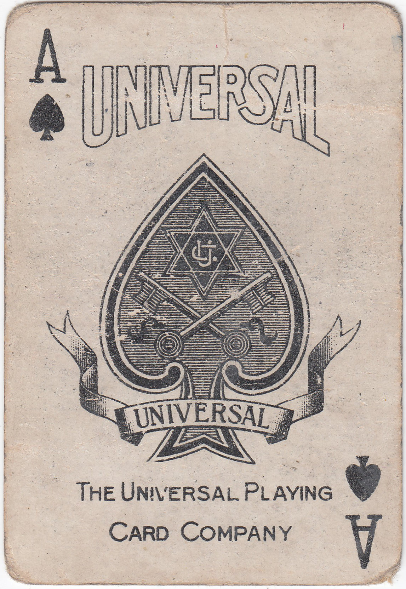
>
> ```yaml
> noborder: true
> position: "aside"
> ```
>
> Universal also published standard Western decks; this Ace from a “No. <strong>706</strong>” deck shows the logo of a star containing the letters U &amp; C intertwined.

The Universal Playing Card Company was founded in 1914, and based in <span class="noun"
lang="ja-Latn">Ōsaka</span>.[@UniversalInfo] Their maker’s mark on <span class="noun"
lang="ja-Latn">Hanafuda</span> decks was a drawstring purse (<span lang="ja">巾
着</span> <span lang="ja-Latn">kinchaku</span>); elsewhere they used a
six-pointed star containing “<small>UNIVERSAL</small>” or an interlocked U &amp;
C. Their own brands included:[@ModernJapaneseWrappers pp. 59–62]

* <span lang="ja">ゴム花</span> (<span lang="ja-Latn">gomuhana</span>, ‘rubber flower’)
* <span lang="ja">萬年花</span> (<span lang="ja-Latn">mannenhana</span>, ‘10&thinsp;000 year flower’)

In addition to <span class="noun" lang="ja-Latn">Hanafuda</span>, they produced Western cards
and Ceki cards for export. In 1935 they exported a total of 10 million
decks.[@UniversalInfo]

Like other manufacturers, they produced combination <span class="noun"
lang="ja-Latn">Trump-Hana</span> (<span lang="ja">トランプ花</span>) decks, and
in multiple sizes: the smallest size deck (numbered “<strong>350</strong>”) has
cards that are much closer in size to that of <span class="noun"
lang="ja-Latn">Hanafuda</span> than other brands’ combination cards are. A very
similar deck was published under the brand “Star Playing Cards” (numbered
“<strong>807</strong>”, with a five-pointed star).

> [!figure]
>
> 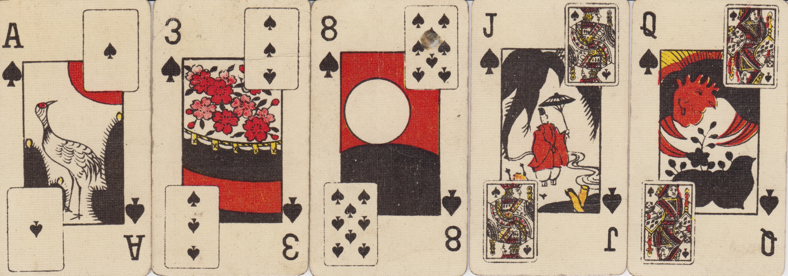
>
> The Bright cards of Universal’s <span class="noun" lang="ja-Latn">Trump-Hana</span> deck. This particular deck is listed as number “350” on the packaging.

> [!figure]
>
> 
>
> The extra [Hachi-Hachi](games/hachi-hachi/hachi-hachi.md)-related cards of Universal’s <span class="noun" lang="ja-Latn">Trump-Hana</span> deck. I’m not sure of the significance of the “vase” Joker, since usually the Joker has the manufacturer’s name. It could be intended as a multilingual pun on “Universal” (<span lang="ja">ユニバーセル </span> <span lang="ja-Latn">yunibāseru</span>) → “Universe” (<span lang="ja">ユ ニバース</span> <span lang="ja-Latn">yunibāsu</span>), which sounds like “uni-vase” (one vase).

> [!figure]
>
> 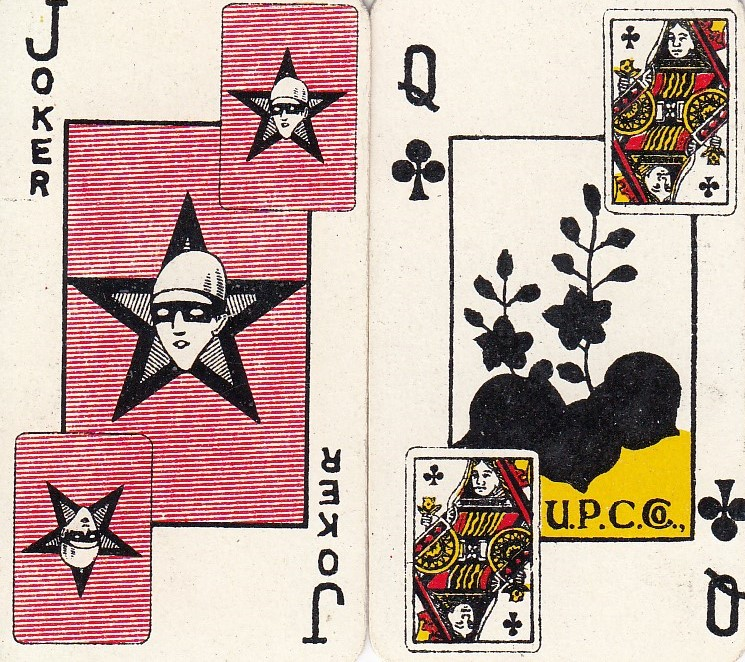
>
> ```yaml
> size: "small"
> ```
>
> The joker and manufacturer’s Paulownia card from the “Star Playing Cards” brand. The Universal #350 deck’s manufacturer’s card is identical to this one.


A larger sized <span class="noun" lang="ja-Latn">Hana-Trump</span> deck (numbered
“<strong>25</strong>”) of theirs has different Kings which feature additional
<span class="noun" lang="ja-Latn">Hanafuda</span>-style cards that could be used as an
additional suit in games with more players.

> [!figure]
>
> 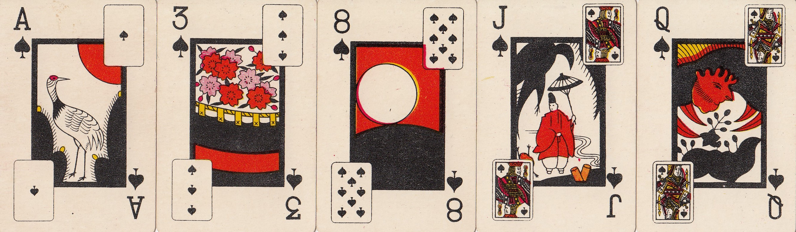
>
> The Bright cards of Universal’s <span class="noun" lang="ja-Latn">Hana-Trump</span> deck. This particular deck is listed as number “25” on the packaging.

> [!figure]
>
> 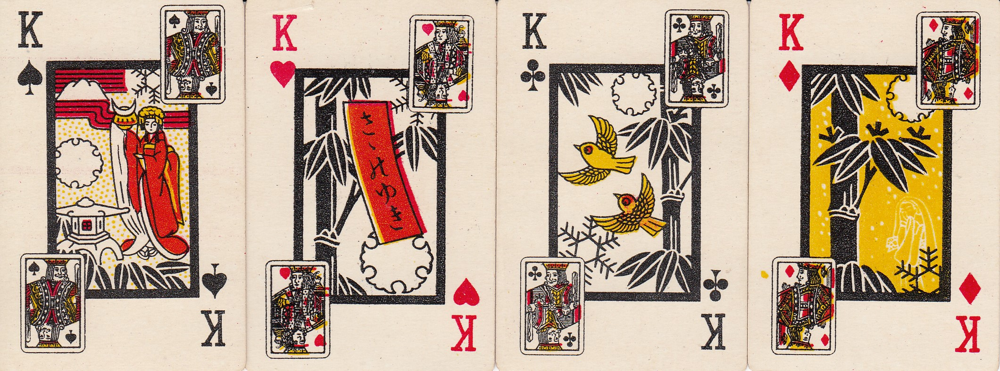
>
> The Bamboo–King extra suit of Universal’s <span class="noun" lang="ja-Latn">Hana-Trump</span> deck. The extra cards, from left-to-right, are: an additional Bright card featuring Princess <span class="noun" lang="ja-Latn">Yaegaki</span> (<span lang="ja">八重垣姫 </span>), a character from the traditional <span lang="ja-Latn">bunraku</span> (and later <span lang="ja-Latn">kabuki</span>) play <cite>24 Paragons of Filial Piety</cite> (<span lang="ja">本朝廿四孝</span>, <span lang="ja-Latn">Honchō Nijūshikō</span>), who is taking a magical helmet to her lover across frozen [Lake <span class="noun" lang="ja-Latn">Suwa</span>](https://en.wikipedia.org/wiki/Lake_Suwa); the <span lang="ja-Latn">tanzaku</span> card, which is inscribed <span lang="ja">さゝ𛂜ゆ き</span> (<span lang="ja-Latn">sasa no yuki</span>, ‘snow on bamboo’); the <span lang="ja-Latn">tane</span> card, showing two sparrows; and the <span lang="ja-Latn">kasu</span> card, which has a yellow background similar to one of the Paulownia cards.

> [!figure]
>
> 
>
> ```yaml
> size: "small"
> ```
>
> The reverse of the deck features a grape vine pattern. There are also two jokers included, one featuring a [<span lang="ja-Latn">kadomatsu</span>](https://en.wikipedia.org/wiki/Kadomatsu) (<span lang="ja">門松</span>), and the other with significantly less effort invested in its design. Note the small six-pointed stars in the corners, containing the letters U &amp; C intertwined.

###  <span class="noun" lang="ja-Latn">Kawai</span>

A manufacturer from <span class="noun" lang="ja-Latn">Ōsaka</span>, whose mark was <span
lang="ja">万</span> with corner at top-right.[@OstasiatischeSpielkarten p. 135]

###  <span class="noun" lang="ja-Latn">Akata Shōjōya</span> (<span lang="ja">赤田猩々屋</span>)

> [!figure]
>
> 
>
> ```yaml
> noborder: true
> position: "aside"
> license: "cc0"
> ```
>
> <span class="noun" lang="ja-Latn">Aakata Shōjōya</span>’s trademark, registered on the 24th of April 1900 by <span class="noun" lang="ja-Latn">Akada Hanjirō</span> (<span lang="ja">赤田 半次郎</span>).[@Trademarks1905 p. 67]

A <span class="noun" lang="ja-Latn">Kyōto</span> manufacturer whose mark was <span lang="ja">
松</span> in a circle. Their mascot was a <span
lang="ja-Latn">[shōjō](https://en.wikipedia.org/wiki/Sh%C5%8Dj%C5%8D)</span>, a
Japanese sea spirit who is depicted as carrying a long-handled <span
lang="ja-Latn">sake</span> ladle.

> [!multi]
> > [!figure]
> >
> > 
> >
> > ```yaml
> > license: "cc0"
> > originalUrl: 'https://gallica.bnf.fr/ark:/12148/btv1b105093472'
> > orgName: 'Bibliothèque nationale de France'
> > orgLang: "fr"
> > orgAbbr: 'BnF'
> > ```
> >
> > An additional manufacturer’s card included with an <span class="noun" lang="ja-Latn">Akata Shōjōya</span> deck, produced after 1902. BnF Gallica has [high-quality scans](https://gallica.bnf.fr/ark:/12148/btv1b105093472) of this deck, and Yale University also [owns a copy](https://search.library.yale.edu/catalog/13318512).
> 
> > [!figure]
> >
> > 
> >
> > ```yaml
> > license: "cc0"
> > originalUrl: 'https://hojishinbun.hoover.org/?a=d&d=jan19210920-01.1.4'
> > orgName: 'Hoover Institution'
> > ```
> >
> > An advertisement for <span class="noun" lang="ja-Latn">Akata Shōjōya</span> cards in the <a href="https://en.wikipedia.org/wiki/Nichi_Bei_Times">Nichi Bei Times</a>, September 1921. This indicates the cards were being imported into San Francisco in the 1920s.
### <span class="noun" lang="ja-Latn">Suisando</span> (<span lang="ja">翠山堂</span>)

A manufacturer that has a very finely-detailed deck of cards reproduced in
@Hargrave [p. 13]. I know of no further information about them.

###  <span class="noun" lang="ja-Latn">Nihon Goraku</span> (<span lang="ja">日本娯楽</span>)

> [!figure]
>
> 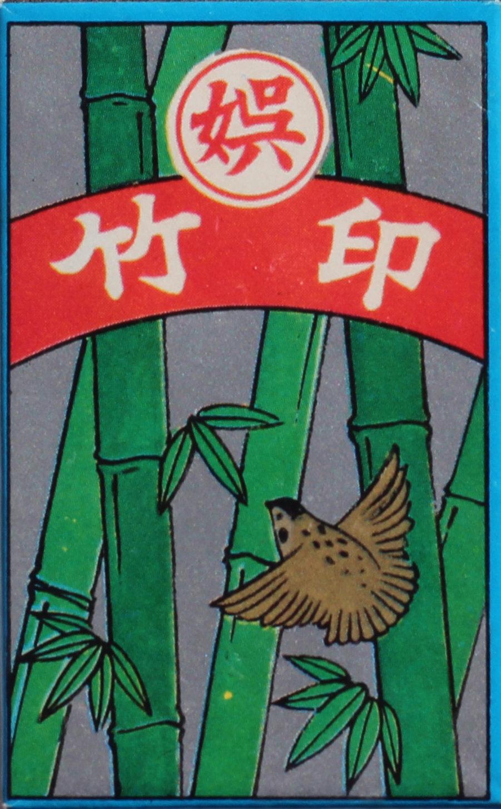
>
> ```yaml
> size: "small"
> position: "aside"
> license: 'with-permission'
> authorFamily: "Richert"
> authorGiven: "Marcus" 
> ```
>
> <span class="noun" lang="ja-Latn">Nihon Goraku</span>’s <span lang="ja-Latn">takejirushi</span> wrapper.


<span class="noun" lang="ja-Latn">Nihon Goraku</span> was founded in 1945 as <span class="noun" lang="ja-Latn">Takahashi Shōten</span> (<span lang="ja">高橋商店</span>), was renamed <span class="noun" lang="ja-Latn">Nishinihon Koppai</span> (<span lang="ja">西日本骨 牌</span>) in 1966, and became <span class="noun" lang="ja-Latn">Nihon Goraku</span> in 1968.[@NihonGoraku] They were based in <span class="noun" lang="ja-Latn">Shinhama</span>, [<span class="noun" lang="ja-Latn">Onomichi</span> city](https://en.wikipedia.org/wiki/Onomichi,_Hiroshima), <span class="noun" lang="ja-Latn">Hiroshima</span> (<span lang="ja">広島県尾道市新浜</span>), and originally had their cards manufactured by <span class="noun" lang="">Kyōto Karuta</span>. Nowadays the company imports musical instruments.

Their mark was circled <span lang="ja">娯</span>, and brands included:

* <span lang="ja">山伏</span> (<span lang="ja-Latn">yamabushi</span>, a mountain-dwelling hermit, practitioner of [<span class="noun" lang="ja-Latn">Shugendō</span>](https://en.wikipedia.org/wiki/Shugend%C5%8D))
* <span lang="ja">福の神</span> (<span lang="ja-Latn">fuku no kami</span>, ‘god of fortune’, the name of a recurring character in [<span lang="ja-Latn">kyōgen</span>](https://en.wikipedia.org/wiki/Ky%C5%8Dgen) and also the title of a play)
* <span lang="ja">天狗</span> (<span lang="ja-Latn">tengu</span>), also used for <span class="noun" lang="ja-Latn">Kabufuda</span>
* <span lang="ja">竹印</span> (<span lang="ja-Latn">takejirushi</span>, ‘bamboo brand’)

###  <span class="noun" lang="ja-Latn">Nishi&shy;guchi Shōten</span> (<span lang="ja">西口商店</span>)

> [!figure]
>
> 
>
> ```yaml
> noborder: true
> size: "small"
> position: "aside"
> license: "cc0"
> ```
>
> <span class="noun" lang="ja-Latn">Nishiguchi</span>’s trademark, registered on the 3rd of October 1914 by <span class="noun" lang="ja-Latn">Nishiguchi Eisuke</span> (<span lang="ja"> 西口榮助</span>).[@Trademarks1924_7 p. 226]

> [!figure]
>
> 
>
> ```yaml
> size: "small"
> position: "aside"
> ```
>
> The <span lang="ja-Latn">otanoshimi</span> wrapper.


<span class="noun" lang="ja-Latn">Nishi&shy;gushi</span> also manufactured board games (such as [Gunjin Shogi](games/gunjin-shogi/gunjin-shogi.md)) Some of their decks were manufactured by <span class="noun" lang="ja-Latn">Nihon Karuta</span>. Their mark was a circled <span class="circled" lang="ja">榮</span>, the same as <span class="noun" lang="ja-Latn">Kyōwadō</span>. Brands included:

* <span lang="ja">おたのしみ</span> (<span lang="ja-Latn">otanoshimi</span>, ‘enjoyment’)


###  <span class="noun" lang="ja-Latn">Kyōwadō</span> (<span lang="ja">京和堂</span>)

A company about which I know very little. Presumably from the name they were
based in <span class="noun" lang="ja-Latn">Kyōto</span>. Their mark was a circled <span
class="circled" lang="ja">榮</span>, the same as <span class="noun"
lang="ja-Latn">Nishi&shy;guchi Shōten</span>. Their brands included:

* <span lang="ja">京寶船</span> (<span lang="ja-Latn">kyō&shy;takarabune</span>, ‘<span class="noun" lang="ja-Latn">Kyōto</span> treasure ship’)
* <span lang="ja">京紅梅</span> (<span lang="ja-Latn">kyō&shy;kōbai</span>, ‘<span class="noun" lang="ja-Latn">Kyōto</span> red plum’)[^fn3]

[^fn3]: This is a <em>likely</em> categorization based upon the design of the box, but the maker’s mark appears to be different.

###  <span class="noun" lang="ja-Latn">Kamigataya</span> (<span lang="ja">上方屋</span>)

> [!figure]
>
> 
>
> ```yaml
> noborder: true
> position: "aside"
> license: "cc0"
> ```
>
> <span class="noun" lang="ja-Latn">Kamigataya</span>’s earliest trademark, registered on the 2nd of October 1889 by <span class="noun" lang="ja-Latn">Maeda Kihei</span> (<span lang="ja"> 前田喜兵衛</span>).[@Trademarks1905 p. 65]

For more about <span class="noun" lang="ja-Latn">Kamigataya</span>, see the [history article](articles/cards/japan/hanafuda/art/art.md). Early on, <span class="noun" lang="ja-Latn">Kamigataya</span> had decks made (by <span class="noun" lang="ja-Latn">Nintendō</span>) with their own brand, but they would later sell <span class="noun" lang="ja-Latn">Nintendō</span>-branded cards directly. Their maker’s mark was <span lang="ja">片&#xE0103;</span> with angle.

In 1914, the company was run by one <span class="noun" lang="ja-Latn">Kataoka Ei</span> (<span lang="ja">片岡エイ</span>). (Probably the logo dates from after <span class="noun" lang="ja-Latn">Kamigataya</span> was taken over by the <span class="noun" lang="ja-Latn">Kataoka</span> family.)

Their brands included:

* <span lang="ja">白菊</span> (<span lang="ja-Latn">shirokiku</span>, ‘white chrysanthemum’)
* <span lang="ja">倭錦</span> (<span lang="ja-Latn">yamato&shy;nishiki</span>, ‘ancient Japanese brocade’)
* <span lang="ja">都錦</span> (<span lang="ja-Latn">miyako&shy;nishiki</span>, ‘capital brocade’), trademarked in 1921[@Trademarks1924_18 p. 333]
* <span lang="ja">𣲅戸錦</span> (<span lang="ja-Latn">edo&shy;nishiki</span>, ‘<span class="noun" lang="ja-Latn">Edo</span> brocade’), trademarked in 1921[@Trademarks1924_18 p. 333]
* <span lang="ja">八重錦</span> (<span lang="ja-Latn">yae&shy;nishiki</span>, ‘multilayered brocade’), trademarked in 1921[@Trademarks1924_18 p. 333]
* <span lang="ja">御殿櫻</span> (<span lang="ja-Latn">goten&shy;zakura</span>, ‘palace cherry blossoms’), trademarked in 1921[@Trademarks1924_18 p. 333]
* <span lang="ja">大正櫻</span> (<span lang="ja-Latn">taishō&shy;zakura</span>, ‘<span class="noun" lang="ja-Latn">Taishō</span> cherry blossoms’), trademarked in 1921[@Trademarks1924_18 p. 333]
* <span lang="ja">大正花</span> (<span lang="ja-Latn">taishō&shy;hana</span>, ‘<span class="noun" lang="ja-Latn">Taishō</span> flowers’), trademarked in 1921[@Trademarks1924_18 p. 333]
* <span lang="ja">大正錦</span> (<span lang="ja-Latn">taishō&shy;nishiki</span>, ‘<span class="noun" lang="ja-Latn">Taishō</span> brocade’), trademarked in 1921[@Trademarks1924_18 p. 333]
* <span lang="ja">𠮷野櫻</span> (<span lang="ja-Latn">yoshino&shy;zakura</span>, ‘<span class="noun" lang="ja-Latn">Yoshino</span> cherry blossoms’), trademarked in 1921[@Trademarks1924_18 p. 333]
* <span lang="ja">百萬圓</span> (<span lang="ja-Latn">hyakumanen</span>, ‘a million yen’), trademarked in 1921[@Trademarks1924_18 p. 333]

> [!figure]
>
> 
>
> ```yaml
> orgName: "beforemario.com"
> orgUrl: "https://beforemario.com"
> copyrightYear: 2021
> license: "with-permission"
> ```
>
> The <span lang="ja-Latn">miyako nishiki</span> wrapper, manufactured by <span class="noun" lang="ja-Latn">Nintendō</span> (credited as “<span class="noun" lang="ja-Latn">F. Yamauchi</span>”).

###  <span class="noun" lang="ja-Latn">Marukin</span>

<span class="noun" lang="ja-Latn">Marukin</span> was a company based in the city of <span class="noun"
lang="ja-Latn">Sakata</span>, <span class="noun" lang="ja-Latn">Yamagata</span> prefecture
(<span lang="ja">山形県酒田市</span>). Their mark was a circled <span lang="ja"
class="circled">金</span>. Brands included:

* <span lang="ja">金天狗</span> (<span lang="ja-Latn">kintengu</span>, ‘golden <span class="noun" lang="ja-Latn">Tengu</span>’)

###  <span class="noun" lang="ja-Latn">Ōtani Shōten</span> (<span lang="ja">大谷商店</span>)

<span class="noun" lang="ja-Latn">Ōtani Shōten</span> was a company based in the town of
<span class="noun" lang="ja-Latn">Sakurai</span>, in <span class="noun" lang="ja-Latn">Shiki</span>
district, <span class="noun" lang="ja-Latn">Nara</span> prefecture (<span lang="ja">奈良県磯
城郡桜井町</span>, now part of [<span class="noun"
lang="ja-Latn">Sakurai</span>](https://en.wikipedia.org/wiki/Sakurai,_Nara)).
Their mark was a circled <span lang="ja" class="circled">大</span>. Brands
included:

* <span lang="ja">千島</span> (<span lang="ja-Latn">chishima</span>, ‘thousand
  islands’, the Japanese name for the [Kuril
  Islands](https://en.wikipedia.org/wiki/Kuril_Islands))

###  <span class="noun" lang="ja-Latn">Tōhoku Karuta</span> (<span lang="ja">東北骨牌</span>)

<span class="noun" lang="ja-Latn">Tōhoku</span> was a manufacturer based in the city of [<span class="noun" lang="ja-Latn">Tendō</span>](https://en.wikipedia.org/wiki/Tend%C5%8D,_Yamagata), <span class="noun" lang="ja-Latn">Yamagata</span> prefecture (<span lang="ja">山形県天童市 </span>). They originally appear to have been a manufacturer (including for <span class="noun" lang="ja-Latn">Seieidō</span>), but later outsourced production to <span class="noun" lang="ja-Latn">Tamura Shōgundō</span>. The company seems to still exist in some form as [<span class="noun" lang="ja-Latn">Tendon Shogi</span>](http://www.syougi.co.jp/).  Their manufacturer’s mark was a circled <span class="circled" lang="ja">特 </span>, and their own brands included:

* <span lang="ja">初梅</span> (<span lang="ja-Latn">hatsu&shy;ume</span>, ‘new plum’)
* <span lang="ja">出羽桜</span> (<span lang="ja-Latn">dewa&shy;zakura</span>, ‘[<span class="noun" lang="ja-Latn">Dewa</span>](https://en.wikipedia.org/wiki/Dewa_Province) cherry’)
* <span lang="ja">白菊</span> (<span lang="ja-Latn">shira&shy;giku</span>, ‘white chrysanthemum’)

### <span class="noun" lang="ja-Latn">Seieidō</span> (<span lang="ja">精英堂</span>)

> [!figure]
>
> 
>
> ```yaml
> size: "small"
> position: "aside"
> license: "with-permission"
> copyrightYear: 2020
> authorFamily: "Sartor"
> authorGiven: "Ryan"
> ```
>
> <span class="noun" lang="ja-Latn">Seieidō</span>’s <span class="noun" lang="ja-Latn">Ebisu</span> brand.


<span class="noun" lang="ja-Latn">Seieidō</span> was a post-war manufacturer. They do not appear to have had a manufacturer’s mark, instead writing their full name on the Paulownia card. Their brands included:

* <span lang="ja">戎印</span> (<span lang="ja-Latn">ebisu&shy;jirushi</span>,
  ‘[<span class="noun"
  lang="ja-Latn">Ebisu</span>](https://en.wikipedia.org/wiki/Ebisu_(mythology))
  brand’)


### <span class="noun" lang="ja-Latn">Tamei Fukujudō</span> (<span lang="ja">為井福寿堂</span>)

> [!figure]
>
> 
>
> ```yaml
> noborder: true
> position: "aside"
> license: "cc0"
> ```
>
> <span class="noun" lang="ja-Latn">Tamei</span>’s trademark, registered on the 8th of January 1900 by <span class="noun" lang="ja-Latn">Tamei Tatsunosuke</span> (<span lang="ja">為井辰之 助</span>).[@Trademarks1905 p. 67]

Tamei was founded around 1900 and unusally used a romanized version of their
name as a mark. I only know of one brand:

* <span lang="ja">弁慶</span> (<span lang="ja-Latn">benkei</span>, not printed on box)

### <span class="noun" lang="ja-Latn">Sanjōya</span> (<span lang="ja">三條屋</span>)

> [!figure]
>
> 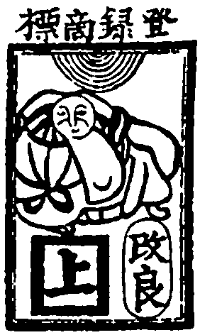
>
> ```yaml
> noborder: true
> size: "small"
> position: "aside"
> license: "cc0"
> ```
>
> <span class="noun" lang="ja-Latn">Sanjōya</span>’s trademark, registered on the 24th of November 1890 by <span class="noun" lang="ja-Latn">Kawasaki Matayoshi</span> (<span lang="ja">川崎又吉</span>).[@Trademarks1905 p. 65]

<span class="noun" lang="ja-Latn">Sanjōya</span> was the second company to apply for a
trademark for <span class="noun" lang="ja-Latn">Hanafuda</span> after [<span class="noun"
lang="ja-Latn">Kamigataya</span>](#kamigataya). Their mark was <span lang="ja">
上</span> in a square. Another mark they used (for the store itself) was <span
lang="ja">又</span> under a mountain.

###  <span class="noun" lang="ja-Latn">Maruyoshi</span> (<span lang="ja">マル芳</span>)

Based in <span class="noun" lang="ja-Latn">Ōsaka</span>, their mark was <span class="circled"
lang="ja">芳</span> in a circle. I know of nothing else about this manufacturer.

### <span class="noun" lang="ja-Latn">Itō Kōji Shōten</span> (<span lang="ja">伊藤幸治商店</span>)

A <span class="noun" lang="ja-Latn">Kyōto</span> manufacturer, only has one deck that I know of:

* <span lang="ja">近代花</span> (<span lang="ja-Latn">kindaibana</span>, ‘modern flowers’)

### Alaska playing cards

Alaska was a playing-card company that also manufactured some hana-trump decks. I know of nothing else about them.

> [!figure]
> 
> 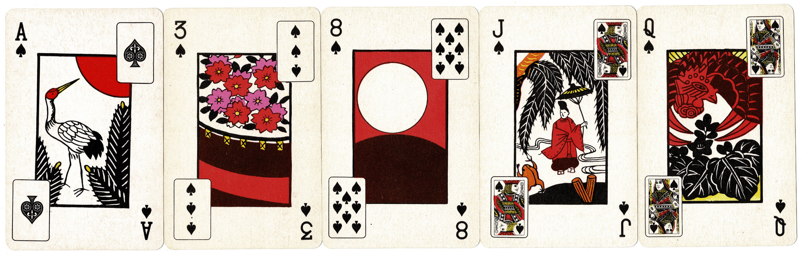
>
> ```yaml
> noborder: true
> size: "wide"
> ```
>
> The five brights of Alaska’s hana-trump deck.


## Unknown

The following brands are by unknown manufacturers. Any help identifying them
would be greatly appreciated!

* <span lang="ja">𛂁𛁲゙𛁈𛀸</span>/<span lang="ja">な𛁲゙𛁈𛀸</span>/<span lang="ja">なでしこ</span> (<span lang="ja-Latn">nadeshiko</span>, ‘pink’ (the flower))
* <span lang="ja">勝力士</span> (<span lang="ja-Latn">katsu rikishi</span>, ‘winning sumo wrestler’)
* <span lang="ja">優良太平楽</span> (<span lang="ja-Latn">yūryō taiheiraku</span> ‘excellent happy-go-lucky’, which is the name of a <span lang="ja-Latn">gagaku</span> piece)

> [!figure]
>
> 
>
> The <span lang="ja-Latn">taiheiraku</span> wrapper.
