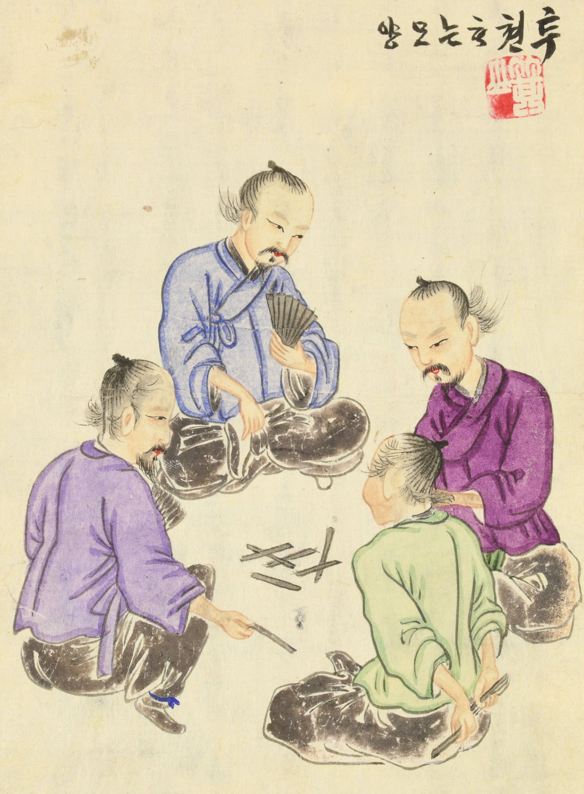

Tuejon images:

https://www.prm.ox.ac.uk/collections-online#/item/prm-object-67423

> [!figure]
> 
> 
>
> ```yaml
> originalUrl: "https://www.penn.museum/collections/object/36173"
> identifier: "21574K"
> license: "terms"
> orgName: "Penn Museum"
> termsUrl: "https://www.penn.museum/about-collections/rights-and-permissions"
> ```
>
> A group of Tujeon players.<br/><cite lang="ko">투전 하는 모양</cite> by <span lang="ko-Latn" class="noun">Gisan</span> <span lang="ko" class="noun">기산</span> (1886).
