Manufacturing of playing cards in New Zealand started in the 1880s. Despite this
early start, there have not been many manufacturers of playing-cards.

The main “lines” of manufacturers described below are (or were):

* [John Dickinson/Croxley](#john-dickinsoncroxley)
* [A. D. Willis/Weeks Ltd./United Empire Box/Amcor](#a-d-willisweeks-ltdunited-empire-boxamcor)
* [Strong & Ready/Tanner Couch](#strong-andamp-readytanner-couch)

> [!figure]
>
> 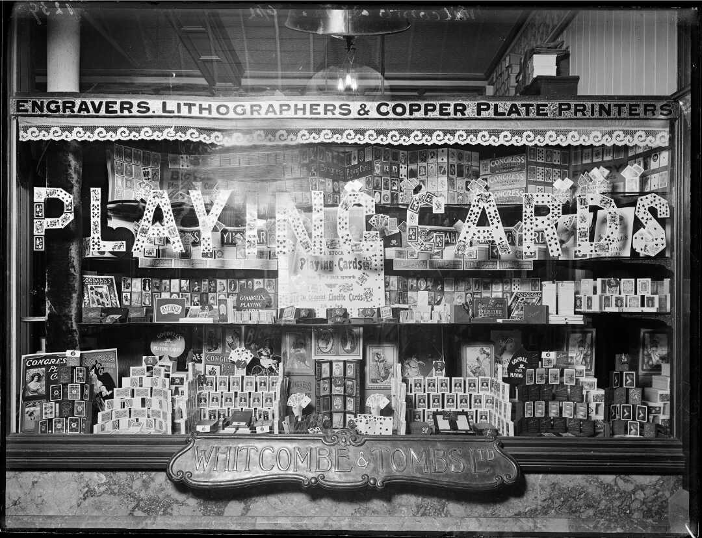
>
> ```yaml
> size: wide
> originalUrl: https://natlib.govt.nz/records/23236778
> orgName: Alexander Turnbull Library
> identifier: 1/1-003979-G
> license: with-permission
> ```
>
> Window display at Whitcombe & Tombs (now Whitcoulls), Christchurch (1912). Mostly showing foreign-made cards: Goodall & Congress.

## Tax Stamps

Playing cards imported into New Zealand were taxed from 1860, and stamped from
1880 until the tax ended in 1930.[@TaxStampNZ] All examples I have
seen have been stamped on the <Cards>d2</Cards>.

> [!multi]
> > [!figure]
> >
> > 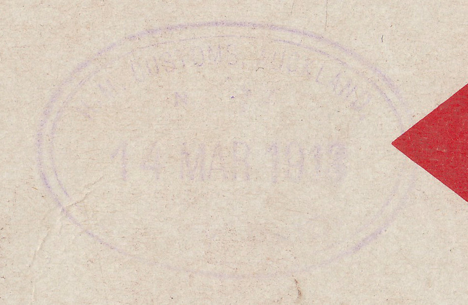
> > 
> > Tax stamp dated 14<sup class="ordinal">th</sup> March, 1913, on imported “1001 Aladdin” cards made by the National Card Co. of Indianapolis & New York.
>
> > [!figure]
> >
> > 
> >
> > Tax stamp dated 21<sup class="ordinal">st</sup> June, 1929, on imported “Congress” brand cards made by the United States Playing Card Co. in Windsor, Ontario, Canada.
>
> > [!figure]
> >
> > 
> >
> > Undated tax stamp from A. D. Willis cards.

> [!todo]
> A section on Playing cards & Māori

## Manufacturers

### John Dickinson/Croxley


The original John Dickinson/Croxley factory (known as “Croxley house”) still
stands in Wellington and was turned into [an apartment
building](https://custance.co.nz/project/croxley-mills-apartments) in the early 2000s.


John Dickinson was a stationery company based in the United Kingdom that opened
a New Zealand branch (“John Dickinson & Co.”) in 1920.[@CroxleyHistory]
“Croxley” was their public brand of stationery products in New Zealand (the UK
company originated in [Croxley
Green](https://en.wikipedia.org/wiki/Croxley_Green)), under which they also
published playing cards. As far as I know, the UK company never manufactured
cards.

> [!figure]
>
> 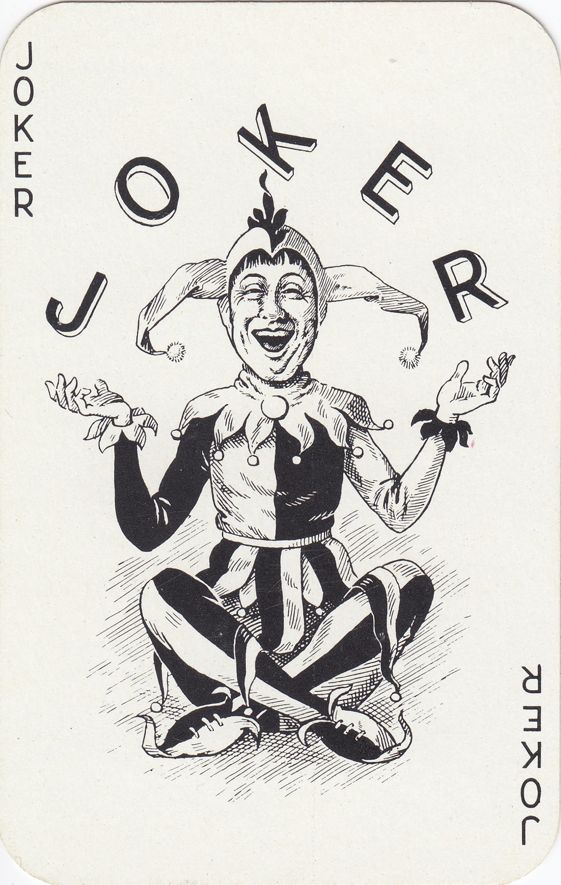
>
> ```yaml
> noborder: true
> position: left
> ```
>
> The Joker card (with the non-pictorial decks) remains unchanged throughout the years, aside from reproduction infelicities.


In 1966 the UK company merged with E. S. & A. Robinson to form
“Dickinson–Robinson Group”; the New Zealand firm was renamed to “The Dickinson
Robinson Group” for a few months from 19 Dec 1968 – 26 Mar 1969, and then “DRG
(New Zealand) Limited” until they were liquidated in 1994.[@DRGCompany]

Croxley remained around as its own company, but closed its last manufacturing
plant in 2005.[@CroxleyClosing] The brand itself still exists, being owned by
OfficeMax. However, it may soon disappear forever as OfficeMax closed all of its
New Zealand stores in late 2020,[^fn0] and is now
online-only. Current Croxley cards appear to be made in China and only retain
the Ace as a nod to the Dickinson line.

[^fn0]: A victim of Covid-19.

The aces have changed over the years to match the name of the company; the later
aces are often poor copies of the earlier ones, where detail has been lost.

> [!multi-wide]
>
> > [!figure]
> >
> > 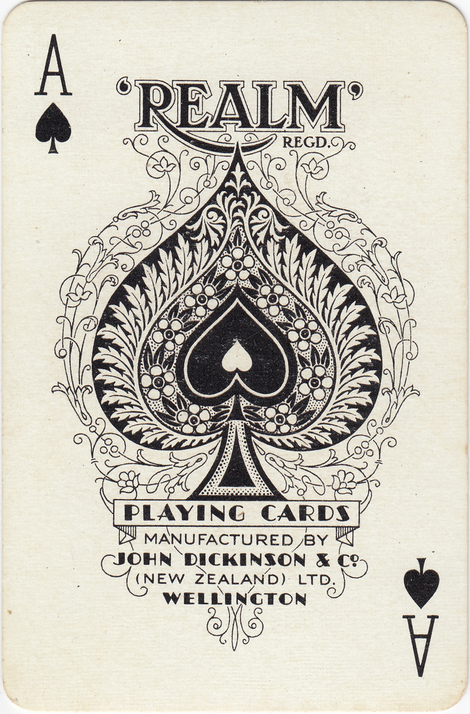
> >
> > ```yaml
> > noborder: true
> > ```
> >
> > An early “John Dickinson & Co.” Realm Ace.
> 
> > [!figure]
> >
> > 
> >
> > ```yaml
> > noborder: true
> > ```
> >
> > A “John Dickinson” Ace.
> 
> > [!figure]
> >
> > 
> >
> > ```yaml
> > noborder: true
> > ```
> >
> > A “DRG” Ace.
> 
> > [!figure]
> >
> > 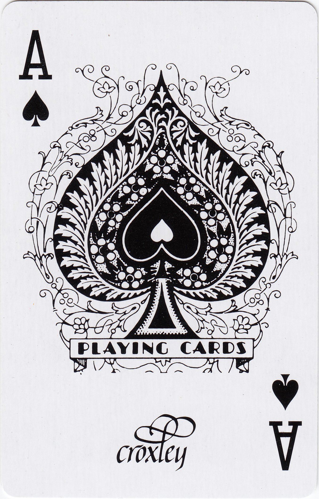
> >
> > ```yaml
> > noborder: true
> > ```
> >
> > A “Croxley” Realm Ace, purchased 2021.

The earlier (pre-DRG) cards are most easily identified by a <Cards>J</Cards> index which has a turned-in tail, but this feature is lost in the DRG cards which shifted to a sans-serif index.

> [!multi-wide]
> > [!figure]
> >
> > 
> >
> > ```yaml
> > noborder: true
> > ```
> >
> > An early “John Dickinson & Co.” Realm Jack, printed in four colours.
> 
> > [!figure]
> >
> > 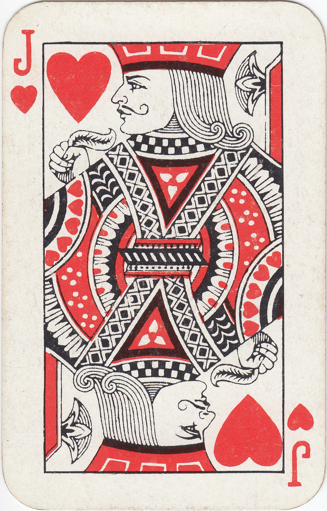
> >
> > ```yaml
> > noborder: true
> > ```
> >
> > A “John Dickinson” Jack, printed in two colours.
> 
> > [!figure]
> >
> > 
> >
> > ```yaml
> > noborder: true
> > ```
> >
> > A “DRG” Jack, with portrait reduced in size and sans-serif indices. There is visible degradation of the linework.
> 
> > [!figure]
> >
> > 
> >
> > ```yaml
> > noborder: true
> > ```
> >
> > A “Croxley” Realm Jack, with courts no longer derived from the John Dickinson pattern.

> [!multi-wide]
> > [!figure]
> >
> > 
> > 
> >
> > ```yaml
> > noborder: true
> > ```
> >
> > At one point, DRG produced Waddington’s cards in New Zealand, under licence. Note the text on the Ace and the small ® on the joker.
>
> > [!figure]
> >
> > 
> > 
> >
> > ```yaml
> > noborder: true
> > ```
> >
> > Cards from a DRG-produced Canasta set. Note that the Joker is the same as [Strong & Ready](#strong-andamp-readytanner-couch)’s. It is possible DRG took over this design from them (the rest of the deck is standard DRG).

The curled-<Cards>J</Cards> index on the pre-DRG cards is useful in identifying
tourist pictorial decks where the card images are replaced by photographs of
scenic locations, so that the Ace gives no identifying information. The
following cards are from a deck produced before 1958:

> [!multi-wide]
> > [!figure]
> >
> > 
> >
> > ```yaml
> > noborder: true
> > ```
> >
> > A pictorial card with the characteristic <Cards>J</Cards> index.
> 
> > [!figure]
> >
> > 
> >
> > ```yaml
> > noborder: true
> > ```
> >
> > The back of the card deck, showing a woman performing with <a href="https://en.wikipedia.org/wiki/Poi_(performance_art)"><span lang="mi">poi</span></a>.
> 
> > [!figure]
> >
> > 
> >
> > ```yaml
> > noborder: true
> > ```
> >
> > The joker of the deck, featuring a <a href="https://en.wikipedia.org/wiki/Hei-tiki"><span lang="mi">hei-tiki</span></a>. Note that this rather offensively reduces a <a href="https://en.wikipedia.org/wiki/Taonga"><span lang="mi">taonga</span></a> to the status of a jester.

The Dickinson and DRG cards are probably most often found with backs designed
for tourists, depicting locations around New Zealand, or New Zealand wildlife:

> [!multi]
> > [!figure]
> >
> > 
> >
> > ```yaml
> > noborder: true
> > ```
> >
> > Croxley/John Dickinson & Co. card back showing a <a href="https://en.wikipedia.org/wiki/Tui_(bird)">Tūī</a>.
> 
> > [!figure]
> >
> > 
> >
> > ```yaml
> > noborder: true
> > ```
> >
> > Croxley/John Dickinson & Co. card back showing a <a href="https://en.wikipedia.org/wiki/New_Zealand_fantail">Fantail</a>.


> [!multi-wide]
> > [!figure]
> >
> > 
> >
> > ```yaml
> > noborder: true
> > ```
> >
> > Croxley/John Dickinson card back showing the <a href="http://ketechristchurch.peoplesnetworknz.info/places_and_streets/topics/show/415-ferrier-fountain-christchurch-town-hall">Ferrier fountain</a>.
> 
> > [!figure]
> >
> > 
> >
> > ```yaml
> > noborder: true
> > ```
> >
> > John Dickinson card back showing the Queenstown gondola (the first in the southern hemisphere).
> 
> > [!figure]
> >
> > 
> >
> > ```yaml
> > noborder: true
> > ```
> >
> > Croxley/DRG card back showing <a href="https://en.wikipedia.org/wiki/Aoraki_/_Mount_Cook"><span class="noun" lang="mi">Aoraki</span> / Mount Cook</a>.

### A. D. Willis/Weeks Ltd./United Empire Box/Amcor

> [!figure]
>
> 
>
> ```yaml
> size: wide
> orgName: Museum of Te Papa Tongarewa
> identifier: GH007256
> originalUrl: https://collections.tepapa.govt.nz/object/333268
> license: stock-image 
> ```
>
> Playing cards, circa 1920, Whanganui, by A. D. Willis Ltd.


> [!figure]
>
> 
>
> ```yaml
> position: aside
> originalUrl: https://natlib.govt.nz/records/22778453
> license: cc0
> orgName: Alexander Turnbull Library 
> ```
>
> Archibald Dudingston Willis, circa 1902.

Archibald Dudingston Willis (1842–1908)[@ADWillis_IPCS] was a very early manufacturer of playing cards in New Zealand who operated in Wanganui from the 1880s. In 1951 the company was sold to Weeks Ltd, which kept A. D. Willis as a subsidiary, and the business was sold in turn to United Empire Box (UEB) around 1964.[@AstuteBusinessman][^fn1] In the late 1980s the design was taken over by Kiwi Packaging (part of Amcor). This line of designs now appears to be out-of-print, as Amcor no longer manufacture playing cards.

[^fn1]: Some sources (including [@ADWillis_IPCS]) state 1949 here, but 1951 is corroborated by newspaper reports.[@AYearOfExpansion]

> [!figure]
> 
> 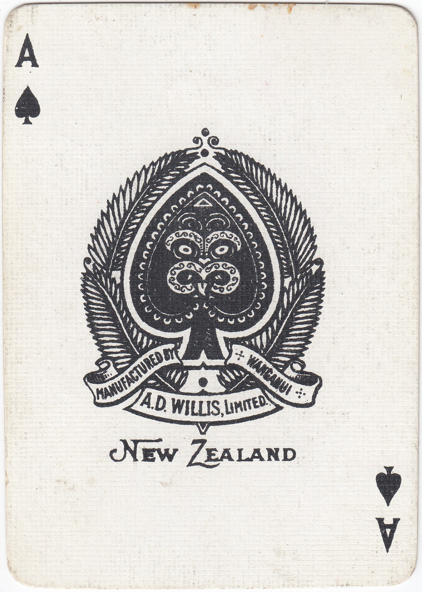
> 
> 
> 
>
> ```yaml
> noborder: true
> ```
>
> Cards in the original A. D. Willis style, <abbr title="circa">c.</abbr> 1910.


> [!figure]
>
> 
> 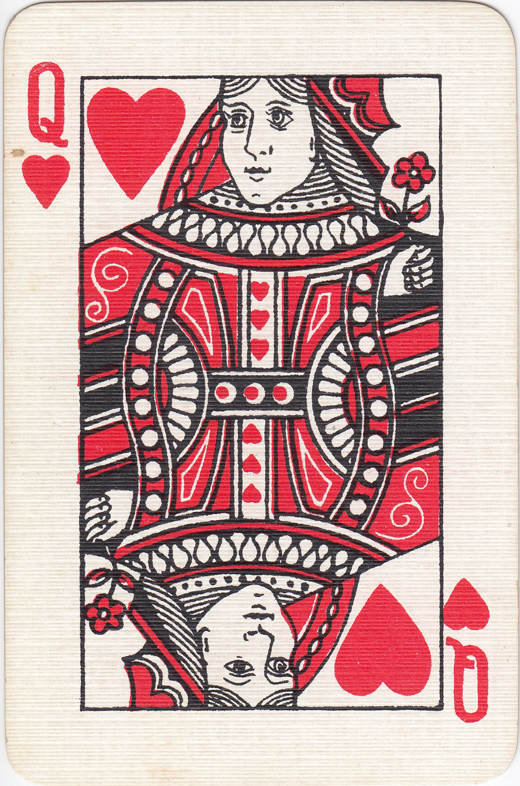
> 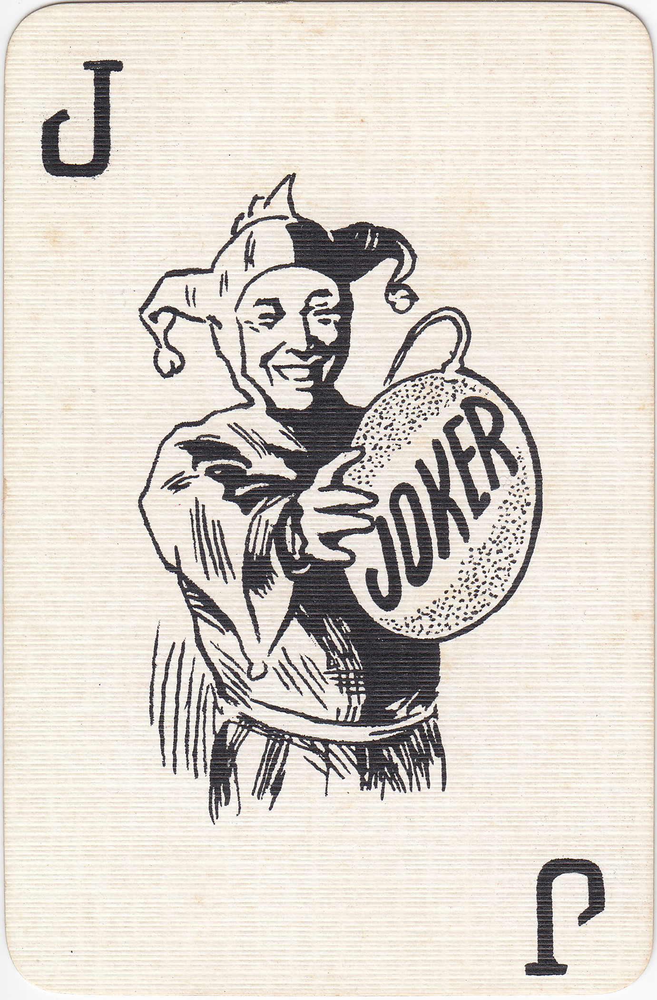
> 
> 
> ```yaml
> noborder: true
> ```
>
>  Cards in the later Willis style, this deck possibly produced by A. D. Willis.  The deck is a 500 deck and includes <Cards>⑪</Cards>s, <Cards>⑫</Cards>s, and <Cards>⑬</Cards>s. An unusual detail is that the tail of the <Cards>Q</Cards> index is truncated on the red cards. 

> [!figure]
>
> 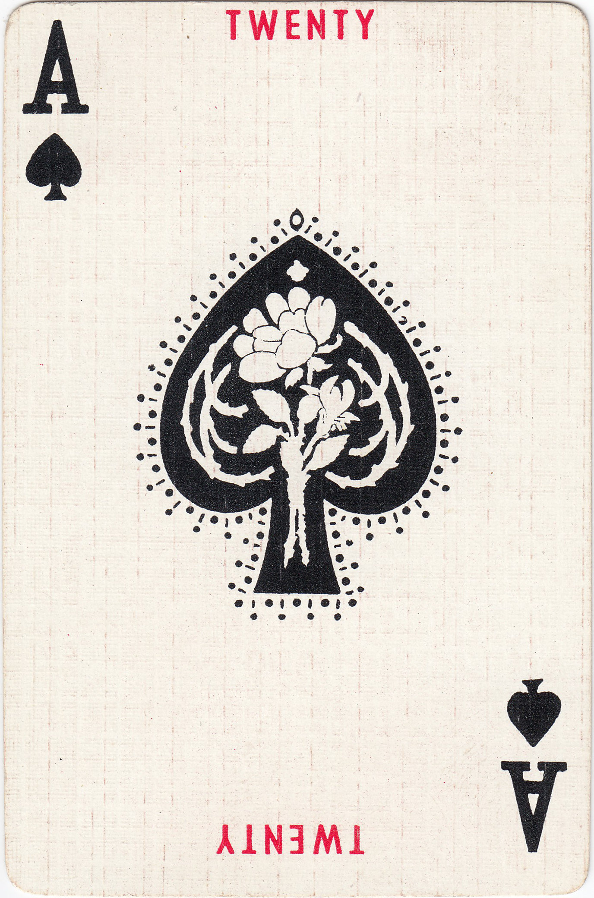
> 
> 
> 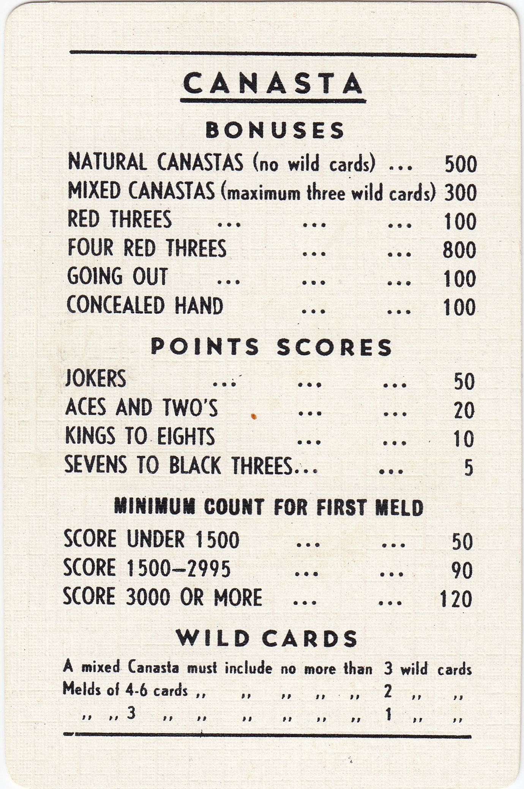
>
> ```yaml
> noborder: true
> ```
>
> “Hostess” Canasta cards in the Willis style, as produced by Weeks Ltd. This deck retains the short tail on the red <Cards>Q</Cards> index.

> [!figure]
> 
> 
> 
> 
> 
>
> ```yaml
> noborder: true
> ```
>
> “Strand” Cards in the Willis style, this deck probably made by UEB. The designs are redrawn from the original Willis design. This deck is unusual in that the paper is uncoated and the cards feel like plain cardboard, despite the box promising a “Linen Finish”.

> [!figure]
>
> 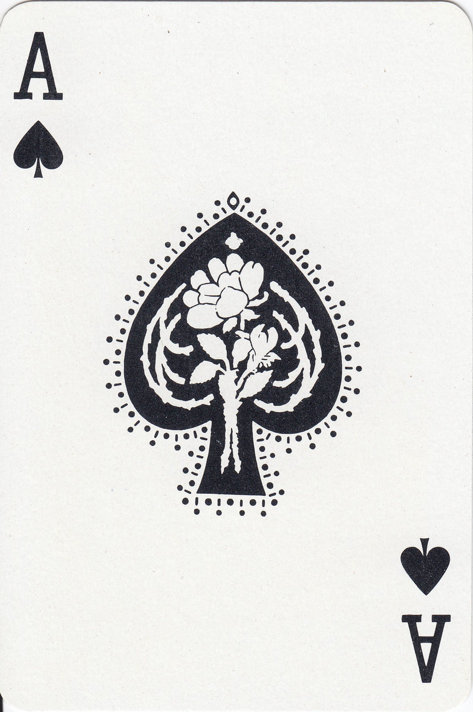
> 
> 
> 
>
> ```yaml
> noborder: true
> ```
>
> “Royal” Cards in the Willis style, made by UEB in four colours. “Kiwi” on the box describes the card backs.

> [!figure]
>
> 
>
> ```yaml
> size: small
> position: aside 
> ```
>
> An earlier “Arcade” box as produced by Weeks Ltd.


> [!figure]
>
> 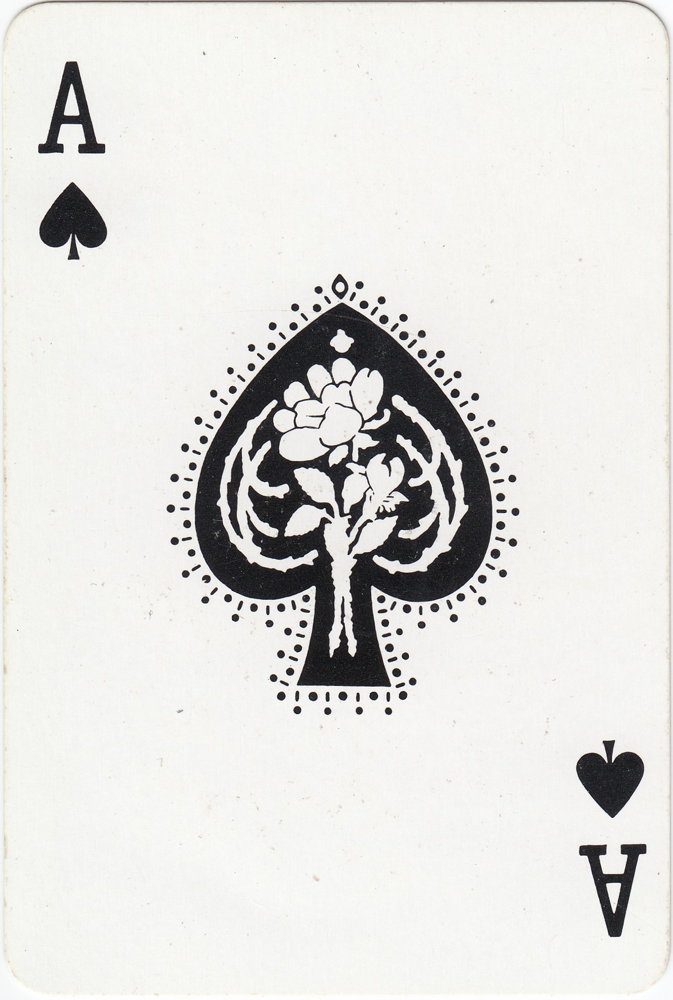
> 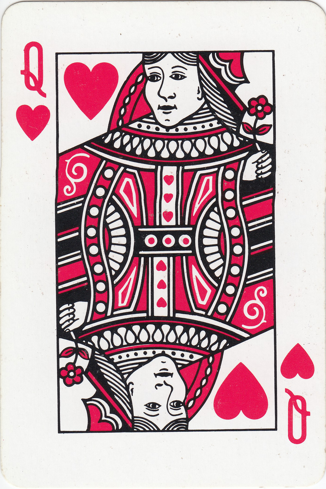
> 
> 
>
> ```yaml
> noborder: true
> ```
>
> “Arcade” Cards in the Willis style, produced by Amcor Cartons.

UEB also produced pictorial souvenir decks, such as the one below.

> [!figure]
>
> 
> 
> 
>
> ```yaml
> noborder: true
> ```
>
> Back and cards from a UEB tourist deck.


> [!figure]
>
> 
>
> ```yaml
> size: wide
> originalUrl: https://natlib.govt.nz/records/22738050
> license: cc0
> orgName: Alexander Turnbull Library 
> ```
>
> An advertisement for A. D. Willis’s playing cards.


### Strong & Ready/Tanner Couch

Strong & Ready Ltd. was registered from 1948–1974.

> [!figure]
>
> 
> 
> 
> 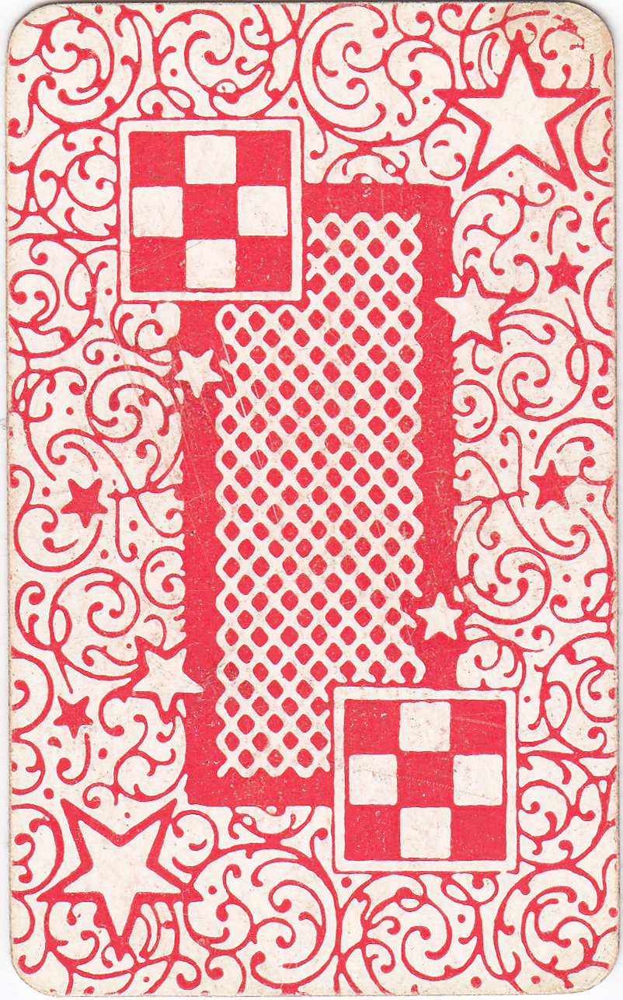
>
> ```yaml
> noborder: true
> size: wide
> ```
>
> Strong & Ready “Elfin” patience-sized playing cards.


> [!figure]
>
> 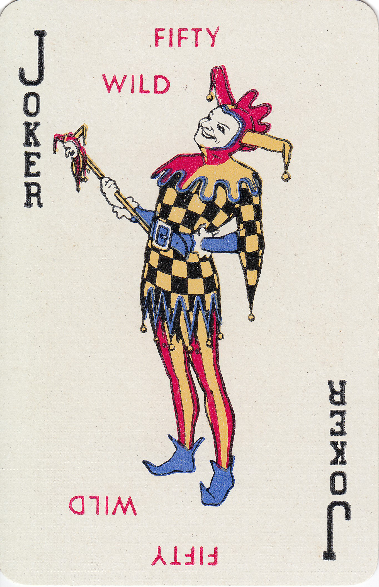
> 
> 
> 
>
> ```yaml
> noborder: true
> size: wide 
> ```
>
> Strong & Ready cards from a Canasta deck, 1953.


> [!multi-wide]
> > [!figure]
> >
> > 
> > 
> >
> > ```yaml
> > noborder: true
> > ```
> >
> > Strong & Ready Joker and Ace, from a “Mark 1 Canasta” deck.
> 
> > [!figure]
> >
> > 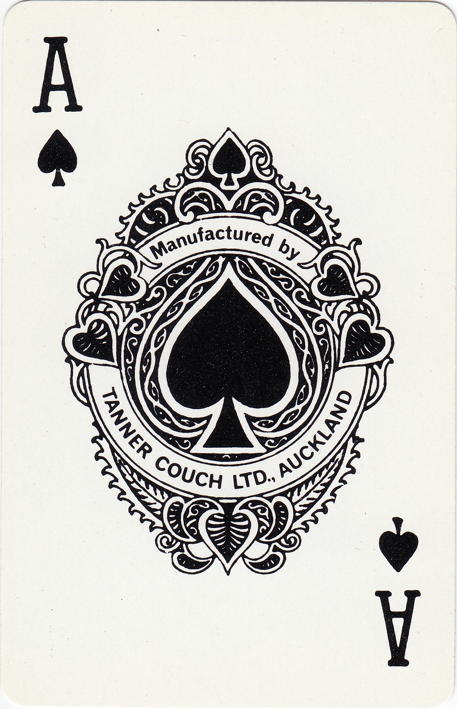
> > 
> >
> > ```yaml
> > noborder: true
> > ```
> >
> > Tanner Couch Ace and Joker, from a “Royal Flush 500” deck.


### Foreign manufacturers

In addition to cards manufactured in New Zealand, cards featuring New Zealand
scenes were manufactured in other countries, such as the United Kingdom.

> [!figure]
>
> 
> 
>
> ```yaml
> noborder: true
> ```
>
> Two card backs produced by Goodall under their “Boudoir” brand, with art by [Frank H. Mason](https://en.wikipedia.org/wiki/Frank_Henry_Mason). The left features [Mount Taranaki / Egmont](https://en.wikipedia.org/wiki/Mount_Taranaki), and the right [Lake Matheson](https://en.wikipedia.org/wiki/Lake_Matheson).
