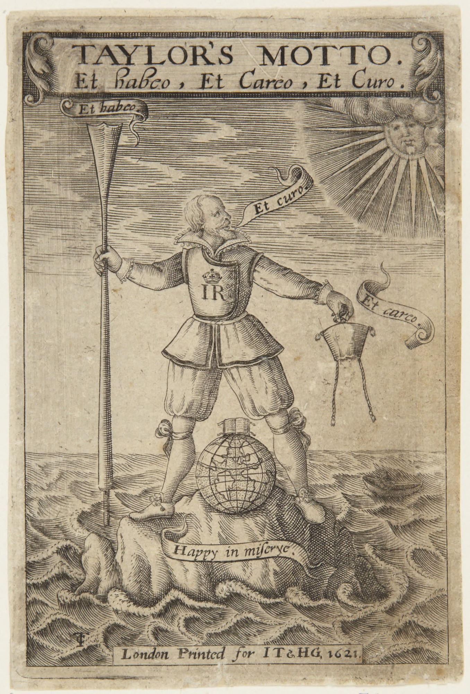

# <cite>Taylor’s Motto</cite> (1621)


> [!figure]
>
> 
>
> ```yaml
> position: "aside"
> license: "cc0"
> originalUrl: "https://artmuseum.princeton.edu/collections/objects/46096"
> orgName: "Princeton University Art Museum"
> ```
>
> Frontispiece to Taylor’s <cite>Motto</cite> (1621).

[John Taylor](https://en.wikipedia.org/wiki/John_Taylor_(poet)) (1578–1653) was
an English poet who gave himself the epithet “the Water-Poet”. His work
<cite>Taylor’s Motto</cite> was published in 1621, and contains a list of games in one verse, as follows:

> The Prodigals estate, like to a flux,\
> The Mercer, Draper, and the Silkman sucks:\
> The Taylor, Millainer, Dogs, Drabs and Dice,\
> Trey-trip, or Passage, or The most at thrice;\
> At Irish, Tick-tack, Doublets, Draughts or Chesse,\
> He flings his money free with carelessenesse:\
> At Nouum, Mumchance, mischance, (chuse ye which\
> At One and thirty, or at Poore and rich,\
> Ruffe, slam, Trump, nody, whisk, hole, Sant, Newcut.\
> Vnto the keeping of foure Knaues he'le put\
> His whole estate, at Loadum, or at Gleeke\
> At Tickle-me-quickly, he's a merry Greeke,\
> At Primefisto, Post and payre, Primero,\
> Maw, Whip-her-ginny, he•s a lib'rall Hero;\
> At My-sow-pigg'd, and (Reader neuer doubt ye,\
> He's skil'd in all games, except) Looke about ye.\
> Bowles, shoue-groate, tennis, no game comes amis,\
> His purse a nurse for any body is;\
> Caroches, Coaches, and Tobacconists,\
> All sorts of people freely from his fists\
> His vaine expences daily sucke and soake,\
> And his himselfe sucks onely drinke and smoake,\
> And thus the Prodigall, himselfe alone,\
> Giues suck to thousands, and himselfe sucks none.[@TaylorsMotto]

The named games are:
- Dice games:
    - Trey-Trip
    - Passage: see [Passage](games/passage/passage.md)
    - The Most at Thrice
- Tables games:
    - Irish
    - Tick-tack
    - Doublets
- Board games:
    - Draughts
    - Chess
- Card games:
    - Nouumm
    - Mumchance
    - Mischance
    - One and Thirty
    - Poore and Rich
    - Ruffe
    - Slam
    - Trump
    - Nody
    - Whisk
    - Hole: probably [My Lady’s Hole](games/my-ladys-hole/my-ladys-hole.md)
    - Sant
    - Newcut
    - Loadum
    - Gleeke
    - Tickle-me-quickly
    - Primefisto
    - Post and Payre
    - Primero
    - Maw
    - Whip-her-ginny
    - My-sow-pigg’d: [My Sow (Has) Pigged](games/my-sow-pigged/my-sow-pigged.md)
- Physical games:
    - Bowles
    - Shoue-groate
    - Tennis
