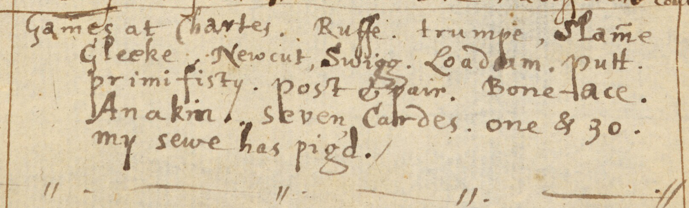

<p class="lead">Thomas Crosfield’s diary entry for Christmas day 1629 contains an entry titled “Games at Chartes” that contains a list of card games.[@ThomasCrosfield fol. 34r]</p>

> [!figure]
> 
> 
>
> ```yaml
> originalUrl: "https://digital.bodleian.ox.ac.uk/objects/fe116079-c422-402f-8dca-3efce5f73ff9/surfaces/ed1b83c1-1c2d-48ad-b1be-df7662d730f2/"
> orgName: "The Provost and Fellows of the Queen’s College, Oxford"
> license: "cc-by-nc"
> licenseVersion: "4.0"
> copyrightYear: 2022
> size: "wide"
> ```
>
> The original diary entry.

The games listed are:

<dl>
<dt>Ruffe</dt>
<dt>trumpe</dt>
<dt>Slam̃e</dt>
<dt>Gleeke</dt>
<dd>[Gleek](games/gleek/gleek.md)</dd>
<dt>Newcut</dt>
<dt>Swigg</dt>
<dt>Loadam</dt>
<dt>putt</dt>
<dt>primifisty</dt>
<dt>post & pair</dt>
<dt>Bone-ace</dt>
<dt>Anakin</dt>
<dt>Seven Cardes</dt>
<dt>one & 30</dt>
<dd>[Thirty One](games/thirty-one/thirty-one.md)</dd>
<dt>my sewe has pig’d</dt>
<dd>[My Sow Has Pigged](games/my-sow-pigged/my-sow-pigged.md)</dd>
</dl>
