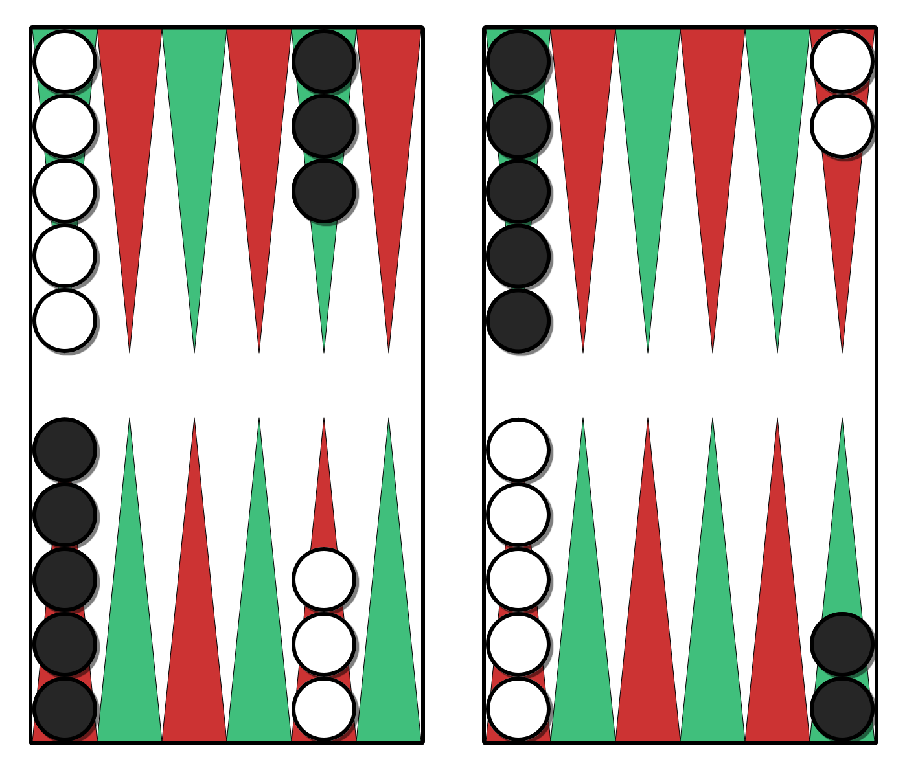

# Backgammon

> [!figure]
>
> 
>
> The initial board setup.

History:
- 

Ref:
- @OxfordBG
- @Falkener [p. 254]
- @Bell [p. 42]
- @BriefHistoryOfBackgammon
- @BackgammonAncientIndian
- @BackgammonLo
- @PubGamesOfEngland [p. 29–35]
- @Murray2 [§6.2.12, p. 122]

Variants:

- Duplicate Backgammon [@NewRules, p. 32]
- Chouettes [@NewRules, p. 162]
- Dutch Backgammon [@NewRules, p. 167]
- 1000-point Backgammon [@NewRules, p. 167]
