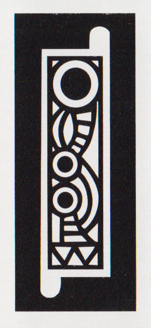
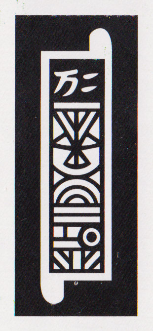
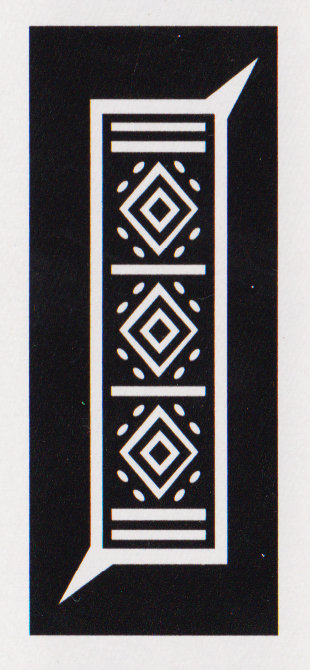
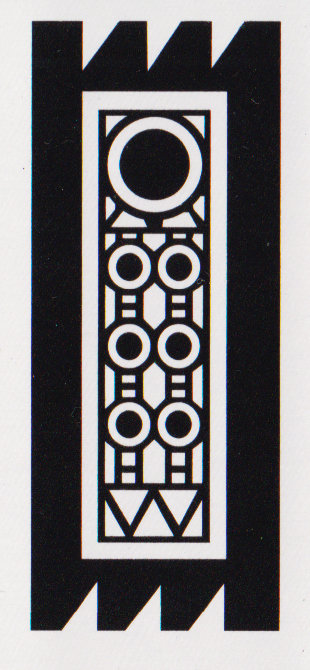
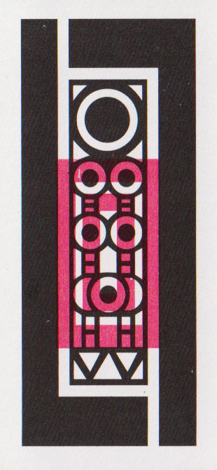
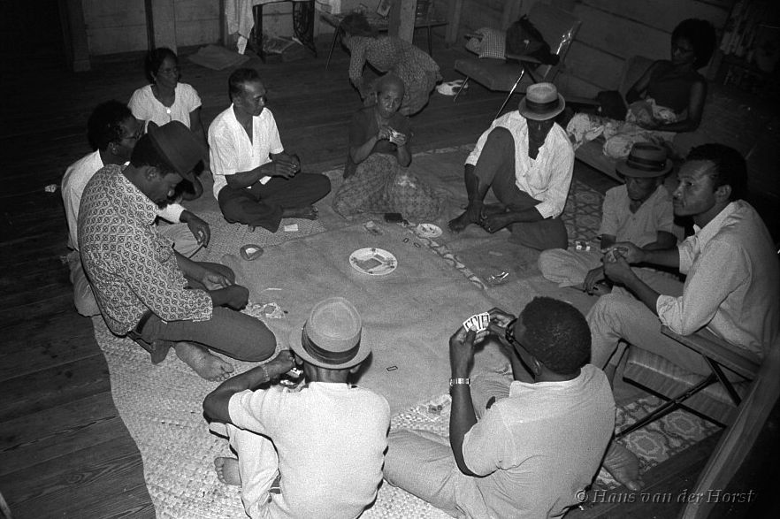
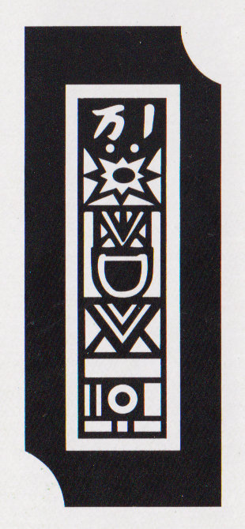

# <span lang="ms" class="noun">Balik Satu</span>

<span class="noun aka" lang="ms">Balik Satu</span> (‘turn one’) is a Peranakan game played with [Cherki cards](articles/cards/ceki/ceki.md). The method of play is similar to [Mahjong](games/mahjong/mahjong.md), with the goal being to collect five sets of three cards.

Most of the description below is drawn from @ChikiCards [p. 122], with additions from @TheBabas [p. 155].

## Equipment

<span class="noun" lang="ms">Balik Satu</span> can be played by almost any number of people as long as you have enough cards. My two sources give differing amounts of cards per player. (I am inclined to prefer the middle column as it starts with the simple example of two decks for two people, even though the book suggests that up to 20 people can play with a total of 1&#x202f;200 cards!) Recall that a <span class="noun" lang="ms">Cherki</span> deck contains 60 cards, two of each type, so a ½ deck has 30 cards, one of each type.

<table class="numeric">
<thead>
<tr>
<th rowspan="2">
Players
</th>
<th colspan="3">
Decks (Cards)
</th>
</tr>
<tr>
<th>
from Pwee
</th>
<th>
from <cite>The Babas</cite>
</th>
<th>
from @ChaquiAndPartui
</th>
</tr>
</thead>
<tbody>
<tr>
<th scope="row">
2
</th>
<td>
2½ (150)
</td>
<td>
2 (120)
</td>
<td>
—
</td>
</tr>
<tr>
<th scope="row">
3
</th>
<td rowspan="2">
3 (180)
</td>
<td>
2½ (150)
</td>
<td rowspan="2">
2
</td>
</tr>
<tr>
<th scope="row">
4
</th>
<td>
3 (180)
</td>
</tr>
<tr>
<th scope="row">
5
</th>
<td rowspan="2">
3½ (210)
</td>
<td>
3½ (210)
</td>
<td rowspan="2">
3
</td>
</tr>
<tr>
<th scope="row">
6
</th>
<td>
4 (240)
</td>
</tr>
<tr>
<th scope="row">
7
</th>
<td rowspan="2">
4 (240)
</td>
<td>
4½ (270)
</td>
<td rowspan="2">
4
</td>
</tr>
<tr>
<th scope="row">
8
</th>
<td>
5 (300)
</td>
</tr>
<tr>
<th scope="row">
9
</th>
<td rowspan="2">
4½ (270)
</td>
<td>
5½ (330)
</td>
<td rowspan="2">
5
</td>
</tr>
<tr>
<th scope="row">
10
</th>
<td>
6 (360)
</td>
</tr>
<tr>
<th scope="row">
11
</th>
<td rowspan="2">
5 (300)
</td>
<td>
6½ (390)
</td>
<td rowspan="2">
6
</td>
</tr>
<tr>
<th scope="row">
12
</th>
<td>
7 (420)
</td>
</tr>
<tr>
<th scope="row">
13
</th>
<td rowspan="2">
5½ (330)
</td>
<td>
7½ (450)
</td>
<td rowspan="2">
7
</td>
</tr>
<tr>
<th scope="row">
14
</th>
<td>
8 (480)
</td>
</tr>
</tbody>
</table>

## Play

Deal 7 cards to each player, an additional card to the first player, and then a
second round of 7 cards to each player. Set the remainder of the cards in the
middle of the table face-down, to form the stock. <strong>Alternately</strong>,
with a large number of people it is faster to wash-shuffle the cards in the
centre of the table and then for each person to draw 14 cards (15 for the
starting player).

The first player starts the game by discarding one card face-up to the middle.
Play in an anti-clockwise direction; the next player is the person to their
right.

On a player’s turn they can either take the last discard or the next face-down
card, and must discard a card to complete their turn. The goal is to form your
hand into five sets of three: a set can be three of the same rank (i.e. with the
same indices) or three of the exact same card, which is called a <span
lang="ms">mata</span> (‘eye’), or a ‘passport’ in Melaka. A player
<strong>must</strong> have at least one <span lang="ms">mata</span> to win, and
the winning card that completes the hand (making 15 cards) must be drawn from
the stock, not from a discard.

**Calling**: once a player has formed four sets in their hand and only needs one
card to win, they can “call” on their next discard. To do this, they discard and
then flick their discarded card with their finger. If they have formed at least
one <span lang="ms">mata</span> already, they call ‘<span
lang="ms">tan</span>’,[^tan] or else (if they are trying to
form a <span lang="ms">mata</span> for their last set) they call ‘<span
lang="ms">ceki</span>’.[^ceki]

[^tan]: This comes from Hokkien <span lang="nan">等</span> <span lang="nan-Latn">tán</span> ‘wait’.
[^ceki]: From Hokkien <span lang="nan">一枝</span> ‘one card’.

> [!figure]
>
> 
> 
> 
> 
> 
> 
> 
> 
> 
> 
> 
> 
> 
> 
>
> ```yaml
> cram: true
> noborder: true
> size: "wide"
> hidden: true
> ```
>
> A hand with four complete sets that can be called as ‘<span lang="ms">ceki</span>’, hoping to turn the pair of identical <Cards>8</Cards>s into a <span lang="ms">mata</span>.

Once any player has called, whenever a player draws from the face-down stock,
they must reveal the card before adding it to their hand. If it is the winning
card for a player who has called, the calling player takes it and wins the
round. When a player claims or draws a winning card they call ‘<span
lang="ms">sampei!</span>’ (‘arrived!’).

A player who has called can still change their hand if they think they can
improve it, by turning an existing mixed set into a <span lang="ms">mata</span>.
If they do this and have already called ‘<span lang="ms">ceki</span>’ they can
change their call to ‘<span lang="ms">tan</span>’.

### Scoring

The winner draws an additional card from the deck (hence the name of the game),
and this determines the value of their hand. Unmarked cards are worth their rank
value (1–9 points), and the red-stamped cards are worth more:

> [!multi]
> > [!figure]
> >
> > 
> >
> > ```yaml
> > size: small
> > noborder: true
> > hidden: true
> > ```
> >
> > Red Nine scores 10 points.
> 
> > [!figure]
> >
> > 
> >
> > ```yaml
> > size: small
> > noborder: true
> > hidden: true
> > ```
> >
> > Nyonya scores 11 points.
> 
> > [!figure]
> >
> > 
> > ```yaml
> > size: small
> > noborder: true
> > hidden: true
> > ```
> >
> > Lau Chian scores 12 points.

A common rule is that if the drawn card is a rank-1 <span lang="ms">yeo</span>
card, then the winning player does not score and the round is played again.

The drawn card may be used to improve a set in the hand into a <span
lang="ms">mata</span>, if possible, by replacing a card of the same
rank. This is called <span lang="ms">kena</span> (‘contact’).[@TheBabas p. 162]

To the point value of the drawn card, the winner adds one point for each unmarked
<span lang="ms">mata</span>, and two points for each <span lang="ms">mata</span>
of red-stamped cards.

Finally, if the player won by completing a <span lang="ms">mata</span> (i.e.
they called ‘<span lang="ms">ceki</span>’),[^initially] then:

[^initially]: If the winner initially called ‘<span lang="ms">ceki</span>’ and later changed their call to ‘<span lang="ms">tan</span>’, it does not count as calling <span lang="ms">ceki</span>. The rules given in @ChikiCards also award 1 point for winning after calling <span lang="ms">tan</span>, but this seems superfluous as the winner will always win at least 1 point for their <span lang="ms">mata</span>.

* if someone else drew the winning card from the stock (called <span
  lang="ms">ayam</span>, ‘chicken’), they earn an additional
  1,[@GatewayToOldSchoolGames p. 71] 5,[@TheBabas p. 162] or 10[@ChikiCards]
  points, or
* if they self-drew the winning card (called <span lang="ms">kandang</span>
  ‘cage’), they earn an additional 2,[@GatewayToOldSchoolGames p. 71]
  10,[@TheBabas p. 162] or 20[@ChikiCards] points.

The player is then paid their total score by <em>each</em> player. In
Singapore[@ChikiCards] this is done by paying 10¢ per point.[^in70s]

[^in70s]: This was 5¢ a point in the 1970s[@TheBabas p. 162].

In the case that a player is initially dealt a winning hand (<span lang="ms">kandang tangan</span> ‘cage in hand’), they win instantly and double the normal scoring (no calling bonuses will apply).

### <span lang="mcm" class="noun aka">Chaqui</span>

> [!aside]
>
> A video of this game being played can be found on [the Endangered Languages Archive (ELAR).](https://www.elararchive.org/uncategorized/IO_a417dbb9-20d8-43b6-9e24-a775e733edce/) At 2:20 one player wins and counts out the next 15 cards for scoring purposes.

Amongst the [Kristang](https://en.wikipedia.org/wiki/Kristang_people) (<span lang="mcm">Christão</span>), the game was known as <span lang="mcm" class="noun">Chaqui</span>, <span lang="mcm" class="noun aka">Chiqui</span>, or <span lang="mcm" class="noun aka">Chekki</span>.[@ChaquiAndPartui p. 34]

A set of three identical cards is called a <span lang="mcm">olo</span> (‘eye’). If an <span lang="mcm">olo</span> is completed by drawing another player’s discard, then it must be exposed.

The game is played as above, except that scoring is a fixed amount per <span lang="mcm">olo</span>, for example five points.

If a player completes their hand via <span lang="mcm">chiqui</span>, an identical pair, they may turn over the next 15 cards of the stock to try to turn the <span lang="mcm">chiqui</span> into an <span lang="mcm">olo</span>.

A song about the game runs:

> [!multi]
>
> > [!lang] mcm
> > 
> > Bom bom filo\
> > Nao bai djoga chiqui\
> > Com grande de bergonha\
> > Cum grandi pedrē sangui.
>
> My good good son\
> Don’t go and play <span lang="mcm">chiqui</span>\
> With great dishonour\
> With great loss of blood.

### <span class="noun aka" lang="ms">Balik Lima Belas</span>

> [!aside]
>
> Note that in @ChikiCards [p. 127], <span class="noun" lang="ms">Balik Lima Belas</span> and <span class="noun" lang="ms">Chot</span> are described as the same game. Here I separate them as in @TheBabas [p. 167]: <span class="noun" lang="ms">Balik Lima Belas</span> is a specific scoring method, and <span class="noun" lang="ms">Chot</span> is the four-player partnership version of the game.

<span class="noun" lang="ms">Balik Lima Belas</span> (‘draw fifteen’) is an alternate scoring mechanism for <span class="noun" lang="ms">Balik Satu</span>.

At the end of each round, instead of drawing one card as in <span class="noun" lang="ms">Balik Satu</span>, the winner draws fifteen cards from the stock. They must use these cards to try to improve their sets into <span lang="ms">mata</span> by swapping cards of equivalent rank, as in the <span lang="ms">kena</span> rule of <span class="noun" lang="ms">Balik Satu</span>. Scoring is calculated as one point for winning plus one for each <span lang="ms">mata</span> (so, always at least two points). 

In this form of the game the red-stamped cards do not score extra, but bonuses for winning by completing a <span lang="ms">mata</span> (<span
lang="ms">ayam</span> or <span lang="ms">kandang</span>) still apply.

### <span class="noun aka" lang="ms">Chot</span>

> [!aside]
>
> Note that the sources are a little unclear and contradictory, so I have attempted to harmonize this description.

<span class="noun" lang="ms">Chot</span> or <span class="noun aka" lang="ms">Kiong</span> is a version played with four players in partnerships, with partners sitting opposite each other. Three decks of cards are used (180 cards). 

The game is scored using two different tokens. Traditionally two sizes of seed such as those of the <span lang="ms">assam</span> (tamarind) and <span lang="ms">saga</span> ([<cite>Adenanthera pavonina</cite>](https://en.wikipedia.org/wiki/Adenanthera_pavonina)) trees,[@ChikiCards p. 127] or black and white marbles (<span lang="ms">pichi</span>)[@TheBabas p. 167] are used. The smaller (or white) tokens count as one point and the larger (or black) as ten points.

The game is played and scored as in <span class="noun" lang="ms">Balik Lima Belas</span>. Players take one token for each point scored, and if a player wins by completing a <span lang="ms">mata</span> (<span lang="ms">ayam</span> or <span lang="ms">kandang</span>) then they take 10-point tokens instead of single-point tokens. Players keep their seeds separate until one <span lang="ms">bangkong</span> is completed.

Once any player has obtained twenty points (called a <span lang="ms">bangkong</span>, ‘large frog’?), the partnerships pool their tokens.  The side with the larger number of points wins the <span lang="ms">bangkong</span> and records this number. The number of excess points above the other team they have is also recorded. All tokens are then returned to the pool.

Once a fixed number of <span lang="ms">bangkong</span> have been completed, the overall scores are tallied. The partnership with fewer <span lang="ms">bangkong</span> pays the team with more for the difference between their totals (e.g. $20 per <span lang="ms">bangkong</span>). The partnership with fewer ‘excess points’ also pays for the difference (e.g. 10¢ per point).

## Similar games

### <span class="noun aka" lang="jv-Latn" id="gonggong">Gonggong</span>

<span class="noun" lang="jv-Latn">Gonggong</span> (from Makassarese <span lang="mak" class="aka">ᨁᨚᨁᨚ</span>) is a very similar game. It was reported in South Sulawesi in the 19th century.[@MakassaarschWoordenboek p. 69] In the 1940s it is recorded in Java, where it is described as being played mostly by women.[@JavaanseKaartspelen p. 94–97] A game of this name  was also played by Javan emigrants in Suriname up until at least the 1970s.

> [!figure]
> 
> 
>
> ```yaml
> license: "with-permission"
> authorGiven: "Hans"
> authorFamily: "van der Horst"
> originalUrl: "https://www.facebook.com/Nickerianen/posts/pfbid0onFnYziW2UL8evg91FSZswgUdrrSTAfbyKzh39SrSbh6wEuE6cnSHHjx8UC5fyByl"
> ```
>
> A group of people playing Gonggong in the 1970s in Nickerie, Suriname.


The game as played in Surakarta was described as follows:

It is played with six sets of cards (180 cards) for four players, or eight sets (240 cards) for six players. Deal 14 cards each and play as with <span class="noun" lang="ms">Balik Satu</span>. In order to win, again at least one triplet (called a <span lang="jv-Latn">bak</span>) must be completed.

Waiting for a specific card to win (to complete a <span lang="jv-Latn">bak</span>) is called <span lang="jv-Latn">ceki nocog</span>, and is announced by placing one coin on the table. Waiting for any card of a particular rank is called <span lang="jv-Latn">ceki kowah</span> and is announced by placing two coins on top of each other.

A self-drawn win is called <span lang="jv-Latn">rabas</span> ‘clear’. A win by the opponents’ card is called <span lang="jv-Latn">metu</span> (formal <span lang="jv-Latn">medal</span>) ‘came out’.

**Scoring** is a little different to <span class="noun" lang="ms">Balik Satu</span>, and is done by one of several methods:

<dl>
<dt>
<span lang="jv-Latn">undhuh-undhuhan</span> (‘pickings’)
</dt>
<dd>
At the beginning of the game a pot is formed with a stake from each player. If a player wins with <span lang="jv-Latn">metu</span>, they win one stake from it. If a player wins with <span lang="jv-Latn">rabas</span>, they win the entire remaining pot.
</dd>
<dt>
<span lang="jv-Latn">toh bayaran</span> (‘stake payments’)
</dt>
<dd>
This method is very similar to <span class="noun" lang="ms">Balik Satu</span>. The winner scores according to the following scheme:
<ol>
<li>
1 for <span lang="jv-Latn">metu</span>; 2 for <span lang="jv-Latn">metu</span> with a red card, or <span lang="jv-Latn">rabas</span>; or 3 for <span lang="jv-Latn">rabas</span> with a red card,
</li>
<li>
an additional 1 for each <span lang="jv-Latn">bak</span> or 2 for each red <span lang="jv-Latn">bak</span> in their hand,
</li>
<li>
and then turn over the top card and add its points. Nyonya/Lau Chian/1 Myriads score 10 points, everything else according to rank (White Flower scores 1).
</li>
</ol>
> [!figure]
>
> 
> 
> 
>
> ```yaml
> size: "small"
> noborder: true
> justify: "centered"
> hidden: true
> ```
>
> These cards are worth 10 points each.
</dd>
<dt>
alternative <span lang="jv-Latn">toh bayaran</span>, drawing 14 cards
</dt>
<dd>
This method is very similar to <span class="noun" lang="ms">Balik Lima Belas</span>. The winner’s score is calculated according to steps 1 & 2 in <span lang="jv-Latn">toh bayaran</span> but instead of step 3, they draw 14 cards from the stock. They combine these 14 with the 14 cards from their hand (excluding the winning card) and try to form <span lang="jv-Latn">bak</span> from these cards. For each <span lang="jv-Latn">bak</span> they can form, they add 1 point, or 2 for a red <span lang="jv-Latn">bak</span>.
</dd>
</dl>

In the 1940s the <span lang="jv-Latn">toh bayaran</span> methods were paid out at 2¢[^fn0] per point from each other player.

[^fn0]: These were cents of the [Netherlands Indies gulden](https://en.wikipedia.org/wiki/Netherlands_Indies_gulden).

In Yogyakarta the following bets were used:

<dl>
<dt>
<span lang="jv-Latn">bak-bakan</span>
</dt>
<dd>
This is payment according to the number of <span lang="jv-Latn">bak</span>, i.e. the same as <span lang="jv-Latn">toh bayaran</span>.
</dd>
<dt>
<span lang="jv-Latn">umbuk</span> (‘piled’)
</dt>
<dd>
A pot is formed with a stake from each player. If a player wins with <span lang="jv-Latn">metu</span>, they win half the pot. If a player wins with <span lang="jv-Latn">rabas</span>, they win the entire pot.
</dd>
<dt>
<span lang="jv-Latn">ceken</span>
</dt>
<dd>
Ad-hoc bets are made between the players, whoever wins receives the staked amount from the others.
</dd>
</dl>

### <span class="noun aka" lang="jv-Latn" id="tantanan">Tantanan</span>

This is another game described as being played in Surakarta in Java during the 1940s.[@JavaanseKaartspelen p. 97–8] It is played with fewer cards than <span class="noun" lang="ms">Balik Satu</span> and is thus a faster game.

The game is played by four people with one full set of 60 cards. Each player is dealt five cards. 

In this reduced game, a player must form three pairs to win, and one pair must be identical (a <span lang="jv-Latn">bak</span>). All honour cards are considered to be rank 1, so can be paired with other rank-1 cards.

Waiting for a one card to win is called <span lang="jv-Latn">tan</span>, as in <span class="noun" lang="ms">Balik Satu</span>. Waiting for a identical card is called <span lang="jv-Latn">tan nokang</span>, waiting for any card of the same rank is called <span lang="jv-Latn">tan kowah</span>.

Scoring is performed the same as the <span lang="jv-Latn">toh bayaran</span> method of <span class="noun" lang="jv-Latn">Gonggong</span>, above.

In Yogyakarta this game was played with three people and known as <span class="noun aka" lang="jv-Latn">Cekèn</span> or <span class="noun aka" lang="jv-Latn">Sampèn</span>.[@JavaanseKaartspelen p. 98][^other]

[^other]: Note that there is also another game called [Sampen](games/sampen/sampen.md).

## See also

[Cholek Tiga](games/cholek-tiga/cholek-tiga.md) is another Peranakan <span class="noun" lang="ms">Cherki</span> game.
