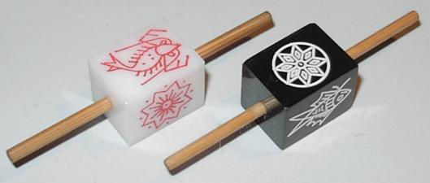
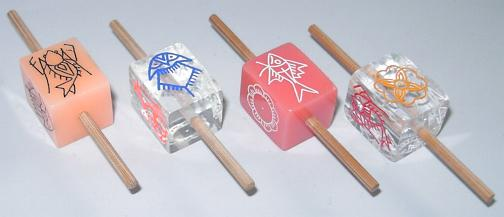

<p class="lead">
<span lang="ms" class="noun aka">Belangkai</span> is a gambling game that is played in Malaysia[@GamblingGamesOfMalaya p. 127] and is named after the Malaysian word for the horseshoe crab <span lang="ms">belangkas</span>. The game is also referred to as Belankai, Belanki, or simply Belan(g)kas. In @GamblingGamesOfMalaya [p. 127] the name <span lang="zh" class="aka">勿人介</span> is also given, although without explanation. In Vietnam, it is called <span lang="vi" class="noun aka">Cua Hoàng Đế</span> (‘emperor crab’).
</p>

The game is still played currently, and has many online implementations.[^fn0]

[^fn0]: See also [here](https://www.youtube.com/watch?v=pGcRlTl3GdI) for a game streamed online but with a live table.

## Equipment

A four-sided teetotum is used, with images of:

- a horseshoe crab
- a flower, sun, or star device
- a fish
- a prawn

The staking layout also bears these four symbols.

> [!figure]
>
> 
> 
>
> ```yaml
> originalUrl: "https://averweij.web.cern.ch/belankai.htm"
> authorGiven: "Arjan"
> authorFamily: "Verweij"
> license: "with-permission"
> ```
>
> Various modern plastic spinners.


## Play

The banker spins the teetotum and covers it with another bowl. Players then place their bets on the outcome in appropriate parts of the layout. Bets can be placed on a single outcome by placing it within a particular section, or on two outcomes by placing the stake on a dividing line between two sections.

Any players who have chosen a bet that matches the outcome win. If they placed a bid on a single outcome they win 3× back, if they placed a bid on two outcomes they win 1× back.[@TheBelangkasGame] All other stakes are lost.

@GamblingGamesOfMalaya gives the more precise (harsh) returns of 2.7× and 0.9×.  More modern versions might pay 2.85×/2.9× and .95×.[@KingCrab]

Recent versions of the game also include a third bet type, which wins on one symbol, pushes (neither wins nor loses) on another, and loses on the other two.  This pays 2× or 1.95×.[@KingCrab]

Several online implementations also provide a three-way bet which pays 0.3×.
