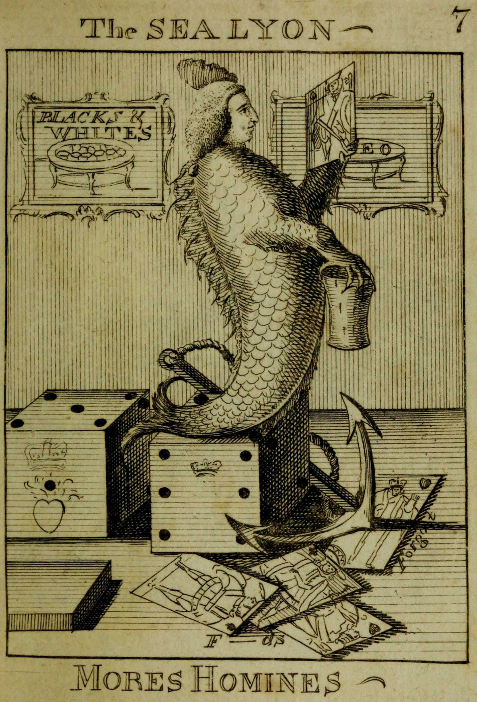

<span class="aka">Black and White Cocks</span> — an apparently un-Googleable name — was a gambling game played in England in the 19th century. In 1838 it was described as a “well-known game of chance”,[@Tiverton] but it seems to have died out before the 20th century.

> [!figure]
> 
> 
>
> ```yaml
>  position: aside
>  license: cc0
> ```
>
> The caption from the book reads: “A remarkable Caricatura, compounded of ſeveral ſpecies, being by ſome ſuppoſed to be a Sea-Calf, by others a Sea Lion; after having been toſſed about on his native Element for ſome Years, he was caſt aſhore on a *gaming Iſland*, where he was ſo captivated with Cards and Dice, that he commenced *Gameſter*, and fixed upon the Iſland ever ſince.”

The form of the game is still obscure to me, but based upon brief descriptions, it was a gambling game played with a spinning wheel,[@SharpersAtAltcar] probably much like the game E–O (an early form of Roulette). A table with black and white cocks (presumably roosters) painted on it was used, probably as a staking layout,[@MorningChronicleOldBailey] where bets as low as a penny could be placed.[@Tiverton] Like other games of this type, it was played at racecourse meets[@EastbourneHunt] and fairs.[@CamberwellFair]

An earlier depiction of or reference to the game possibly appears in a satirical depiction of [John Byng](https://en.wikipedia.org/wiki/John_Byng) in the book @PoliticalSatiricalHistory [p. 36]. At top left, opposite the [EO](games/eo/eo.md) table, is “Blacks & Whites”.

In an 1877 catalogue of the British Museum[@CatalogueOfPrintsAndDrawingsI p.  1076] this is interpreted as a reference to the (in)famous [White’s](https://en.wikipedia.org/wiki/White%27s) gentlemen’s club and gambling house, but it seems to more straightforwardly refer to the game, especially when positioned in a pair with E–O.
