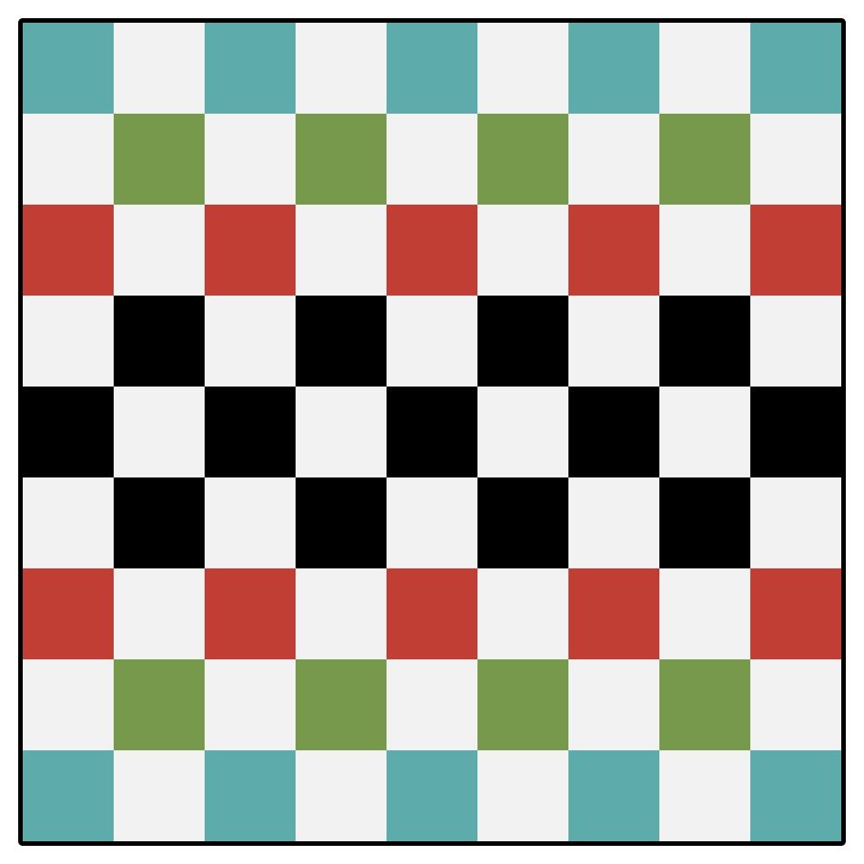
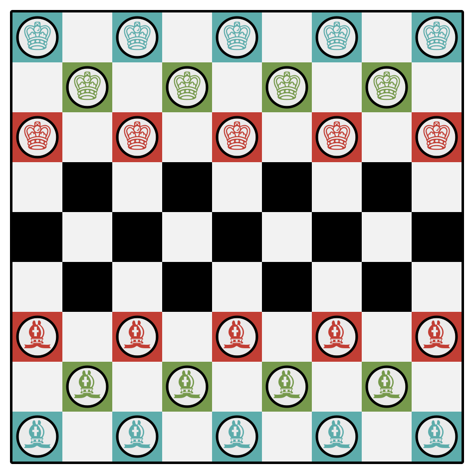

Cetro is a [traversal game](articles/families/traversal-games/traversal-games.md) for two players that was  published at the start of the 20th century in Germany by J. W. Spear & Son.

> [!figure]
> 
> ```yaml
> license: cc0
> position: aside
> ```
> A man and woman playing Cetro on the cover of J. W. Spear & Söhne’s catalogue.

Cetro is played on a 9×9 grid, with some rows marked out with different colours.
The top- and bottom-most rows (those nearest the two players) are coloured blue,
the second-most green, the third-most red, and the inner three rows are black:

> [!figure]
> 
> ```yaml
> noborder: true
> ```
> The Cetro board.

Each player has 14 pieces in the three colours: 5 each of blue and red, and 4
green. One player’s pieces are marked as kings (&#x2654;) and the other’s as
bishops (&#x265D;).

> [!figure]
> 
> ```yaml
> noborder: true
> ```
> The players’ pieces.

### Play

The initial setup of the board places the pieces on squares of matching colour:

> [!figure]
> 
> ```yaml
> noborder: true
> ```
> Initial setup of the Cetro board.

The goal of the game is for a player to move their pieces across the board and
have them end up in the matching-coloured spaces on their opponent’s side of the
board. Thus, the blue pieces must traverse the entire board to end up in the
opponent’s back row, but the red pieces only need to move four rows forward.

On a player’s turn they may move one piece. A piece may make one of two moves:

1. it may jump over a **single** piece (of either side) in a forward diagonal
   direction (this does not capture the jumped piece), or
2. retreat a single square back in either diagonal direction.

This means that the white squares are unused, as in [Draughts](games/draughts/draughts.md). Note that a piece may **not** move one square forward in a diagonal direction like in draughts.

A player can also **demand** that their opponent make a jump instead of a withdrawal, if any is possible, but may not specify which of several available jumps must be made.

A player who has no possible moves skips their turn. If both players have no possible moves, whoever made the last move wins the game.

## See also

[Halma](games/halma/halma.md) is a similar game.

## See elsewhere

* [Cetro on BoardGameGeek](https://boardgamegeek.com/boardgame/237239/cetro)
