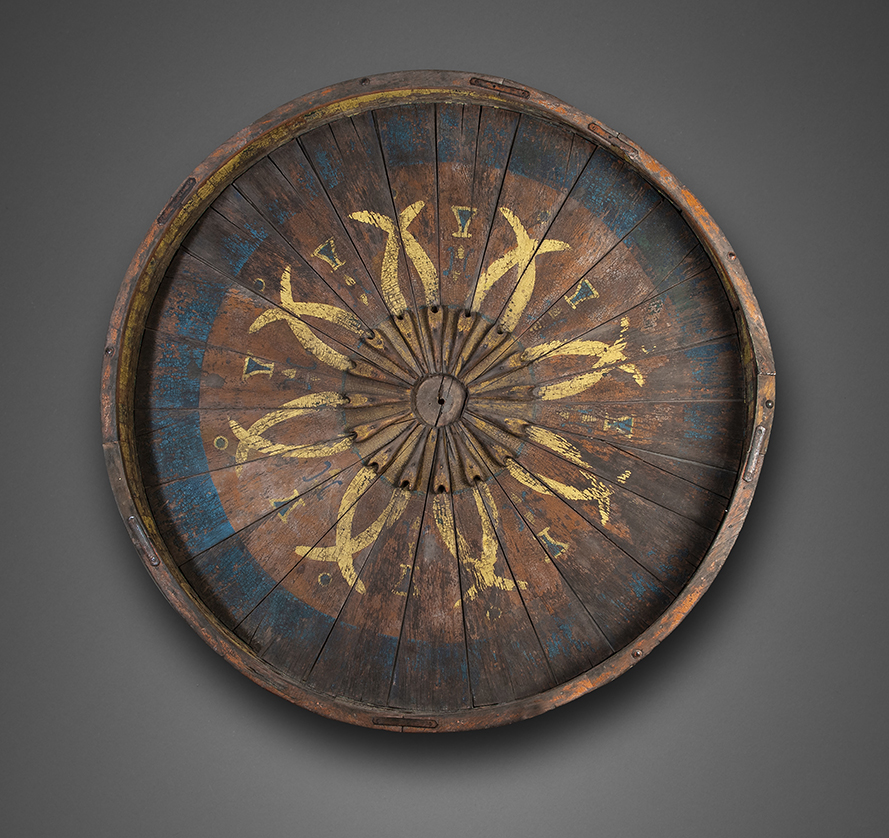

# <span lang="es" class="noun">Chuza</span>

<span lang="es" class="aka noun">Chuza</span> or <span lang="es" class="aka noun">Chusas</span> (‘owls’) was a gambling game popular in the 19th century in both Mexico and New Mexico, and similar to [Roulette](games/roulette/roulette.md).

Writing in 1886, John Gregory Bourke described it as a “purely Mexican game”, in opposition to “American” games such as Faro, Keno, and Diana.[@LynchingAtTucson 236] The game was said to be particularly popular with women:[@TheWhiteChief 44][@CommercePrairies_1 240]

> [it is not] confined to any class; but the most respectable New Mexican ladies would be found seated at these tables day and night, until their faces and sunken eyes proclaimed that the excitement was too powerful for their system.[@NewMexicanCustoms][^fn0]

[^fn0]: One author in the New Mexico Historical Review misunderstood this passage as referring to a card game.[@NMInTransition 191]

The game was played with a spinning wheel (see image below) and small coloured balls,[@MagneticWest] and either cards or numbers marked upon the table were used to track the bets placed upon the segments of the wheel.[@BorderWithCrook 81] In New Mexico in 1824, a tax of 4 pesos was levied upon the game.[@NewMexicoMexican 239]

Other than that, I know little about how it was played.[^fn1] Any further information that a reader can provide would be helpful!

[^fn1]: In 1898, a correspondent of <cite>Notes and Queries</cite> also wrote in for information about the game—as far as I can tell, they weren’t answered.[@ChuzaNotesAndQueries]

> [!figure]
>
> 
>
> ```yaml
> license: "terms"
> termsUrl: "https://web.archive.org/web/20250103222106/https://media.newmexicoculture.org/policies.php?name=terms"
> orgName: "Historical Society of New Mexico"
> identifier: "NMHM/DCA 09409.45"
> originalUrl: "https://media.newmexicoculture.org/photo-library/event/file/detail/4658/4534/19"
> copyrightYear: 2018
> ```
>
> A Chuza wheel.
