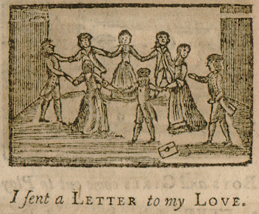

Under this title, I collect several children’s games which are very similar and involve most of the players sitting or standing in a circle while another player walks around the outside of it until they choose someone (with or without their knowing, according to the game), who must then chase them.

The most obvious modern version of this game is ‘Duck, Duck, Goose’.

## History

Games of this type date at least from Roman times. The Greek scholar [Julius Pollux](https://en.wikipedia.org/wiki/Julius_Pollux) wrote of a game called <span lang="el-polyton-Latn">schoinofílíndá</span> (<span lang="el-polyton">σχοινοφῖλίνδᾶ</span>)[^also] in his proto-encyclopædia <cite>Onomasticon</cite> (<span
lang="el-polyton">Ὀνομαστικὸν</span>, <abbr>c.</abbr> 200 <abbr>CE</abbr>):

[^also]: Also written <span lang="el-monoton">σχοινοφιλίνδα</span> or <span lang="el-monoton">σχοινοβιλίνδα</span>.[@GreekEnglishLexicon p. 1459]

Ή δέ σχοινοφιλίνδα, κάθηται κύκλος, είς δέ σχοινίον έχων λαθών παρά τω τίθησι·
κάν μέν άγνοήση έκενος παρ' ώ κεϊται, περιθέων περί τον κύκλον τύπτεται, εί δέ
μάθοι, περιελαύνει τόν θέντα τύπτων.

> ἡ δὲ σχοινοφιλίνδα, κάθηται κύκλος, εἷς δὲ σχοινίον ἔχων ἐλθὼν παρ’ αὐτῷ
> τίθησι· κἂν μὲν ἀγνοήσῃ ἐκεῖνος παρ’ ᾧ κεῖται, περιθέων περὶ τὸν κύκλον
> τύπτεται, εἰ δὲ μάθοι περιελαύνει τὸν θέοντα τύπτων [Book 9, 115][^notranslation]
 
[^notranslation]: Unfortunately I do not yet have a good translation of this passage.

See Italian translation: @CostanzaPolluce

The game involved one player walking around the outside of the circle with a piece of rope, who attempted to drop or place it behind a player without them noticing. The chosen player would then chase the other player with the rope and strike at them before the chooser could return to the chosen’s original position. If the chosen player did not notice, the chooser would then chase them instead.

See [@ChildrensGamesInStreet p. 198–206]

Later Greek–English dictionaries offer the names of games which were current at the time, that are useful as points of reference for how the game was understood.

A 1585 edition of [Hadrianus Junius’](https://en.wikipedia.org/wiki/Hadrianus_Junius) <cite>Nomenclator</cite> produced by [Abraham Fleming](https://en.wikipedia.org/wiki/Abraham_Fleming) has “Schœnophilinda” with the definition “A kinde of playe called clowt clowt, to beare about, or my hen hath layd.”[@Nomenclator1585] Here ‘clowt’ (=‘clout’) is an old word meaning ‘a piece of cloth’, so a modern equivalent of the name could be ‘cloth, cloth, to carry around’.[^later]

[^later]: Later dictionaries copy this definition in a corrupted manner; [John Rider’s](https://en.wikipedia.org/wiki/John_Rider_(bishop)) English–Latin dictionary of 1589 has “Schenophilanda” “clout clout to beare about, or my hen hath laid”;[@Rider1589] Thomas Thomas’ dictionary (in its 3rd edition of 1592) has “Schœnophilanda” “clowt, clowt, to beare about, or my henne hath laide”,[@ThomasThomas1592] and an edition of Rider’s dictionary with additions by [Francis Holyoake](https://en.wikipedia.org/wiki/Francis_Holyoake) from 1617 has “Schænophilanda” “clout clout to beare about, or my hen hath laid”.[@Rider1640]

Some comparisons are inaccurate; @AthleticsOfGreeks1 [p. 55] compares the game to “hunt the slipper”, a Victorian parlour game more akin to Pass-the-Parcel.

However, “hunt the squirrel” does seem to be very similar; “drop-glove” also listed.[@GamesAndSongsAmericanChildren p. 168]

Drop-Handkerchief[@GommeI p. 110]

Cat After Mouse or Threading The Needle[@GommeI p. 64][@Strutt p. 337]

> [!figure]
> 
> 
>
> ```yaml
> license: "cc0"
> ```
>
> A depiction of “A Letter to My Love” from @LittlePrettyPocket [p. 38].


Drop Handkerchief 4th most popular game at Lousville playgrounds in 1901.[@LouisvilleSummerPlaygrounds]

---

German description: @LorenzGrasberger1 [p. 52], Das Plumpsackspiel 

spellings: @GreekEnglishLexicon [p. 1459]  

Drop-Cloth 

French <span lang="fr">jeu de mouchoir</span>, Dutch <span lang="nl">zakdoekje leggen</span> (in Flanders <span lang="nl-BE">zakdoek leggen</span>).

@MannersAncientGreece1 [p. 154] - Schœnophilinda.

https://drum.lib.umd.edu/bitstream/handle/1903/9209/Layne_umd_0117N_10038.pdf?isAllowed=y&sequence=1


- Kiss in the ring (also thread-the-needle): @EveryDayBook1 [p. 692]
- drop handkerchief, kss in the ring: @EveryDayBook2 [p. 666]

Also [@ShropshireFolklore3 p. 512]

---

Called Kebeto in Ethiopia https://allaboutethio.com/10-best-ethiopian-traditional-sports-games.html or Mehareben Yayachiw/Yayachihu (መሀረቤን ያያችሁ): https://www.youtube.com/watch?v=n11MPNDHC18 https://press.et/herald/?p=21771 (https://web.archive.org/web/20231001231632/https://press.et/herald/?p=21771)
https://dlalaproject.com/archive/ ‘have you seen my handkerchief’ https://www.youtube.com/watch?v=S8q90YeGDNc

in Khmer(!) លាក់កន្សែង , see http://sealang.net/khmer/


<span lang="sco" class="aka">Allicomgreenyie</span>[@SupplementToJamieson 11]
