# Crown & Anchor

<span class="aka">Crown & Anchor</span> is a dice game using three special dice that is probably most famous as being popular with British and “Colonial” servicemen in the early 20th century, but today it is played in many locations around the world.

The game play is equivalent to that of [Chuck-a-Luck](games/chuck-a-luck/chuck-a-luck.md), but the pips on the dice and the numbers on the staking-table are replaced by symbols: the titular 👑&#xfe0e; crown and ⚓&#xfe0e; anchor, and the playing-card suits: <Cards>s</Cards> spade, <Cards>c</Cards> club, <Cards>d</Cards> diamond, and <Cards>h</Cards> heart.

> [!figure]
>
> 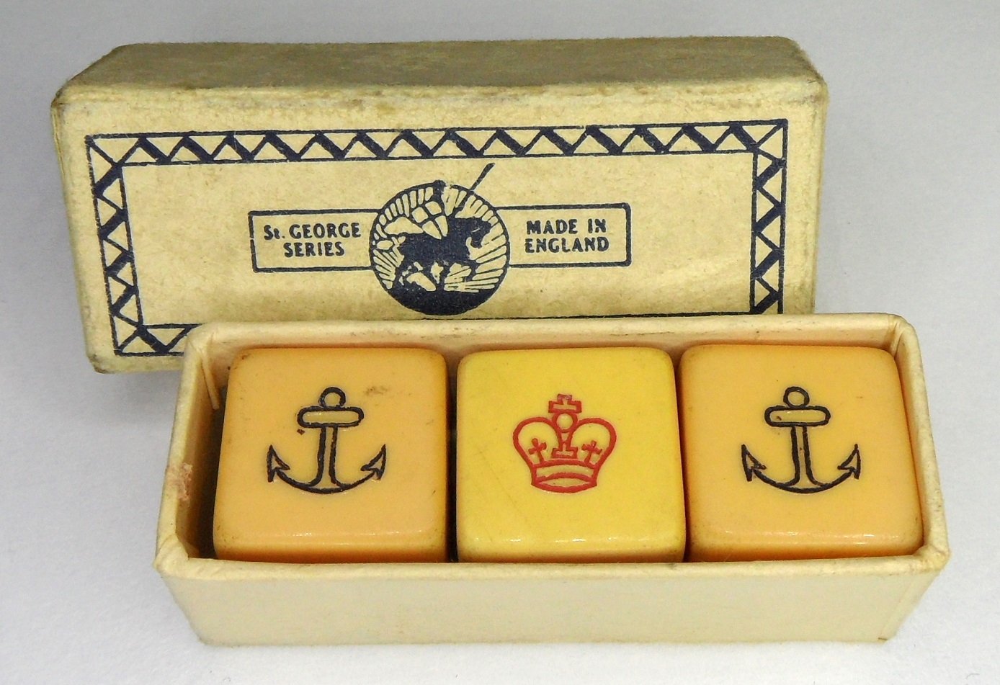
>
> ```yaml
> originalUrl: https://averweij.web.cern.ch/crownanchor.htm
> authorGiven: Arjan
> authorFamily: Verweij
> license: with-permission
> ```
>
> Crown & Anchor dice from the early 20th century.


## History

> [!epigraph]
>
> ‘It’s a fair game,’ he was saying; ‘it’s a fair game. The wee boy has the same chance as the old man, and the old man as the wee boy.’[@ItsAFineWorld p. 210]

Please note that the following is (necessarily, for me) biased toward
English-language sources. It is entirely possible the game has a longer history
elsewhere; for the moment, at least, I cannot say.

> [!figure]
>
> 
>
> ```yaml
> size: wide
> license: cc-by
> licenseVersion: '4.0'
> originalUrl: https://collections.museumsvictoria.com.au/items/387918
> authorFamily: Morrow
> authorGiven: Sandra
> orgName: Museums Victoria
> ```
>
> A Crown & Anchor mat purchased in Colombo (Sri Lanka) in 1915 and used by Australian troops while in transport.

Many gaming histories cite a 17th or 18th century origin for the game, but based
on textual evidence it seems to date from the late 19th century (at least in the
version played with the Crown and Anchor symbols), possibly derived from
pictorial versions of Chuck-A-Luck such as “Mustang”. In England there are
certainly many old references to “dice boards” or “gaming tables”, but they are
not described in detail very often.

At first, the game was played with symbols other than the crown and anchor. The earliest reference I have found is to a version played with “anchors, stars, clubs, spades, hearts, and diamonds” at the coronation fair of George <span class="rnum">IV</span> in Hyde Park in 1821.[^fn0][@DissolutionOfCoronationFair]

[^fn0]: This is clearly the same game as six outcomes are listed and the operator announces “three to win, three to lose” — a classically misleading claim!

Other variants were developed through the 19th century: In 1842, the <cite>Punch</cite> character Mr. Muff “mistrust[s] the chances of the ‘Dimunt, Star, Hanker, Crown, Club, and Feather’” being played at the (fictional) “Clodpole races”.[@CuriositiesOfMedicalExperience] In 1859 a game involving “anchor, heart, etc” is described at a fair,[@GamblingAtFairs] and in 1860 “clubs, spades, &c.” at a game at the races.[@GamblingAtTheRaces] An 1864 newspaper article claims that [Deacon Brodie](https://en.wikipedia.org/wiki/William_Brodie) played a game of “anchor, club, star, feather, heart, [and] spade” in his youth, but this may be anachronistic — in any case, it is still an early reference.[@TheMysteriesOfEdinburgh] In 1875 there is reference to a game of “feather, star, and anchor” being played in Epping Forest.[@EasterMondayInTheForest] In 1889, chuck-a-luck (as the “three dice game”) is reported in [Middlesbrough](https://en.wikipedia.org/wiki/Middlesbrough).[@GamblingInMiddlesbrough]

> [!figure]
>
> 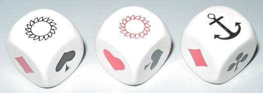
>
> ```yaml
> position: aside
> authorGiven: Arjan
> authorFamily: Verweij
> license: with-permission
> ```
>
> Modern versions of “anchor & sun” dice.

Early references to the game under the name <span lang="nl">anker en zon</span> (“anchor and sun”) appear in Flanders in 1880,[@Aldenardiana] and finally as “the crown and anchor game” in Melbourne,[^inmelbourne] Australia in 1882.[@CrownAndAnchorAustralia] An equivalent game is recorded as being played in British-controlled Hong Kong in 1884.[@HongKongCrownAnchor]

[^inmelbourne]: The game under the name of [Chuck-a-Luck](games/chuck-a-luck/chuck-a-luck.md) or “old sweat” is known in Melbourne from at least 1866.[@LayOfAMelbourneVagrant]

Information from the people who actually ran the games is hard to find. One notable exception is that of Arthur Harding, whose memoir details his life growing up in [The Nichol](https://en.wikipedia.org/wiki/Boundary_Estate),[^nichol]  in the late 19th and early 20th centuries.[@EastEndUnderworld] Harding states that “some of the first pennies [he] earned was holding up the boards for ‘Crown and Anchor’”, and describes how the board would be held by a person at each end, with a cloth on which the staking layout was painted placed on top. The entire setup was designed to make it as easy as possible to disappear when the police arrived, although in many cases the games were tolerated by police as the income the games provided prevented the operators from resorting to harder crimes.[^snidepitching]

[^nichol]: The Nichol was a slum in East London, also called the “Jago”, which was torn down in the 1890s.

[^snidepitching]: Such as “snide-pitching” (passing false money), and “shoot-flying” (stealing pocket watches by grabbing their chains)![@EastEndUnderworld pp. 175–8]

> [!aside]
>
> Another curious patent for a game using Crown & Anchor dice was filed in 1891[@PatentLudoCrownAnchor] and eventually granted in modified form in 1905;[@PatentLudoCrownAnchor2] this one combined the dice with the game of Ludo, but is mechanically unrelated.


An interesting patent lodged in England in 1895 (see image) indicates that the crown-and-anchor version of the game must have been known at that time, but I have yet to find any other references to it this early on, and the patent does not mention Crown & Anchor by name.[@GB189504141A]

> [!figure]
>
> 
>
> ```yaml
> noborder: true
> license: "cc0"
> ```
>
> An image from the patent for the game “Stars and Stripes”.

The game has also at times been called “bubble and buck”,[@BubbleBuck1911]
“bumble and buck”,[@APrivateInTheGuards p. 189] “diddlum
buck”[@SmallerSlangDictionary p. 44]  or “toodlum buck(s)”.[^teetotum]

[^teetotum]: This name was also used in Australia to refer to a children’s game played with a teetotum; perhaps the version on sale here is Crown & Anchor played with a teetotum.[@ToodlumBucks]

### Boer War

The game seems to have first became popular with British soldiers during the [Second Boer War](https://en.wikipedia.org/wiki/Second_Boer_War) (1899–1902), when British and Australian troops fought alongside American volunteers. It was possibly transmitted from American troops at this time. [Sir Bertram Fox Hayes](https://en.wikipedia.org/wiki/Bertram_Fox_Hayes) describes the game being played aboard his ship,[^ship] while transporting troops to South Africa.[@HullDown p. 103]  In 1900, the game is recorded as having been played by English <abbr class="initialism" title="prisoners of war">POW</abbr>s at the [Waterval](https://en.wikipedia.org/wiki/Waterval) prison camp, under both the names of “chuck-a-luck”[@AGlimpseAtWaterval] and “crown and anchor”.[@TrooperMilverton] British soldiers’ diaries also record the game being played in military camps at [De Aar](https://en.wikipedia.org/wiki/De_Aar)[@AutobiographyOfAMilitaryGreatCoat p. 391] and on transport ships.[@DukeOfLancastersOwn p. 157]

[^ship]: The SS [<cite>Britannic</cite>.](https://en.wikipedia.org/wiki/SS_Britannic_(1874))

In 1902, the game was described in London as “a new game from South Africa”,[@ANewGameFromSouthAfrica] and a syndicated article from 1914 also discusses the game as having been played in the army “since the first South African campaign”.[@GamblingInTheArmy]

References from the end of the Boer War period refer to returning British soldiers being swindled at the game,[@RobbingTommyAtkins] returning Australian troops playing it aboard transport ships (including the last troopship the <cite>Drayton Grange</cite>,[@DraytonGrange] which returned over-crowded and disease-ridden), and a report by an American who played the game with English troops.[@FromTombsBaker]

### World War I

> [!figure]
>
> 
>
> ```yaml
> license: cc0
> originalUrl: https://www.awm.gov.au/collection/E04801
> orgName: Australian War Memorial
> ```
>
> British gun crews with two 9″ guns, May 1918; the counterweight “dirt box” in front is painted with Crown & Anchor iconography.

At the beginning of WWI the game was, at least at first, still unfamiliar to many British soldiers, and seems to have been most strongly associated with Australian troops. Sam Sutcliffe described a camp scene at [Abbassia](https://en.wikipedia.org/wiki/Abbassia) in 1915:[@NobodyOfAnyImportance p. 191]

> Gambling was forbidden to us and, officially, it may have been to them, but a
> mighty sight worth seeing was the Australian Crown And Anchor school. Soon
> after dusk, quite some distance from their camp, a line of little lights would
> commence to twinkle. Curiosity lured me over there, spiced by the knowledge
> that, if our Military Police caught me near those wicked Aussies, I’d be in
> real trouble.[^mingle] I believe I planned to vanish into the dark desert if
> trouble threatened, and make my merry way back to our camp later.
>
> I found a long line of improvised desks, a space of several yards between each
> of them. A couple of candles on each desk illuminated the Crown And Anchor
> board — actually a leatherette sheet, easily folded up and pocketed in an
> emergency, with the six symbols of the game printed on it. The operator sat on
> a box and called out his line of persuasion or temptation, such as “Come on,
> me lucky lads! The more you put down the more you pick up. Who’ll have a bet
> on the old mudhook?”[^mudhook]
>
> Some operators always had a group of punters around them, others did less
> business. Why should some be more successful than others, even there at the
> edge of the desert? All had the same set-up, although they did vary the odds.
> The lowest offer made was to double your money if the symbol you’d backed
> turned up when the dice was thrown. Perhaps the variations which could be
> introduced by ingenious operators attracted men who applied careful thought to
> their gambling. Watching from my respectful distance, I was very impressed, at
> times amazed, at the quantity of money which changed hands.

[^mingle]: English troops were not permitted to mingle with the Australians.
[^mudhook]: i.e. anchor, see below.

> [!figure]
>
> 
>
> ```yaml
> size: wide
> license: cc0
> originalUrl: https://www.awm.gov.au/collection/C607?image=1
> orgName: Australian War Memorial
> ```
>
> Australians playing Crown & Anchor aboard HMAT Medic, <abbr>c.</abbr> 1919.

As seen in the last quote, each symbol had its own nickname. The crown could also be termed the “sergeant-major” or “[Teddy’s](https://en.wikipedia.org/wiki/Edward_VII) hat”, the spade the “shovel” or “pioneer’s tool”, the diamond the “curse” or “[Kimberley](https://en.wikipedia.org/wiki/Kimberley,_Northern_Cape)”, the heart the “jam tart”, the club the “shamrock”, and the anchor the “mud-hook”, “mud-rake”, or “meat-hook”.[@APrivateInTheGuards pp. 187-8][@TheLongTrail]

According to several observers, the game was even played on the frontlines, in trenches. An anecdote from the [Ypres Salient](https://en.wikipedia.org/wiki/Ypres_Salient) in 1916, by a soldier of the [King’s Royal Rifle Corps](https://en.wikipedia.org/wiki/King%27s_Royal_Rifle_Corps):[@JerryWinsABet]

> Alf, who owned a Crown and Anchor board of great antiquity, had it spread out
> on two petrol cans at the bottom of a shell-hole.
>
> Around it four of us squatted and began to deposit thereon our dirty half- and
> one-franc notes, with occasional coins of lesser value. The constant whistle
> of passing fragments was punctuated by the voice of Alf calling upon the
> company to “’ave a bit on the ’eart” or alternately to “’ave a dig in the
> grave”, when a spent bullet crashed on his tin hat and fell with a thud into
> the crown square.
>
> “’struth,” gasped Alf, “old squarehead wants to back the sergeant-major.” He
> gave a final shake to the cup and exposed the dice — one heart and two crowns.
> “Blimey,” exclaimed Alf, “would yer blinkin’ well believe it? Jerry’s backed a
> winner. ’Arf a mo,” and picking up the spent bullet, he threw it with all his
> might towards the German lines, exclaiming, “’Ere’s yer blinking bet back,
> Jerry, and ’ere’s yer winnings.” He cautiously fired two rounds.

Similar samples of the proprietors’ patter resound from many memoirs of the war:[@APrivateInTheGuards p. 178]

> Where you lay we pay. Come and put your money with the lucky old man. I touch
> the money, but I never touch the dice. Any more for the lucky old heart? Make
> it even on the lucky old heart. Are you all done, gentlemen? … _Are you all
> done?_ … The diamond, meat-hook, and lucky old sergeant-major. (He shakes
> the dice again.) Now, then, will any one down on his luck put a little bit of
> snow (some silver) on the curse? Does any one say a bit of snow on the old
> hook? Are you all done, gentlemen? _Are you all done?_ … Cocked dice
> are no man’s dice. Change your bets or double them! Now, then, _up she
> comes again._ The mud-rake, the shamrock, and the lucky old heart. Copper
> to copper, silver to silver, and _gold to gold_ We shall have to drag
> the old anchor a bit. (Rattles the dice.) Now who tries his luck on the name
> of the game?

Another report from Gallipoli in 1916 also mentions it being played in trenches,
and indicates that it was associated with “colonials” (Australians and New
Zealanders):[@AnInterestingNarrative]

> I am satisifed there is as much chance of stopping colonials gambling as old
> Canute had of stopping the tide rising. I have see them playing “crown and
> anchor,” a great game with them (don’t know if you ever saw it) in all sorts
> of unlikely places, even on the fire step in first line trenches. It was funny
> on the Ionian, going back to Egypt, when there was a church parade. The padre
> paused in the sermon, and in the middle of the silence came a yell from behind
> the deck-house, “Who’s going to put a bob on the lucky old mud hook?” whilst
> straight on the bridge, and absolutely the nearest to the parson, was a ring
> of men gambling all the time, and too straight under the parson for him to see
> them. It did look comical…

In 1917 it was described as being played by “colonial” New Zealanders at an English <abbr title="non-commissioned officer">NCO</abbr> school:[@AtAnEnglishNCOSchool]

> Colonial slang appears strange to the “Tommy,” […] an invitation to a game of
> “pounds, coins, or browns” lets one know that the popoular gambling game of
> “crown and anchor,” for anything from a £1 note to a penny, is in progress.

In 1916, one author reported that a local toy store in Boulogne was selling game sets to English troops.[@YearOfChivalry p. 66]

Despite all the previous quotations, some American troops believed it to be a British game.[@HistoryOfThe107th p. 369][@307AtHomeAndInFrance p. 66]

Canadian troops also report playing the game during the war.[@WithTheAmmunitionTrain p. 94][@MapleLeavesInFlandersFields pp. 21, 140]

In 1919, it was reported to be played on the ill-fated returning Australian transport Sardinia.[@LifeOnTransportSardinia]

Post-war memoirs indicate that the game was commonly played in <abbr class="initialism" title="prisoners of war">POW</abbr> camps as in the Boer War, including the German camp <span class="noun" lang="de">Münster</span> <span class="rnum">II</span> (<abbr class="initialism" title="also known as">AKA</abbr> K47, <span lang="de">Rennbahn</span>), although gambling games were not permitted to be played.[@KaisersGuest pp. 204–6]

### World War II

In 1940, it was reported that [Australian Imperial Force](https://en.wikipedia.org/wiki/Second_Australian_Imperial_Force) troops stationed in Mandatory Palestine had figured out how to play the game without dice: several [slaters](https://en.wikipedia.org/wiki/Woodlouse) were placed under an upturned ashtray which had indentations for resting cigarettes; the holes from which the slaters emerged determined the winning numbers.[@AIFSlaters]

> [!figure]
>
> 
>
> ```yaml
> size: wide
> ```
>
> A “St. George Series” Crown & Anchor board, <abbr>c.</abbr> 1930s?


> [!todo]
> As in the Boer and First World Wars, the game was played by prisoners in  and concentration camps.

### Post-War

After the first and second World Wars, mentions of the game become much more common, as the game diffused from returning soldiery back into the wider population.

A version of the game played by workers constructing Scotland’s hydro-electric dams in the middle of the 20th century was played with six dice, but two matches were required to win anything.[@TheDamBuilders pp. 162–163] This version of the game has a much higher house edge of 13.865%.

## Around the World

> [!figure]
>
> 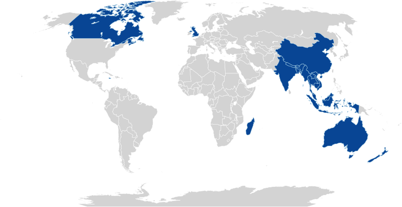
>
> ```yaml
> noborder: true
> size: wide
> ```
>
> Countries known to play Crown & Anchor.

The game is played in many locations around the world, some of which are
described below. Note that American-style games including casino versions are
discussed in the [Chuck-a-Luck](games/chuck-a-luck/chuck-a-luck.md) article.

### China and amongst Peranakans

> [!figure]
>
> 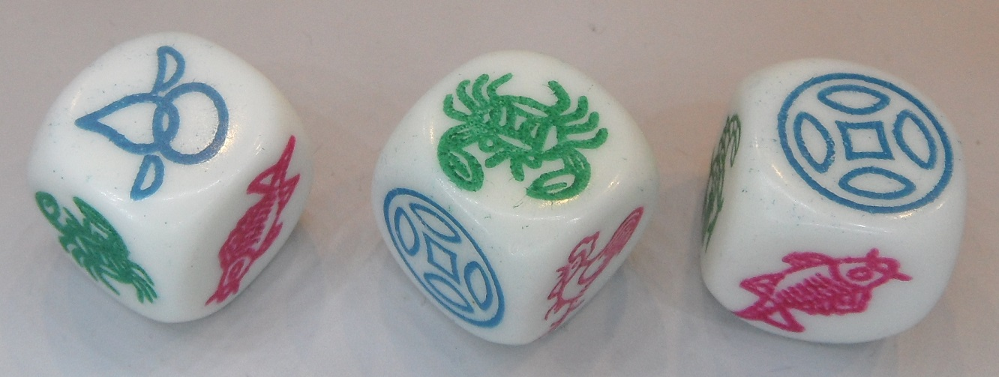
>
> ```yaml
> position: aside
> originalUrl: https://averweij.web.cern.ch/hoo-hey-how.htm
> authorGiven: Arjan
> authorFamily: Verweij
> license: with-permission
> ```
>
> Modern Chinese dice.


In English the Chinese name is usually given as “<span class="aka">Hoo Hey How</span>”; this appears to derive from the Hokkien <Pronounce lang="nan-Latn"  file="pronunciation_nan_魚蝦鱟.mp3" class="aka" pronouncer="2867290031">hû hê hāu</Pronounce> <span lang="nan" class="aka">魚蝦鱟</span>.[@GamblingGamesOfMalaya p. 109] The modern Chinese name is <span lang="zh-Hant" class="aka">魚蝦蟹</span>/<span lang="zh-Hans" class="aka">鱼虾鲎</span> ‘fish prawn crab’; these are several of the symbols that commonly appear on the staking layout.

> [!figure]
>
> 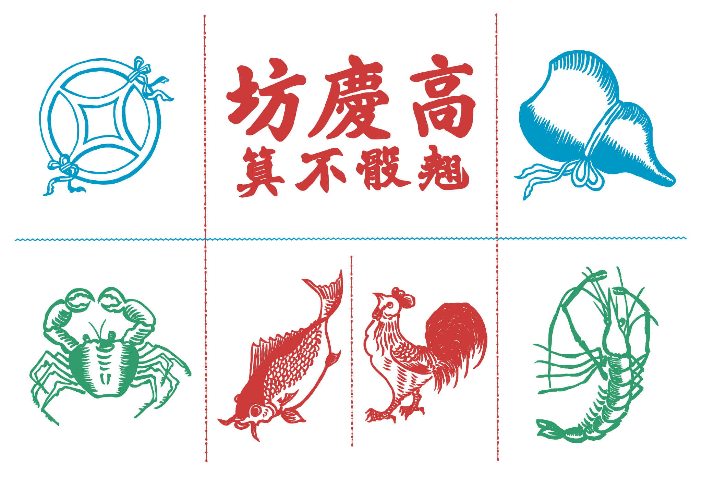
>
> Example of a Chinese-style staking layout. At the top is the manufacturer’s name <span lang="zh">高慶坊</span> <span class="noun" lang="cmn-Latn-pinyin">Gāo Qìng Fāng</span>, followed by <span lang="zh">翹骰不算</span> “cocked dice don’t count”.

An equivalent (perhaps older) game can be played with three standard six-sided dice. It does not need to be played with a layout board but it can be. In this form it can be called <span lang="nan" class="aka">么二三</span> <span lang="nan-Latn" class="aka">io jī sam</span> (‘ace, two, three’, romanized “<span class="aka noun" lang="nan-Latn">Yew Yee Sam</span>” in older texts).[@GamblingGamesOfMalaya p. 95]

#### ‘Grasping Eight’

Culin[@ChineseGames p. 495–6] describes a very similar game that he calls “<span class="aka">Grasping Eight</span>” (<span lang="yue" class="aka">八㪥</span>, Cantonese: <span lang="yue-Latn-jyutping" class="aka">baat³ zaa¹</span>),[^fn1] which uses eight dice.

[^fn1]: Culin transcribes this as <span lang="yue-Latn" class="aka">pát chá</span>.

The staking board contains the six squares with the dice symbols <Dice type="chinese">123456</Dice>, and players place their stakes on the squares. The eight dice are rolled. If at least three match a number, the players who staked on that number win 8×; if at least six match, they win 16×. All other stakes are lost.

### Indochina

The game is widely played across the countries of the Indochinese peninsula,
despite gambling being illegal in most of them. The presentation of the game is
very similar in all regions.

#### Vietnam

The Vietnamese game has a similar æsthetic to the Chinese version, including the name: <span lang="vi" class="aka">bầu cua tôm cá</span> (‘gourd crab prawn fish’).

> [!figure]
>
> 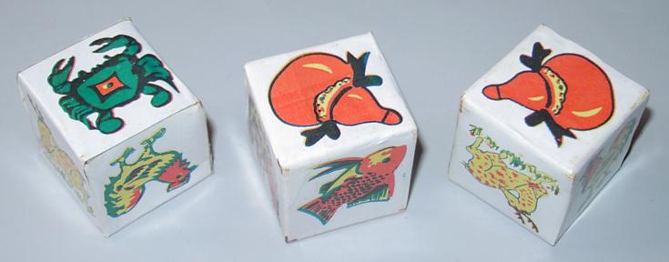
>
> ```yaml
> position: aside
> originalUrl: https://averweij.web.cern.ch/sunanchor.htm
> authorGiven: Arjan
> authorFamily: Verweij
> license: with-permission
> ```
>
> Modern Vietnamese dice, made out of paper.


> [!figure]
>
> 
>
> ```yaml
> authorFamily: Shark
> authorGiven: Marie
> license: stock-image
> orgName: Shutterstock.com
> originalUrl: https://www.shutterstock.com/image-photo/traditional-vietnamese-game-bau-cua-tom-541065277
> identifier: '541065082'
> ```
>
> Three dice as used in the Vietnamese game.


#### Thailand

I have little information about the game in Thailand other than that the paraphernalia for playing exists; gambling is illegal in Thailand.

> [!figure]
>
> 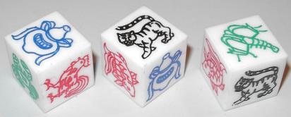
>
> ```yaml
> position: aside
> originalUrl: https://averweij.web.cern.ch/hoo-hey-how.htm
> authorGiven: Arjan
> authorFamily: Verweij
> license: with-permission
> ```
>
> Modern Thai dice.


From what little I have seen, the game is called <span lang="th" class="aka">(น้ำ)เต้า ปู ปลา</span> (<span lang="th-Latn" class="aka">(nam)tao pu pla</span>, ‘(water)gourd crab fish’).[@ThaiGambling p. 85] The images that the game is played with are: goldfish (<span lang="th">ปลาทอง</span> <span lang="th-Latn">pla-thong</span>), chicken (<span lang="th">ไก่</span> <span lang="th-Latn">kai</span>), crab (<span lang="th">ปู</span> <span lang="th-Latn">pu</span>), gourd (<span lang="th">เต้า</span> <span lang="th-Latn">tao</span>), tiger (<span lang="th">เสือ</span> <span lang="th-Latn">suea</span>), and shrimp (<span lang="th">กุ้ง</span> <span lang="th-Latn">kung</span>). Sometimes a frog (<span lang="th">กบ</span> <span lang="th-Latn">kop</span>) appears instead of a tiger.[@ThaiGambling p. 85]

It is possible, although difficult, to obtain official permission to play the
game at funerals.[@ThaiGambling p. 86]

> [!figure]
>
> 
>
> ```yaml
> license: stock-image
> orgName: Shutterstock.com
> author: jointstar
> identifier: '319181276'
> originalUrl: https://www.shutterstock.com/image-photo/animal-picture-on-dice-319181276
> ```
>
> Dice with Thai names.

#### Cambodia

In Khmer the game is called <span lang="km" class="aka">ខ្លាឃ្លោក</span> <span lang="km-Latn" class="aka">khlaa khlook</span> (‘tiger and gourds’),[@SEAlangKhmer] and the images are usually tiger, gourd, chicken, prawn, crab, fish. As in Thailand, gambling is illegal.

#### Myanmar

The name of the game appears to be <span lang="my" class="aka">ဂျောက်ဂျက်</span> <span lang="my-Latn" class="aka">gjau’ gje’</span>,[@SEAlangBurmese] but I have no other information.

#### Laos

Again I have little information about the game here. Some images of the game being played in Laos follow. Interestingly, both photos show a board with Thai names.

> [!multi-wide]
>
> > [!figure]
> >
> > 
> >
> > ```yaml
> > license: cc-by
> > licenseVersion: '2.0'
> > copyrightYear: 2013
> > author: PhotAsia
> > originalUrl: https://www.flickr.com/photos/photasia/8373019722/
> > ```
> >
> > Children playing with a Thai-produced board in Laos.
>
> > [!figure]
> >
> > 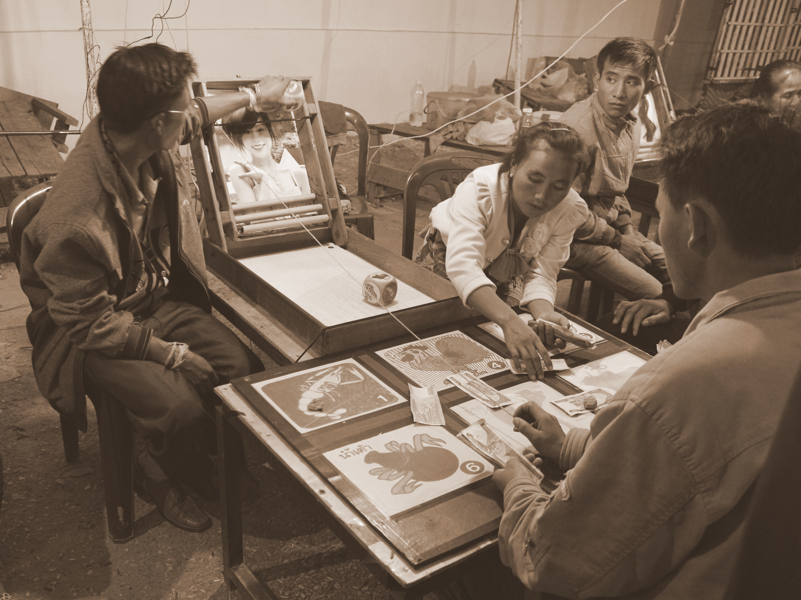
> >
> > ```yaml
> > license: cc-by-nc
> > licenseVersion: '2.0'
> > authorGiven: Jodie
> > authorFamily: Gallagher
> > originalUrl: https://www.flickr.com/photos/126412580@N04/14740162634/
> > ```
> >
> > Playing with a dice tower in Laos; the board has names in Thai.

> [!todo]
> Myanmar?

### India and Nepal

The game was known in Mumbai and Pune[^fn2] as early as 1905, as indicated by court cases from the time,[@ABookmakerAndThePolice][@HeartAnchorAndCrown] but it may have been in India for a long time prior to that.

[^fn2]: Then called Bombay and Poona.

In current times, the game is called <span lang="hi" class="aka">झंडी मुंडा</span> <span class="noun aka" lang="hi-Latn">Jhaṇḍī Muṇḍā</span> (“flag crown”?), or <span lang="hi" class="aka">खोर खोरे</span> <span class="noun aka" lang="hi-Latn">Khor Khore</span>.

Gambling remains illegal in most of India but the game is commonly played during [<span class="noun" lang="hi-Latn">Diwali</span>](https://en.wikipedia.org/wiki/Diwali).

> [!figure]
>
> 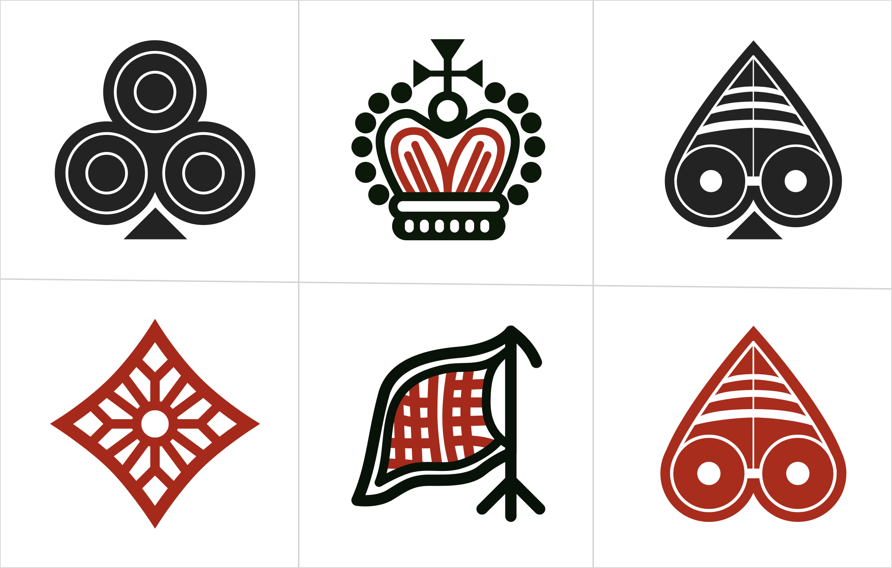
>
> ```yaml
> license: stock-image
> orgName: Shutterstock.com
> author: rajanpy
> identifier: '1958829937'
> originalUrl: https://www.shutterstock.com/image-vector/langur-burja-jhandi-munda-dice-local-1958829937
> ```
>
> An example of a staking layout for <span class="noun" lang="hi-Latn">Jhaṇḍī Muṇḍā</span>.
>
> Note that the heart is presented with the same orientation as the spade; this appears to be a typical feature (see more examples: [1](https://www.alamy.com/stock-photo-traditional-gambling-in-indian-village-on-a-festival-132646298.html), [2](https://www.alamy.com/stock-photo-children-playing-gambling-game-bahundanda-village-lamjung-district-27979377.html)).

The names of the symbols are (in Hindi):

* flag: <span lang="hi">झंडी</span> <span lang="hi-Latn">jhaṇḍī</span> (flag, specifically a triangular flag associated with Hinduism)
* crown: <span lang="hi">मुंडा</span> <span lang="hi-Latn">muṇḍā</span> (“shaven”?)/<span lang="hi">बुर्जा</span> <span lang="hi-Latn">burjā</span> (tower?)/<span lang="hi">मुकुट</span> <span lang="hi-Latn">mukuṭ</span> (crown)
* spade: <span lang="hi">हुकुम</span> <span lang="hi-Latn">hukum</span>
* club: <span lang="hi">चिड़ी</span> <span lang="hi-Latn">ciṛī</span>
* diamond: <span lang="hi">ईंट</span> <span lang="hi-Latn">īṇṭ</span> (literally ‘brick’)
* heart: <span lang="hi">पान</span>  <span lang="hi-Latn">pān</span> (‘betel leaf’)

> [!figure]
>
> 
>
> ```yaml
> size: wide
> license: stock-image
> orgName: Shutterstock.com
> author: Kondoruk
> identifier: '1035142783'
> copyrightYear: 2017
> originalUrl: https://www.shutterstock.com/image-photo/pokhara-nepal-sept-24-2017-unidentified-1035142783
> ```
>
> The game being played with 6 dice in [Pokhara](https://en.wikipedia.org/wiki/Pokhara), Nepal.

> [!figure]
>
> 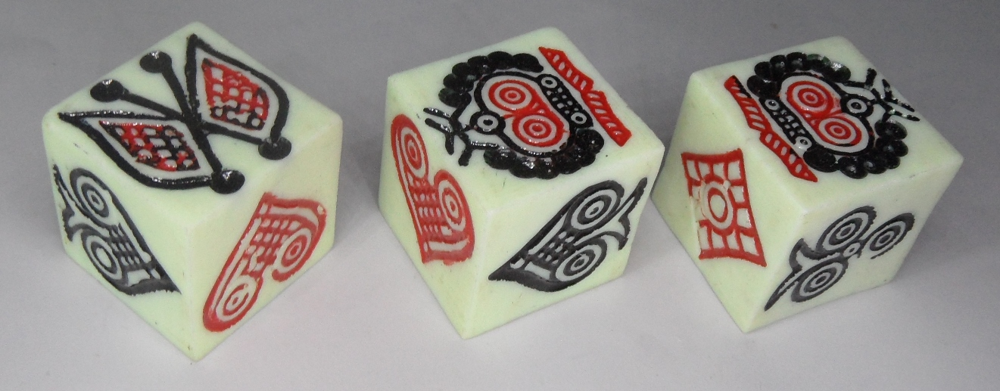
>
> ```yaml
> position: aside
> originalUrl: https://averweij.web.cern.ch/nepal.htm
> authorGiven: Arjan
> authorFamily: Verweij
> license: with-permission
> ```
>
> Modern dice for the Nepalese game.


In Nepal the game is called <span lang="ne-Latn" class="aka">langur burja</span> (<span lang="ne" class="aka">लंगूर</span> or <span lang="ne" class="aka">लङ्गुर बुर्जा</span>).[^fn3] It is commonly played during the festivals of [<span class="noun" lang="ne-Latn">Dashain</span>](https://en.wikipedia.org/wiki/Dashain) (<span lang="ne">दशैं</span>) and [<span class="noun" lang="ne-Latn">Tihar</span>](https://en.wikipedia.org/wiki/Tihar_(festival)) (<span lang="ne">तिहार</span>), and it is usually played with six dice (requiring a minimum of two matches to pay out).

[^fn3]: <span lang="ne-Latn">Langur</span> would seem to derive from the Hindi <span lang="hi">लंगर</span> <span lang="hi-Latn">langar</span>, “anchor”, but the association has been lost in Nepal as the anchor symbol was replaced by a flag.

Some Nepali names for the playing-card symbols are:

* spade: <span lang="ne">सुरथ</span> <span lang="ne-Latn">surath</span>
* club: <span lang="ne">चीड</span> <span lang="ne-Latn">chid</span> (‘pine’)
* diamond <span lang="ne">इँट</span> <span lang="ne-Latn">itta</span> (‘brick’)
* heart: <span lang="ne">पान</span> <span lang="ne-Latn">pana</span> (‘betel leaf’)

### Malaysia and Brunei

> [!figure]
>
> 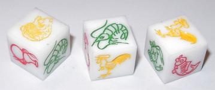
>
> ```yaml
> position: aside
> originalUrl: https://averweij.web.cern.ch/hoo-hey-how.htm
> authorGiven: Arjan
> authorFamily: Verweij
> license: with-permission
> ```
>
> Modern Malaysian dice.


In Malaysia the game can be known as <span lang="ms" class="aka">ikan, udang, dan ketam</span> (‘fish, shrimp, and crab’), <span lang="ms" class="aka">ketam-ketam</span> (‘crabs’), or <span lang="ms" class="aka">yu ha hai</span> (derived from a non-Mandarin pronunciation of the Chinese name). Chinese-style staking layouts are often used.

The game is very popular amongst the [Kadazan–Dusun](https://en.wikipedia.org/wiki/Kadazan-Dusun) people of Sabah (Northern Borneo), where it is known as <span lang="dtp" class="aka">katam-katam</span> (‘crabs’). It is played during the festive season and also at funerals.

In Brunei the game is also known as <span lang="kxd" class="aka">katam-katam</span>.[@HuaHuiBrunei]

### Bali and Indonesia

In Bali the game is played in many forms and known under many names: <span lang="id" class="aka">mong-mongan</span> (the name of a set of three small gongs used in Sumatra), or one of a variety of similar names such as <span lang="id" class="aka">kocok(an)</span> (‘shake’/‘shaking’, as of the dice), <span lang="id" class="aka">koprok</span>, <span lang="id" class="aka">kolok</span>, or <span lang="id" class="aka">kopyok(an)</span> (also ‘shake’/‘shaker’; used also for lotteries).[@SEAlangBalinese]

Bali is (based on appearances on the internet) possibly the part of the world where the game is currently the most popular; this despite all gambling being illegal in the country.

As in many cultures, gambling is often associated with religious festivals.  While other Balinese gambling activities such as the [cock-fight](https://en.wikipedia.org/wiki/Cockfight#Indonesia) are restricted to men, the game can be played by anyone, including young children.

> [!figure]
>
> 
>
> ```yaml
> license: cc-by-nc-nd
> licenseVersion: '2.0'
> author: Walther Tjon Pian Gi
> copyrightYear: 2011
> originalUrl: https://www.flickr.com/photos/wtpg/15100534169/
> ```
>
> A game being played with 6 dice and 12 squares (including one featuring the [Teletubbies](https://en.wikipedia.org/wiki/Teletubbies)!) at <span class="noun" lang="id">Pura Samuan Tiga</span> temple; note the men wearing traditional Balinese dress including [<span lang="ban-Latn">udeng</span>](https://en.wikipedia.org/wiki/National_costume_of_Indonesia#:~:text=Malay%20men%27s%20headgear-,Udeng,-%2C%20Balinese%20men%27s%20headgear).

In the Balinese game, bets can be placed spanning two symbols.

> [!todo]
> what is the bet return here?

> [!todo]
> Javanese game: https://www.britishmuseum.org/collection/object/A_As-5302

Some of the sets of symbols used are:

* <span lang="ban-Latn">basir</span>, robin, <span lang="ban-Latn">rare</span> (baby), <span lang="ban-Latn">ikan barong</span> (fish [Barong](https://en.wikipedia.org/wiki/Barong_(mythology))), <span lang="ban-Latn">kepiting</span> (crab), <span lang="ban-Latn">ayam</span> (chicken); see images below
* <span lang="ban-Latn">basir</span>, <span lang="ban-Latn">bayi ajaib</span> (magic baby), [???], [a duck], <span lang="ban-Latn">macan</span> (tiger), <span lang="ban-Latn">elang</span> ([Javan hawk-eagle](https://en.wikipedia.org/wiki/Javan_hawk-eagle))[^imgs1]
* <span lang="ban-Latn">kak tua</span> (grandfather), <span lang="ban-Latn">elang</span>, <span lang="ban-Latn">cewek</span> (girl), <span lang="ban-Latn">singa</span> (lion), <span lang="ban-Latn">ikan</span> (fish), <span lang="ban-Latn">kodok</span> (frog)[^imgs2]

[^imgs1]: Seen [here](https://www.alamy.com/stock-photo-bali-indonesia-gambling-with-dice-dlod-blungbang-village-71850399.html).

[^imgs2]: Seen [here](https://www.alamy.com/balinese-traditional-street-gambling-the-game-called-kocok-or-mong-mongan-with-fields-saying-eagle-old-man-girl-fish-frog-and-lion-in-indonesian-image261042011.html).

> [!multi-extra-wide]
> > [!figure]
> >
> > 
> >
> > ```yaml
> > license: stock-image
> > orgName: Shutterstock.com
> > author: Novie Charleen Magne
> > identifier: '1350321158'
> > copyrightYear: 2013
> > originalUrl: https://www.shutterstock.com/image-photo/karangasem-bali-indonesia-26-july-2013-1350321158
> > ```
> >
> > A game being played in Bali: bets are placed…
>
> > [!figure]
> >
> > 
> >
> > ```yaml
> > license: stock-image
> > orgName: Shutterstock.com
> > author: Novie Charleen Magne
> > identifier: '1350321164'
> > copyrightYear: 2013
> > originalUrl: https://www.shutterstock.com/image-photo/karangasem-bali-indonesia-26-july-2013-1350321164
> > ```
> >
> > …and the dice are revealed.

The game can also be played without symbols, but the dice used are still very highly stylized:

> [!figure]
>
> 
>
> ```yaml
> license: stock-image
> orgName: Shutterstock.com
> author: Nomad1988
> identifier: '1398460952'
> copyrightYear: 2017
> originalUrl: https://www.shutterstock.com/image-photo/baliindonesia2009-on-weekeds-bali-1398460952
> ```
>
> A Balinese game played without imagery.

### West Indies

The game was probably played throughout the British West Indies; there are records of it from Trinidad,[@SportsAndPastimesInTheWestIndies p. 692] Antigua, Jamaica, and Bermuda.[@CelebratingCricket pp. 622–3]

The game is still played today in Jamaica.

> [!figure]
>
> 
>
> ```yaml
> originalUrl: https://www.flickr.com/photos/ekkaia/207971457
> license: cc-by-nd
> licenseVersion: '2.0'
> author: Lisa
> copyrightYear: 2006
> ```
>
> A busy game being played during the Cup Match in Bermuda.


In Bermuda, the game is legal during the weekend of the Cup Match (a cricket tournament), and played in large tents known as the “stock market”.[@CupMatchAndCarnival p. 267] It is also known as <span class="aka">Hook and Hat</span>.[@AScapeToBermuda p. 123]

> [!todo]
> TODO: Lago Lago in Bhutan?

## Fairground variants

As with [Chuck-a-Luck](games/chuck-a-luck/chuck-a-luck.md), the game has been adapted for mass play at fairgrounds and carnivals. As noted on that article, the modified games usually have worse odds for the players.

> [!figure]
>
> 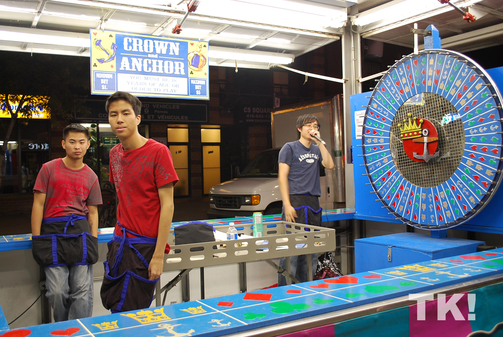
>
> ```yaml
> size: wide
> originalUrl: https://www.flickr.com/photos/tsarkasim/3891195907/
> author: Damien D.
> copyrightYear: 2009
> licenseVersion: '2.0'
> license: cc-by-sa
> ```
>
> A Crown & Anchor wheel in Toronto.


## See also

The French game of [Tribord et Bâbord](games/tribord-et-babord/tribord-et-babord.md) appears to be similar to Crown & Anchor, but the rules are very different.
