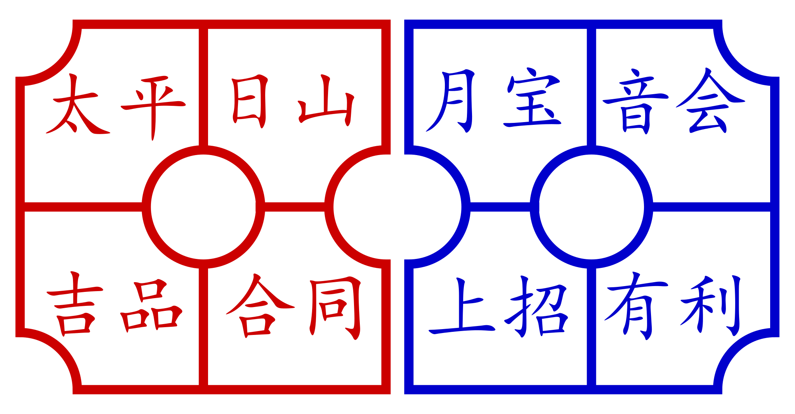

Eight Faces (<span lang="zh" class="aka">八面</span>, Mandarin <span lang="cmn-Latn-pinyin" class="aka">bā miàn</span>, Hokkien <span lang="nan-Latn" class="aka">peh bīn</span>) is (or was) a simple staking game played with a special eight-sided teetotum (<span lang="zh">陀螺</span>, Mandarin <span lang="cmn-Latn">tuóluó</span>, Hokkien <span lang="nan-Latn">tolo</span>). It is also called <span lang="zh" class="aka">小花会</span> (Mandarin <span lang="cmn-Latn-pinyin" class="aka">xiǎohuāhuì</span>, ‘small <span class="noun" lang="cmn-Latn">Huāhuì</span>’), as it uses a subset of characters from the <span class="noun" lang="cmn-Latn">Huāhuì</span> (<span lang="zh">花會</span>) lottery game.[@郑超麟回忆录]

> [!aside]
>
> The name is given as “<span class="aka">Pek Bin</span>” in older English sources, such as @GamblingGamesOfMalaya [p. 125], and in legislation based upon that work (see below).

The description below is mostly based upon @GamblingGamesOfMalaya, which describes it as popular in Malaysia with “Chinese ladies”. In Malay the game is called <span lang="ms" class="aka">pebin</span>.[@ChineseLoanWordsMalay p. 53]

The game is also described in the memoirs of Chinese revolutionary <span class="noun" lang="cmn-Latn-pinyin">Zheng Chaolin</span> (<span lang="zh">郑超麟</span>, 1901–1998), who says that it was played at roadside gambling stalls during the five days after the Chinese New Year (and in practice until the Lantern Festival on the fifteenth day), when gambling was not prohibited.[@郑超麟回忆录]

As of 2021, the game remains explicitly illegal in Malaysia,[@MalaysiaCommonGamingHousesAct] Singapore,[@SingaporeGamesOfChanceAndSkill] and Brunei.[@LawsOfBrunei p. 21]

## Equipment

The special die has eight sides, each marked with the name of a character from the <span class="noun" lang="cmn-Latn">Huāhuì</span> (<span lang="zh">花會</span>) lottery game, and they are divided alternately into two different colours. If the teetotum is made out of a dark material (such as buffalo horn), the characters are inlaid with red and white; if a light material (ivory, bone) is used then they are red and blue/black. These colours are not necessary for the play of the game but make it easier to match the result.

<table>
<thead>
<tr>
<th>
Name
</th>
<th>
Mandarin
</th>
<th>
Hokkien
</th>
<th>
Older Romanization
</th>
</tr>
</thead>
    <tbody>
        <tr class="red">
            <td>
            <span lang="zh">太平</span>
            </td>
            <td>
            <span class="noun" lang="cmn-Latn">Tài Píng</span>
            </td>
            <td>
            <span class="noun" lang="nan-Latn">Thài Pêng</span>
            </td>
            <td>
            Tai or Thai Peng
            </td>
        </tr>
        <tr class="blue">
            <td>
            <span lang="zh-Hant">月寶</span>/<span lang="zh-Hans">月宝</span>
            </td>
            <td>
            <span class="noun" lang="cmn-Latn">Yuè Bǎo</span>
            </td>
            <td>
            <span class="noun" lang="nan-Latn">Goa̍t Pó</span>
            </td>
            <td>
            Yuet Po or Guat Poh
            </td>
        </tr>
        <tr class="red">
            <td>
            <span lang="zh">合同</span>
            </td>
            <td>
            <span class="noun" lang="cmn-Latn">Hé Tóng</span>
            </td>
            <td>
            <span class="noun" lang="nan-Latn">Ha̍p Tông</span>
            </td>
            <td>
            Hup Thong or Hap Tong
            </td>
        </tr>
        <tr class="blue">
            <td>
            <span lang="zh">有利</span>
            </td>
            <td>
            <span class="noun" lang="cmn-Latn">Yǒu Lì</span>
            </td>
            <td>
            <span class="noun" lang="nan-Latn">Iú Lī</span>
            </td>
            <td>
            Yeow Lay or Yu Li
            </td>
        </tr>
        <tr class="red">
            <td>
            <span lang="zh">吉品</span>
            </td>
            <td>
            <span class="noun" lang="cmn-Latn">Jí Pǐn</span>
            </td>
            <td>
            <span class="noun" lang="nan-Latn">Kiat Phín</span>
            </td>
            <td>
            Kat Pang or Kiat Pin
            </td>
        </tr>
        <tr class="blue">
            <td>
            <span lang="zh">上招</span>
            </td>
            <td>
            <span class="noun" lang="cmn-Latn">Shàng Zhāo</span>
            </td>
            <td>
            <span class="noun" lang="nan-Latn">Siōng Chiau</span>
            </td>
            <td>
            Siong Chow or Siang Chiow
            </td>
        </tr>
        <tr class="red">
            <td>
            <span lang="zh">日山</span>
            </td>
            <td>
            <span class="noun" lang="cmn-Latn">Rì Shān</span>
            </td>
            <td>
            <span class="noun" lang="nan-Latn">Ji̍t San</span>
            </td>
            <td>
            Yat Sun or Jit San
            </td>
        </tr>
        <tr class="blue">
            <td>
            <span lang="zh-Hant">音會</span>/<span lang="zh-Hans">音会</span>
            </td>
            <td>
            <span class="noun" lang="cmn-Latn">Yīn Huì</span>
            </td>
            <td>
            <span class="noun" lang="nan-Latn">Im Hōe</span>
            </td>
            <td>
            Im Huay
            </td>
        </tr>
    </tbody>
</table>

The staking board is drawn on a piece of paper or cloth, and has eight cells,
one for each result, along with several circles and quarter-circles:

> [!figure]
>
> 
>
> ```yaml
> noborder: true
> ```
>
> The staking layout, after @GamblingGamesOfMalaya [p. 124].

## Rules

The game is a gambling game played with one player at a time acting as the banker (莊, Hokkien <span lang="nan-Latn">chong</span>, Mandarin <span lang="cmn-Latn">zhuāng</span>). The game can be run by a syndicate with a fixed banker, or in a friendly game the banker can rotate on a time interval (e.g.  every 15 or 30 minutes).

Each round, the top is spun on a plate[^fn0] and covered with a bowl. While the top remains covered, players place their bets on the staking board, then the banker reveals the top and the bets are collected.

[^fn0]: This plate was often placed on a bed of rice inside a larger bowl, to deaden the noise.

There are four kinds of bets that can be placed:

<dl>
<dt>
A bet on one result
</dt>
<dd>
These bets are placed inside one of the eight cells; if the chosen character comes up then the bet pays out 6&ratio;1. If any other result comes up the bet is lost.
</dd>
<dt>
A bet on two results
</dt>
<dd>
These bets are placed on the lines dividing the cells; if either of the adjacent characters comes up then the bet pays out 2.8&ratio;1. If any other result comes up the bet is lost. In <span class="noun" lang="cmn-Latn-pinyin">Zheng Chaolin</span>’s version, this bet pays 3&ratio;1.
</dd>
<dt>
A bet on four results
</dt>
<dd>
These bets are placed on the circles between four cells; if any of the four characters comes up then the bet pays out 1&ratio;1. If any other result comes up the bet is lost.
</dd>
<dt>
A corner bet
</dt>
<dd>
These bets are placed in the quarter-circles in the corner of the board; if the adjacent character comes up then the bet pays out 1&ratio;1. However, the bet is only lost if either of the nearer two cells in the opposite colour comes up; in all other cases the bet remains, and may be taken back by the player. For example, if the player places their bet next to <span lang="zh" class="red">太平</span> at the top-left, it is only lost if <span lang="zh" class="blue">月宝</span> or <span lang="zh" class="blue">上招</span> come out.
</dd>
</dl>

## Analysis

The house edges on the bets are as follows:

<dl>
<dt>
A bet on one result
</dt>
<dd>
Pays 6&ratio;1, real odds 7&ratio;1. House edge is 12.5%.
</dd>
<dt>
A bet on two results
</dt>
<dd>
Pays 2.8&ratio;1, real odds 3&ratio;1. House edge is 5%. If it pays 3&ratio;1 as in <span class="noun" lang="cmn-Latn-pinyin">Zheng Chaolin</span>’s version, then the bet is fair, which is probably why it was changed!
</dd>
<dt>
A bet on four results
</dt>
<dd>
Pays 1&ratio;1, which are the fair odds, unusual for a gambling game.
</dd>
<dt>
A corner bet
</dt>
<dd>
This wins on one option and loses on two, paying 1&ratio;1; the house edge is 12.5%.
</dd>
</dl>
