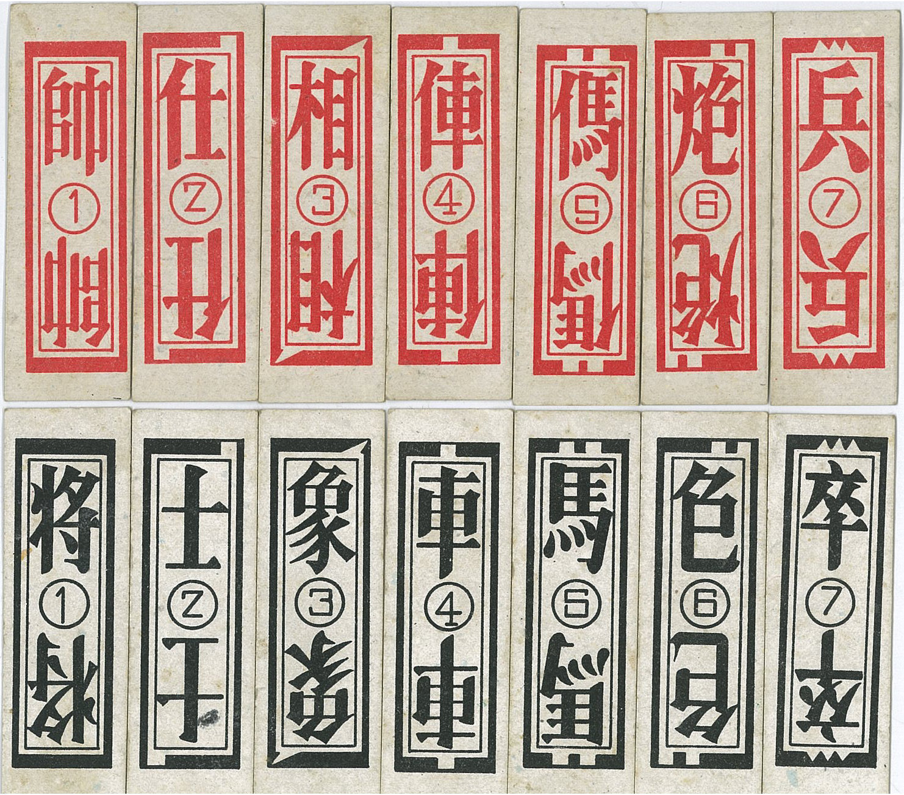

# <span lang="zh">釣白魚</span> · Fishing for Hairtails

Fishing for Hairtails <span lang="zh-Hant">釣白魚</span> (Hokkien: <span lang="nan-Latn">tiò pe̍h-hî</span>) is a Hokkien [fishing game](articles/families/fishing-games/fishing-games.md) for two or three players that is played with two-colour chess cards, which are sometimes called <span lang="zh-Hant">釣魚牌</span> ‘fishing cards’.  It may also be called <span lang="zh-Hant">白魚賭</span> ‘hairtail gambling’ or simply <span lang="zh-Hant">釣魚</span> ‘fishing’.

In Java (Indonesia), the name <span lang="jv">ꦥꦺꦲꦶ</span> <span lang="jv-Latn">pèhi</span> (<span lang="jv">ꦥꦺꦃꦱꦶ</span> <span lang="jv-Latn">pèhsi</span>) also referred to [a related game](games/pei/pei.md) played with [Ceki cards](articles/cards/ceki/ceki.md).[@deClercqPehiSpel]

The “hairtail” is the fish [<cite>Trichiurus lepturus</cite>,](https://en.wikipedia.org/wiki/Largehead_hairtail) also called the <span lang="ms">layur</span> throughout the Malay Archipelago. Legend has it that when one of these fish is caught, another one catches its tail, and so on, until the whole shoal is pulled up out of the water. This is compared to the way that cards are captured in this game. The reality is not as dramatic as that, but when they are being caught the hairtails do have a tendency to latch onto each other (see image at @タチウオの共食い), and it is possible to use hairtail tails as bait for them.

When many friends come to visit in succession, it is also compared to the way hairtails latch onto each other, and there is a saying <span lang="zh-Hant">白魚相咬尾</span> (Hokkien: <span lang="nan-Latn">pe̍h-hî sio kā bóe</span>) “hairtails biting each other” to describe situations like that.

The description below is based upon @YoungCeki [p. 293–5] and @DrieChineescheKaartspelen.

> [!todo]
>
> Chineesche visschers verhalen vandezen visch dat,wan eréénuiteenschool aandenhoek gevangen isenuithetwater gehaald wordt,denaaste buurman hem onmiddelijk indenstaart bijtenzich mede laat optrekken.Deze handeling plant zich voort door degeheele school en200ge beurt hetdatdevisscher meteenonbeduidend stukje aas,bestaande uiteenmoot vandenzelfden »witten visch"inéénkeer eengroot aantal dier visschen vaugt. Nuheeft deChineesche kaartspeler dievorming vancenaaneenschakeling door den »witten visch "vergeleken metdevorming vanseriën inzijnkaartspel ,en aanééndier spelen dennaam »denwitten visch hengelen “gegeven . Buiten het kaartspel wordt deze hebbelijkheid van den »witten visch" nog gebezigd om te wijzen op een ongewoon groot aantal vrienden, die achtereenvolgens op den zelfdeuntijd een bezoek komen brengen. Het achter elkander binnenkomen der vrieden wordt nl. vergeleken met die reeks witte visschen aan den hengel, en onder een welkemstgroet voegt de gastheer den bezoekers toe: "de witte visschen bitjen elkander in den staart"
>
> Chinese fishermen tell that when one of the school's fish is caught at an angle and taken out of the water, its next neighbour immediately bites its tail and pulls it up with him. This action is repeated throughout the whole school and 200 times the fisherman fishes a large number of fish with an insignificant piece of bait consisting of the same "white fish". Now the Chinese card player has compared the formation of cen links by the "white fish" with the formation of saris in his card game, and has given this game the name "angling the white fish". Outside the card game, the "whitefish's" ability is also used to refer to an unusually large number of friends who come to visit successively at the same time. The arrival of friends one after the other is compared to a series of white fish on a fishing rod, and under a greeting the host adds: "the white fish bit each other in the tail".
>
> Translated with www.DeepL.com/Translator (free version)

> [!todo]
>
> 一方有難，八方追著啃
>
> 釣帶魚時，會發生一種神奇現象。《海錯圖》畫的就是這個場景：一隻帶魚咬鉤後，另一隻會咬住它的尾巴，一起被提出水。
>
> 這可不是瞎說的，今天人們釣帶魚時，仍能看到這種奇觀，有時甚至能一次提起三四條帶魚。閩南有漁諺「白魚相咬尾」、「白魚連尾釣」即此。
>
> 原文網址：https://kknews.cc/food/mpov422.html
>
> When one side is in trouble, all sides follow
>
> When fishing for striped bass, a magical phenomenon occurs. This is the scene depicted in The Sea of Mistakes, where one striped bass bites the hook and then another bites its tail and is lifted out of the water together.
>
> This is not just nonsense, as people can still see this spectacle when fishing for striped bass today, sometimes even lifting three or four fish at a time. There is a fishing proverb in Minnan that says "white fish bite each other's tails" and "white fish caught with tails".
>
> Original website: https://kknews.cc/food/mpov422.html
>
> Translated with www.DeepL.com/Translator (free version)

## Play

The game is played with a deck of two-colour chess cards containing 56 cards, so that there are 4 copies of each individual card (8 of each rank). This deck is sometimes called <span lang="nan-Latn">âng-pâi</span> (<span lang="zh">紅牌
</span>, ‘red cards’).[@DrieChineescheKaartspelen p. 415]

> [!figure]
>
> 
>
> ```yaml
> originalUrl: "https://commons.wikimedia.org/wiki/File:%E9%87%A3%E9%AD%9A%E7%89%8C.png"
> author: "outlookxp"
> copyrightYear: 2013
> license: "cc-by-sa"
> licenseVersion: "3.0"
> ```
>
> Example cards from a deck.


The types of cards in each colour are:

<ul class="columnar">
<li>
<b><span lang="zh-Hant" class="red">帥</span> <span lang="zh-Hant">將</span></b> king
</li>
<li>
<b><span lang="zh-Hant" class="red">仕</span> <span lang="zh-Hant">士</span></b> councillor
</li>
<li>
<b><span lang="zh-Hant" class="red">相</span> <span lang="zh-Hant">象</span></b> elephant
</li>
<li>
<b><span lang="zh-Hant" class="red">俥</span> <span lang="zh-Hant">車</span></b> chariot
</li>
<li>
<b><span lang="zh-Hant" class="red">傌</span> <span lang="zh-Hant">馬</span></b> horse
</li>
<li>
<b><span lang="zh-Hant" class="red">炮</span> <span lang="zh-Hant">包</span></b> cannon
</li>
<li>
<b><span lang="zh-Hant" class="red">兵</span> <span lang="zh-Hant">卒</span></b> soldier
</li>
</ul>

Determine the dealer by drawing cards; the highest card becomes dealer, red outranking black.

For two people, the dealer deals 10 cards face-down to themselves, then 8 face-up to the table, then 10 face-down to their opponent and another 8 face-up to the table, so that there are 16 cards in the pool.

For three people, deal 7 to the player, 5 to the table, 7 and 5 again, then 7 and 4, so that there are 14 cards in the pool.

The remaining cards are placed face-down to form a stock (20 cards for two players, 21 for three). The top card of the stock is turned over and remains face-up during play; this will be the last card drawn by the last player.

The play is the same as a standard fishing game. On each player’s turn they play a card from their hand into the pool and try to match one of the cards that is already there. If they match it (by rank), then they capture their played card and the card from the pool. After this, they draw the _bottom_ card of the stock and try to capture again in the same way. Cards that are played or turned that do not match are left in the pool.

The game finishes once all players are out of cards. Any cards left in the pool are uncaptured.

### Scoring

Using the cards that they have captured, the players form them into scoring combinations. The scoring combinations are formed by having sets of 3 or 4 cards in the same suit. They are:

- chariot, horse, cannon: 50 points
- king, councillor, elephant: 100 points
- all four soldiers: 100 points

@DrieChineescheKaartspelen also says that any odd cards are worth 10 points each.

After totalling points, players who have fewer points must pay to those who have more a sum based on the difference between their point totals. Or, if playing for points, they must pay the difference in points.
