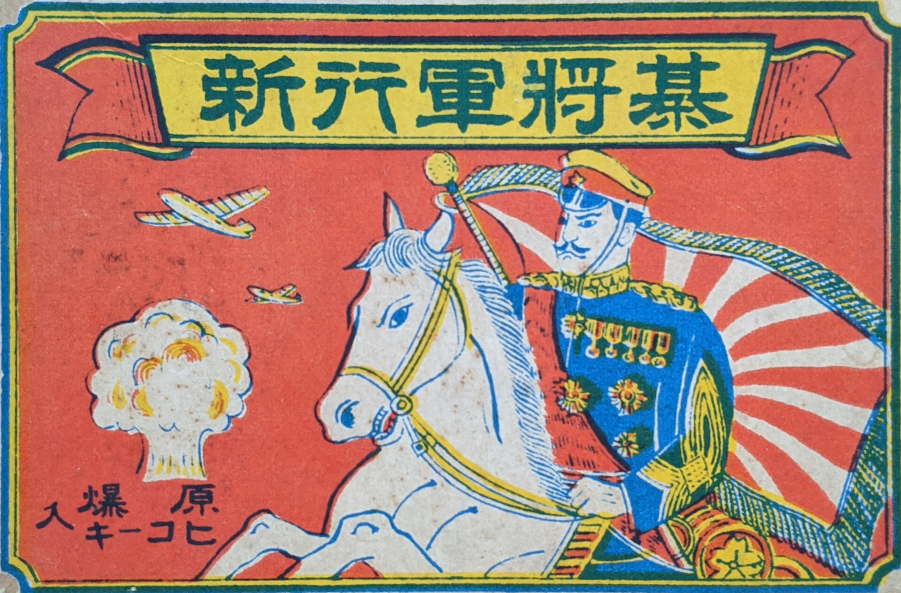
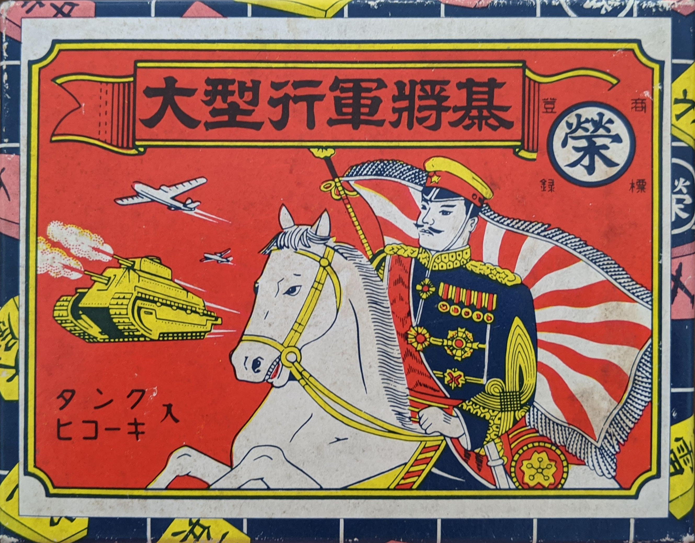

<Pronounce noun="true" lang="ja-Latn"  file="pronunciation_ja_軍人将棋.mp3" pronouncer="mezashi">Gunjin Shogi</Pronounce> (<span lang="ja">軍人将棋</span> ‘soldier chess’) is a Japanese game of hidden ranked combat, like the game Stratego. However, unlike Stratego, the game is usually played with a third person acting as referee, so that the identity of pieces does not need to be revealed at any stage.

## Pieces and Powers

There exist many different versions of <span class="noun" lang="ja-Latn">Gunjin Shogi</span>, with between 15 and 35 pieces, and with different ranks or powers given to the pieces. I present two versions that I have access to here.

### 15-piece version

> [!figure]
>
> 
>
> ```yaml
> size: "small"
> ```
>
> The box for <span lang="ja">新行軍将棋</span>. This was probably produced some time between 1945–55.[@HironoriGunjin]

> [!figure]
> 
> 
>
> ```yaml
> position: "aside"
> ```
>
> The board for the 14-piece version, printed on thin paper.


This version was sold as <span lang="ja">新行軍将棋</span> (<Pronounce lang="ja-Latn"  pronouncer="mezashi" file="pronunciation_ja_新行軍将棋.mp3">shinkōgunshōgi</Pronounce> ‘new marching chess’). There are fourteen pieces: the first eleven are soldiers ranking from <span lang="ja">元帥</span>[^fn0] ‘marshal’ down to <span lang="ja">少尉</span> ‘second lieutenant’; the rest are special pieces [<span lang="ja">ＭＰ</span>](https://en.wikipedia.org/wiki/Military_police), <span lang="ja">ヒコーキ</span> ‘aeroplane’, <span lang="ja">原子爆弾</span> ‘atomic bomb’, and <span lang="ja">スパイ</span> ‘spy’.

[^fn0]: In the game this is mistakenly spelled “<span lang="ja">元師</span>” both on the piece and in the rules.

The ordinary soldier pieces capture by rank: each can capture any other soldier
piece ranked lower than itself. In general, if two pieces of the same rank meet,
both are removed from the board. My interpretation of the ranking of each piece
is as follows:

> [!todo]
> 
> this table is a best-guess at the moment

<div class="scroller wide">
<table class="small rule-first-col" lang="ja">
<thead>
<tr>
<th>
</th>
<th>
<span class="vertical-rl">元帥</span>
</th>
<th>
<span class="vertical-rl">大将</span>
</th>
<th>
<span class="vertical-rl">中将</span>
</th>
<th>
<span class="vertical-rl">少将</span>
</th>
<th>
<span class="vertical-rl">代将</span>
</th>
<th>
<span class="vertical-rl">大佐</span>
</th>
<th>
<span class="vertical-rl">中佐</span>
</th>
<th>
<span class="vertical-rl">少佐</span>
</th>
<th>
<span class="vertical-rl">大尉</span>
</th>
<th>
<span class="vertical-rl">中尉</span>
</th>
<th>
<span class="vertical-rl">少尉</span>
</th>
<th>
<span class="vertical-rl">ＭＰ</span>
</th>
<th>
<span class="vertical-rl">ヒコーキ</span>
</th>
<th>
<span class="vertical-rl">原子爆弾</span>
</th>
<th>
<span class="vertical-rl">スパイ</span>
</th>
</tr>
</thead>
<tbody class="text-center">
<tr>
    <th scope="row" class="text-end">
    元帥
    </th>
    <td>
    △
    </td>
    <td>
    ○
    </td>
    <td>
    ○
    </td>
    <td>
    ○
    </td>
    <td>
    ○
    </td>
    <td>
    ○
    </td>
    <td>
    ○
    </td>
    <td>
    ○
    </td>
    <td>
    ○
    </td>
    <td>
    ○
    </td>
    <td>
    ○
    </td>
    <td>
    ○
    </td>
    <td>
    ×
    </td>
    <td>
    ×
    </td>
    <td>
    ×
    </td>
</tr>
<tr>
    <th scope="row" class="text-end">
    大将
    </th>
    <td>
    ×
    </td>
    <td>
    △
    </td>
    <td>
    ○
    </td>
    <td>
    ○
    </td>
    <td>
    ○
    </td>
    <td>
    ○
    </td>
    <td>
    ○
    </td>
    <td>
    ○
    </td>
    <td>
    ○
    </td>
    <td>
    ○
    </td>
    <td>
    ○
    </td>
    <td>
    ○
    </td>
    <td>
    ×
    </td>
    <td>
    ×
    </td>
    <td>
    ○
    </td>
</tr>
<tr>
    <th scope="row" class="text-end">
    中将
    </th>
    <td>
    ×
    </td>
    <td>
    ×
    </td>
    <td>
    △
    </td>
    <td>
    ○
    </td>
    <td>
    ○
    </td>
    <td>
    ○
    </td>
    <td>
    ○
    </td>
    <td>
    ○
    </td>
    <td>
    ○
    </td>
    <td>
    ○
    </td>
    <td>
    ○
    </td>
    <td>
    ○
    </td>
    <td>
    ×
    </td>
    <td>
    ×
    </td>
    <td>
    ○
    </td>
</tr>
<tr>
    <th scope="row" class="text-end">
    少将
    </th>
    <td>
    ×
    </td>
    <td>
    ×
    </td>
    <td>
    ×
    </td>
    <td>
    △
    </td>
    <td>
    ○
    </td>
    <td>
    ○
    </td>
    <td>
    ○
    </td>
    <td>
    ○
    </td>
    <td>
    ○
    </td>
    <td>
    ○
    </td>
    <td>
    ○
    </td>
    <td>
    ○
    </td>
    <td>
    ×
    </td>
    <td>
    ×
    </td>
    <td>
    ○
    </td>
</tr>
<tr>
    <th scope="row" class="text-end">
    代将
    </th>
    <td>
    ×
    </td>
    <td>
    ×
    </td>
    <td>
    ×
    </td>
    <td>
    ×
    </td>
    <td>
    △
    </td>
    <td>
    ○
    </td>
    <td>
    ○
    </td>
    <td>
    ○
    </td>
    <td>
    ○
    </td>
    <td>
    ○
    </td>
    <td>
    ○
    </td>
    <td>
    ○
    </td>
    <td>
    ×
    </td>
    <td>
    ×
    </td>
    <td>
    ○
    </td>
</tr>
<tr>
    <th scope="row" class="text-end">
    大佐
    </th>
    <td>
    ×
    </td>
    <td>
    ×
    </td>
    <td>
    ×
    </td>
    <td>
    ×
    </td>
    <td>
    ×
    </td>
    <td>
    △
    </td>
    <td>
    ○
    </td>
    <td>
    ○
    </td>
    <td>
    ○
    </td>
    <td>
    ○
    </td>
    <td>
    ○
    </td>
    <td>
    ○
    </td>
    <td>
    ×
    </td>
    <td>
    ×
    </td>
    <td>
    ○
    </td>
</tr>
<tr>
    <th scope="row" class="text-end">
    中佐
    </th>
    <td>
    ×
    </td>
    <td>
    ×
    </td>
    <td>
    ×
    </td>
    <td>
    ×
    </td>
    <td>
    ×
    </td>
    <td>
    ×
    </td>
    <td>
    △
    </td>
    <td>
    ○
    </td>
    <td>
    ○
    </td>
    <td>
    ○
    </td>
    <td>
    ○
    </td>
    <td>
    ○
    </td>
    <td>
    ×
    </td>
    <td>
    ×
    </td>
    <td>
    ○
    </td>
</tr>
<tr>
    <th scope="row" class="text-end">
    少佐
    </th>
    <td>
    ×
    </td>
    <td>
    ×
    </td>
    <td>
    ×
    </td>
    <td>
    ×
    </td>
    <td>
    ×
    </td>
    <td>
    ×
    </td>
    <td>
    ×
    </td>
    <td>
    △
    </td>
    <td>
    ○
    </td>
    <td>
    ○
    </td>
    <td>
    ○
    </td>
    <td>
    ○
    </td>
    <td>
    ×
    </td>
    <td>
    ×
    </td>
    <td>
    ○
    </td>
</tr>
<tr>
    <th scope="row" class="text-end">
    大尉
    </th>
    <td>
    ×
    </td>
    <td>
    ×
    </td>
    <td>
    ×
    </td>
    <td>
    ×
    </td>
    <td>
    ×
    </td>
    <td>
    ×
    </td>
    <td>
    ×
    </td>
    <td>
    ×
    </td>
    <td>
    △
    </td>
    <td>
    ○
    </td>
    <td>
    ○
    </td>
    <td>
    ○
    </td>
    <td>
    ×
    </td>
    <td>
    ×
    </td>
    <td>
    ○
    </td>
</tr>
<tr>
    <th scope="row" class="text-end">
    中尉
    </th>
    <td>
    ×
    </td>
    <td>
    ×
    </td>
    <td>
    ×
    </td>
    <td>
    ×
    </td>
    <td>
    ×
    </td>
    <td>
    ×
    </td>
    <td>
    ×
    </td>
    <td>
    ×
    </td>
    <td>
    ×
    </td>
    <td>
    △
    </td>
    <td>
    ○
    </td>
    <td>
    ○
    </td>
    <td>
    ×
    </td>
    <td>
    ×
    </td>
    <td>
    ○
    </td>
</tr>
<tr>
    <th scope="row" class="text-end">
    少尉
    </th>
    <td>
    ×
    </td>
    <td>
    ×
    </td>
    <td>
    ×
    </td>
    <td>
    ×
    </td>
    <td>
    ×
    </td>
    <td>
    ×
    </td>
    <td>
    ×
    </td>
    <td>
    ×
    </td>
    <td>
    ×
    </td>
    <td>
    ×
    </td>
    <td>
    △
    </td>
    <td>
    ○
    </td>
    <td>
    ×
    </td>
    <td>
    ×
    </td>
    <td>
    ○
    </td>
</tr>
<tr>
    <th scope="row" class="text-end">
    ＭＰ
    </th>
    <td>
    ×
    </td>
    <td>
    ×
    </td>
    <td>
    ×
    </td>
    <td>
    ×
    </td>
    <td>
    ×
    </td>
    <td>
    ×
    </td>
    <td>
    ×
    </td>
    <td>
    ×
    </td>
    <td>
    ×
    </td>
    <td>
    ×
    </td>
    <td>
    ×
    </td>
    <td>
    △
    </td>
    <td>
    ○
    </td>
    <td>
    ○
    </td>
    <td>
    ○
    </td>
</tr>
<tr>
    <th scope="row" class="text-end">
    ヒコーキ
    </th>
    <td>
    ○
    </td>
    <td>
    ○
    </td>
    <td>
    ○
    </td>
    <td>
    ○
    </td>
    <td>
    ○
    </td>
    <td>
    ○
    </td>
    <td>
    ○
    </td>
    <td>
    ○
    </td>
    <td>
    ○
    </td>
    <td>
    ○
    </td>
    <td>
    ○
    </td>
    <td>
    ×
    </td>
    <td>
    △
    </td>
    <td>
    ○
    </td>
    <td>
    ○
    </td>
</tr>
<tr>
    <th scope="row" class="text-end">
    原子爆弾
    </th>
    <td>
    ○
    </td>
    <td>
    ○
    </td>
    <td>
    ○
    </td>
    <td>
    ○
    </td>
    <td>
    ○
    </td>
    <td>
    ○
    </td>
    <td>
    ○
    </td>
    <td>
    ○
    </td>
    <td>
    ○
    </td>
    <td>
    ○
    </td>
    <td>
    ○
    </td>
    <td>
    ×
    </td>
    <td>
    ×
    </td>
    <td>
    △
    </td>
    <td>
    ○
    </td>
</tr>
<tr>
    <th scope="row" class="text-end">
    スパイ
    </th>
    <td>
    ○
    </td>
    <td>
    ×
    </td>
    <td>
    ×
    </td>
    <td>
    ×
    </td>
    <td>
    ×
    </td>
    <td>
    ×
    </td>
    <td>
    ×
    </td>
    <td>
    ×
    </td>
    <td>
    ×
    </td>
    <td>
    ×
    </td>
    <td>
    ×
    </td>
    <td>
    ×
    </td>
    <td>
    ×
    </td>
    <td>
    ×
    </td>
    <td>
    △
    </td>
</tr>
</tbody>
</table>
</div>

### 31-piece version

> [!figure]
>
> 
>
> ```yaml
> size: "small"
> ```
>
> The box for <span lang="ja">大型行軍将棋</span>.


This version was sold as <span lang="ja">大型行軍将棋</span> (<Pronounce lang="ja-Latn"  pronouncer="mezashi" file="pronunciation_ja_大型行軍将棋.mp3">ōgatakōgunshōgi</Pronounce> ‘large marching chess’).
