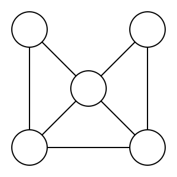

# Horseshoe

<span class="aka">Horseshoe</span> is a simple blocking boardgame for children that seems to originate from China, where it is known by many names.

> [!figure]
>
> 
>
> ```yaml
> noborder: true
> position: "aside"
> ```
>
> Countries mentioned in this article.

Because the board is shaped like the Chinese character ‘<span lang="zh">区</span>’ (‘area’), it is known as ‘<code>区</code> character game’ (<span lang="zh" class="aka">区字棋</span>, Mandarin: <span lang="cmn-Latn-pinyin" class="aka">qū zì qí</span>). Other names include ‘crotch game’ (<span lang="zh-Hant" class="aka">褲襠棋</span>/<span lang="zh-Hans" class="aka">裤裆棋</span>, Mandarin: <span lang="cmn-Latn-pinyin" class="aka">kùdāng qí</span>), or ‘scissor game’ (<span lang="zh" class="aka">剪刀棋</span>, Mandarin: <span lang="cmn-Latn-pinyin" class="aka">jiǎndāo qí</span>).

The board is simple enough to be drawn with a finger into dirt or sand, and can
be played with any two sets of two distinctive pieces: rocks, shell, bottlecaps,
or anything else that the players have to hand.

> [!figure]
>
> 
>
> ```yaml
> noborder: true
> size: "small"
> ```
>
> A “standardized” board with places for the pieces to go.
>
> The usual Chinese board is the same as this, only drawn without circles.

In English the game has no standard name, not being widespread, but it has been called “horseshoe”, or also “<span class="aka">bar</span>”.[@MeditoBoxFront]

In Cantonese it is called ‘cleft lip game’ (<span lang="yue" class="aka">崩口棋</span> <span lang="yue-Latn-jyutping" class="aka">bong¹ hau² kei⁴</span>),[@KoreanGames p.  100][@PangHauKiImage][^culintranslit] because of the shape of the board. In Hindi it is called <span lang="hi-Latn" class="aka">do-guṭī</span> (<span lang="hi" class="aka">दो गुटी</span> ‘two pieces’, perhaps Urdu <span lang="ur" class="aka">دو گتھی</span>).[@GuptaD p. 143][^corrupted]

[^corrupted]: A corrupted (and unplayable) version of this game appears in @GamesOfTheWorld [265] under the name “Do-quti”.

[^culintranslit]: In older books (such as Culin’s) this is transliterated as <span lang="yue-Latn" class="aka">pong hau k’i</span>.

In Korea it is known as <span lang="ko-Latn" class="aka">umulgonu</span> (<span lang="ko" class="aka">우물고누</span> ‘well game’) or <span lang="ko-Latn" class="aka">ganggonu</span> (<span lang="ko" class="aka">강고누</span> ‘river game’).[@KoreanGames p. 100] In Thailand it is called <span lang="th-Latn" class="aka">suea tok thang</span> (<span lang="th" class="aka">เสือตกถัง</span> ‘tiger falls into the bucket’),[^suatoktong] and a similar Khmer name is <span lang="km-Latn" class="aka">khlaa thlĕək ʼɑndoung</span> (<span lang="km" class="aka">ខ្លាធ្លាក់អណ្ដូង</span> ‘tiger falls in the well’).[@SEAlangKhmer] Other Thai names are <span lang="th-Latn" class="aka">saeng tawan</span> (<span lang="th" class="aka">แสงตะวัน</span> ‘sun rays’).[@TigerTank][^anothername] In Malaysia it is known as <Pronounce lang="ms" class="aka"  pronouncer="Alvin00">telaga buruk</Pronounce> (‘bad well’).[@TigerTank]

[^suatoktong]: Older books transliterate this as <span lang="th-Latn" class="aka">sua tok tong</span>.

[^anothername]: Another name given is <span lang="th" class="aka">จะบูมูลู</span> but I haven’t been able to translate it.


> [!multi-equal]
> > [!figure]
> >
> > 
> >
> > ```yaml
> > noborder: true
> > ```
> >
> > A Korean board, after @KoreanGames [p. 100].
>
> > [!figure]
> >
> > 
> >
> > ```yaml
> > noborder: true
> > ```
> >
> > A Thai board, as found [online](https://web.archive.org/web/20220809031306/https://shopee.co.th/%E0%B9%80%E0%B8%81%E0%B8%A1%E0%B9%80%E0%B8%AA%E0%B8%B7%E0%B8%AD%E0%B8%95%E0%B8%81%E0%B8%96%E0%B8%B1%E0%B8%87-Dead-End-%E0%B8%82%E0%B8%AD%E0%B8%87%E0%B9%80%E0%B8%A5%E0%B9%88%E0%B8%99%E0%B9%84%E0%B8%A1%E0%B9%89-%E0%B9%80%E0%B8%81%E0%B8%A1%E0%B9%84%E0%B8%A1%E0%B9%89-%E0%B8%82%E0%B8%AD%E0%B8%87%E0%B9%80%E0%B8%A5%E0%B9%88%E0%B8%99%E0%B9%84%E0%B8%A1%E0%B9%89%E0%B9%80%E0%B8%AA%E0%B8%A3%E0%B8%B4%E0%B8%A1%E0%B8%9E%E0%B8%B1%E0%B8%92%E0%B8%99%E0%B8%B2%E0%B8%81%E0%B8%B2%E0%B8%A3-%E0%B8%82%E0%B8%AD%E0%B8%87%E0%B9%80%E0%B8%A5%E0%B9%88%E0%B8%99%E0%B9%84%E0%B8%A1%E0%B9%89%E0%B8%9D%E0%B8%B6%E0%B8%81%E0%B8%AA%E0%B8%A1%E0%B8%AD%E0%B8%87-wooden-family-board-games-i.92760471.11313361650).
>
>
> > [!figure]
> >
> > 
> >
> > ```yaml
> > noborder: true
> > ```
> >
> > A Thai board, after @KoreanGames [p. 100].


The Korean, Malaysian, and Thai names are probably implying a similar theme to the game: the point of the game is to block the opponent so that their only move is to “fall into” the river/well/bucket. The boards used in these countries also have a circle over the ‘forbidden’ section of the board, representing the obstacle that a piece could fall into.

This theme is also known in the Mongolian version of the game, where the circular board above is known as <span lang="mn-Latn" class="aka">temeenii tavkhai</span> (<span lang="mn-Cyrl" class="aka">тэмээний тавхай</span>/<span lang="mn-Mong" class="aka">ᠲᠡᠮᠡᢉᠡᠨ ᠦ᠋ ᠲᠠᠪᠠᠬᠠᠢ</span>) ‘camel’s paw’, and the circle is called the <span lang="mn-Latn">khudag</span> (<span lang="mn-Cyrl">худаг</span>/<span lang="mn-Mong">ᠬᠤᠳᠳᠤᠭ</span>) ‘well’. The square form of the board without a well is known as <span class="aka" lang="mn-Latn">dörvön bukh</span> (<span lang="mn-Cyrl" class="aka">дөрвөн бух</span>/<span lang="mn-Mong" class="aka">ᠳᠥᠷᠪᠡᠨ ᠪᠤᠬ</span>) ‘four bulls’.[@GamesOfMongolianShepherds p. 37–8][^query]

[^query]: In the summary at the end of @GamesOfMongolianShepherds the game is described as if the goal is to _prevent_ the other player from entering the well, however this can’t be correct as the game does not function when played in this manner.


> [!todo]
>
> <span lang="pa">ਦੋਗੁਟਿ</span> Punjabi?


## Play

> [!figure]
>
> 
>
> ```yaml
> size: "small"
> noborder: true
> ```
>
> The initial placement of the pieces.


Each player has two matching pieces. The game board is set up in the initial position as shown above. On each player’s turn, they select one of their pieces to move into the empty position on the board. The chosen piece must move along one of the lines on the board (or, on the boards with a  “well”, it must not move over the circle). If a player is unable to move one of their pieces, since they are both blocked, then they lose.

## Analysis

See: @Straffin95 and @ThinkingThroughDiagrams.

## See also

Some general references are @OxfordBG [p. 160], @Zaslavsky [p. 32], and @Murray2 [§4.8.1–2].
