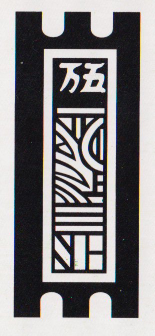
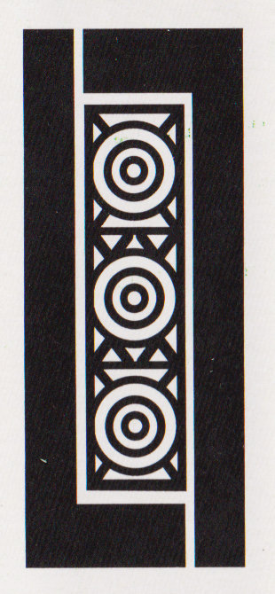
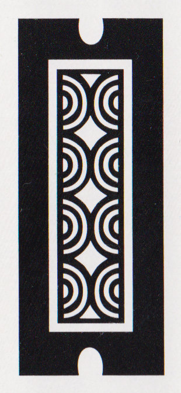
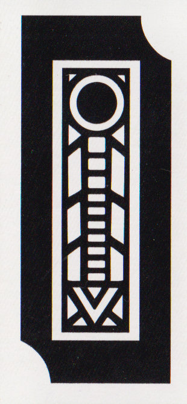

<span class="noun" lang="jv-Latn">Kartu Lima</span> (‘five cards’) is an unusual trick-taking game from Java, which was played with .[@JavaanseKaartspelen p. 46–57] The same game has also been described under the name <span class="noun" lang="jv-Latn">Tepu</span>.[@JavanischeKartenspiele p. 47]

The game below was described as being played in Surakarta. The version played in Yogyakarta was slightly different and is described afterwards.

## Setup

<span class="noun" lang="jv-Latn">Kartu Lima</span> is played by at least five and up to nine players. A single deck of 60 ceki cards is used.

To determine where players sit, pairs of cards can be used, dealing one half to the table and the other half of each pair to a player. The players sit where the corresponding cards are on the table.

Cut for the highest card (Red Flower, Old Thousand, or 1 Myriads counting 10 and others their rank) to determine who is the dealer. The dealer shuffles and the player to their left cuts the deck. The dealer deals each player five cards, and then the player to their right begins the game. Play is in anti-clockwise order as in other south-east Asian games.

## Play

The starting player can lead any card to a trick. The subsequent players try to ‘kill’ (<span lang="jv">ꦩꦠꦼꦤꦶ</span> <span lang="jv-Latn">mateni</span> or formal <span lang="jv-Latn">mejahi</span>) the led card by playing one of _equal or higher_ rank, within the same group (see below).

A player does not have to beat the card led but _must_ play one of the same group if possible. If they have no cards in the same group they toss in any card face-down (<span lang="jv-Latn">mberi</span>).

The highest card (or last card of equal value) played to the trick wins it, and the player who played it leads to the next trick. The aim of the game is to be the winner of the _last_ (fifth) trick played. The outcomes of the previous tricks do not count towards winning at all.

The winner of the round is called the <span lang="jv-Latn">banjiran</span> (‘flooded’), and shuffles and deals for the next round. If they win a second game they are called <span lang="jv-Latn">mbanjir</span> (‘abundance’?), and if a third and fourth, <span lang="jv-Latn">ladoe</span> (‘eruption’?).

A pair of top-ranking cards in one hand, i.e. a pair of any <span lang="jv-Latn">dika</span>, or the 9 of Strings or Coins, the 4 of Coins, or the Old Thousand, is unbeatable if led, and is called a <span lang="jv-Latn">mraji</span>.

If the starting player has a hand with two pairs of <span lang="jv-Latn">mraji</span>, they can reveal all four cards (<span lang="jv-Latn">mraji papat</span> ‘four <span lang="jv-Latn">mraji</span>’); these four cards would be unbeatable. The other players then discard down to one card and the final trick is played out.

Another variation is that any player who is dealt five Myriads cards can reveal them before the first trick to win instantly.

## Scoring & Payment

There are various ways to make bets on the game. The first type is <span lang="jv-Latn">wudhon tengah</span> (‘middle bet’); before each round, every player places the same stake (e.g. 5 or 10 cents) as a pot in the middle of the table. The winner of the round takes the whole pot. A new pot is made for each round.

Instead of winning the whole pot, a method called <span lang="jv-Latn">undhuh-undhuh</span> (‘pickings’) may be followed. In this case the winner only wins back the amount that each player staked (e.g. if everyone staked 5¢, then the winner takes 5¢ from the pot). One pot is built and will last for a number of rounds equal to the number of players. It can also be agreed than anyone who wins a second round in a row instantly takes the remainder of the pot, and a new one is created. If they win a third or subsequent consecutive round, they continue to win whole pots until their winning streak is ended.

{/*
 this section is very unclear in the book…
Usually the pot method is only followed for the first game (which I understand
to mean until the pot is taken). After this a method called <span
lang="jv-Latn">bal-balan</span> (‘bales’) is followed, whereby each player
places any bet amount they want in front of themselves, but it must be at least
the stake amount using during <span lang="jv-Latn">wudhon tengah</span>.
*/}

Another possible bet is <span lang="jv-Latn">pethitan</span> (“tapering points”?): if a player leads a <span lang="jv-Latn">dika</span> to the last round and it is not beaten, they win the bet; if it is killed, the killer takes the bet.

### Roosters

Players may also make bets on specific cards, called “roosters” (<span lang="jv-Latn">jagoan</span>, formal <span lang="jv-Latn">sawungan</span>).

The first method is called “challenge of roosters” (<span lang="jv-Latn">jagoan tantangan</span>): if a player has a <span lang="jv-Latn">dika</span> card amongst the five cards in their hand, they may place it face-down on the table.  This becomes their rooster (<span lang="jv-Latn">jago</span>), and they place a bet on top of the card. Other players may also (but don’t have to) place rooster bets, with the same amount on their cards. Any player that can “kill” a card with their rooster wins their bet amount from the other players who placed bets.

The second method is called “steady roosters” (<span lang="jv-Latn">jagoan tetep</span>); under this version, all players must place a rooster bet whether or not they have a <span lang="jv-Latn">dika</span> card or not, but those without cannot win anything. Players without <span lang="jv-Latn">dika</span> cards choose an arbitrary card to place face-down, so that it is not known who has roosters or not.

### Side Bets


## Card groups

The card groupings are unusual and I have not yet figured out an explanation for how they are constructed.

### <span lang="jv-Latn">Cina cilik</span> (‘little Chinese’)

There are ten cards in this group: the Myriad cards from <Cards>2–9</Cards> are all of equal rank. In the same group, but ranked higher, are Red Flower, and then Old Thousand is the highest.

> [!multi]
>
> > [!figure]
> >
> > 
> >
> > ```yaml
> > noborder: true
> > size: "small"
> > hidden: true
> > ```
> >
> > Old Thousand is the highest-ranking card in this group.
>
> > [!figure]
> >
> > 
> >
> > ```yaml
> > noborder: true
> > size: "small"
> > hidden: true
> > ```
> >
> > Red Flower is the second-highest.

> [!figure]
>
> 
> 
> 
> 
> 
> 
> 
> 
>
> ```yaml
> noborder: true
> size: "small"
> hidden: true
> ```
>
> Then the rest of the Myriads cards (aside from <Cards>1</Cards>) are ranked equally.

### 3 & 4 Coins

There are only two cards in this group; the 4 of Coins outranks the 3 of Coins.

> [!multi]
>
> > [!figure]
> >
> > 
> >
> > ```yaml
> > noborder: true
> > size: "small"
> > hidden: true
> > ```
> >
> > 4 Coins is the higher-ranking.
>
> > [!figure]
> >
> > 
> >
> > ```yaml
> > noborder: true
> > size: "small"
> > hidden: true
> > ```
> >
> > 3 Coins is the lower-ranking.

### 8 & 9 Coins

There are only two cards in this group; the 9 of Coins outranks the 8 of Coins.

> [!multi]
>
> > [!figure]
> >
> > 
> >
> > ```yaml
> > noborder: true
> > size: "small"
> > hidden: true
> > ```
> >
> > 9 Coins is the higher-ranking.
>
> > [!figure]
> >
> > 
> >
> > ```yaml
> > noborder: true
> > size: "small"
> > hidden: true
> > ```
> >
> > 8 Coins is the lower-ranking.

### <span lang="jv-Latn">Lintrik cilik</span> (‘little rows’)

There are four cards in this group; the 9 of Strings outranks the 8 of Strings, and the 5 & 7 of Strings are of equal rank.

> ![multi]
>
> > [!figure]
> >
> > 
> >
> > ```yaml
> > noborder: true
> > size: "small"
> > hidden: true
> > ```
> >
> > 9 Strings is the highest-ranking.
> 
> > [!figure]
> >
> > 
> >
> > ```yaml
> > noborder: true
> > size: "small"
> > hidden: true
> > ```
> >
> > 8 Strings is the second-highest.
> 
> > [!figure]
> >
> > 
> > 
> >
> > ```yaml
> > noborder: true
> > size: "small"
> > justify: "centered"
> > hidden: true
> > ```
> >
> > 5 & 7 Strings are ranked equally.

### <span lang="jv-Latn">Dika</span>

The remaining 12 cards are in this group.  The name of this group comes from the work <span lang="jv-Latn">mardika</span> meaning ‘free, independent, not in service to someone else’. This group should really be thought of as 12 different groups,[^fn0] one for each card, as the cards in this group can only be beaten by their identical copy (there are two copies of each card).

[^fn0]: As pointed out in @JavaanseKaartspelenReview [p. 350].

Note that because these are really 12 separate groups, if one of the <span lang="jv-Latn">dika</span> is led, the only card that is forced to be played is its matching partner (which, if played, must win the trick). You do not have to throw away another <span lang="jv-Latn">dika</span> as a discard.

The cards are:

> [!figure]
>
> 
> 
> 
> 
>
> ```yaml
> noborder: true
> size: "small"
> justify: "centered"
> hidden: true
> ```
>
> All non-red rank-1 cards.

> [!figure]
>
> 
> 
> 
> 
>
> ```yaml
> noborder: true
> size: "small"
> justify: "centered"
> hidden: true
> ```
>
> The 2, 3, 4, and 6 of Strings.

> [!figure]
>
> 
> 
> 
> 
>
> ```yaml
> noborder: true
> size: "small"
> justify: "centered"
> hidden: true
> ```
>
> The 2, 5, 6, and 7 of Coins.

## <span lang="jv-Latn">Wangsalan</span>

For many of the cards there exist <span lang="jv-Latn">wangsalan</span>, that is, riddling sentences that allude to the card’s name. These are used by the leading player to announce which card is being played. For the <span lang="jv-Latn">dika</span> cards, if a player has the corresponding card that can kill the led one, they say <span lang="jv-Latn">ana kéné</span>: “I have it!”

### <span lang="jv-Latn">Dika</span> cards

The <span lang="jv-Latn">wangsalan</span> for the <span lang="jv-Latn">dika</span> cards are, in the order presented above:[@JavaanseKaartspelen p. 50]

<dl>
<dt>
<span lang="jv-Latn">Kucing</span> (White Flower)
</dt>
<dd>
* <span lang="jv-Latn">mandor ténong</span> (supervisor of the snack box), since it is a cat!
</dd>
<dt>
<span lang="jv-Latn">Petik</span> (1 Myriads)
</dt>
<dd>
* <span lang="jv-Latn">gemak lesung</span> (quail which hangs out near the rice pounding trough), since the word for “chicken” (<span lang="jv-Latn">pitik</span>) sounds like <span lang="jv-Latn">petik</span>
* <span lang="jv-Latn">dadi layadan</span> (lamented) because it is a synonym for <span lang="jv-Latn">dadi petikan</span> (grieved), which contains <span lang="jv-Latn">petik</span>
</dd>
<dt>
<span lang="jv-Latn">Bedor</span> (1 Bamboo)
</dt>
<dd>
All of the <span lang="jv-Latn">wangsalan</span> for this card refer to its phallic appearance:
* <span lang="jv-Latn">lindu ambèn</span> (sleeping-couch shaker)
* <span lang="jv-Latn">pada nggawa</span> (we all carry it), used amongst men
* <span lang="jv-Latn">srutu wulu</span> (hairy cigar)
* <span lang="jv-Latn">disénggol modot</span> (it grows longer when touched)
* <span lang="jv-Latn">paku sentong</span> (nail of the small room)
* <span lang="jv-Latn">kenthès lèker</span> (pleasant cudgel)
</dd>
<dt>
<span lang="jv-Latn">Kasut</span> (1 Coins)
</dt>
<dd>
* <span lang="jv-Latn">wong tuwa</span> (old person), since <span lang="jv-Latn">kisut</span> (wrinkled) sounds like <span lang="jv-Latn">kasut</span>
* <span lang="jv-Latn">sa tekem</span> (a handful), “for the condition of a certain part of the body in an old woman”
</dd>
<dt>
<span lang="jv-Latn">Déngkék</span> (2 Bamboo)
</dt>
<dd>
* <span lang="jv-Latn">tiba kanteb</span> (falling down), since <span lang="jv-Latn">rèngkèk-rèngkèk</span> (walking with a bent back) sounds like <span lang="jv-Latn">déngkék</span>
* <span lang="jv-Latn">ménco jurang</span> (mynah bird of the gorge), via another name for it <span lang="jv-Latn">tèngkèk</span>
* in Yogyakarta it was called <span lang="jv-Latn">kendang Sala</span> (drum of Surakarta), since the drum sounds like <span lang="jv-Latn">andlingdanghèk</span>(?)
</dd>
<dt>
<span lang="jv-Latn">Gunung</span> (3 Bamboo)
</dt>
<dd>
Referring to the name “mountain”:
* <span lang="jv-Latn">pager jagad</span> (world wall)
* <span lang="jv-Latn">wudun bumi</span> (earth pimple)
* <span lang="jv-Latn">gedé duwur</span> (large and high)
</dd>
<dt>
<span lang="jv-Latn">Cawang</span> (4 Bamboo)
</dt>
<dd>
* <span lang="jv-Latn">sènggèt kembang</span> (flower picking pole)
* <span lang="jv-Latn">pedot del</span> (sudden break)
* <span lang="jv-Latn">pedot tengah</span> (broken in the middle)
</dd>
<dt>
<span lang="jv-Latn">Kléja</span> (4 Bamboo)
</dt>
<dd>
* <span lang="jv-Latn">kluwung ésuk</span> (morning rainbow), due to <span lang="jv-Latn">téja</span> (rainbow)
</dd>
<dt>
<span lang="jv-Latn">Plompong</span> (2 Coins)
</dt>
<dd>
* <span lang="jv-Latn">bocah bisu</span> (mute child), due to <span lang="jv-Latn">mlompong</span> (with open mouth)
* <span lang="jv-Latn">randa jégang</span> (widow, sitting improperly with one leg drawn up)
* <span lang="jv-Latn">tanpa tutup</span> (without a cover)
</dd>
<dt>
<span lang="jv-Latn">Kanthong</span> (5 Coins)
</dt>
<dd>
* <span lang="jv-Latn">sak wédok</span> (woman’s bag), referring to <span lang="jv-Latn">kanthong</span> (bag)
* <span lang="jv-Latn">putra Semar</span> (son of <a href="https://en.wikipedia.org/wiki/Semar">Semar</a>), i.e. <a href="https://en.wikipedia.org/wiki/Petruk">Petruk</a>, whose nickname is <span lang="jv-Latn">Kantong Bolong</span>
</dd>
<dt>
<span lang="jv-Latn">Kerok</span> (6 Coins)
</dt>
<dd>
* <span lang="jv-Latn">wajah tambur</span> (drum time), since one would brush the horses (with <span lang="jv-Latn">kerok</span>, a curry comb) when the drums sounded
</dd>
<dt>
<span lang="jv-Latn">Kéra</span> (7 Coins)
</dt>
<dd>
Meaning “cross-eyed”:
* <span lang="jv-Latn">putra pacé</span> (child of a type of fruit), unclear but <span lang="jv-Latn">pécé</span> means one-eyed
* <span lang="jv-Latn">bebed klèmbrèh</span> (a batik garment worn by men, hanging loosely)
* <span lang="jv-Latn">mata keplèsèt</span> (slipped eye)
</dd>
</dl>

### Other cards

<span lang="jv-Latn">Wangsalan</span> for other cards are:

<dl>
<dt>
Myriad cards other than the 1 Myriads
</dt>
<dd>
In Yogyarkarta these were referred to as “Secadiningrat”, after <a href="https://id.wikipedia.org/wiki/Tan_Jin_Sing">Tan Jin Sing</a> (c.  1760–1831), an official of Chinese descent who held the title Radèn Tumenggung Secadiningrat from 1813.
</dd>
<dt>
<span lang="jv-Latn">Tambur</span> (4 Coins)
</dt>
<dd>
* <span lang="jv-Latn">rijal bètèng</span> (<span lang="jv-Latn">rijal</span> of a fort); <span lang="jv-Latn">rijal</span> are strange noises heard in the dead of night, hence noises from a fort are drums (<span lang="jv-Latn">tambur</span>)
* <span lang="jv-Latn">bedug bètèng</span> (mosque drum of a fort); the <span lang="jv-Latn">bedug</span> is the drum that summons Muslims to prayer
* <span lang="jv-Latn">lulang cilaka</span> (misfortunate leather), presumably the drum skin which is beaten
</dd>
<dt>
<span lang="jv-Latn">Picis</span> (8 Coins)
</dt>
<dd>
* <span lang="jv-Latn">tumbak gajah</span> (elephant spear), via <span lang="jv-Latn">cis</span>, a short spear used to guide elephants
</dd>
<dt>
<span lang="jv-Latn">Glinding</span> (9 Coins)
</dt>
<dd>
* <span lang="jv-Latn">tambak ludira</span> (pond blood), unclear
* In Yogyakarta, <span lang="jv-Latn">lori Pundung</span> (lorry for Pundung), or <span lang="jv-Latn">grobag Imagiri</span> (cart for Imagiri), via <span lang="jv-Latn">ngglinding</span> (rolling)
</dd>
<dt>
<span lang="jv-Latn">Sanga Bang</span> (9 Bamboo)
</dt>
<dd>
* <span lang="jv-Latn">geni murub</span> (flaring fire)
* <span lang="jv-Latn">obor</span> (torch)
</dd>
</dl>
