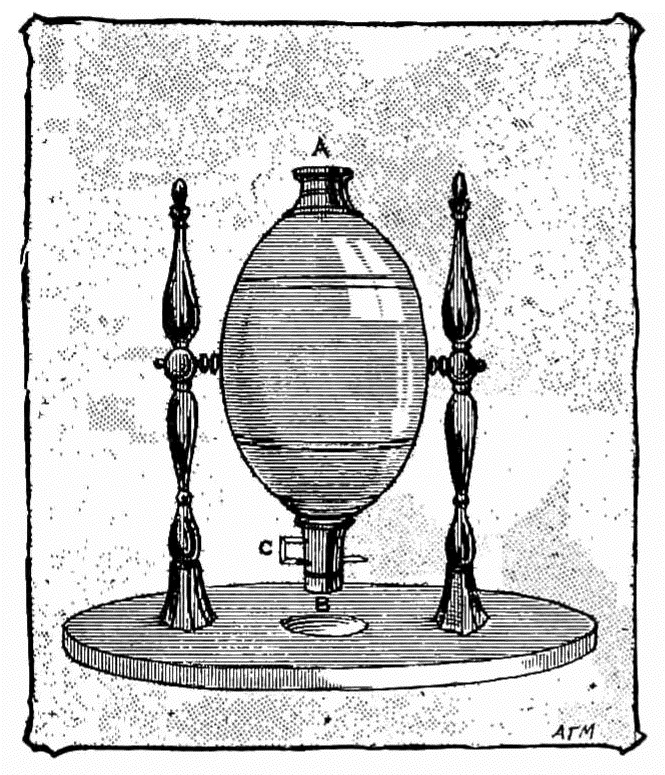

This article is about the 19th century lottery game called “Keno”, which is a
different game to that currently played in casinos by that name (see [the Pigeon Lottery article](games/pigeon-lottery/pigeon-lottery.md)). It shares much with the modern game of Bingo.

> [!figure]
>
> 
>
> ```yaml
> license: "cc0"
> noborder: true
> ```
>
> Diagram of a Keno globe, 1890.[@FoolsOfFortuneOrGamblingAndGamblers p. 251]
