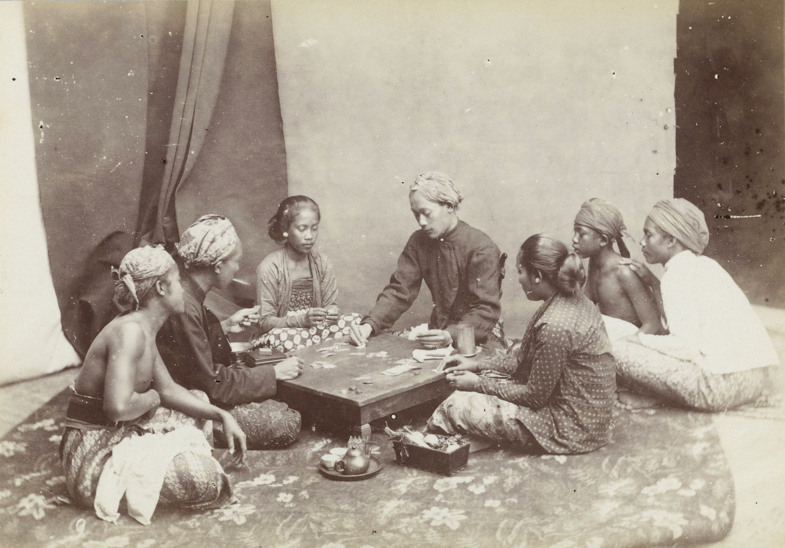

Koa (also Kowah) is a draw-and-discard game played with . It is also sometimes simply called Ceki,[@CekiOrKowah] and is probably the most canonical of the games played with the cards.

> [!figure]
> 
> 
>
> ```yaml
> license: "cc0"
> size: "wide"
> originalUrl: "http://hdl.handle.net/10934/RM0001.COLLECT.258935"
> identifier: "RP-F-F18040"
> orgName: "Rijksmuseum"
> ```
>
> A Koa game in progress, 1890s or earlier.[^fn0] Note the <span lang="jav-Latn">{%a glossary#:~:text=the%20tong,tong%}</span> on the table for collecting the house cut.

[^fn0]: Identified as such in @VolkenDerAarde [p. 106], and @BlikJavaansche_2 [pl. XV].
