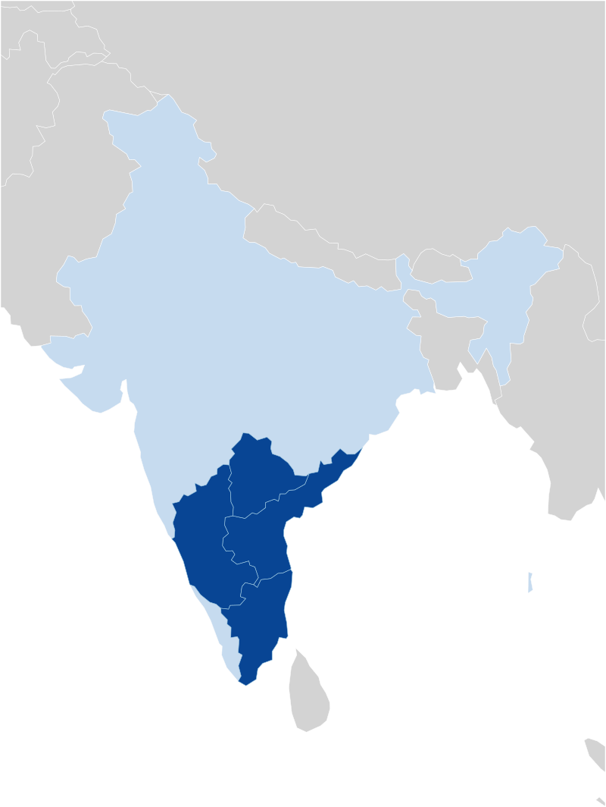

> [!figure]
>
> 
>
> Parts of India where the game is well-known.

Tamil: ஆடு புலி ஆட்டம் āṭu puli āṭṭam ‘goat tiger game’.

Kannada: ಆಡು ಹುಲಿ ಆಟ āḍu huli āṭa ‘goat tiger game’, or ಕುರಿ ಹುಲಿ ಆಟ kuri huli āṭa ‘sheep tiger game’.

Telugu: మేక పులి ఆట mēka puli āṭa ‘goat tiger game’, or పులిజూదం pulijūdaṁ.

In [Acehnese](https://en.wikipedia.org/wiki/Acehnese_language), it is called meurimueng-rimueng ‘playing tigers’.[@TheAcehnese p. 204]

---

Bagh Chal as well:

@TigerGoatsDraw

Bagh Chal in Nepali https://archive.org/details/in.ernet.dli.2015.146785/page/n443