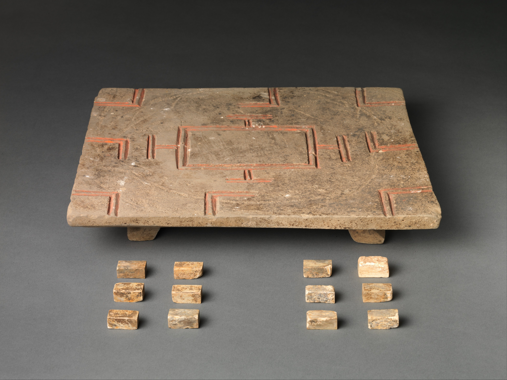
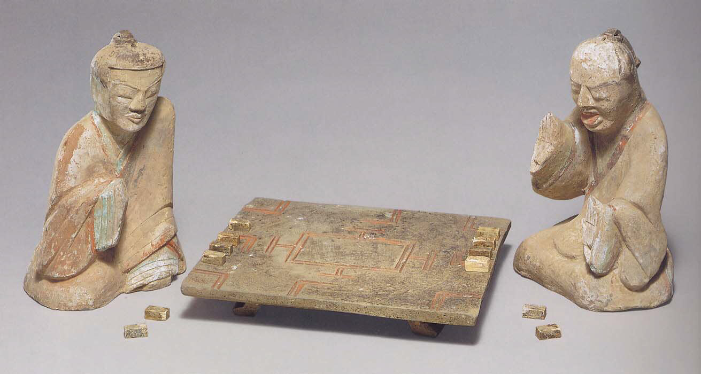

# <span lang="zh">六博</span> · Liubo

> [!figure]
>
> 
>
> ```yaml
> originalUrl: "https://www.metmuseum.org/art/collection/search/50484"
> license: "cc0"
> orgName: "The Met museum"
> identifier: "1994.285a–m"
> ```

> [!figure]
>
> 
>
> ```yaml
> originalUrl: "https://www.metmuseum.org/art/collection/search/44732"
> license: "cc0"
> orgName: "The Met museum"
> identifier: "1992.165.23a,b"
> ```

---

See: @AdditionalLiuPo

Good image of TLV mirror: https://www.metmuseum.org/art/collection/search/61417
https://www.metmuseum.org/art/collection/search/53937

---


## Nine Ways of Looking at <span lang="cmn-Latn-pinyin">Zhāo Hún</span>

The “shamanistic” poem <span lang="cmn-Latn-pinyin" class="noun">Zhāo Hún</span> <span lang="zh">招魂</span> (“Summons of the Soul”) — written perhaps around 270 <abbr>BCE</abbr>, and part of the [<span lang="cmn-Latn-pinyin" class="noun">Chǔ Cí</span>](http://www.chinaknowledge.de/Literature/Poetry/chuci.html) <span lang="zh">楚辭</span> (“Songs of [Chu](https://en.wikipedia.org/wiki/Chu_(state))”) collection, traditionally attributed to either of [<span lang="cmn-Latn-pinyin" class="noun">Qū Yuán</span>](https://en.wikipedia.org/wiki/Qu_Yuan) (<span lang="zh">屈原</span>) or [<span lang="cmn-Latn-pinyin" class="noun">Sòng Yù</span>](https://en.wikipedia.org/wiki/Song_Yu) (<span lang="zh">宋玉</span>)[@ChuTzuEarlyChinese][@SongsOfTheSouth 219–23]  — contains a verse that refers to the game, attempting to entice the soul of a king back to the world of the living:

> <p lang="zh">
> 菎蔽象棊，有六簙些。\
> 分曹並進，遒相迫些。\
> 成梟而牟，呼五白些。
> </p>

> [!todo]
>
> FAKE TRANSLATION (copilot) “The chessboard is covered with six kinds of pieces. They are divided into two armies, which advance and press each other. When the pieces are arranged in the shape of a bird, the five white pieces are called out.” (Witter Bynner)

> [!aside]
>
> With apologies to @19Ways, which you should read if you haven’t.

This is interpreted in several different ways by various translators:

> With bamboo sticks and ivory draughtsmen,\
> &emsp;There is the game <span lang="zh-Latn">liu-po</span>.\
> Dividing into groups and proceeding together,\
> &emsp;Forcefully they threaten each other.\
> Having become <span lang="zh-Latn">hsiao</span> <span lang="zh">梟</span> (i.e., in the lead) and going to win double,\
> &emsp;One shouts for the ‘five-white’ <span lang="zh">五白</span>…[@ANoteOnTheTLV 204]

> Then with bamboo dice and ivory pieces the game of Liu Po is begun;\
> Sides are taken; they advance together; keenly they threaten each other.\
> Pieces are kinged and the scoring doubled. Shouts of “Five White!” arise.[@SongsOfTheSouth 108]

> Smoky-jade markers and ivory pieces\
> they play the game of Six Whites.\
> Dividing in teams, they attack together,\
> and press one another hard.\
> The throw succeeds, the score is doubled,\
> one shouts: “Five white!”[@AnthologyChineseLiterature 209–10]

> With jade throwing rods and ivory pieces,\
> &emsp;The game of <span lang="zh-Latn">liubo</span> commences.\
> Sides are taken and the pieces advance,\
> &emsp;Threatening the opposing side.\
> Whoever becomes a <span lang="zh-Latn">xiao</span> wins double,\
> &emsp;And shouts out “five white!”[@LiuboFiveHundred 112]

> Bamboo sticks and ivory draughtsmen,\
> the game of <span lang="zh-Latn">liubo</span> is set up.[@DisquisitionOnBoyi 568]

> Then with <span lang="zh-Latn">kun-bi</span> sticks and ivory pawns they have a bit of Liu Bo;\
> Two [players] take their sides and advance, threatening each other.\
> One becomes an owl and doubles [his score] shouting ‘five whites!’ [@SenetTarot 154]

> Jade throwing rods and ivory tiles\
> For the liubo-game come out.\
> People pair off and make their first moves\
> Forcing each other’s pieces into tight corners.\
> When each gets the “Owl” they are tied\
> Until one cries “Five Whites.”\
> The strategic pincering plays move slowly\
> Consuming the light of day.[@SongsOfChu 204]

> Then with bamboo game sticks and ivory-inlaid board the liu bo game begins:<br/>
> Both sides advance at once: they press and contend<br/>
> Reaching the target and recording a double score, they shout: ‘Five White!’<br/>
> Dice of rhino horn, fashioned in Jin, flash in the sun.[@MythicChineseUnicorn 104]

> Bamboo rods, ivory pieces\
> &emsp;a Liubo preparation\
> Sides divide, advance together\
> &emsp;a blocking confrontation\
> Promoted piece, doubled scores\
> &emsp;a ‘five-white’ exclamation.[@SummonsFragment]
