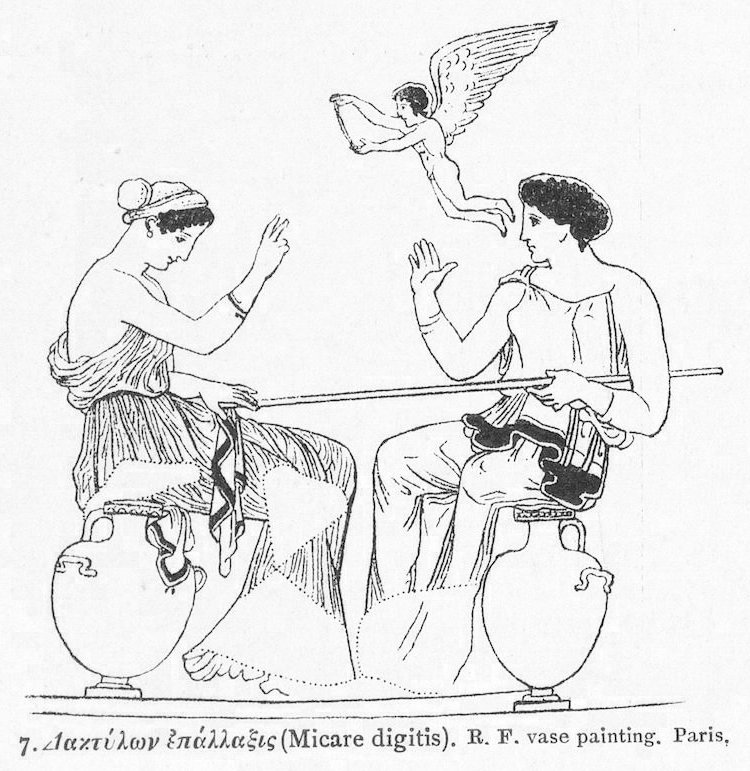

This is a finger-guessing game which English is usually known by its Italian name of “<span class="aka" lang="it">morra</span>”.[@MacedonianFolklore p. 297] However, it has been around for a long time and very similar games are played in many countries throughout the world; in Latin it was known as <span lang="la" class="aka">micatio</span>[@StudyOfGames p.  65] or <span lang="la" class="aka">micare digitis</span>.[@IlGiuocoDellaMorra]

In Ancient Greek it was called ‘finger crossing’ (<span lang="el-polyton" class="aka">ἡ ἐπάλλαξις τῶν δακτύλων</span> <span lang="el-Latn-polyton" class="aka">hē epállaxis tôn daktúlōn</span>, or <span lang="el-polyton" class="aka">δακτύλων ἐπάλλαξις</span> <span lang="el-Latn-polyton" class="aka">daktúlōn epállaxis</span>).[@AtlasClassicalAntiquities p. 151] In this time it was usually played with a rod or wand, which was held with the left hand. In modern Greek it is called <span lang="el" class="aka">μόρρα</span>, after the Italian name.

In French it is called <span lang="fr" class="aka">mourre</span>. In German it was once called <span lang="de" class="aka">Munke</span>,[@IuKiaoLi p. 285] although it is now known as <span lang="de" class="aka">Mora</span> or <span lang="de" class="aka">Morra</span> after the Italian.

In Italy to play the game was <span lang="it">givocare alla mora</span>
In Lombardy it was called <span lang="lmo" class="aka">buttàre al tocco</span>.[@GameOfMicatioDigitorum p. 509]

## Play

To play the game, both players stand facing each other. They simultaneously raise their hands with 0–5 fingers showing, and call out the **total** number of fingers that they think will be showing. If they get this correct, they are the winner.

see correspondence [@GameOfMicatioDigitorum] [@MicatioDigitorumLetter][@MicatioDigitorumDescribed] (some of which is about )

> [!figure]
>
> 
>
> ```yaml
> license: "cc0"
> ```
>
> Two Greek girls playing Morra, on a water-pot (<span lang="grc-Latn">hydria</span>), <abbr>c.</abbr> 500 <abbr>BCE</abbr>. From @AtlasClassicalAntiquities [p. 150].


See also: @PrimitiveCulture [p. 74]

Ti in Maori? [@AccountOfNewZealand 113]

See: @FriendshipAndGamesItalian, @OneToZero [p. 67–70].

https://www.britishmuseum.org/collection/object/P_1949-0203-263
https://www.britishmuseum.org/collection/object/P_1865-0610-1320

Mentioned in @DiversChoiceRemarks [p. 266]

Arabic: Lane says: خَرَاجِ / خراج ‘khrāj’, or <span lang="ar" class="aka">خَرِيجٌ</span> (<span lang="ar-Latn" class="aka">kharij</span>)
@LaneMorra

Ge'ez: see @ComparativeGeez [p. 168]

Also known in Japan[@JapanAndHerPeople p. 252]: “that game with their fingers, which has been perpetuated from classic times in Italy”. Original source for this is here: https://archive.org/details/bijdragetotdeken00over/page/202/mode/2up?q=vingers (jonko) [@JapanscheRijk p. 202–3]

Some nice quotes maybe here:
- https://archive.org/details/the-new-monthly-belle-assemblee-volume-22-january-june-1845/page/176/mode/2up?q=%22game+with+their+fingers%22
- https://archive.org/details/newmonthlymagaz60unkngoog/page/462/mode/2up?q=%22game+with+their+fingers%22

## <span lang="yue-Latn-jyutping" class="aka">Caai¹ Mui⁴⁻²</span> (<span lang="yue" class="aka">猜枚</span>)

This is a game which is known as <span lang="zh" class="aka">猜枚</span>[@TipcatAndOtherChineseGames] (Cantonese: <span lang="yue-Latn-jyutping" class="aka">caai¹ mui⁴⁻²</span>; Hokkien: <span lang="nan-Latn" class="aka">chhai mûi</span>; Mandarin: <span lang="cmn-Latn-pinyin" class="aka">cāi méi</span>) ‘guess the count’,[^fn0] <span lang="yue" class="aka">猜碼</span>[@AFunSouthernChineseGame] (Cantonese: <span class="aka" lang="yue-Latn-jyutping">caai¹ maa⁵</span>) ‘guess the number’, or <span lang="zh" class="aka">猜拳</span>[@TonicDictionary p. 191] (Cantonese: <span lang="yue-Latn-jyutping" class="aka">caai¹ kyun⁴</span>; Hokkien: <span lang="nan-Latn" class="aka">chhai kûn</span>; Mandarin: <span class="aka" lang="cmn-Latn-pinyin">cāi quán</span>) ‘guess the fist’.[^fn1] A variant using two hands where a hand can only be open or shut is also called “15, 20” <span lang="zh" class="aka">十五二十</span>, or “15, 15, …” , and the player must guess correctly twice.[@ShiwuShiwu]

[^fn0]: In very old works this is represented as <span lang="yue-Latn" class="aka">Tsoey-Moey</span>[@MicatioDigitorumDescribed], <span lang="yue-Latn" class="aka">Tsae Mei</span>,[@IuKiaoLi p. 284] or <span lang="yue-Latn" class="aka">chái-múí</span>.[@ThingsChinese p. 296]

[^fn1]: Also <span lang="zh" class="aka">猜媒</span> in @ChineseGamesOfChance [2].

On the 5th of April, 1872, the Nuisances Ordinance of Hong Kong (No. 2 of 1872) placed restrictions upon the game:[^fn2]

[^fn2]: This was later integrated as part of the Summary Offences Ordinance.[@LawAndRacism p. 248][@SummaryOffencesHongKong]

> 4. (Penalty for playing Chai-mui at night.) Every person shall be liable to a penalty not exceeding ten dollars who shall utter shouts or cries or make other noises while playing the game known as Chai-mui, between the hours of 11 P.M. and 6 A.M. within any district or place not permitted by some regulation of the Governor in Council.[@NuisancesOrdinanceHongKong]

{/*
> 12.—(1) No person shall utter any shouts or cries or make other noises while playing the game known as “<span class="aka" lang="yue-Latn">Chai Mui</span>” within the hours prescribed for any district of place by regulation of the Governor-in-Council.
*/}

See [@PersistenceAndChange p. 196–7]

See [@ThingsChinese p. 295–6]

See @ChaiMuiPickering:

<span lang="zh">
一心
二好
三元
四季
五子
六合
七巧
八仙
九長
十全
對手
</span>


## Strategy

Optimal strategy was calculated by [Merill M.
Flood](https://en.wikipedia.org/wiki/Merrill_M._Flood) and reported in
@OnGameLearningTheory [p. 35–7].

WRONG: it was reported here first: @GamesOfStrategy_Dresher
