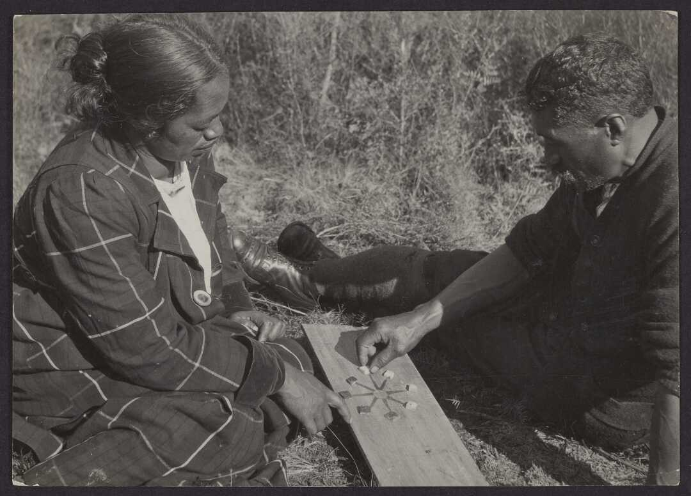

<p class="lead">
<span lang="mi" class="noun aka">Mū Tōrere</span> is a traditional Māori blocking game from New Zealand.
</p>

The game was first described in print by @Best17, and this description is based upon his.

It is said that the [Ngāti Haua](https://en.wikipedia.org/wiki/Ng%C4%81ti_Hau%C4%81) chief [Wiremu Tamihana Te Waharoa](https://en.wikipedia.org/wiki/Wiremu_Tamihana) once offered to play <span lang="mi" class="noun">Mū Tōrere</span> with [Governor Grey,](https://en.wikipedia.org/wiki/George_Grey) with the whole country as a stake — Grey apparently declined.[@TaongaTukuIho p. 54]

## Game

> [!figure]
>
> 
>
> ```yaml
> size: "wide"
> orgName: "Alexander Turnbull Library"
> license: "with-permission"
> identifier: "PAColl-5671-07"
> originalUrl: "https://natlib.govt.nz/records/23218316"
> ```
>
> A married couple (Te Urikore at left and Te Rangiua at right) playing Mū Tōrere, <abbr title="circa">c.</abbr> 1910.


The board used in the game has a central spot (<span lang="mi">putahi</span> ‘centre’) as well as eight arms or ‘tentacles’ (<span lang="mi">kāwai</span>) arranged around the central spot. In this way, the board resembles an octopus, and modern commercial versions of the game are often octopus-themed.

Each player has four pieces in a different colour from their opponent, which begin the game placed in a single cluster at the end of four of the eight arms.

On each player’s turn they must move one piece either from one arm to an adjacent arm which does not have a piece on it, from an arm to the central spot if it is empty, or from the central spot to any empty arm. The goal is to block the other player so that they are unable to move; if this is done, the blocking player wins.

To start the game, the first player must move one of the two pieces at the end of their cluster, as moving one of the central two pieces would result in an instant victory.

## Analysis

For analysis, see @Ascher87; @Straffin95; @Straffin95_2. With perfect play, the game is a draw.

## See also

Some general references are: @OxfordBG, @Zaslavsky [p. 34].
