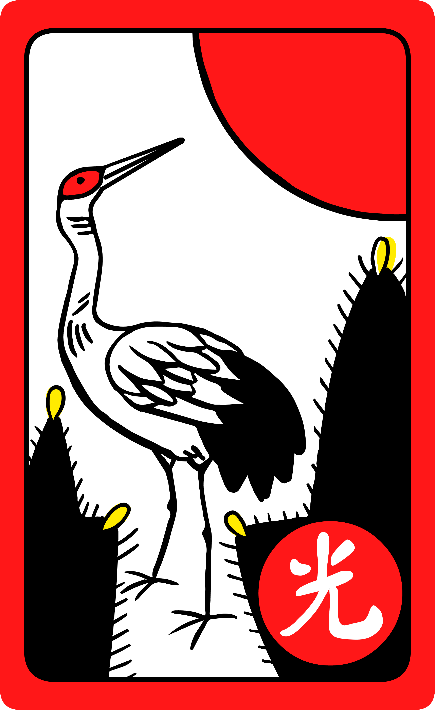
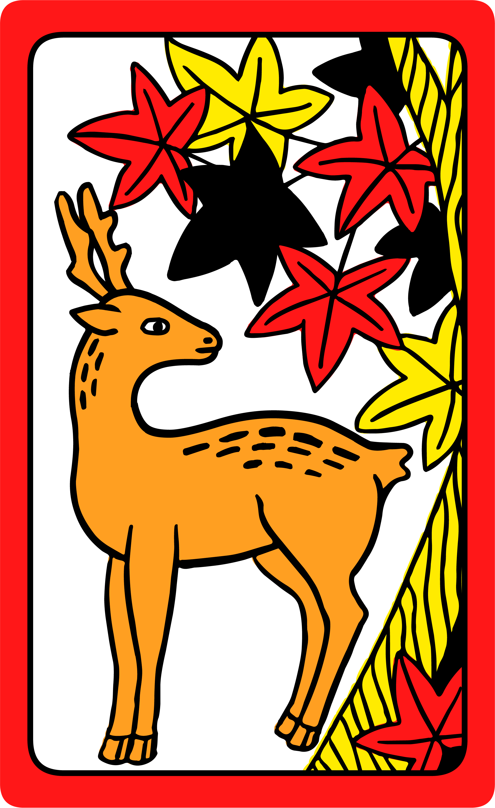
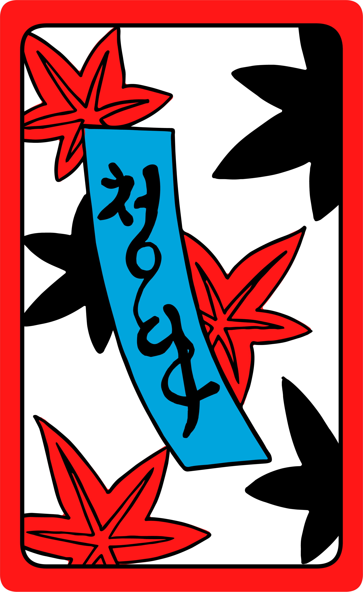
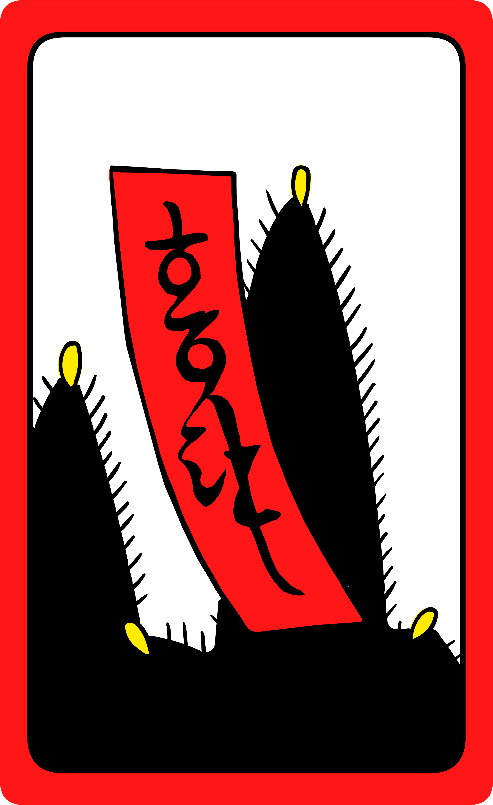

<Pronounce file="pronunciation_ko_섰다.mp3"  pronouncer="Letitgo"  class="aka" noun=true lang="ko-Latn">Seotda</Pronounce> (<span lang="ko">섰다</span>)

## Hand Rankings

<table>
<thead>
<tr>
<th>Group</th><th>Combination</th><th>Description</th>
</tr>
</thead>
<tbody>
<tr>
<th rowspan="3" scope="row" class="sideways centered">
<span lang="ko">광땡</span><br/>
<span lang="ko-Latn">gwang&shy;ttaeng</span>
</th>
<td>
> [!figure]
>
> 
> 
>
> ```yaml
> noborder: true
> size: "extra-small"
> silent: true
> authorFamily: "Richert"
> authorGiven: "Marcus"
> copyrightYear: 2021
> license: "cc-by-sa"
> licenseVersion: "4.0"
> originalUrl: "http://www.marcusrichert.com/images/hwatu/"
> ```
</td>
<td>

<span lang="ko">삼팔광땡</span> <span lang="ko-Latn">sampal gwang&shy;ttaeng</span>

Highest combination in the game; cannot be beaten.

</td>
</tr>
<tr>
<td>
> [!figure]
>
> 
> 
>
> ```yaml
> noborder: true
> size: "extra-small"
> silent: true
> authorFamily: "Richert"
> authorGiven: "Marcus"
> copyrightYear: 2021
> license: "cc-by-sa"
> licenseVersion: "4.0"
> originalUrl: "http://www.marcusrichert.com/images/hwatu/"
> ```
</td>
<td></td>
</tr>
<tr>
<td>
> [!figure]
>
> 
> 
>
> ```yaml
> noborder: true
> size: "extra-small"
> silent: true
> authorFamily: "Richert"
> authorGiven: "Marcus"
> copyrightYear: 2021
> license: "cc-by-sa"
> licenseVersion: "4.0"
> originalUrl: "http://www.marcusrichert.com/images/hwatu/"
> ```
</td>
<td></td>
</tr>
<tr>
<th rowspan="3" class="sideways centered" scope="row">
<span lang="ko">땡</span> <span lang="ko-Latn">ttaeng</span>
</th>
<td>
> [!figure]
>
> 
> 
>
> ```yaml
> noborder: true
> size: "extra-small"
> silent: true
> justify: "centered"
> authorFamily: "Richert"
> authorGiven: "Marcus"
> copyrightYear: 2021
> license: "cc-by-sa"
> licenseVersion: "4.0"
> originalUrl: "http://www.marcusrichert.com/images/hwatu/"
> ```
</td>
<td></td>
</tr>
<tr class="table-warning">
<td colspan="2" class="text-center">
⋮
</td>
</tr>
<tr class="table-warning">
<td>
> [!figure]
>
> 
> 
>
> ```yaml
> noborder: true
> size: "extra-small"
> justify: "centered"
> silent: true
> authorFamily: "Richert"
> authorGiven: "Marcus"
> copyrightYear: 2021
> license: "cc-by-sa"
> licenseVersion: "4.0"
> originalUrl: "http://www.marcusrichert.com/images/hwatu/"
> ```
</td>
<td></td>
</tr>
</tbody>
</table>
