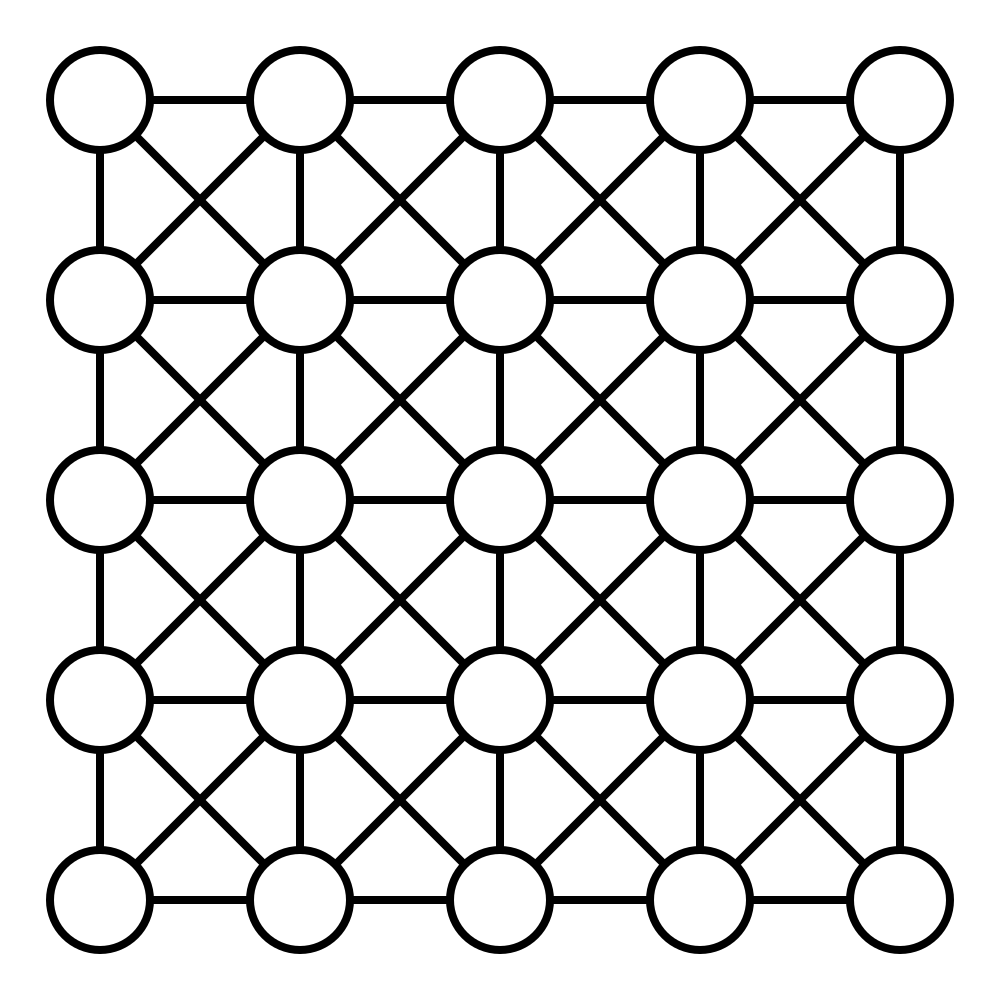
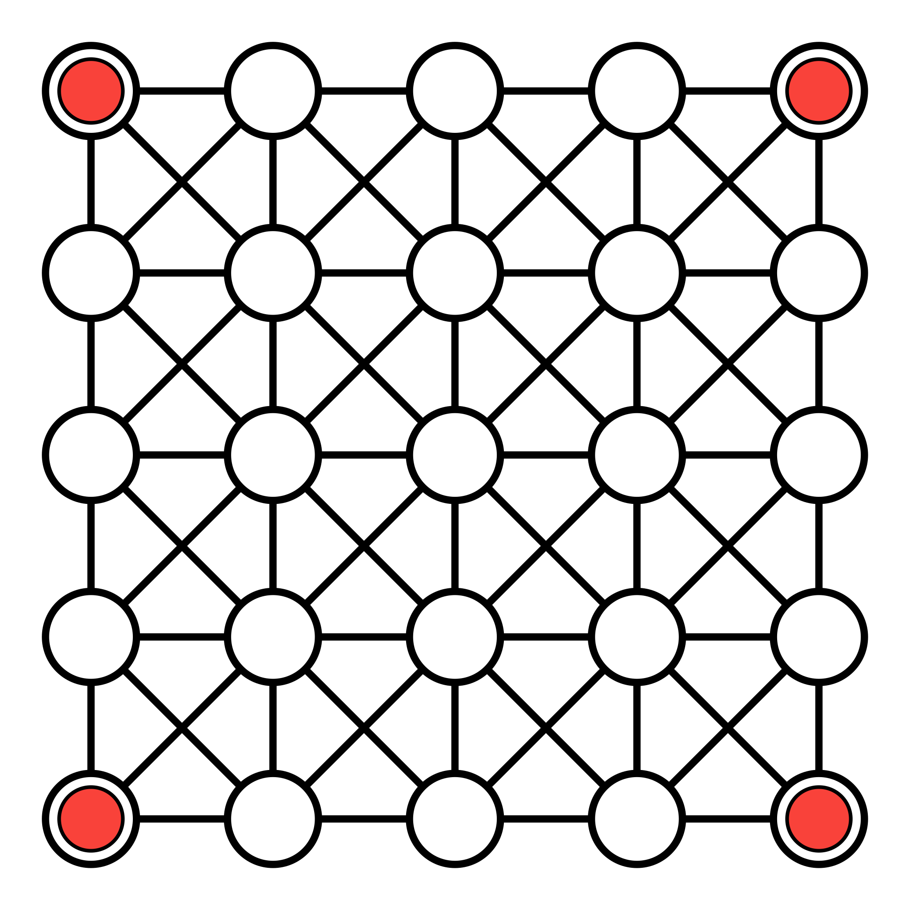

Teeko is a game for two players by John Scarne.

## History

Teeko was developed over a period of 15 years by John Scarne.[@Teeko] With the
trademark Scarne bombast and confidence, he believed that it was a game to rival
chess and checkers, and that it would eventually rank alongside (or above) them.
Nowadays it is barely known.

The game was first published by Scarne in 1955 in the book @Teeko. This is
possibly the only game rulebook ever produced that has had [an opera written
about it](https://www.quinapalus.com/musical.html)!

His (future) wife Steffi Storm is described in the book as a “top-ranking Teeko
player”, although she would later state that “if I win, it’s by dumb
luck.”[@AWorldOfGames] Scarne thought so much of Teeko that he would later name
their son (John Teeko Scarne) after it.[@AWorldOfGames]

## Equipment

Teeko is played with four pieces per player (usually in red and black), and a
special board (although it can also be played on a standard chess/checkers
board):

> [!figure]
> 
> 
>
> ```yaml
> noborder: true
> ```
>
> Teeko is played on the points of a 5×5 grid.

## Play

The aim of the game is to create a straight line of four pieces, along the
horizontal, vertical, or diagonal lines on the board, or alternately, to form
all four pieces into a square. There are 44 distinct winning positions.

> [!figure]
> 
> 
> 
> 
> 
>
> ```yaml
> size: "wide"
> noborder: true
> ```
>
> Examples of winning positions in Teeko.


In the placement phase of the game, players take turns putting one piece at a
time onto any empty space on the board. If a player can make a line or square
with all four pieces, then they win, otherwise the movement phase begins. During
the movement phase, players take turns moving any of their pieces along a line
to another empty space. Whoever can first form a line or square wins.

## Variations

### Advanced Teeko

In Advanced Teeko, squares can also be made in “extended” form, with gaps between the pieces:

> [!figure]
>
> 
> 
> 
>
> ```yaml
> noborder: true
> ```
>
> Examples of extended squares in Advanced Teeko.


In Advanced Teeko there are 58 distinct winning positions.

### Alternate Teeko

In Alternate Teeko, during the placement phase, each player’s pieces are placed
*by their opponent*, instead of by the player that owns the pieces. The
opponent may also ‘pass’ to allow the owning player to place the piece where
they wish.

## Analysis

Solving Teeko was suggested as Item 90 in the “HAKMEM” memo.[@HAKMEM] Guy Steele
proved that the basic game is a draw if played perfectly, and that the advanced
game is a first-player win.[@SteeleTeeko]
