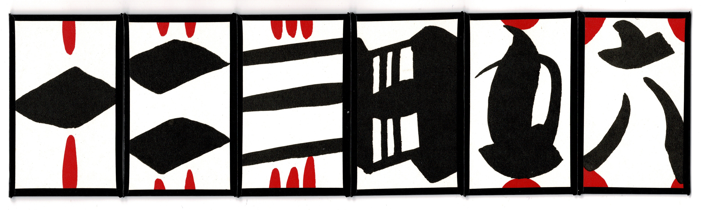
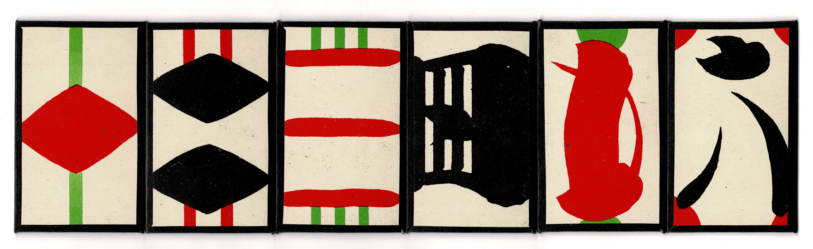
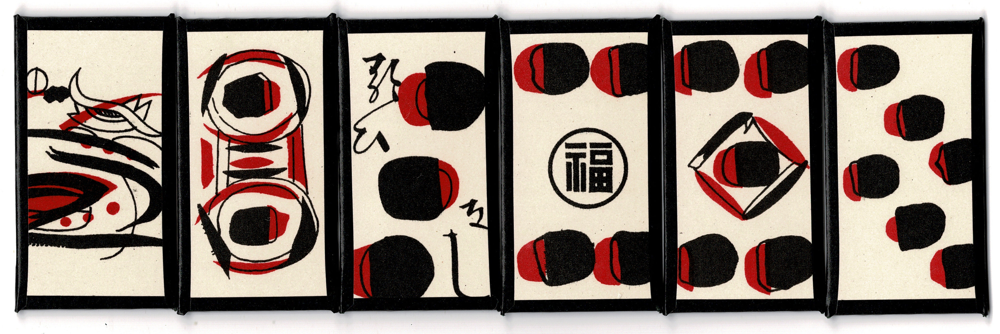
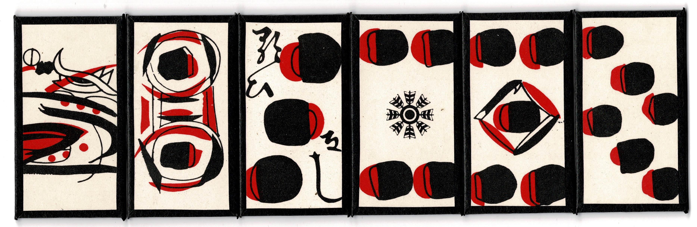
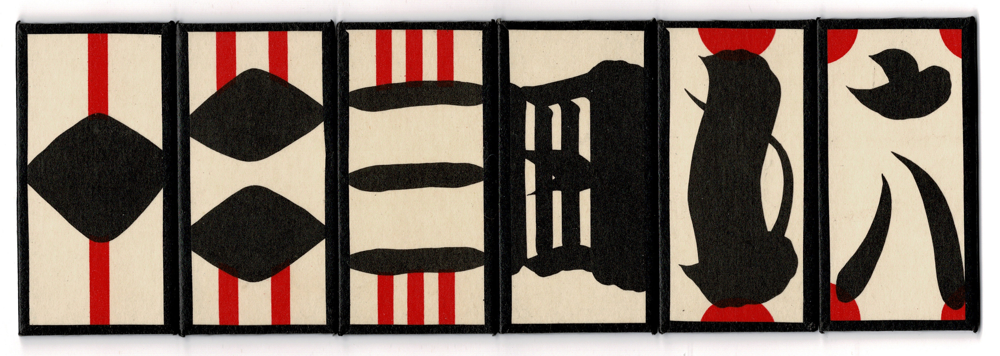

# <span lang="ja">手本引き</span> · <span lang="ja-Latn" class="noun">Tehonbiki</span>

<span lang="ja-Latn" class="noun aka">Tehonbiki</span> (<span lang="ja" class="aka">手本引き</span>, meaning something like ‘draw an example’) is a traditional Japanese gambling game that is played with sets of six cards.

The goal of the game is for the players to guess the card which the dealer has chosen; the fact that the dealer must _choose_ the card and not select one at random turns this into a game of psychology rather than one of pure chance.

## Equipment

To play the game, three sets of cards are used:

Cards for each player, numbered 1–6. These are called **<span lang="ja-Latn">hari&shy;fuda</span>** (<span lang="ja">張札</span> ‘spreading cards’), <span lang="ja-Latn">kaki&shy;fuda</span> (<span lang="ja">書札</span> ‘document cards’), or <span lang="ja-Latn">dai ichi roku</span> (<span lang="ja">大一六</span> ‘big one-six’). There are two styles; the Ōsaka style has the odd numbers in red, whereas with the Kyōto style all the numbers are black.

> [!figure]
>
> 
>
> ```yaml
> noborder: true
> ```
>
> A set of <span lang="ja-Latn">harifuda</span> produced by Nintendō.

> [!figure]
>
> 
>
> ```yaml
> noborder: true
> ```
>
> A set of <span lang="ja-Latn">harifuda</span> produced by Tamura Shogundō.

> [!figure]
>
> 
>
> ```yaml
> noborder: true
> ```
>
> A set of <span lang="ja-Latn">harifuda</span> produced by Tamura Shogundō, in the Ōsaka style.


Cards for the dealer, again numbered 1–6, but in a different pattern. These are called **<span lang="ja-Latn">hiki&shy;fuda</span>** (<span lang="ja">引札</span> ‘drawing cards’), <span lang="ja-Latn">kuri&shy;fuda</span> (<span lang="ja">繰札</span> ‘shuffling cards’), <Pronounce lang="ja-Latn"  file="pronunciation_ja_親札.mp3" pronouncer="cochan0308">oya&shy;fuda</Pronounce> (<span lang="ja">親札</span> ‘house cards’), or <span lang="ja-Latn">mame&shy;fuda</span> (<span lang="ja">豆札</span> ‘bean cards’). The card with the number 4 on it is usually stamped with the manufacturer’s mark.

Sometimes these are produced with the same images as on the <span lang="ja-Latn">harifuda</span>, in which case they are called <span lang="ja-Latn">ko&shy;hari</span> (<span lang="ja">小張</span>, ‘small <span lang="ja-Latn">hari</span>’).

> [!figure]
>
> 
>
> ```yaml
> noborder: true
> ```
>
> A set of <span lang="ja-Latn">hikifuda</span> produced by Nintendō.

> [!figure]
>
> 
>
> ```yaml
> noborder: true
> ```
>
> A set of <span lang="ja-Latn">hikifuda</span> produced by Tamura Shogundō.

> [!figure]
>
> 
>
> ```yaml
> noborder: true
> ```
>
> A set of <span lang="ja-Latn">kohari</span> produced by Tamura Shogundō.


Finally, there are wooden blocks numbered 1–6 for the dealer to show recently chosen numbers. These are called <span lang="ja-Latn">mefuda</span> (<span lang="ja">目札</span> ‘seeing cards’), <span lang="ja-Latn">memoku</span> (<span lang="ja">目木</span> ‘seeing woods’), or <Pronounce lang="ja-Latn"  file="pronunciation_ja_目安札.mp3" pronouncer="cochan0308">meyasufuda</Pronounce> (<span lang="ja">目安札</span> ‘easy-to-see cards’).

See @FinalMahjong for examples of the use of <span lang="ja">通り</span>.

## Media

The 1968 Japanese film <cite lang="ja">緋牡丹博徒</cite> <cite>Red Peony Gambler</cite> (<Pronounce lang="ja-Latn"  pronouncer="mezashi" file="pronunciation_ja_緋牡丹博徒.mp3">hibotan bakuto</Pronounce>, also titled in English ‘Lady Yakuza: The Red Peony Gambler’) opens with a scene in which the game is played.[^fn0]

[^fn0]: The film can be viewed [on The Internet Archive](https://archive.org/details/LadyYakuzaTheRedPeonyGambler).

Appears in the manga <cite lang="ja">世紀末博狼伝サガ</cite> <cite>Legend of the End-of-Century Gambling Wolf ‘Saga’</cite> (1995–8), chapters 14 through 28.


## Equipment variations

When played with [Mahjong](games/mahjong/mahjong.md) tiles, it can be called <span lang="ja-Latn" class="aka">haihonbiki</span> (<span lang="ja" class="aka">牌本引</span>).

Tehonbiki can also be played with [Hanafuda](articles/cards/japan/hanafuda/hanafuda.md) cards. In this case it can be called <span lang="ja-Latn" class="aka">ehonbiki</span> (<span lang="ja" class="aka">絵本引</span>) or <span lang="ja-Latn" class="aka">echobo</span> (<span lang="ja" class="aka">絵樗蒲</span>/<span lang="ja" class="aka">えちょぼ</span>).[^fn1] When used in this manner, the values of the cards are ignored and only the months are considered; the mapping of months to numbers is:[^fn2]

[^fn1]: <span lang="ja-Latn">Chobo</span> here probably just means “gambling”; see also the dice game .

[^fn2]: The reason that this mapping doesn’t seem to obey the standard ordering of the cards is that it is based upon the so-called “Nagoya order”.

<ol class="columnar">
<li>
Pine or Bush clover
</li>
<li>
Rain or Silver grass
</li>
<li>
Cherry or Chrysanthemum
</li>
<li>
Wisteria or Maple
</li>
<li>
Iris or Peony 
</li>
<li>
Paulownia or Plum
</li>
</ol>

When playing with Hanafuda, <span lang="ja-Latn">mefuda</span> are not used, and
instead the past outcomes can be recorded on a piece of paper.

Tehonbiki can also be played with dice (TODO).

## <span lang="ms" class="noun aka" id="chap-ji-ki-panjang">Chap Ji Ki Panjang</span>

This game from Singapore, whose name means ‘long Chap Ji Ki’ was a <span lang="ja-Latn" class="noun">Tehonbiki</span>-like variation of the main  lottery game.[@GamblingGamesOfMalaya p. 113–5] It was also known as <span lang="nan" class="aka">十二支現場</span> <span lang="nan-Latn" class="aka">cha̍p jī ki hiān-tiûⁿ</span> (‘12 characters on the spot’), or <span lang="ms" class="noun aka">Tok Tok</span>, an onomatopœia for the sound of rapping on the table.[@NyonyaMosaic p. 129]

This variant of the game was played with [Four Colour Cards](articles/cards/china/four-colour-cards/four-colour-cards.md); each player receives 12 cards, one of each of six types in two colours (the soldier cards are left out).

## <span lang="id" class="noun aka">Daun Empat</span>

<span lang="id" class="noun aka">Daun Empat</span> (‘four leaves’), also known as <span lang="nan" class="aka">四支頁</span> ‘four pages’ (Hokkien: <span lang="nan-Latn" class="aka">sì ki ia̍h</span>),[^fn3] is a version of the game played with only four objects, which was at one time popular in Penang and Kelantan.[@GamblingGamesOfMalaya p. 116]

[^fn3]: Transliterated as <span lang="nan-Latn" class="aka">see kee yah</span> in older texts.[@GamblingGamesOfMalaya p. 116]

This game remains explicitly illegal in Malaysia when played in a gaming house.[@MalaysiaCommonGamingHousesAct]

The dealer has four flat ivory or bone tiles marked <Cards>1,2,3,4</Cards> or <Cards>schd</Cards>. There are also four cards with matching symbols, to be placed face-up in front of the dealer and which indicate the recently-chosen values. 

To play, the dealer (<span lang="nan">保官</span> <span lang="nan-Latn">pó koaⁿ</span>) secretly choses one of the four tiles from within a bag and places it inside a sealed wooden box. The tiles that are used are marked with notches on their edges so that the dealer is able to select one without seeing them. Once the dealer has chosen a tile, all players place their bets. 

Finally, the dealer moves the card corresponding to the chosen tile to the front of the line of cards, then reveals the tile in the box. Players who have selected that tile win 3× their stakes; all other stakes are lost. 10% of winning stakes are retained by the dealer (or else the odds would be fair).

Players bets may be indicated in two ways: either a staking board is used in the manner of [Fan-Tan](games/fan-tan/fan-tan.md), or a deck of cards may be distributed to the players; each player is given one card of each suit.

When the playing-card method is used there are other bets that can be made: placing two cards on top of each other indicates a bet where either card will win, for a payment of 1× the stake. Placing two cards with one in front of the other indicates a bet where the front card wins 2× the stake if it matches, and the rear card is a push.
