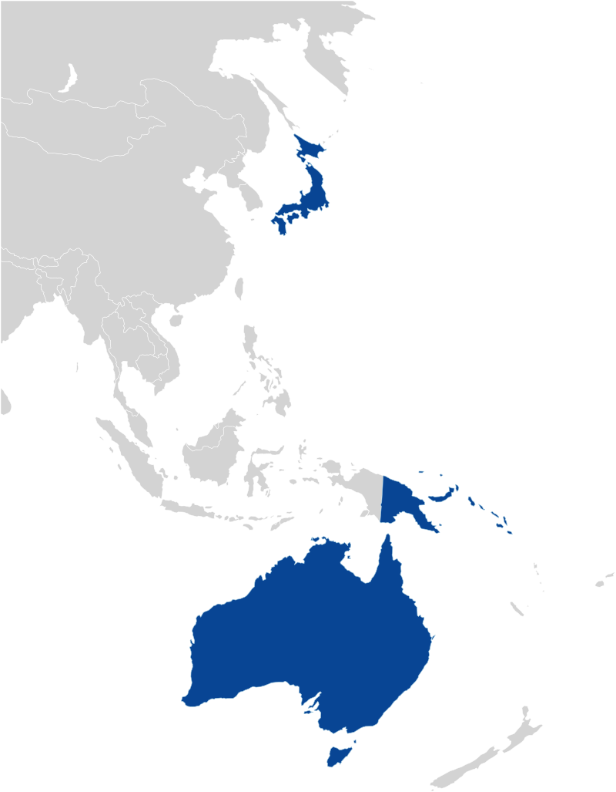
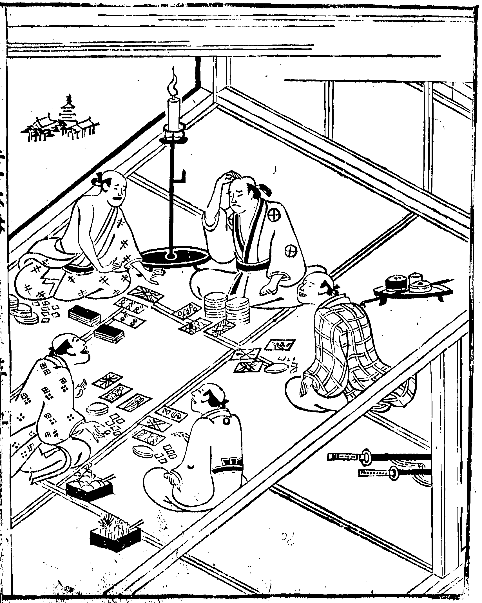

<p class="lead">
This page discusses variants of what — for lack of a better term — I call the ‘three-card game’. The game is played with a deck of cards and the goal is to achieve a score as close to 9 as possible. It dates from at least the late Ming dynasty (<abbr>c.</abbr> 1580–1600), but has spread to many countries, with one route in particular originating in Japan, passing down through the Malay Archipelago, and arriving in Aboriginal communities in the Northern Territory of Australia. The most widespread version of the game today is that derived in Europe and known as Baccarat.
</p>

> [!figure]
>
> 
>
> ```yaml
> position: left
> ```
>
> Countries where the game has been played. (TODO)

The earliest reference that I know of is that of <span lang="cmn-Latn-pinyin" class="noun">Pān Zhīhéng</span> (<span lang="zh">潘之恒</span>, 1556–1622), a late Ming-era poet who mentioned the game <span lang="zh" class="aka">扯三章</span>/<span lang="zh" class="aka">扯三張</span>[^fn0]  (‘draw 3 cards’) in passing while describing the rules of the game <span lang="zh">扯三章</span> (‘draw 5 cards’, for which, see the [Five Card](games/five-card/five-card.md) article). The rules are not explicitly given (he simply states <span lang="zh">扯三張例俱如前</span> ‘drawing 3 cards: rules as above’ after a subsection of the 5-card rules), but it is clear from the context that the game is essentially the same as the more recent versions given below.[@XuYeziPu_2] <span lang="cmn-Latn-pinyin" class="noun">Pān</span> also describes the game being played for drinks:[@XuYeziPu_2 281]

[^fn0]: The first name is used in the @YeziPu, the second in @XuYeziPu.

> In the <span lang="zh-Latn">wuzi</span> year [<span lang="zh">戊子</span>, here 1588], I was with his lordship the Vice Minister of War Wang Shizhen [<span lang="zh">王世贞</span>, 1526–90][^fn1] in his official residence in the auxiliary capital Nanjing. We drank and wrote poetry together every day. When a few rounds had passed, he would have cards brought out,and we would play the game ‘Drawing Three Cards’. Each one would take turns being the ‘banker’, and the others would gather round and play against him. There would be complete wins or losses, or a mixture of both. Those who lost would drink a large cup. Sometimes, one of the players would try to get up and escape, feeling unable to drink anymore. If he was really inebriated, we would not chase him. If he was pretending, we would stop him. If someone was the sole winner, others would feel dissatisfied, and he would have to play against everyone again. All gave shouts of delight and had a wonderful time. His lordship would sometimes be in his cups, and would tell his two pages to help him retire. The guests would then continue with his sons and play to their hearts’ delight. These sessions were frequent, but each time the game provided fresh delights. There is just no better drinking game than this.

[^fn1]: Also a poet, calligrapher, and historian.

I don’t yet know of any other Chinese references to the game, so the game may have been a game of lower status which was not commonly played — or at least described — by the literati.

The facts of the Chinese game at this point were: it was played with a money-suited deck of thirty cards ranking 1–9 in 3 suits (coins, strings, and myriads), and the goal was to get a total as close to 9 as possible. The 3 honour or ‘flower’ (<span lang="zh">花</span>) cards were also used and could count as one or zero.

(https://iiif.lib.harvard.edu/manifests/view/drs:428497656$67i)

Within the next hundred years, Portuguese sailors had taken the game to Japan (possibly picking it up from the Portuguese port at Macau, from which one of the earliest European games also takes its name).[^fn2] It is unclear whether or not the game was played in Europe at this time, but the lack of other references to it makes it seem unlikely.

[^fn2]: The Portuguese influence upon the Japanese game is known through the use of a Portuguese name and terminology (for more see below), as well as cards derived from European and not Chinese examples.

The Japanese game is also played amongst Aboriginal communities in the northern parts of Australia (particularly by [Larrakia](https://en.wikipedia.org/wiki/Larrakia_people) people around Darwin), apparently having been transferred there by Japanese sailors working in [the pearl industry](https://en.wikipedia.org/wiki/Pearling_in_Western_Australia).[@NoteOnAMissingLink][@CardGamesAmongAborigines] A <span class="noun" lang="ja-Latn">Nintendō</span> advertising poster from the early 20th century also indicates that their cards were being exported to Australia.


The same game was reported under the name <span lang="pis">kura</span> in the Solomon Islands in the 1970s,[@EthnographicPsychology p. 271][^fn3] and it is still played there to this day.[@IllegalCardGamesToBeBanned]

[^fn3]: The word also seems to apply to gambling in general.

In Papua New Guinea it has been called <span lang="tpi">kawu</span> — clearly derived from the Japanese name.[@ThreeMoreNewGuineanCardGames p. 54][^fn4] Further versions of this game — of which there are many — are called <span lang="tpi">laki</span> (‘lucky’),[@ThreeNativeCardGames p. 50] and these variants are described below.

[^fn4]: It is worth noting that in the article @ThreeMoreNewGuineanCardGames the author’s informant definitely knows more about the history of the game; it is not “almost certainly European in origin”!

Self Note: See the Makassar dictionary re kawu (the game) vs kuwa (the winning call). Kuwa could also mean "nine" there, and be from Hokkien? Kuwa also in [@ChineseLoanWordsMalay 56]

## <span lang="aka noun" lang="ja-Latn">Oicho-Kabu</span> <span lang="ja" class="aka">おいちょかぶ</span>: The Japanese Game</h2> ^oicho-kabu

<span class="noun" lang="ja-Latn">Oicho-Kabu</span> (<span lang="ja">おいちょかぶ</span>, ‘eight-nine’) is a Japanese version of the game which has been played as a gambling game for a long time.

In Japan the game is usually played with special cards called <span lang="ja-Latn">kabufuda</span> (<span lang="ja">株札</span>, ‘<span lang="ja-Latn">kabu</span> cards’), which are numbered from 1–10. A full deck is 40 cards, and has four copies of each card. It can also be played with <span lang="ja-Latn">hanafuda</span> cards (by dropping two months),[^fn5] or with all of the <Cards>A–10</Cards> from a standard deck of playing cards.

[^fn5]: There are also <span lang="ja-Latn">hanafuda</span> decks with only 10 months, called <span lang="ja-Latn">mushifuda</span>. These lack the 6th &amp; 7th months of the standard deck.

> [!figure]
>
> 
>
> A full deck of forty <span class="noun" lang="ja-Latn">Kabu</span> cards produced by [<span class="noun" lang="ja-Latn">Tamura Shōgundō</span>](/articles/cards/japan/hanafuda/traditional-manufacturers/#tamura-shogundo).

Possibly the game was originally called the ‘three card’ (<span lang="ja">三枚</span>) game.

### Play

> [!figure]
>
> 
>
> ```yaml
> noborder: true
> position: aside
> license: cc0
> originalUrl: "https://iiif.dl.itc.u-tokyo.ac.jp/repo/s/katei/document/cb3e601f-5df0-4433-bbae-723e214ef33c"
> orgName: "General Library in the University of Tokyo" 
> ```
>
> A three-card game being played in a picture that accompanies the story “A Man Coming to [Ponto”](https://en.wikipedia.org/wiki/Ponto-ch%C5%8D) <span lang="ja">「<ruby>先斗<rp>（</rp><rt>ぼんと</rt><rp>）</rp></ruby>に<ruby>置<rp>（</rp><rt>をい</rt><rp>）</rp></ruby>て<ruby>来多<rp>（</rp><rt>きた</rt><rp>）</rp></ruby>男」</span> in the book <cite>Twenty Cases of Unfilial Children</cite> <cite lang="ja">本朝二十不孝</cite> (1686) by [<span lang="ja-Latn" class="noun">Ihara Saikaku</span>](https://en.wikipedia.org/wiki/Ihara_Saikaku) (<span lang="ja">井原西鶴</span>, 1642—1693); the book is a parody of the Chinese classic [<cite>Twenty-Four Paragons of Filial Piety</cite> <cite lang="zh">二十四孝</cite>.](https://en.wikipedia.org/wiki/The_Twenty-four_Filial_Exemplars)


Up to ten people can play the game (aside from the dealer).

The goal of the game is to get a card total as close to 9 as possible. The total is calculated by summing the values of the cards in a player’s hand. Card totals equal to or over 10 have their first digit discarded (i.e. the sum is calculated modulo ten), so that a total of 10 is equivalent to zero, and a total of 12 equivalent to two.

In addition, a hand of three cards of the same rank is an automatic win. This hand is called  <Pronounce lang="ja-Latn"  file="pronunciation_ja_嵐.mp3" pronouncer="straycat88">arashi</Pronounce> (<span lang="ja">嵐 </span> ‘storm’) or <span lang="ja-Latn">zoro</span> (<span lang="ja">揃</span> ‘set’).

The dealer shuffles the cards and deals two cards to each player including themselves, the first face-up, the second face-down. Each player looks at their cards and may then request a third if they wish. A common rule is that a player *must* ask for another card if their total is 3 or less, and *may not* ask for another card if their total is 7 or more.

Once all players have decided whether or not to receive a third card, all cards are revealed. Players who have beaten the dealer’s total win, and the others lose.

The dealer also wins if their first card was a <Cards>4</Cards> or <Cards>9</Cards> and their second card was a <Cards>1</Cards>. This beats any hand including a triple. The combination <Cards>4–1</Cards> is called <span lang="ja-Latn">shippin</span> (<span lang="ja">シッピン</span>) and <Cards>9–1</Cards> is called <span lang="ja-Latn">kuppin</span> (<span lang="ja">クッピン</span>).

If both dealer and player have a triple, the higher triple wins.

### Other Combinations

As with all living card games, there are many local variations.

In the [<cite>Yakuza</cite>](https://en.wikipedia.org/wiki/Yakuza_(franchise)) video game series, there are two special hands:

* A hand with <Cards>10–10–1</Cards>, in any order, wins 20× the stake.
* A player who is dealt the two cards <Cards>4–6</Cards>, in any order, may choose
  to turn in their cards and keep their stake, instead of playing out the round.

### Special Terminology

The hand totals are counted with special gambling-specific numbers. Some of these — like the playing cards themselves — are derived from Portuguese:

<table>
<thead>
    <tr>
    <th>Total</th>
    <th>Standard</th>
    <th>Gambling</th>
    <th>Meaning</th>
    </tr>
</thead>
<tbody>
    <tr>
    <td>0 <span lang="ja">〇</span></td>
    <td><span lang="ja-Latn">rei</span></td>
    <td><span lang="ja-Latn">buta</span></td>
    <td>‘pig’</td>
    </tr>
    <tr>
    <td>1 <span lang="ja">一</span></td>
    <td><span lang="ja-Latn">ichi</span></td>
    <td><span lang="ja-Latn">pin</span></td>
    <td>From Portuguese <span lang="pt">pinta</span>, ‘spot’</td>
    </tr>
    <tr>
    <td>2 <span lang="ja">二</span></td>
    <td><span lang="ja-Latn">ni</span></td>
    <td><span lang="ja-Latn">nizō</span></td>
    <td />
    </tr>
    <tr>
    <td>3 <span lang="ja">三</span></td>
    <td><span lang="ja-Latn">san</span></td>
    <td><span lang="ja-Latn">santa/sanzun</span></td>
    <td />
    </tr>
    <tr>
    <td>4 <span lang="ja">四</span></td>
    <td><span lang="ja-Latn">shi/yon</span></td>
    <td><span lang="ja-Latn">yotsuya</span></td>
    <td>‘set of four arrows’</td>
    </tr>
    <tr>
    <td>5 <span lang="ja">五</span></td>
    <td><span lang="ja-Latn">go</span></td>
    <td><span lang="ja-Latn">goke/gosu</span></td>
    <td />
    </tr>
    <tr>
    <td>6 <span lang="ja">六</span></td>
    <td><span lang="ja-Latn">roku</span></td>
    <td><span lang="ja-Latn">roppō</span></td>
    <td />
    </tr>
    <tr>
    <td>7 <span lang="ja">七</span></td>
    <td><span lang="ja-Latn">nana/shichi</span></td>
    <td><span lang="ja-Latn">naki/shichiken</span></td>
    <td />
    </tr>
    <tr>
    <td>8 <span lang="ja">八</span></td>
    <td><span lang="ja-Latn">hachi</span></td>
    <td><span lang="ja-Latn">oicho</span></td>
    <td>From Portuguese <span lang="pt">oito</span>, ‘eight’</td>
    </tr>
    <tr>
    <td>9 <span lang="ja">九</span></td>
    <td><span lang="ja-Latn">kyū</span></td>
    <td><span lang="ja-Latn">kabu</span></td>
    <td>From Portuguese <span lang="pt">cabo</span>, ‘end’. {/*Removed, since I have no idea where this came from: In some very old documents <span lang="ja-Latn">kabu</span> is written <span lang="ja">九寸</span>.*/}</td>
    </tr>
</tbody>
</table>

#### Named hands

In the past, some combinations of hands totalling 9 (<span lang="ja-Latn">kabu</span>) were named. In the erotic book <cite>Lustful Plum Blossom Fence</cite> (<cite lang="ja">好色梅花垣</cite>, date unknown to me), the following names were given. The meaning of most of the names is obscure.[@EbashiKabuCarta]

* <Cards>153</Cards> ‘royal nine’ (<span lang="ja">御かぶ</span> <span lang="ja-Latn">o&shy;kabu</span>)
* <Cards>234</Cards> ‘ascending nine’ (<span lang="ja">のぼりがぶ</span> <span lang="ja-Latn">nobori&shy;kabu</span>)[^fn6] — this is the only obvious name
* <Cards>333</Cards> ‘newly-born imperial prince/new shrine nine’ (<span lang="ja">今みやがぶ</span>)
* <Cards>559</Cards> ??? (<span lang="ja">でつくがぶ</span>)
* <Cards>757</Cards> ‘two card imperial archivist protection nine’ (<span lang="ja">二条蔵人あいごがぶ</span>) — the position of the head of the “imperial archivists” (<span lang="ja">蔵人頭</span> <span lang="ja-Latn">kurōdo</span> or <span lang="ja-Latn">kurando no tō</span>, usually translated ‘head chamberlain’) was held by two people, who were personally selected by the Emperor
* <Cards>883</Cards> ‘thunder nine’ (<span lang="ja">雷公がぶ</span> <span lang="ja-Latn">raikō gabu</span>) — named after a [Chinese god of thunder](https://en.wikipedia.org/wiki/Leigong)

[^fn6]: i.e. <span lang="ja">上り</span> — not, as Japanese Wikipedia has, [<span lang="ja">幟</span>](https://en.wikipedia.org/wiki/Nobori).

Similarly, in the <span lang="ja-Latn">bunraku/kabuki</span> play <cite>Ōtō-no-Miya and the Armor of the Rising Sun</cite> (<cite lang="ja">大塔宮曦鎧</cite>), staged for the first time in 1723, other names are given for the zero-scoring hands:[@EdoKaruta7]

* <Cards>668</Cards> ‘<span lang="ja-Latn">hitsuhari</span> pig’ (<span lang="ja">ひつはりぶた</span>)
* <Cards>893</Cards> ‘<span lang="ja-Latn" class="noun">Kamakura</span> pig’ (<span lang="ja">鎌倉ぶた</span>)

### “<span lang="ja-Latn">Yakuza</span>”

> [!aside]
> An interesting coincidence pointed out by Ryan Sartor is that when translated to the <span lang="ja-Latn" class="noun">Hanafuda</span> deck (with which the game could also be played), the card values <Cards>893</Cards> correspond to the following card combination (<span lang="ja">役</span> <span lang="ja-Latn">yaku</span>), which is named <span lang="ja-Latn">nomi</span> (<span lang="ja">飲み</span> ‘drinking’), and is used in several <span lang="ja-Latn" class="noun">Hanafuda</span> games:
> > [!figure]
> >
> > 
> > 
> > 
> >
> > ```yaml
> > size: "small"
> > justify: "centered"
> > authorFamily: "Mantia"
> > authorGiven: "Louie"
> > copyrightYear: 2021
> > license: "cc-by-sa"
> > licenseVersion: "4.0"
> > ```

A hand that sums to zero is the worst possible hand. The name of one of these hands — that comprising the 8, 9, and 3 cards — will be familiar to many English-speakers today as the word used for Japanese gangsters, <span lang="ja-Latn">yakuza</span>. The name is a straightforward reading (one of several possible) of the numbers <span lang="ja">八九三</span> (893), and, before being applied to gangsters, was a term derived from the <span lang="ja-Latn" class="noun">Oicho-Kabu</span> hand which also meant “useless” or “good-for-nothing”. 

The term has been used in this way for a long time; it appears in the <span lang="ja-Latn">bunraku</span> (and later <span lang="ja-Latn">kabuki</span>) play <span lang="ja-Latn">Wada Gassen Onna Maizuru</span> (<cite lang="ja">和田 合戦女舞鶴</cite> ‘Wada Battle Female Dancing Crane’),[^fn7] first performed in 1736:

[^fn7]: The dancing crane (<span lang="ja-Latn">maizuru</span>) was the <span lang="ja-Latn">mon</span> of a standard <span lang="ja-Latn">kabuki</span> character based upon [<span lang="ja-Latn">Asahina Yoshihide</span>](https://en.wikipedia.org/wiki/Asahina_Yoshihide); thus, the title promised a female version of this character.

<blockquote lang="ja" class="blockquote">
エエ埒もない<ruby>八九三<rp>(</rp><rt>ヤクザ</rt><rp>)</rp></ruby>の<ruby>眶 <rp>(</rp><rt>まぶた</rt><rp>)</rp></ruby>に出合うて
</blockquote>

This term was adopted by gamblers as a nickname and eventually became the standard term for a Japanese gangster.

As to _why_ this particular hand was chosen, there are several options. Note that it is not the only hand that sums to zero; there are 22 such hands.  However, it is the only hand containing an <Cards>8</Cards> and a <Cards>9</Cards> that results in a zero score; thus if the name of the game is “8, 9…” it is naturally followed by “3”.

### Kabu

This is a simplified variant of <span lang="ja-Latn" class="noun">Oicho-Kabu</span> by [Sid Sackson](/articles/people/sid-sackson/), for 2–6 players, as described in @CardGamesAroundTheWorld [p. 12].

Play with the <Cards>A–⑩</Cards> from a standard deck of cards. You will also need some chips to keep track of score. Sids’ suggested chip distribution for each player is:

<table class="numeric">
    <thead>
    <tr>
        <th>Players</th>
        <th>1 pt<br />(White)</th>
        <th>5 pt<br />(Red)</th>
        <th>10 pt<br />(Blue)</th>
        <th>Total Points</th>
    </tr>
    </thead>
    <tbody>
    <tr>
        <th scope="row">2</td>
        <td>10</td>
        <td>2</td>
        <td>2</td>
        <td>40</td>
    </tr>
    <tr>
        <th scope="row">3</th>
        <td>10</td>
        <td>3</td>
        <td>3</td>
        <td>55</td>
    </tr>
    <tr>
        <th scope="row">4</th>
        <td>10</td>
        <td>4</td>
        <td>4</td>
        <td>70</td>
    </tr>
    <tr>
        <th scope="row">5</th>
        <td>10</td>
        <td>5</td>
        <td>5</td>
        <td>85</td>
    </tr>
    <tr>
        <th scope="row">6</th>
        <td>10</td>
        <td>6</td>
        <td>6</td>
        <td>100</td>
    </tr>
    </tbody>
</table>

Shuffle and deal two cards face-down to each player. Each player looks at their cards and may then request a third, and subsequently a fourth card.

The goal, as in standard <span class="noun" lang="ja-Latn">Oicho-Kabu</span>, is to get a total as close to 9 as possible, discarding 10s.

After all players have finished requesting new cards, the hands are revealed.  Each player collects the difference from their hand to players with a lower count, and pays the different from their hand to players with a higher count.

The game ends when a player is unable to pay their debts as they have run out of chips. They do not pay any of their remaining chips. Whoever has the most points is the winner.

**Variant:** in addition to dealing to the players, deal 6 cards face-up to the table. These cards are out of play but give the players more information about the cards remaining in the deck.

## Laki: The Papuan Game

## The Aboriginal Game

In Australia the game was played with standard “international” playing cards. There it is also called <span class="aka">cabul-card</span> or <span class="aka">two-three card</span>.[@WhatsTheBigDeal p. 668]

## The European Game
