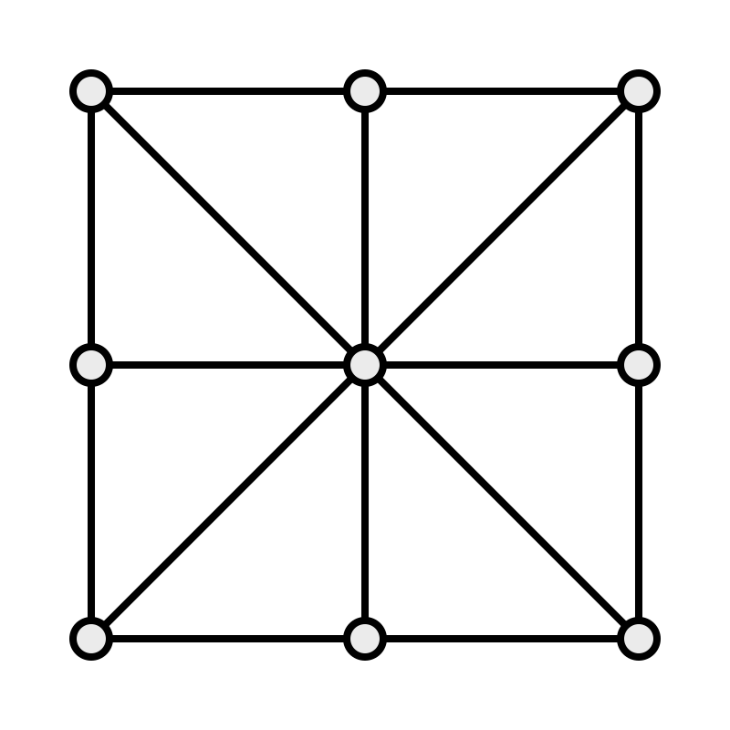

# Three Men’s Morris
<span class="aka">Three Men’s Morris</span> is an ancient [mill game](articles/families/mill-games/mill-games.md) for two players.

## Play

> [!figure]
>
> 
>
> ```yaml
> noborder: true
> position: "aside"
> size: "small"
> ```
>
> The game is played on the small mill board with diagonals.

Each player has three pieces, in contrasting colours. The aim of the game is to arrange all of one’s pieces in a line, either horizontally, vertically or diagonally. The first player to do this wins.

There are two ways to begin the game: either players take turns placing a piece on one of the empty points, or the pieces are lined up on two opposite sides of the board. If played with the pieces on the board at the start, then a player cannot win by lining their pieces up in their original position.

Starting the game by playing to the centre of the board is a forced win for the first player, so usually this move is banned.[@WinningWaysV3 p. 737]

After placing all their pieces, if no one has already won the game, the players then take turns moving a piece from one point to another.

## History & Nomenclature

Three Men’s Morris has also been called “<span class="aka">Ovid’s Game</span>”, based on its similarity to a game that is alluded to in Ovid’s [<cite lang="la">Ars Amatoria</cite>.](https://en.wikipedia.org/wiki/Ars_Amatoria)[@WinningWaysV3 p.  736]

The name Three Men’s Morris seems to be a modern invention, based on the name [Nine Men’s Morris](games/nine-mens-morris/nine-mens-morris.md). In the past it was known by other names in England, such as “<span class="aka">Knockings In and Out</span>”.[@NotesOnTheAbbey p.  20][@OnTheIndoorGamesOfSchoolBoys p. 321]

As evidenced by the many boards carved into stone walls and seats in cathedrals and monasteries, the game was played in England over a long period — [Murray](articles/people/hjr-murray.md)[@Murray2 p. 41] dates it from after the Norman conquest in the 11th century, and states that it was “well established by 1300.” However, the game seems to have declined until in the 19th century it was not well known in England; English visitors to Ireland during this period describe it as an Irish game.

In 19th century Ireland, it was described as ‘universally’ played by the peasantry and named <span lang="ga" class="aka">caisleáin gearr</span>[^fn0] ‘<span class="aka">short castle</span>’,[@CrokerCrofton p.  171] or ‘<span class="aka">top castle</span>’.[@GentlemansMagazineLibrary p. 257] Other old names in the United Kingdom come from areas such as Galloway (‘<span class="aka">corsi-crown</span>’)[@Gallovidian p.  142] and Cumberland (‘<span class="aka">copped-crown</span>’).[@Hyde2 p. 211]

[^fn0]: Hyde[@Hyde2 p. 211] wrote this as “<span lang="ga" class="aka">cashlan gherra</span>”.

[Murray](articles/people/hjr-murray.md) also claims that a distinct game called ‘<span class="aka">Nine Holes</span>’ existed,[@Murray2] but I don’t believe that it was a separate game to Three Men’s Morris, as all the references seem to track back to a single entry in Robert Nares’ <cite>Glossary</cite>.[@NaresGlossary p. 345] To me, it is the same game only played on a board that doesn’t show any lines. In any case, it is recorded as being played on the Isle of Man in 1674, when a man was [presented](https://en.wikipedia.org/wiki/Presentment) in [Malew](https://en.wikipedia.org/wiki/Malew) for “playing nine holes on Easter day before evening prayers”,[@Rothwell1674] and again in 1699 when two men were presented in [Lezayre](https://en.wikipedia.org/wiki/Lezayre) for “Makeing Nine holes with their knives upon Sunday after evening Prayer”.[@LezayrePresentments][^fn1]

[^fn1]: Their punishment being “to acknowledge their fault, and promise Reformation.”

A game that appears to be Three Men’s Morris appears in [Alfonso X’s <cite>Book of Games</cite>](articles/lists/alfonso-x.md) under the name <span lang="es">Alquerque de Tres</span>; however, this is in fact equivalent to [Tic-Tac-Toe](games/tic-tac-toe/tic-tac-toe.md), since the game described there does not permit movement after the pieces have been placed.[@DimensionsOfBookOfGames p. 600]  In modern Spanish the game is called <span lang="es" class="aka">tres en raya</span> ‘three in a line’, <span lang="es" class="aka">castro</span> ‘fort’, or <span lang="es" class="aka">pedrería</span> ‘little stones’.[@Murray2 p. 41] In Catalan it is apparently called <span lang="ca" class="aka">marro</span>.[@ElAjedrez p. 204]

In Italy it has been called <span lang="it" class="aka">riga de tre</span> ‘line of three’,[@IlGiocoDeGliScacchi p. 35] <span lang="it" class="aka">smerelli</span>, <span lang="it" class="aka">mulino</span>, <span lang="it" class="aka">semplice mulinello</span>, <span lang="it" class="aka">filo</span>, <span lang="it" class="aka">filetto</span>, or <span lang="it" class="aka">tavoletta</span>.[@Murray2 p. 41] In France, it has been called <span lang="fr" class="aka">mérelles</span>, <span lang="fr" class="aka">marelles</span>,[@NoticeDesÉmaux p.  381] or <span lang="fr" class="aka">carré chinois</span> ‘Chinese square’.[@DictionnaireHistorique7 p. 279]

The game is known as <span lang="fil" class="noun aka">Tapatan</span> in the Philippines,[@Zaslavsky p. 6] or <span lang="yue" class="aka">六卒棋</span> (<span lang="yue-Latn-jyutping" class="aka">luk⁶ zeot¹ kei⁴</span> ‘six man game’) in southern China.[@CulinPhilippine p. 648][^fn2]

[^fn2]: Note that @Bell confuses its sources here and claims that Hyde states that “<span class="aka noun">Luk Tsut K’i</span>” was played in the time of Confucius.

Writing in 1694,[@Hyde2 p. 211] Thomas Hyde said that it was called “<span lang="zh-Latn" class="aka noun">Che-Lo</span>” in Chinese (i.e. <span lang="zh-Hant" class="aka">直六</span> Mandarin: <span lang="cmn-Latn-pinyin" class="aka">zhí liù</span> ‘straight six’), and “<span lang="fa-Latn" class="aka noun">Hugjurè</span>” in Persian (<span lang="fa" class="aka">هجوره</span>, probably not a native Persian word?), but he also stated that each player has 6 pieces.

The game is popular throughout India: In Bengali, it has been called <span lang="bn" class="aka">তাঁত ফাঁত</span> <span lang="bn-Latn" class="aka">tā̃t phā̃t</span>[^fn3] (‘loom-[foom]’, possibly meaning something like weaving?), <span lang="bn" class="aka">তিন গুটি পাইত পাইত</span> (<span lang="bn-Latn" class="aka">tin guṭi pāit pāit</span>, ‘getting three pieces’), or simply <span lang="bn" class="aka">তিন গুটি</span> (<span lang="bn-Latn" class="aka">tina guṭi</span>) ‘three pieces’, and is played with the pieces starting on the board.

[^fn3]: Given as <span lang="bn-Latn" class="aka">tant-fant</span> in older works.[@Datta p. 167]

In Hindi it is called <span lang="hi" class="aka">तीन गोटी</span> (<span lang="hi-Latn" class="aka">tīn gōṭī</span>) ‘three pieces’; in Tamil <span lang="ta" class="aka">கட்ட விளையாட்டு</span> (<span lang="ta-Latn" class="aka">kaṭṭa viḷaiyāṭṭu</span>) ‘square game’ (although this is also used for other games).[@TamilCountryGames p. 59]

In Malayalam it is called <span lang="ml" class="aka">നിര</span> (<span lang="ml-Latn" class="aka">niṟa</span>) ‘line’, <span lang="ml" class="aka">പടവെട്ടു</span> (<span lang="ml-Latn" class="aka">paṭaveṭṭu</span>) or <span lang="ml" class="aka">പട</span> (<span lang="ml-Latn">paṭa</span>) ‘battle’, or <span lang="ml" class="aka">കല്ലുകളി</span> (<span lang="ml-Latn" class="aka">kallukaḷi</span>) ‘stone game’ (although this is usually used for knucklebones).[@InterestingGameVideo] Pieces can either be placed[@InterestingGameVideo] or start on the sides of the board.[@NiraVideo]

It is also played across Africa: in Madagascar it is called <span lang="mg" class="aka">fanorona telo</span> ‘three-[Fanorona](games/fanorona/fanorona.md)’;[@Murray2 p. 42] in Nigeria ([Urhobo](https://en.wikipedia.org/wiki/Urhobo_language)) <span lang="urh" class="aka">epelle</span>;[@Murray2 §3.3.18, p. 42] and in Somalia <span lang="so" class="aka">jara-badakh</span> (‘reed […]’?).[@SomaliGames 505][^fn4]

[^fn4]: In Marin’s orthography this is <span lang="so" class="aka">dʒara-badàχ</span>. It is also variously spelled <span lang="so" class="aka">jara-badàkh</span>,[@Murray2 §3.1.10, p. 40] <span lang="so" class="aka">jarabadach</span>,[@GamesOfManyNations 18], <span lang="so" class="aka">carabawg</span>.[@Murray2 §3.3.17, p. 42]

In Arabic it has been called <span lang="ar" class="aka">دريس اثلاثة</span> (<span lang="ar-Latn" class="aka">drīs ath-thalātha</span>).[^fn5][@ReisebeschreibungNachArabien 172][@Murray2 41]

[^fn5]: Neibuhr uses “<span lang="ar-Latn">drîs et talâte</span>”.

The game is also sometimes called <span class="aka">Hopscotch</span>, in @MathematicalRecreationsMaurice [p. 290], but I think that name is better reserved for [Picaria](games/picaria/picaria.md).[^fn6]

[^fn6]: As in @WinningWaysV3 [p. 737].

> [!todo]
>  To Check
> * Terni Lapilli
> * Three Men’s Marriage

## Variants

### Circular Three Men’s Morris

In this version the game is played on a circular board with ‘spokes’, meaning that mills can only be made across the center point. Zaslavsky [@Zaslavsky p. 4–5] calls it <span class="aka">Shisima</span>, and says it is played in Kenya.[^fn7] It has also been published as ‘[<span class="aka">Tri-Pin</span>](https://boardgamegeek.com/boardgame/111169/tri-pin)’ (Louis Marx & Co.).

[^fn7]: The original reference for this seems to be <cite>African Games of Strategy: A teaching manual</cite> by Louise Crane, but I haven’t been able to view this work.

See @HeimannLoop for an analysis of the game.

### X-ceter-O

[X-ceter-O](https://boardgamegeek.com/boardgame/21951/x-ceter-o) (Endless Games, 2009) — originally in German <span lang="de">X-für-O</span> (Milton Bradley, 1985) — has 6 pieces numbered #1–#6, alternating between sides. The pieces must be placed or moved in order (and can leap to any unoccupied square), looping back to #1 after #6 has been moved.

### King

[King](https://boardgamegeek.com/boardgame/22452/king) (Jim Wilkinson, 1985,
Paradigm Games) is a straightforward commercial implementation of the game. No
first play to centre, and pieces may move on the long diagonals.

### Chung Toi

In [Chung Toi](https://boardgamegeek.com/boardgame/11557/chung-toi) (Reginald Chung, 1994, multiple publishers), each player’s pieces are octagonal, and have a cross incised upon the top. After the placement phase, a piece can move one or two squares (jumping is allowed) in any of the four directions that the cross is pointing, and may also then rotate so that its cross is facing a different set of squares.

A piece may also rotate without moving instead, as long as it changes orientation (i.e. passing without changing the board is not permitted).

## See also

General references are: @OxfordBG [p. 116], @Bell [vol. 1, p. 91], and @Murray2 [p. 41].

[Achi](games/achi/achi.md) is often mis-described as a three-men’s-morris game (e.g. in @TicTacToe), based on a misreading of the description in @Murray2.

[Picaria](games/picaria/picaria.md) is the same game played with additional diagonals on the board.
