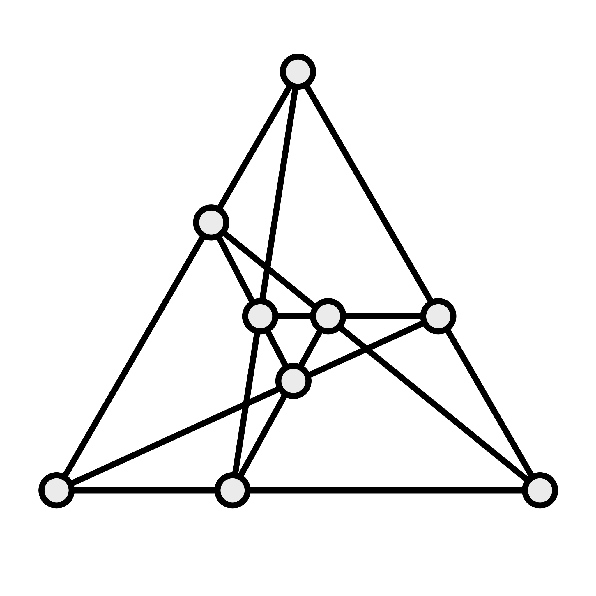

# Tri-Hex
Tri-Hex is a [mill game](articles/families/mill-games/mill-games.md) that was invented by one T. H. O’Beirne in 1962. It was first described in an article in <cite>New Scientist</cite> magazine, and was derived by exploring alternate board configurations for [Tic-Tac-Toe](games/tic-tac-toe/tic-tac-toe.md).[@TriHex]

## Rules

> [!figure]
>
> 
>
> ```yaml
> noborder: true
> ```
>
> The Tri-Hex board.

Each player has four pieces, which are first (the placement phase) placed one at
a time on the board. Once all the pieces are on the board, players take turns
moving a single piece along a line to the (single) vacant location. The first
player to form a row of three along a line wins the game (this can be during
either of the placement or movement phases).

O’Beirne provides analysis of the play in the original article (below in References).
