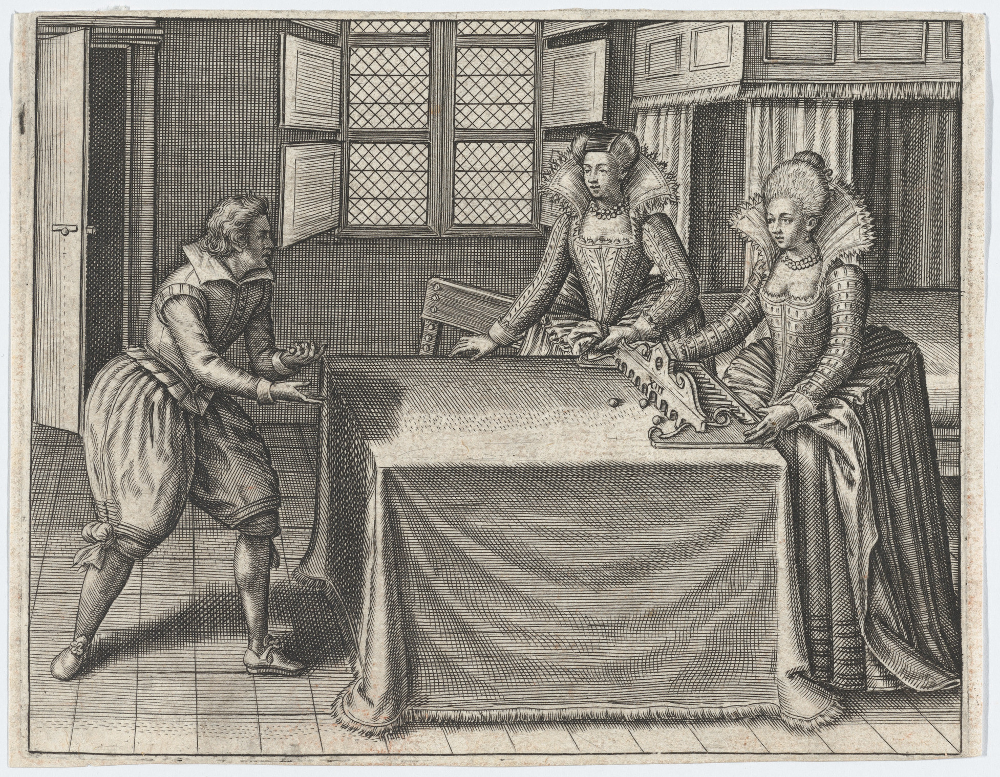

# <span lang="fr" class="noun">Trou Madame</span>

Also called “<span class="aka">Nine Holes</span>” in English.

In Scots, <span lang="sco" class="aka">Trulis</span>.[@SupplementToJamieson 247]


See also Nine Holes/Bumble Puppy

https://www.alamy.com/stock-photo-youths-playing-bumble-puppy-or-nine-holes-near-the-templa-of-vesta-57292455.html
https://georgianera.wordpress.com/2018/06/28/skittles-and-nine-holes-or-bumble-puppy-sporting-pastimes-in-the-georgian-era/

https://shakespeareillustration.org/2016/07/01/trol-my-dames-costume-temp-eliz-from-specimen/
https://www.istockphoto.com/vector/nine-holes-gm175396716-20296398

Mirélla

https://archive.org/details/gri_33125008510097/page/n325/mode/2up?q=%22my+ladies+hole%22


Nine Holes [@Strutt p. 340].

> [!figure]
> 
> 
>
> ```yaml
> size: "wide"
> originalUrl: "https://www.metmuseum.org/art/collection/search/744905"
> license: "cc0"
> orgName: "The Met museum"
> identifier: "2016.360.6"
> noborder: true
> ```
>
> A table-top game of Trou Madame, from @EnigmeJoyeuse [f. 8r].\
> This depicts the thirteen-hole version of the game, known in Italian as <span lang="it" class="noun">Trúcco</span>.[@FlorioVocabolario]


Players at the time were well aware of the double-entendres possible with such a
name; the text accompanying the image in the book reads:

> [!multi]
> 
> > [!lang] fr
> >
> > Voicy comme tu dois ioüer d’adreſſe & d’heur,\
> > Il faut mettre au milieu de ce trou, qu’on apelle\
> > Trou Madame : autrement tu le perdras contre elle,\
> > Le milieu eſt le but, & le poinct de l’honneur.
>
> Here is how you must play with skill and chance,\
> It is necessary to put in the middle of this hole, which one calls\
> Hole Madame: otherwise you will lose to her,\
> The middle is the target, and the point of honour.

> [!multi]
> 
> > [!lang] fr
> >
> > L’y mettre n’eſt pas tout : il faut auec vigueur\
> > Le pouſſer iuſqu’au fond : Si que la Damoiſelle\
> > Confeſſe que tu ſçais enfiler la venelle :\
> > Et que le coup eſt bon : l’on ioüe à la rigueur.
>
> Putting it there is not all: you must push it with vigour\
> Until it goes to the bottom: so that the maiden\
> Confesses that you know how to thread the alley:[^fn0]\
> And that the blow is good: one plays with rigour.

[^fn0]: or the space beside the bed

> [!multi]
> 
> > [!lang] fr
> >
> > Demeurer en chemin, perdre courſe & carriere,\
> > Entrer, ſortir ſoudain, retourner en arriere,\
> > Sont traicts pour à iamais te faire meſpriſer.
>
> To not make progress, to lose course and quarry,[^fn1]\
> To enter, to leave suddenly, to go back,\
> Are acts to make you despised forever.

[^fn1]: Both words in their hunting sense; <span lang="fr">carrière</span> and <em>quarry</em> are synonyms in both their rocky and rabbity senses, as they are from the same root.[@DictionnaireHistorique3 251]

> [!multi]
> 
> > [!lang] fr 
> > 
> > Ioüant, garde toy bien vn trou pour l’autre prendre,\
> > Quoy que proches ils ſoient : ce ſeroit te meſprendre,\
> > Pour emporter le prix, faut droictement viſer.
>
> Playing, keep well a hole for another to take,\
> However near they are: that would be to mistake you,\
> To win the prize, you must aim rightly.

Similar Italian games are <span lang="it" class="aka noun">Mirélla</span> (9 balls, 9 holes), <span lang="it" class="aka noun">Rúllo</span>, and <span lang="it" class="aka noun">Trúcco</span> (13 holes).[@FlorioVocabolario]

https://archive.org/details/bim_early-english-books-1641-1700_vocabulario-italiano-e-i_florio-giovanni_1690/page/n29/mode/2up?q=%22lady%27s+hole%22
