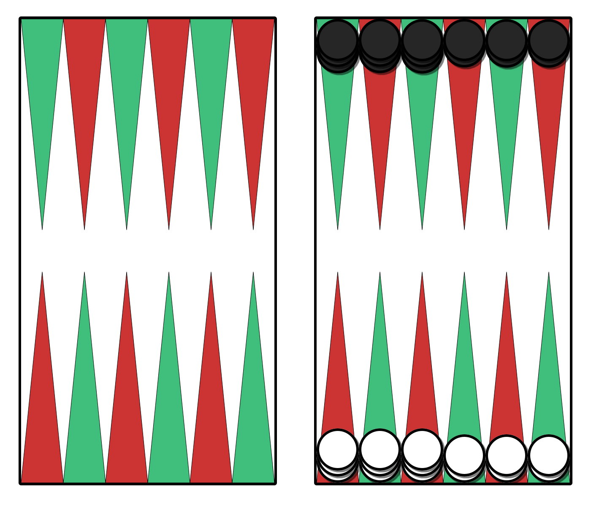

Yahūdiyya يهودية (also transcribed yahoudieh, meaning “Jewish woman”) is a simple [table game](articles/families/table-games/table-games.md) for two players.

See: @DimensionsOfBookOfGames.

Original source: [@Tawula]

## Play

For shared terminology, please see the [Table Games](articles/families/table-games/table-games.md) article.

The game is played using only the inner table of the board. In each player’s outer three points they stack two pieces, and on each of their inner three points they stack three pieces.

> [!figure]
>
> 
>
> The initial board setup.
