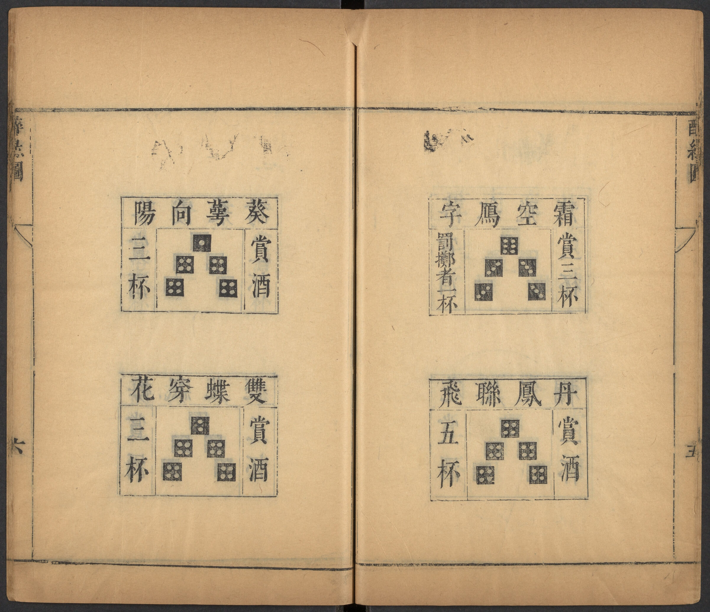

# <span lang="zh">醉綠</span> · <span lang="cmn-Latn-pinyin" class="noun">Zuì Lǜ</span>

<span lang="cmn-Latn-pinyin" class="noun aka">Zuì Lǜ</span> (<span lang="zh" class="aka">醉綠</span>, ‘drunken green’) was a very old Chinese drinking game from the late [Ming](https://en.wikipedia.org/wiki/Ming_dynasty) period that was played with five dice. At a later stage it was known as <span lang="zh" class="aka">合歡</span> <span lang="cmn-Latn-pinyin" class="noun aka">Héhuān</span>, ‘happy union’.[@BettingOnEmpire 42]

> [!figure]
>
> 
>
> ```yaml
> size: "wide"
> license: "cc0"
> orgName: "Harvard University"
> originalUrl: "https://nrs.lib.harvard.edu/urn-3:fhcl:23410787?n=27"
> ```
>
> Diagrams from the instruction manual.

I suspect that the otherwise-unexplained <span lang="zh">緑</span> ‘green’ in the title is a pun on the number 6 (<span lang="zh">六</span>), since it is pronounced the same or similarly in all Chinese languages. In this game, rolling a 6 is what causes a player to obtain penalty drinks.

Rules for the game appear in the book <cite lang="zh">醉緑圖</cite> <cite>Drunken Green Diagrams</cite> by a <span lang="zh">張光</span> <span lang="cmn-Latn-pinyin" class="noun">Zhāng Guāng</span>, and this work is included in [the 1646 edition](https://curiosity.lib.harvard.edu/chinese-rare-books/catalog/49-990067678380203941) of the <span lang="zh">說郛</span> [<span lang="cmn-Latn-pinyin" class="noun">Shuōfú</span>](http://www.chinaknowledge.de/Literature/Diverse/shuofu.html) collection, first compiled during the Ming period (1368–1644).[@ZuiLu] This (very short) instructional text is available transcribed on [WikiSource](https://zh.wikisource.org/wiki/%E8%AA%AC%E9%83%9B_(%E5%9B%9B%E5%BA%AB%E5%85%A8%E6%9B%B8%E6%9C%AC)/%E5%8D%B7102#%E9%86%89%E7%B7%91%E5%9C%96):

> > [!lang] zh
> >
> > 醉緑用五箇骰子擲先以一色相賽得一點者先擲得六點者㝡後擲不必賽其餘復賽如前\
> > 擲色以三同為主除三同外但以餘二色計之得么么二二三三四四五五點為賞采賞二杯么六二六三六四六五六為罰采罰一杯六六罰二杯得么二二三三四四五之類為賽色得三同六點為罰色罰一杯不賽獨三同六點么么二二三三四四五五為賞采賞二杯擲者罰一杯\
> > 擲出五星聚奎者賞依金谷酒數\
> > 賽色點數相同者罰賽者二杯多一點二點賞一杯少一點二點罰一杯\
> > 賞色在手仍即自擲如擲出賽色方許下次人賽擲出散色方許下次人擲不限擲數


An attempted summary of the above rules is as follows. (I do not speak Chinese so this might be inaccurate.)

## Play

The game is played with five dice. To decide who starts, each player rolls a die a single time; whoever rolls a one goes first, whoever rolls a six goes last (anyone else can keep rolling until they are allocated a position).

On each player’s turn they roll all the dice. If they roll three of a kind (or the special roll of 1–5) then they have a scoring (winning, losing, or neutral) outcome. The result of the throw is determined by examining the two leftover dice:
- a pair of 1s, 2s, 3s, 4s, or 5s is a winning roll, earning two cups
- a pair of 6s is a losing roll, gaining a penalty of two cups
- a 6 and any other number is also a losing roll, gaining a penalty of one cup
- in addition, if the triple is all 6s, this is also a penalty of one cup, and it is a “losing roll” unless the other two dice were a winning pair (in which case they earn two cups but also a penalty of one cup)
- if the other two dice are not a pair, then it is a “competing” roll; if the sum of the two dice beats the last competing roll made by someone else then the player earns one cup, if less they are penalized one cup, if _equal_ then they are penalized two cups

If a player rolls a winning roll then they keep rolling; if a losing or neutral roll they pass the dice on.

A table summarizing these outcomes:

<table>
<thead>
    <tr>
        <th>
        Roll
        </th>
        <th>
        Outcome
        </th>
    </tr>
</thead>
<tbody>
    <tr>
        <td>
        <Dice type="chinese">12345</Dice><br/>
	    One of each
        </td>
        <td>
        Win: 5 cups of wine
        </td>
    </tr>
    <tr>
        <td>
        <Dice type="chinese">=====</Dice><br/>
        Five of a kind
        </td>
        <td>
        Win: 5 cups, penalty of 1 if any <Dice type="chinese">6</Dice>
        </td>
        </tr>
    <tr>
        <td>
        <Dice type="chinese">====</Dice>+<Dice type="chinese">q</Dice><br/>
        Four of a kind
        </td>
        <td>
        Win: 3 cups, penalty of 1 if any <Dice type="chinese">6</Dice>
        </td>
    </tr>
    <tr>
        <td>
        <Dice type="chinese">===</Dice>+<Dice type="chinese">==</Dice> (no <Dice type="chinese">6</Dice>)<br/>
        A pair (with triple)
        </td>
        <td>
        Win: 2 cups
        </td>
    </tr>
    <tr>
        <td>
        <Dice type="chinese">666</Dice>+<Dice type="chinese">==</Dice><br/>
        Pair with triple six
        </td>
        <td>
        Win: 2 cups, penalty of 1
        </td>
    </tr>
    <tr>
        <td>
        <Dice type="chinese">666</Dice>+<Dice type="chinese">qq</Dice>
        </td>
        <td>
        Lose: penalty of 1
        </td>
    </tr>
    <tr>
        <td>
        <Dice type="chinese">===</Dice>+<Dice type="chinese">66</Dice><br/>
        Pair of sixes (with triple)
        </td>
        <td>
        Lose: penalty of 2
        </td>
    </tr>
    <tr>
        <td>
        <Dice type="chinese">===</Dice>+<Dice type="chinese">6q</Dice><br/>
        One six (with triple)
        </td>
        <td>
        Lose: penalty of 1
        </td>
    </tr>
    <tr>
        <td>
        <Dice type="chinese">===</Dice>+<Dice type="chinese">qq</Dice><br/>
        Triple
        </td>
        <td>
        Neutral: competition
        </td>
    </tr>
    <tr>
        <td>
        Anything else
        </td>
        <td>
        Neutral: pass 
        </td>
    </tr>
</tbody>
</table>


All of the four- and five-of-a-kind rolls, as well as the special 1-5 roll, have special names, as follows:

> [!aside]
>
> Some translations below are from @PersonalLuck [p. 426].

<div class="wide">
<table class="small">
<thead>
    <tr>
        <th>
        Roll
        </th>
        <th>
        Name
        </th>
        <th>
        Translation
        </th>
        <th>
        Award
        </th>
    </tr>
</thead>
<tbody>
    <tr>
    <td>
    <Dice type="chinese">12345</Dice>
    </td>
    <td>
    <span lang="zh">群英入轂</span>
    </td>
    <td>
    Heroes in a chariot
    </td>
    <td>
    +5
    </td>
    </tr>
    <tr>
    <td>
    <Dice type="chinese">11111</Dice>
    </td>
    <td>
    <span lang="zh">五星聚奎</span>
    </td>
    <td>
    Five star alignment
    </td>
    <td>
     +5
    </td>
    </tr>
    <tr>
    <td>
    <Dice type="chinese">11211</Dice>
    </td>
    <td>
    <span lang="zh">兩儀四像</span>
    </td>
    <td>
    </td>
    <td>
    +3
    </td>
    </tr>
    <tr>
    <td>
    <Dice type="chinese">11311</Dice>
    </td>
    <td>
    <span lang="zh">七曜麗空</span>
    </td>
    <td>
    </td>
    <td>
    +3
    </td>
    </tr>
    <tr>
    <td>
    <Dice type="chinese">11411</Dice>
    </td>
    <td>
    <span lang="zh">丹露聮珠</span>
    </td>
    <td>
    </td>
    <td>
     +3
    </td>
    </tr>
    <tr>
    <td>
    <Dice type="chinese">11511</Dice>
    </td>
    <td>
    <span lang="zh">四方歸極</span>
    </td>
    <td>
    </td>
    <td>
    +3
    </td>
    </tr>
    <tr>
    <td>
    <Dice type="chinese">11611</Dice>
    </td>
    <td>
    <span lang="zh">六化四時</span>
    </td>
    <td>
    </td>
    <td>
    +3, &minus;1
    </td>
    </tr>
    <tr>
    <td>
    <Dice type="chinese">22222</Dice>
    </td>
    <td>
    <span lang="zh">十道同風</span>
    </td>
    <td>
    </td>
    <td>
    +5
    </td>
    </tr>
    <tr>
    <td>
    <Dice type="chinese">22122</Dice>
    </td>
    <td>
    <span lang="zh">八荒一體</span>
    </td>
    <td>
    </td>
    <td>
    +3
    </td>
    </tr>
    <tr>
    <td>
    <Dice type="chinese">22322</Dice>
    </td>
    <td>
    <span lang="zh">麟閣功臣</span>
    </td>
    <td>
    </td>
    <td>
    +3
    </td>
    </tr>
    <tr>
    <td>
    <Dice type="chinese">22422</Dice>
    </td>
    <td>
    <span lang="zh">瓊樓十二</span>
    </td>
    <td>
    </td>
    <td>
    +3
    </td>
    </tr>
    <tr>
    <td>
    <Dice type="chinese">22522</Dice>
    </td>
    <td>
    <span lang="zh">五行八字</span>
    </td>
    <td>
    </td>
    <td>
    +3
    </td>
    </tr>
    <tr>
    <td>
    <Dice type="chinese">22622</Dice>
    </td>
    <td>
    <span lang="zh">八柱擎天</span>
    </td>
    <td>
    Eight pillars holding up the sky
    </td>
    <td>
    +3, &minus;1
    </td>
    </tr>
    <tr>
    <td>
    <Dice type="chinese">33333</Dice>
    </td>
    <td>
    <span lang="zh">陶柳三眠</span>
    </td>
    <td>
    […?] three sleeps\
    (A silkworm molts three times)
    </td>
    <td>
    +5
    </td>
    </tr>
    <tr>
    <td>
    <Dice type="chinese">33133</Dice>
    </td>
    <td>
    <span lang="zh">月夜南飛</span>
    </td>
    <td>
    Moonlit night, flying south
    </td>
    <td>
    +3
    </td>
    </tr>
    <tr>
    <td>
    <Dice type="chinese">33233</Dice>
    </td>
    <td>
    <span lang="zh">夢合巫山</span>
    </td>
    <td>
    Dream meeting in Wushan\
    (A reference to a story of meeting [Yaoji](https://en.wikipedia.org/wiki/Yaoji) in a dream?[@WaleyTemple 65])
    </td>
    <td>
    +3
    </td>
    </tr>
    <tr>
    <td>
    <Dice type="chinese">33433</Dice>
    </td>
    <td>
    <span lang="zh">落紅飛鷰</span>
    </td>
    <td>
    Falling (red) flowers, soaring swallows
    </td>
    <td>
    +3
    </td>
    </tr>
    <tr>
    <td>
    <Dice type="chinese">33533</Dice>
    </td>
    <td>
    <span lang="zh">花壓玉欄</span>
    </td>
    <td>
    Flowers against the jade railing<br/>
    (Maybe a reference to [a poem](https://www.gushiwen.cn/shiwenv_60723906a821.aspx) by [Wei Zhuang](https://en.wikipedia.org/wiki/Wei_Zhuang)?)
    </td>
    <td>
    +3
    </td>
    </tr>
    <tr>
    <td>
    <Dice type="chinese">33633</Dice>
    </td>
    <td>
    <span lang="zh">霜空鴈字</span>
    </td>
    <td>
    Geese like writing in the frosty sky
    </td>
    <td>
    +3, &minus;1
    </td>
    </tr>
    <tr>
    <td>
    <Dice type="chinese">44444</Dice>
    </td>
    <td>
    <span lang="zh">丹鳳聮飛</span>
    </td>
    <td>
    Red phoenixes flying together
    </td>
    <td>
    +5
    </td>
    </tr>
    <tr>
    <td>
    <Dice type="chinese">44144</Dice>
    </td>
    <td>
    <span lang="zh">葵蕚向陽</span>
    </td>
    <td>
    Sunflowers (?) facing the sun
    </td>
    <td>
    +3
    </td>
    </tr>
    <tr>
    <td>
    <Dice type="chinese">44244</Dice>
    </td>
    <td>
    <span lang="zh">雙蝶穿花</span>
    </td>
    <td>
     A pair of butterflies dancing amongst flowers<br/>
     (a common scene in Chinese art)
    </td>
    <td>
    +3
    </td>
    </tr>
    <tr>
    <td>
    <Dice type="chinese">44344</Dice>
    </td>
    <td>
    <span lang="zh">落霞飛鶩</span>
    </td>
    <td>
	 Sunset’s glow and flying ducks<br/>
	(A reference to Wang Bo’s <a href="https://en.wikipedia.org/wiki/Tengwang_Ge_Xu"><cite>Preface to the Pavilion of Prince Teng</cite></a>)
    </td>
    <td>
    +3
    </td>
    </tr>
    <tr>
    <td>
    <Dice type="chinese">44544</Dice>
    </td>
    <td>
    <span lang="zh">梅飄花徑</span>
    </td>
    <td>
    Plum blossoms falling on the garden path
    </td>
    <td>
    +3
    </td>
    </tr>
    <tr>
    <td>
    <Dice type="chinese">44644</Dice>
    </td>
    <td>
    <span lang="zh">六女踏花</span>
    </td>
    <td>
    Six Girls Trampling Flowers
    </td>
    <td>
    +3, &minus;1
    </td>
    </tr>
    <tr>
    <td>
    <Dice type="chinese">55555</Dice>
    </td>
    <td>
    <span lang="zh">江城梅落</span>
    </td>
    <td>
    River City blossom-fall\
    (A nickname for [Wuhan](https://en.wikipedia.org/wiki/Wuhan))
    </td>
    <td>
    +5
    </td>
    </tr>
    <tr>
    <td>
    <Dice type="chinese">55155</Dice>
    </td>
    <td>
    <span lang="zh">五雲捧日</span>
    </td>
    <td>
    Five Clouds Lifting the Sun
    </td>
    <td>
    +3
    </td>
    </tr>
    <tr>
    <td>
    <Dice type="chinese">55255</Dice>
    </td>
    <td>
    <span lang="zh">合璧連珠</span>
    </td>
    <td>
    Jade joined, pearls strung\
    (A reference to [Ban Gu](https://en.wikipedia.org/wiki/Ban_Gu)’s line upon a celestial conjunction:\
    <span lang="zh">日月如合璧，五星如连珠</span>\
    “The sun and moon are like a pair of jade discs;\
    the five planets like a string of pearls.”)
    </td>
    <td>
    +3
    </td>
    </tr>
    <tr>
    <td>
    <Dice type="chinese">55355</Dice>
    </td>
    <td>
    <span lang="zh">三弄梅花</span>
    </td>
    <td>
    </td>
    <td>
    +3
    </td>
    </tr>
    <tr>
    <td>
    <Dice type="chinese">55455</Dice>
    </td>
    <td>
    <span lang="zh">紅英綴翠</span>
    </td>
    <td>
    </td>
    <td>
    +3
    </td>
    </tr>
    <tr>
    <td>
    <Dice type="chinese">55655</Dice>
    </td>
    <td>
    <span lang="zh">雪㸃隴梅</span>
    </td>
    <td>
    </td>
    <td>
    +3, &minus;1
    </td>
    </tr>
    <tr>
    <td>
    <Dice type="chinese">66666</Dice>
    </td>
    <td>
    <span lang="zh">六魔降世</span>
    </td>
    <td>
    Six Demons Come to Earth
    </td>
    <td>
    +5, &minus;1
    </td>
    </tr>
    <tr>
    <td>
    <Dice type="chinese">66166</Dice>
    </td>
    <td>
    <span lang="zh">麗日中天</span>
    </td>
    <td>
    Fair Sun in the Midst of Heaven
    </td>
    <td>
    +3, &minus;1
    </td>
    </tr>
    <tr>
    <td>
    <Dice type="chinese">66266</Dice>
    </td>
    <td>
    <span lang="zh">二雄逐鹿</span>
    </td>
    <td>
    Two Men Fight for the Throne
    </td>
    <td>
    +3, &minus;1
    </td>
    </tr>
    <tr>
    <td>
    <Dice type="chinese">66366</Dice>
    </td>
    <td>
    <span lang="zh">碧天劍氣</span>
    </td>
    <td>
    </td>
    <td>
    +3, &minus;1
    </td>
    </tr>
    <tr>
    <td>
    <Dice type="chinese">66466</Dice>
    </td>
    <td>
    <span lang="zh">二十八宿</span>
    </td>
    <td>
    <a href="https://en.wikipedia.org/wiki/Twenty-Eight_Mansions">Twenty-Eight Mansions</a>
    </td>
    <td>
    +3, &minus;1
    </td>
    </tr>
    <tr>
    <td>
    <Dice type="chinese">66566</Dice>
    </td>
    <td>
    <span lang="zh">月值朔虛</span>
    </td>
    <td>
    </td>
    <td>
    +3, &minus;1
    </td>
    </tr>
</tbody>
</table>
</div>

